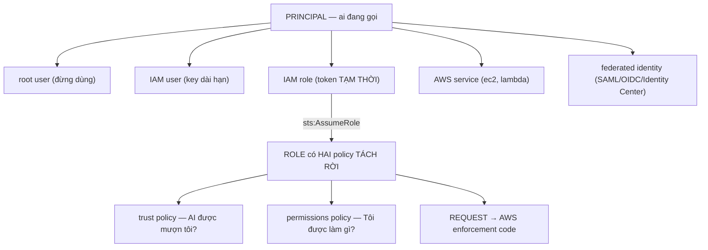
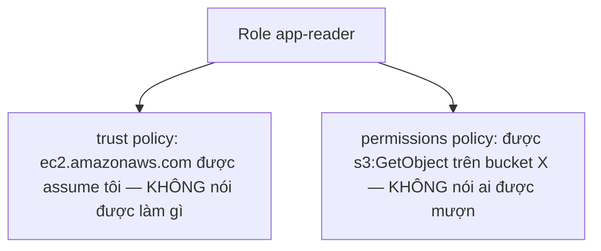
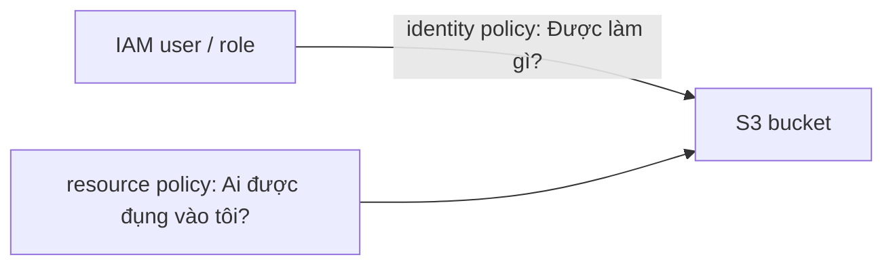
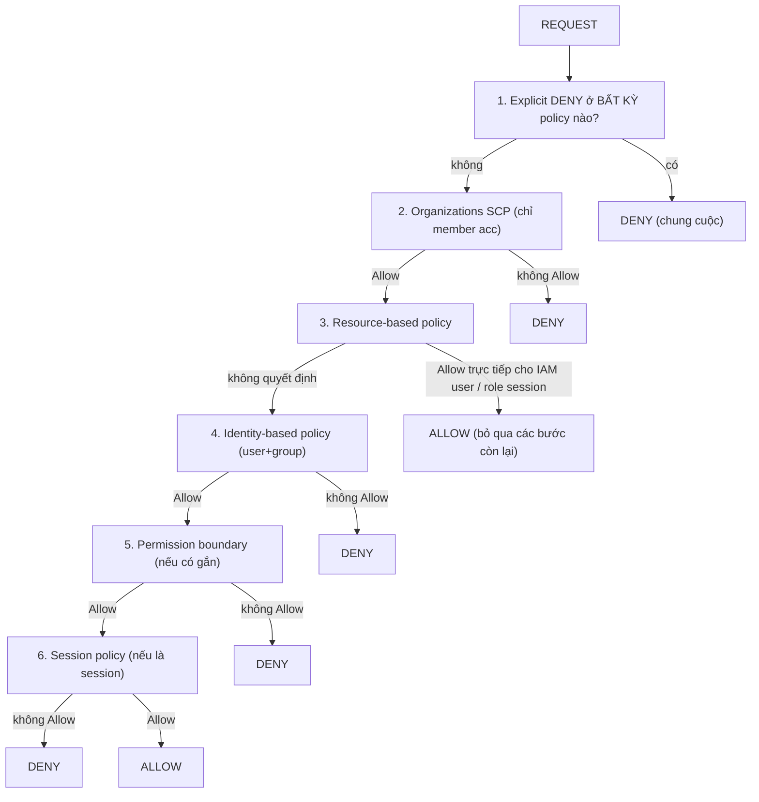
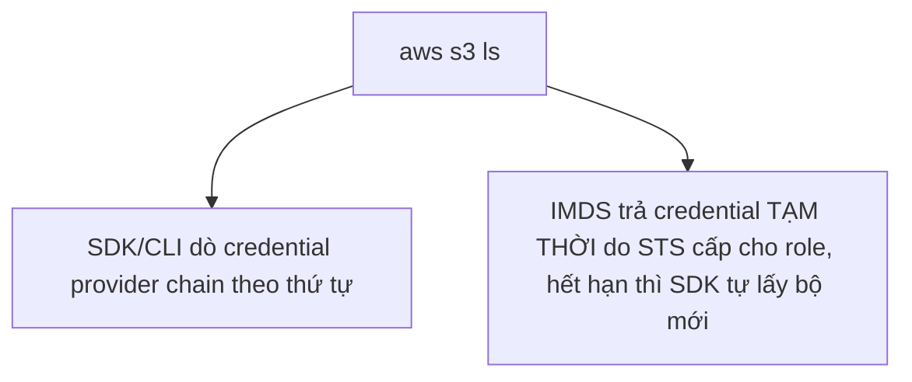
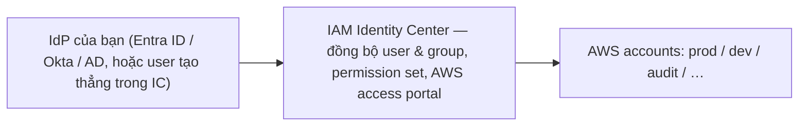

# Tuần 1 — IAM: danh tính, quyền hạn và ranh giới

> Tuần này trả lời một câu hỏi duy nhất nhưng chi phối toàn bộ phần còn lại:
> **khi một request tới AWS, ai quyết định cho phép hay từ chối, và theo trình tự
> nào?** Security là **30% đề thi SAA-C03** — miền nặng nhất — và phần lớn câu hỏi
> security thực chất là câu hỏi IAM trá hình. Chỉ học kỹ được một tuần thì học tuần
> này. Bài giả định bạn đã đọc [Nền tảng AWS](00-nen-tang-aws.md).

---

## Học xong bài này bạn phải trả lời được

1. Vì sao role tốt hơn user, và vì sao đáp án nào có "lưu access key trong ứng dụng" đều sai?
2. Identity-based policy và resource-based policy khác nhau ở câu hỏi nào, và khi nào bạn _bắt buộc_ phải có cả hai?
3. Trust policy nói gì và **không** nói gì? Vì sao nó tách rời hoàn toàn với quyền của role?
4. Viết ra được trình tự đánh giá quyền đầy đủ, và giải thích được vì sao explicit deny thắng tất cả?
5. Permission boundary và SCP đều "giới hạn quyền tối đa" — khác nhau chỗ nào, dùng cái nào khi nào?
6. Instance profile là gì, và cơ chế nào khiến EC2 lấy được credential mà không có access key?
7. STS trả về cái gì, sống bao lâu, và role chaining bị chặn ở đâu?
8. IAM Identity Center thay thế cái gì trong mô hình cũ?

---

## Bản đồ khái niệm



```
AWS enforcement code, theo đúng trình tự:
  1. Explicit DENY ở BẤT KỲ policy nào?   → DENY. Hết.
  2. Organizations SCP có Allow?          → không → DENY
  3. Resource-based policy Allow?         → có thể ĐỦ, dừng ở đây
  4. Identity-based policy Allow?         → không → DENY
  5. Permission boundary Allow?           → không → DENY
  6. Session policy Allow?                → không → DENY  ⇒ còn lại: ALLOW
```

Bốn loại policy mà đề thi liên tục trộn lẫn để bẫy:

| Loại                      | Gắn vào đâu                     | Trả lời câu hỏi                   | `Principal`  |
| ------------------------- | ------------------------------- | --------------------------------- | ------------ |
| **Identity-based policy** | user, group, role               | "Danh tính này được làm gì?"      | Không        |
| **Resource-based policy** | bucket, queue, KMS key, Lambda… | "Ai được đụng vào tôi?"           | **Bắt buộc** |
| **Trust policy**          | **chỉ** role                    | "Ai được hóa thân thành tôi?"     | **Bắt buộc** |
| **Permission boundary**   | user, role                      | "Trần quyền tối đa là bao nhiêu?" | Không        |

Thêm hai loại nữa trong luồng đánh giá: **SCP** (gắn ở Organizations, xem
[Nền tảng AWS](00-nen-tang-aws.md#5-account-và-organizations)) và **session policy**
(truyền lúc gọi `AssumeRole`).

---

## 1. Principal — ai đang gọi API

Trong tài liệu AWS, **principal** là thực thể phát ra request. Năm loại:

### Root user

Danh tính gắn với email đăng ký account. Nó **không bị identity-based policy chi
phối** — root luôn được phép làm mọi thứ trong account của mình. Quy tắc duy nhất:
**bật MFA rồi cất đi.** AWS hiện **bắt buộc** MFA cho root ở mọi loại account, phải
đăng ký trong vòng **35 ngày** kể từ lần đầu đăng nhập console.

Chỉ một nhóm nhỏ việc bắt buộc dùng root: đóng account, đổi support plan, vài thao
tác billing, và khôi phục khi lỡ tự khóa mình.

### IAM user

Danh tính dài hạn, có password (console) và/hoặc **access key** (API). Tối đa
**2 access key mỗi user**, không tăng được — con số đó tồn tại để bạn xoay vòng key:
tạo key mới, chuyển ứng dụng sang, xóa key cũ. Access key sống mãi tới khi có người
chủ động xóa; commit nhầm lên GitHub là kịch bản rò rỉ phổ biến nhất trong thực tế.

> **Bắc cầu:** IAM user ≈ ServiceAccount có token không hết hạn. Đúng cái k8s đã bỏ
> từ v1.24, chuyển sang bound token có TTL. AWS đi cùng hướng: role + STS thay user + key.

### IAM group

**Chỉ là cái túi đựng user.** Group **không phải principal** — không đặt được vào
`Principal` của resource policy, không assume role được. Nó chỉ để gắn policy một
lần rồi áp cho nhiều user. Một user thuộc tối đa **10 group**, không có group lồng group.

### IAM role

Danh tính **không có credential cố định**. Ai đó "mượn" role (assume) và nhận về
một bộ credential **tạm thời** từ STS.

Role có **hai policy tách rời hoàn toàn** — chỗ nhiều người hiểu sai nhất:



Đây là lý do role mạnh hơn user: bạn tách "ai" khỏi "được làm gì", và hai thứ đó
thay đổi độc lập. Role dùng cho dịch vụ AWS, ứng dụng, cross-account, và người dùng
liên kết — trên thực tế **role là câu trả lời mặc định**.

### Service-linked role

Role **liên kết cứng với một dịch vụ AWS**. Dịch vụ định nghĩa sẵn cả trust policy
lẫn permissions policy; bạn **xem được nhưng không sửa được**. Tên luôn có tiền tố
`AWSServiceRoleFor...`. Ví dụ: tạo Auto Scaling Group thì AWS tự tạo
`AWSServiceRoleForAutoScaling`, và bạn chỉ xóa được sau khi đã xóa tài nguyên liên quan.

**Phân biệt với service role thường:** service role là role _bạn_ tạo cho một dịch
vụ assume (ví dụ execution role của Lambda) — bạn sửa được. Service-linked role thì
dịch vụ sở hữu.

---

## 2. Identity-based policy vs resource-based policy

Hai loại này trả lời hai câu hỏi ngược nhau và cùng tồn tại.



|                            | Identity-based                                | Resource-based                                                                                                           |
| -------------------------- | --------------------------------------------- | ------------------------------------------------------------------------------------------------------------------------ |
| Gắn vào                    | user / group / role                           | chính tài nguyên (bucket, queue, topic, KMS key, Lambda function, role)                                                  |
| Có phần tử `Principal`     | **Không** (principal chính là thứ nó gắn vào) | **Có, bắt buộc**                                                                                                         |
| Cross-account              | Chỉ là một nửa — vẫn cần bên kia cho phép     | Cấp được quyền trực tiếp cho account khác                                                                                |
| Dịch vụ nào có             | Mọi thứ                                       | Chỉ một số: S3, SQS, SNS, KMS, Lambda, ECR, Secrets Manager, IAM role (trust policy), EFS, API Gateway, CloudWatch Logs… |
| Kết quả khi cả hai cùng có | **Hợp** của hai bên trong cùng account        |                                                                                                                          |

**Trong cùng một account:** chỉ cần **một trong hai** Allow là đủ (với hầu hết dịch vụ).

**Cross-account:** phải có **cả hai**. Account A đọc bucket của account B thì
identity policy bên A phải Allow _và_ bucket policy bên B phải Allow. Thiếu một bên
là hỏng. Dạng câu hỏi này ra thi rất thường xuyên.

**Hai ngoại lệ phải nhớ:** trust policy của IAM role và key policy của KMS
**bắt buộc phải Allow tường minh cho principal** — không có chuyện identity policy
một mình đủ. Không ai assume được role nếu trust policy không nêu tên họ.

> **Bắc cầu:** identity policy ≈ Role/ClusterRole gắn qua RoleBinding cho một
> ServiceAccount. Resource policy thì k8s không có tương đương trực tiếp — nó gần
> với việc object tự khai báo "ai được đọc tao", giống ACL trong object storage
> hơn là RBAC.

### Vì sao cần cả hai

Resource-based policy giải ba bài toán mà identity policy không giải được: cấp
quyền cho principal ở **account khác**; cấp quyền cho **dịch vụ AWS** (ví dụ
`logs.amazonaws.com` ghi vào bucket của bạn); và quản lý được tình huống 500 user
cần đọc cùng một bucket — sửa một bucket policy dễ hơn sửa 500 identity policy.

---

## 3. Cấu trúc một policy JSON

```json
{
  "Version": "2012-10-17",
  "Statement": [
    {
      "Sid": "AllowReadPublic",
      "Effect": "Allow",
      "Action": ["s3:GetObject"],
      "Resource": "arn:aws:s3:::my-bucket/public/*",
      "Condition": { "Bool": { "aws:SecureTransport": "true" } }
    },
    {
      "Sid": "DenyPrivate",
      "Effect": "Deny",
      "Action": "s3:*",
      "Resource": "arn:aws:s3:::my-bucket/private/*"
    }
  ]
}
```

| Phần tử     | Ý nghĩa                                                                                                                                                                    |
| ----------- | -------------------------------------------------------------------------------------------------------------------------------------------------------------------------- |
| `Version`   | **Luôn là `"2012-10-17"`** — version của _ngôn ngữ policy_, không phải của policy bạn viết. Thiếu nó thì **policy variable không hoạt động**, biến bị hiểu theo nghĩa đen. |
| `Statement` | Mảng câu lệnh. Thứ tự **không** quan trọng.                                                                                                                                |
| `Sid`       | Nhãn để đọc và debug. Không bắt buộc nhưng nên đặt tên có nghĩa.                                                                                                           |
| `Effect`    | `Allow` hoặc `Deny`.                                                                                                                                                       |
| `Action`    | `service:Operation`, ví dụ `s3:GetObject`. Hỗ trợ wildcard `s3:Get*`.                                                                                                      |
| `Resource`  | ARN tài nguyên. Bắt buộc, trừ trust policy.                                                                                                                                |
| `Principal` | Ai. **Chỉ** có trong resource-based policy và trust policy.                                                                                                                |
| `Condition` | Ràng buộc thêm — chỗ least privilege thật sự xảy ra.                                                                                                                       |

### ARN — chỗ sai nhiều nhất

```
arn:aws:s3:::my-bucket        ← chính cái bucket   → dùng cho s3:ListBucket
arn:aws:s3:::my-bucket/*      ← các object bên trong → dùng cho s3:GetObject
```

Hai ARN này **không thay thế được cho nhau**. Viết `s3:GetObject` trên ARN không có
`/*` thì policy không bao giờ khớp, và bạn sẽ debug hàng giờ với một `AccessDenied`
không giải thích gì. Lab tuần 1 cài sẵn cái bẫy này.

Dạng đầy đủ: `arn:partition:service:region:account-id:resource`. Ví dụ
`arn:aws:iam::123456789012:role/app-reader` — IAM là global nên phần region trống.

### Condition — nơi least privilege sống

Vài condition key ra thi thường xuyên:

| Key                                | Dùng để                                                                                |
| ---------------------------------- | -------------------------------------------------------------------------------------- |
| `aws:SecureTransport`              | Bắt buộc TLS. Bucket policy chuẩn luôn `Deny` khi `false`.                             |
| `aws:SourceIp`                     | Giới hạn theo IP nguồn (không hoạt động như mong đợi khi đi qua VPC endpoint).         |
| `aws:SourceVpce` / `aws:SourceVpc` | Chỉ cho phép truy cập qua đúng một VPC endpoint.                                       |
| `aws:PrincipalOrgID`               | Chỉ principal thuộc organization của bạn — thay cho việc liệt kê hàng chục account ID. |
| `aws:MultiFactorAuthPresent`       | Bắt buộc MFA cho thao tác nhạy cảm.                                                    |
| `aws:RequestedRegion`              | Khóa account vào một số Region — hữu ích cho SCP.                                      |
| `s3:x-amz-server-side-encryption`  | Từ chối upload không mã hóa.                                                           |

> **Bắc cầu:** bạn sẽ dùng `data.aws_iam_policy_document` của Terraform chứ không
> viết JSON tay. Nhưng đề thi cho bạn JSON thô, nên phải đọc được nó — và data
> source đó sinh ra đúng cấu trúc trên, không khác gì.

---

## 4. Logic đánh giá quyền — trái tim của Domain 1

Mặc định **mọi request đều bị từ chối** (implicit deny), ngoại lệ duy nhất là root
user. AWS enforcement code chạy theo trình tự sau; mỗi bước có thể kết thúc sớm
bằng **Deny**, chỉ khi đi hết mới là **Allow**.



Bốn điều rút ra:

**1. Explicit deny thắng tất cả, ở mọi lớp, không ngoại lệ.**
Không có "quyền admin đè lên deny". Một `"Effect": "Deny"` khớp là xong. Hệ quả:
muốn chắc chắn một thứ bị chặn vĩnh viễn — kể cả khi tháng sau có người thêm Allow
rộng — hãy viết Deny tường minh, đừng chỉ thu hẹp Allow.

**2. SCP không cấp quyền, chỉ giới hạn.**
Account có SCP `Allow: s3:*` mà user không có identity policy nào thì vẫn không làm
được gì. SCP chỉ định nghĩa _trần_.

**3. Resource-based policy có thể short-circuit.**
Trong cùng account, nếu resource policy cấp quyền **trực tiếp cho ARN của IAM user
hoặc của một role session**, thì implicit deny ở identity policy, permission
boundary hay session policy **không cản được** — đây là lý do đôi khi bucket policy
một mình là đủ. Nhưng nếu resource policy nêu ARN của _role_ (không phải role
session) thì permission boundary và session policy **vẫn** giới hạn được.

**4. Còn lại đều là phép giao.** Identity policy ∩ permission boundary ∩ SCP ∩
session policy. Thêm lớp nào cũng chỉ làm quyền hẹp lại, không bao giờ rộng ra.

### Ba giá trị bạn sẽ thấy trong IAM Policy Simulator

| Kết quả        | Nghĩa là                                   |
| -------------- | ------------------------------------------ |
| `allowed`      | Có ít nhất một Allow và không có Deny nào  |
| `implicitDeny` | Không ai cấm, nhưng cũng không ai cho phép |
| `explicitDeny` | Có một `Effect: Deny` khớp                 |

Phân biệt hai loại deny là kỹ năng debug quan trọng nhất: `implicitDeny` = "thiếu
Allow, thêm quyền vào"; `explicitDeny` = "có người chủ động cấm, đi tìm ai cấm" —
thêm Allow bao nhiêu cũng vô ích. Lab tuần 1 cho bạn thấy đủ ba giá trị này.

---

## 5. Permission boundary vs SCP

Cả hai đều "giới hạn quyền tối đa", cả hai đều **không cấp quyền**, và đề thi rất
thích trộn chúng.

|                     | Permission boundary                                               | Service Control Policy (SCP)                                                         |
| ------------------- | ----------------------------------------------------------------- | ------------------------------------------------------------------------------------ |
| Thuộc dịch vụ       | IAM                                                               | AWS Organizations                                                                    |
| Gắn vào             | **Một IAM user hoặc một IAM role**                                | Root, OU, hoặc **cả một account**                                                    |
| Phạm vi ảnh hưởng   | Đúng entity được gắn                                              | Mọi principal trong account (trừ management account)                                 |
| Ảnh hưởng root user | Không (root không có boundary)                                    | Không áp cho root của management account; **có** áp cho principal của member account |
| Ai quản lý          | Admin của account                                                 | Admin của organization                                                               |
| Cần Organizations   | Không                                                             | **Có**, và phải bật "all features"                                                   |
| Bài toán điển hình  | Ủy quyền tạo user/role cho developer mà không sợ họ tự nâng quyền | Hàng rào toàn tổ chức: cấm dùng Region ngoài danh sách, cấm tắt CloudTrail           |

### Bài toán kinh điển của permission boundary

Bạn muốn developer tự tạo IAM role cho ứng dụng của họ, nhưng không muốn họ tạo ra
một role `AdministratorAccess` rồi assume nó. Giải: cho developer quyền `iam:CreateRole` **kèm điều kiện bắt buộc gắn một
permission boundary cụ thể**. Role họ tạo ra không vượt được cái trần đó, kể cả khi
họ gắn `AdministratorAccess`:

```
  identity policy    : AdministratorAccess   (rộng)
  permission boundary: chỉ s3:* và logs:*    (hẹp)
  quyền thực tế      : chỉ s3:* và logs:*    ← GIAO của hai bên
```

Nhận ra tình huống "ủy quyền quản lý IAM mà không nâng quyền" → permission boundary.

### Bài toán kinh điển của SCP

"Không account nào được tạo tài nguyên ngoài `us-east-1`." · "Không ai được tắt
CloudTrail, kể cả admin của account đó." · "Account sandbox chỉ được dùng EC2, S3,
CloudWatch." Nhận ra "áp cho toàn account / toàn tổ chức, kể cả admin" → SCP.

> **Bắc cầu:** SCP ≈ `ValidatingAdmissionPolicy` mức cluster do platform team quản
> lý, team ứng dụng không gỡ được. Permission boundary ≈ ResourceQuota gắn vào một
> namespace. Cả hai là "trần", không phải "quyền".

---

## 6. IAM role cho EC2 — instance profile

Ứng dụng chạy trên EC2 cần đọc S3. Làm sao nó có credential?

**Sai** (nhưng vẫn thấy đầy trên internet): tạo IAM user, sinh access key, nhét vào
`~/.aws/credentials`. **Đúng:** gắn IAM role vào instance qua **instance profile**.

### Instance profile là gì

Instance profile là **cái vỏ bọc bắt buộc để gắn một role vào EC2**. EC2 không nhận
role trực tiếp — nó nhận instance profile, và instance profile chứa đúng một role.
Console tạo nó ngầm nên nhiều người không biết nó tồn tại; Terraform thì bắt khai báo:

```hcl
resource "aws_iam_instance_profile" "app" {
  name = "app-profile"
  role = aws_iam_role.app.name        # ← đúng MỘT role
}
```

### Cơ chế: credential đến từ đâu



```
Credential provider chain theo thứ tự:
  1. tham số trong code   2. biến môi trường   3. ~/.aws/credentials
  …   5. Instance Metadata Service tại 169.254.169.254   ← chỗ này
```

Bạn không phải làm gì cả. Không có key nào trên đĩa, không có gì để rò rỉ qua git.

### IMDSv2 — và vì sao nó bắt buộc

IMDSv1 cho lấy credential bằng đúng một `GET` tới `169.254.169.254`. Ứng dụng dính
lỗ hổng SSRF là kẻ tấn công đọc được credential của role. IMDSv2 bắt buộc lấy token
bằng `PUT` trước rồi gửi kèm ở header:

```bash
TOKEN=$(curl -X PUT "http://169.254.169.254/latest/api/token" \
  -H "X-aws-ec2-metadata-token-ttl-seconds: 21600")
curl -H "X-aws-ec2-metadata-token: $TOKEN" http://169.254.169.254/latest/meta-data/iam/info
```

SSRF thường chỉ gửi được `GET` nên không lấy được token. Lab tuần 2 ép IMDSv2 và
cho bạn thấy IMDSv1 trả `401`.

> **Bắc cầu:** đây chính xác là IRSA / Workload Identity trên k8s — pod lấy token
> từ endpoint local thay vì mang secret theo mình.

### Quy tắc đi thi

> Thấy đáp án nào chứa "lưu access key trong file cấu hình / biến môi trường / mã
> nguồn / user data" → **loại ngay**. Đáp án đúng gần như luôn là "gắn IAM role".

Áp dụng cho mọi thứ chạy trên AWS: Lambda có execution role, ECS task có task role,
CodeBuild có service role. Cùng một mô hình.

---

## 7. STS và credential tạm thời

**AWS Security Token Service (STS)** cấp credential có thời hạn. Mọi role đều đi
qua nó. Bộ credential tạm thời gồm **ba** phần (access key tĩnh chỉ có hai):
`AccessKeyId` (tiền tố `ASIA`, key tĩnh là `AKIA`), `SecretAccessKey`, và
`SessionToken` — phần chỉ credential tạm thời mới có. Kèm `Expiration`.

Các thao tác chính:

| API                         | Dùng khi                                                      |
| --------------------------- | ------------------------------------------------------------- |
| `AssumeRole`                | Cross-account, role cho dịch vụ AWS, chuyển vai trong console |
| `AssumeRoleWithWebIdentity` | Liên kết OIDC (Cognito, Google, GitHub Actions, EKS IRSA)     |
| `AssumeRoleWithSAML`        | Liên kết SAML với AD/IdP doanh nghiệp                         |
| `GetSessionToken`           | Lấy credential có MFA cho IAM user                            |
| `GetCallerIdentity`         | "Tôi đang là ai?" — không cần quyền gì                        |

Thời hạn `AssumeRole`: từ **900 giây (15 phút)** tới **max session duration của
role**, mà max đặt được từ 1 tới **12 giờ**. Không truyền gì thì mặc định **1 giờ**.

**Role chaining** — dùng credential của một role để assume role tiếp theo — bị giới
hạn **tối đa 1 giờ**, bất kể cấu hình của role. Truyền `DurationSeconds` lớn hơn
thì API lỗi. Đây là chi tiết ra thi.

```bash
aws sts get-caller-identity --profile learn   # lệnh đầu tiên khi nghi ngờ về quyền
```

ARN dạng `arn:aws:sts::…:assumed-role/app-reader/i-0abc…` nghĩa là bạn đang chạy
bằng role. Dạng `arn:aws:iam::…:user/…` nghĩa là credential dài hạn.

---

## 8. IAM Identity Center — mức khái niệm

Vấn đề với IAM user: mỗi account một tập user riêng. 20 account thì nhân viên mới
cần 20 lần tạo user, nghỉ việc cần 20 lần xóa. **AWS IAM Identity Center** (tên cũ
AWS Single Sign-On, đổi tên 26/07/2022) giải bài toán đó: **liên kết một lần, truy
cập mọi account.**



- **Identity source** — nơi user thật sự sống: IdP ngoài qua SAML 2.0, Active
  Directory, hoặc chính Identity Center.
- **Permission set** — tập quyền đặt tên sẵn ("ReadOnly", "Developer"). Gán nó cho
  một group ở một account thì Identity Center **tự tạo IAM role tương ứng trong
  account đó**. Bên dưới vẫn là IAM role + STS, không có gì ma thuật.
- **AWS access portal** — trang nhân viên đăng nhập, thấy danh sách account và vai
  trò, bấm vào là vào console hoặc lấy credential CLI (`aws configure sso`).

Hai kiểu instance: **organization instance** (ở management account — best practice,
và là kiểu duy nhất quản lý được truy cập vào AWS account) và **account instance**
(chỉ hỗ trợ vài ứng dụng AWS managed tách biệt).

**Ở mức SAA chỉ cần nhận diện:** đề mô tả "nhiều account, nhân viên dùng directory
sẵn có của công ty, cần đăng nhập một lần" → IAM Identity Center, không phải tạo
IAM user ở từng account.

---

## 9. Least privilege trên thực tế

"Least privilege" nghe hiển nhiên. Cái khó là đi từ `*` xuống tối thiểu mà không
mất cả tuần.

1. **Bắt đầu bằng AWS managed policy** để hệ thống chạy được. Đừng cầu toàn ngay.
2. **Chạy vài ngày rồi đọc dữ liệu thật.** IAM console có **Access Advisor** cho
   mỗi user/role: dịch vụ nào đã thật sự được gọi, lần cuối khi nào. 90 ngày không
   ai gọi thì cắt.
3. **Thu hẹp `Resource` trước, `Action` sau.** Đổi `"Resource": "*"` thành ARN cụ
   thể giảm rủi ro nhiều hơn là cắt bớt action.
4. **Thêm `Condition`** — bắt buộc TLS, giới hạn Region, giới hạn VPC endpoint.
5. **Kiểm chứng bằng IAM Policy Simulator** trước khi đẩy đi.
6. **Bật IAM Access Analyzer** (miễn phí): soi resource policy và báo cái nào đang
   cấp quyền ra ngoài account/organization. Nó cũng sinh policy từ lịch sử CloudTrail.

Bốn quy tắc cứng: **managed policy trước, inline sau** (inline chỉ khi quan hệ 1-1);
**đừng gắn policy thẳng vào user** — gắn vào group (cho người) hoặc role (cho máy);
**`iam:PassRole` là quyền nguy hiểm**, luôn khóa bằng `Resource` cụ thể; và **không
bao giờ `"Action": "*"` với `"Resource": "*"`** ngoài role admin thật sự.

> **Bắc cầu:** Access Advisor ≈ audit log để tỉa RBAC; Access Analyzer ≈ một policy
> engine kiểu OPA/Kyverno soi cấu hình và báo vi phạm — nhưng có sẵn và miễn phí.

---

## Bảng quyết định

| Tình huống                                                | Chọn                                    | Vì sao không chọn cái kia                                       |
| --------------------------------------------------------- | --------------------------------------- | --------------------------------------------------------------- |
| Ứng dụng trên EC2 cần gọi AWS API                         | IAM role + instance profile             | Access key sẽ nằm trên đĩa và sống mãi                          |
| Lambda cần ghi DynamoDB                                   | Execution role của Lambda               | Cùng lý do                                                      |
| Người thật cần truy cập console, công ty có nhiều account | IAM Identity Center                     | IAM user ở từng account không quản lý nổi                       |
| Cho account khác đọc bucket của bạn                       | Bucket policy + identity policy bên họ  | Chỉ một bên là không đủ trong cross-account                     |
| 500 user cần đọc cùng một bucket                          | Bucket policy                           | Sửa 500 identity policy là không khả thi                        |
| Chắc chắn chặn một action vĩnh viễn                       | **Explicit Deny**                       | Thu hẹp Allow sẽ bị vô hiệu nếu ai đó thêm Allow rộng sau này   |
| Cho developer tự tạo role mà không leo thang quyền        | Permission boundary                     | SCP quá rộng, áp cho cả account                                 |
| Cấm mọi account trong tổ chức tắt CloudTrail              | SCP                                     | Permission boundary chỉ áp cho từng entity, admin vẫn lách được |
| Bắt buộc MFA cho thao tác xóa                             | `Condition: aws:MultiFactorAuthPresent` | Không cơ chế nào khác diễn đạt được điều này trong policy       |
| Cần biết role nào thừa quyền / bucket nào hở ra ngoài     | Access Advisor / IAM Access Analyzer    | Đọc tay từng policy không scale                                 |

---

## Số phải thuộc

| Con số                                     | Giá trị                                            | Ghi chú                                           |
| ------------------------------------------ | -------------------------------------------------- | ------------------------------------------------- |
| Trọng số Domain 1 (Security)               | **30%**                                            | Nặng nhất trong 4 domain                          |
| Access key mỗi IAM user                    | **2**                                              | **Không tăng được** — tồn tại để xoay vòng key    |
| Group mỗi user / MFA device mỗi user       | **10** / **8**                                     | Không tăng được                                   |
| Managed policy gắn vào role / user / group | **20** / **10** / **10**                           | Role và user tăng được (25 / 20)                  |
| Độ dài customer managed policy             | **6.144 ký tự**                                    | Không tính khoảng trắng, không tăng được          |
| Độ dài inline policy                       | user **2.048** / role **10.240** / group **5.120** | Tổng mọi inline policy của entity                 |
| Độ dài trust policy                        | **2.048 ký tự** (tăng tới 8.192)                   |                                                   |
| Session duration của role                  | **15 phút → tối đa 12 giờ**, mặc định **1 giờ**    | Max của role đặt được từ 1 đến 12 giờ             |
| **Role chaining**                          | **tối đa 1 giờ**                                   | Bất kể cấu hình role là bao nhiêu                 |
| Session policy                             | **2.048 ký tự**, tối đa **10** managed policy ARN  | Session tag tối đa 50                             |
| Hạn mức request STS                        | **600 request/giây** mỗi account mỗi Region        | Dùng chung cho `AssumeRole`, `GetCallerIdentity`… |
| Role / customer managed policy mỗi account | **1.000** / **1.500**                              | Đều tăng tới 10.000                               |
| Hạn đăng ký MFA cho root                   | **35 ngày** kể từ lần đầu đăng nhập console        | Bắt buộc ở mọi loại account                       |
| `Version` của policy                       | **`"2012-10-17"`**                                 | Luôn luôn                                         |

---

## Bẫy kinh điển

**"Trust policy nói role được làm gì."** Không — nó chỉ trả lời **ai được mượn
role**. Quyền nằm ở permissions policy gắn kèm, hoàn toàn tách rời. Đây là hiểu lầm
phổ biến nhất về IAM role.

**"Có `AdministratorAccess` thì làm được mọi thứ."** Không, nếu có explicit Deny ở
đâu đó — SCP, bucket policy, permission boundary, hay chính identity policy.

**"SCP cấp quyền, và SCP áp cho mọi account."** Sai cả hai vế. SCP chỉ đặt trần —
account vẫn cần identity policy để làm gì đó. Và SCP **không áp cho management
account**; đó là lý do best practice bảo bạn đừng chạy workload ở đó.

**`arn:aws:s3:::bucket` và `arn:aws:s3:::bucket/*` là như nhau.** Không. Cái đầu là
bucket (`s3:ListBucket`), cái sau là object bên trong (`s3:GetObject`). Nhầm chỗ này
là lỗi debug tốn thời gian nhất khi viết policy S3.

**"Group là principal."** Không — chỉ user, role, account và service principal đặt
được vào `Principal`.

**"Permission boundary cấp quyền."** Không. Entity có boundary `s3:*` mà không có
identity policy nào thì vẫn không làm được gì.

**"Role dùng access key, chỉ là key ngắn hạn."** Thiếu một phần: credential tạm thời
có **ba** thành phần, thêm `SessionToken` — thiếu nó là request bị từ chối. Access
key ID cũng khác tiền tố: `ASIA` (tạm thời) so với `AKIA` (dài hạn).

**"Tôi gán role vào EC2 là xong."** Bạn gán **instance profile**, và nó chứa role.
Console giấu bước này đi; Terraform và CloudFormation thì không.

**"Role chaining cho tôi session 12 tiếng."** Không — bị chặn cứng ở **1 giờ**.

**"Tạo role xong assume được ngay."** IAM eventually consistent, có thể lỗi
`AccessDenied` vài giây đầu. Xem [Nền tảng AWS](00-nen-tang-aws.md#7-eventual-consistency).

**"Root có MFA rồi thì dùng root cho tiện."** MFA giảm rủi ro đăng nhập, không giảm
rủi ro thao tác. Root không bị policy nào chặn — một lệnh sai của root không có lưới
an toàn nào cả.

---

## Nối với lab

[`learn-aws/labs/w01-iam-foundations/`](../../learn-aws/labs/w01-iam-foundations/) — **$0,00, khoảng 2 giờ, không rủi ro đốt tiền.**

Terraform dựng: S3 bucket private (kèm bucket policy `Deny` mọi request không dùng
TLS — resource policy đầu tiên bạn nhìn thấy), một IAM policy dùng chung, một IAM
user, một IAM role cho EC2 kèm instance profile, và IAM Access Analyzer. Ansible ở
lab này **không dựng hạ tầng** — nó chạy Policy Simulator và một bài audit bảo mật.

| Khái niệm trong bài          | Chỗ lab chạm vào                                                           | Quan sát cái gì                                                                                                    |
| ---------------------------- | -------------------------------------------------------------------------- | ------------------------------------------------------------------------------------------------------------------ |
| Identity vs resource policy  | `terraform/main.tf` — policy `w01-s3-reader` và bucket policy              | Hai file, hai câu hỏi khác nhau, cùng một bucket                                                                   |
| Trust policy                 | `assume_role_policy` của role `w01-ec2-reader`                             | Nó chỉ nói `ec2.amazonaws.com`, không nói quyền gì                                                                 |
| Instance profile             | `aws_iam_instance_profile`                                                 | Cái vỏ bọc mà console giấu đi                                                                                      |
| ARN có `/*` và không có `/*` | Bẫy số 1 trong README của lab                                              | Sửa ARN, chạy lại `verify.sh`, xem kết quả đổi                                                                     |
| Ba giá trị đánh giá quyền    | `ansible-playbook site.yml --tags simulate`                                | `allowed` / `implicitDeny` / `explicitDeny` hiện ra thật                                                           |
| Explicit deny thắng tất cả   | Bài tập chặn tiền tố `private/` — chọn giữa "thu hẹp Allow" và "thêm Deny" | Cách nào sống sót khi tháng sau có người thêm Allow rộng?                                                          |
| Least privilege thực hành    | `--tags audit`                                                             | Đếm access key tĩnh, tìm ai cầm `AdministratorAccess`, đọc finding Access Analyzer; báo động nếu root chưa bật MFA |
| Eventual consistency         | `verify.sh` chạy ngay sau `apply`                                          | Thỉnh thoảng phải chạy lại — đó không phải bug                                                                     |

Sau lab phải nói được bằng lời của bạn: **identity policy khác resource policy ở
đâu**, và **vì sao role an toàn hơn access key**.

Ba khái niệm chưa lab được ở tuần 1, để tới [tuần 9](w09-security-deep.md):
permission boundary, SCP, và cross-account `AssumeRole` kèm external ID.

---

## Tự kiểm tra

<details>
<summary>1. Một IAM user có <code>AdministratorAccess</code>. Bucket policy của bucket X có một statement <code>Deny s3:DeleteObject</code> cho mọi principal. User đó xóa được object trong X không?</summary>

**Không.** Explicit deny thắng tất cả. `AdministratorAccess` chỉ là một Allow, và
Allow không bao giờ đè được Deny. Muốn xóa được phải sửa bucket policy.

</details>

<details>
<summary>2. Account A có role muốn đọc bucket của account B. Bucket policy bên B đã Allow cho ARN của role đó. Đủ chưa?</summary>

**Chưa.** Cross-account cần **cả hai** phía: identity policy bên A phải Allow
`s3:GetObject` trên ARN bucket của B, _và_ bucket policy bên B phải Allow principal
đó. Trong _cùng_ một account thì chỉ cần một bên — đây là khác biệt hay bị nhầm.

</details>

<details>
<summary>3. Bạn gắn permission boundary chỉ cho phép <code>s3:*</code> vào một role đang có <code>AdministratorAccess</code>. Role đó làm được gì?</summary>

Chỉ `s3:*`. Quyền thực tế là **giao** của identity policy và permission boundary —
`AdministratorAccess` bị cắt xuống bằng cái trần. Đây là cơ chế cho phép ủy quyền
tạo IAM role cho developer mà không sợ leo thang quyền.

</details>

<details>
<summary>4. Script CI của bạn assume role A, rồi từ role A assume tiếp role B với <code>DurationSeconds=14400</code> (4 giờ). API lỗi. Vì sao?</summary>

**Role chaining giới hạn session ở tối đa 1 giờ**, bất kể cấu hình của role B.
Truyền `DurationSeconds` > 3600 khi chaining thì operation thất bại. Sửa: giảm
xuống ≤ 3600, hoặc assume thẳng role B từ credential gốc.

</details>

<details>
<summary>5. Policy Simulator trả về <code>implicitDeny</code> cho một action. Bạn thêm một statement Allow. Có chắc sửa được không? Nếu trả về <code>explicitDeny</code> thì sao?</summary>

`implicitDeny` = không ai cấm, chỉ là thiếu Allow → thêm Allow là xong.

`explicitDeny` = có một `Effect: Deny` khớp ở đâu đó → thêm Allow **vô ích**, phải
đi tìm nguồn của Deny (identity policy, bucket policy, SCP, boundary, session policy).

</details>

<details>
<summary>6. Developer cần tự tạo IAM role cho ứng dụng của họ. Bạn dùng permission boundary hay SCP?</summary>

**Permission boundary.** Nó gắn vào từng entity và giải đúng bài toán "ủy quyền
quản lý IAM mà không cho leo thang quyền": cho họ `iam:CreateRole` kèm điều kiện
bắt buộc gắn boundary. SCP áp cho cả account nên chặn luôn người khác, và không
diễn đạt được ràng buộc "role bạn tạo ra phải có trần này".

</details>

<details>
<summary>7. Tổ chức muốn không account nào tắt được CloudTrail, kể cả admin của account đó. Dùng gì?</summary>

**SCP** gắn ở root hoặc OU, với `Deny cloudtrail:StopLogging` và
`Deny cloudtrail:DeleteTrail`. SCP áp cho mọi principal trong member account, kể cả
người có `AdministratorAccess`. Lưu ý: nó **không** áp cho management account — nên
đừng chạy workload ở đó.

</details>

<details>
<summary>8. EC2 instance của bạn bị khai thác SSRF. Kẻ tấn công làm được gì với IMDSv1, và IMDSv2 chặn ở đâu?</summary>

Với IMDSv1: một `GET` tới `169.254.169.254/latest/meta-data/iam/security-credentials/`
là lấy được credential tạm thời của role, rồi dùng từ bên ngoài tới khi hết hạn.
IMDSv2 bắt buộc `PUT` lấy token trước và gửi token ở header; SSRF thường chỉ điều
khiển được `GET`. Ép IMDSv2 (`HttpTokens: required`) là mặc định nên có.

</details>

<details>
<summary>9. Vì sao <code>iam:PassRole</code> được coi là quyền nguy hiểm?</summary>

Vì nó cho phép **gắn một role vào một tài nguyên**. Có `iam:PassRole` không giới hạn
cộng với `ec2:RunInstances` là bạn launch được EC2 mang role `AdministratorAccess`,
vào máy đó và dùng credential của nó — leo thang quyền hoàn chỉnh dù identity policy
của bạn không có quyền admin nào. Luôn khóa `iam:PassRole` bằng ARN role cụ thể.
</details>

<details>
<summary>10. Công ty có 15 AWS account và dùng Entra ID. Nhân viên mới cần truy cập 6 account với vai trò khác nhau. Thiết kế thế nào?</summary>

**IAM Identity Center**: kết nối Entra ID làm identity source qua SAML 2.0, đồng bộ
user và group, tạo permission set cho từng vai trò, gán cho group ở từng account.
Nhân viên đăng nhập AWS access portal một lần, thấy đủ 6 account. Bên dưới,
Identity Center tự tạo IAM role tương ứng ở mỗi account và vẫn chạy qua STS.
</details>

---

## Ngoài phạm vi

- **Cross-account `AssumeRole` kèm external ID** — chống confused deputy; để [tuần 9](w09-security-deep.md). [Tài liệu](https://docs.aws.amazon.com/IAM/latest/UserGuide/id_roles_create_for-user_externalid.html)
- **Resource Control Policy (RCP)** — mới, chưa nằm trong SAA-C03. [Tài liệu](https://docs.aws.amazon.com/organizations/latest/userguide/orgs_manage_policies_rcps.html)
- **ABAC chi tiết** (điều khiển truy cập theo tag) — biết khái niệm là đủ ở mức SAA. [Tài liệu](https://docs.aws.amazon.com/IAM/latest/UserGuide/introduction_attribute-based-access-control.html)
- **IAM Roles Anywhere** — role cho workload ngoài AWS bằng chứng chỉ X.509. Nhận diện use case là đủ. [Tài liệu](https://docs.aws.amazon.com/rolesanywhere/latest/userguide/introduction.html)
- **Cognito user pool vs identity pool**, **KMS key policy và envelope encryption** — để [tuần 9](w09-security-deep.md). [Cognito](https://docs.aws.amazon.com/cognito/latest/developerguide/what-is-amazon-cognito.html) · [KMS](https://docs.aws.amazon.com/kms/latest/developerguide/key-policies.html)
- **Cấu hình SAML / OIDC provider từng bước** — thao tác, không phải kiến thức thi. [Tài liệu](https://docs.aws.amazon.com/IAM/latest/UserGuide/id_roles_providers.html)

---

## Nguồn

- [How IAM works](https://docs.aws.amazon.com/IAM/latest/UserGuide/intro-structure.html) — tổng quan authentication/authorization
- [Policy evaluation logic](https://docs.aws.amazon.com/IAM/latest/UserGuide/reference_policies_evaluation-logic.html)
- [How AWS enforcement code logic evaluates requests](https://docs.aws.amazon.com/IAM/latest/UserGuide/reference_policies_evaluation-logic_policy-eval-denyallow.html) — trình tự đầy đủ 6 bước
- [Permissions boundary](https://docs.aws.amazon.com/help-panel/IAM/latest/console/hp-policies-permissions-boundary.html)
- [Service control policies (SCPs)](https://docs.aws.amazon.com/organizations/latest/userguide/orgs_manage_policies_scps.html)
- [Create a service-linked role](https://docs.aws.amazon.com/IAM/latest/UserGuide/id_roles_create-service-linked-role.html)
- [IAM and AWS STS quotas](https://docs.aws.amazon.com/IAM/latest/UserGuide/reference_iam-quotas.html) — độ dài policy, session duration, quota STS
- [AWS Identity and Access Management endpoints and quotas](https://docs.aws.amazon.com/general/latest/gr/iam-service.html) — access key/user, group/user, MFA device/user
- [Troubleshoot IAM roles — session 12 giờ và role chaining](https://docs.aws.amazon.com/IAM/latest/UserGuide/troubleshoot_roles.html)
- [Multi-factor authentication for AWS account root user](https://docs.aws.amazon.com/IAM/latest/UserGuide/enable-mfa-for-root.html) — bắt buộc MFA, 35 ngày
- [What is IAM Identity Center?](https://docs.aws.amazon.com/singlesignon/latest/userguide/what-is.html)
- [Troubleshoot IAM — Changes are not always immediately visible](https://docs.aws.amazon.com/IAM/latest/UserGuide/troubleshoot.html)
