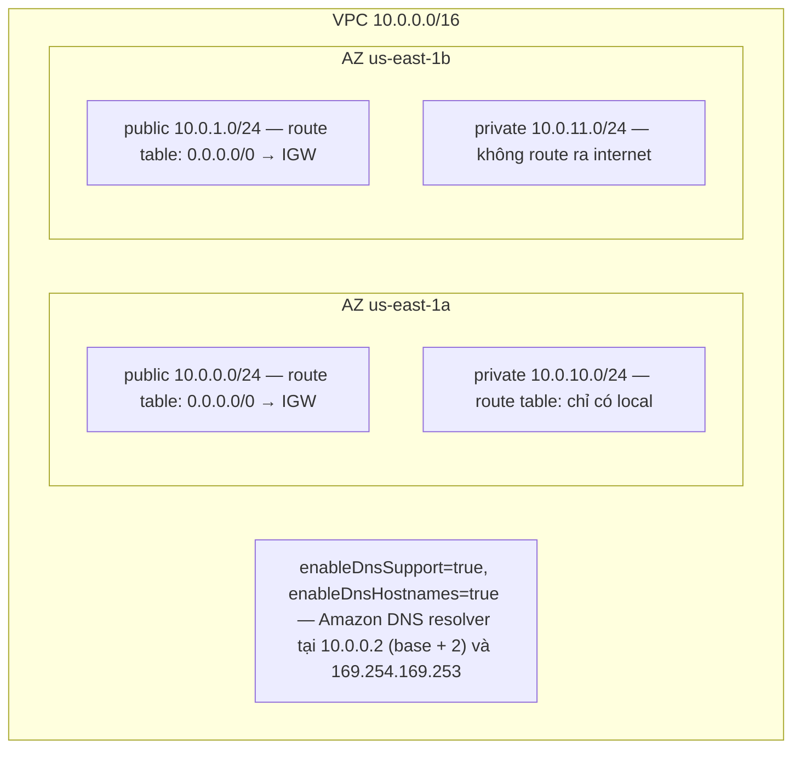
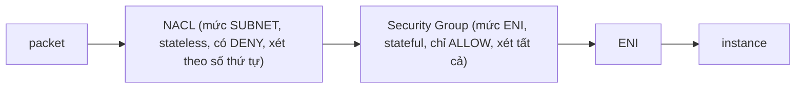

# Tuần 2 — VPC: xương sống của mọi câu hỏi kiến trúc

> Tuần này trả lời: **gói tin đi từ đâu tới đâu, và cái gì cho phép nó đi?**
> VPC không phải một domain riêng của đề thi — nó nằm rải trong cả bốn. Câu security
> hỏi Security Group, câu resilient hỏi subnet trải nhiều AZ, câu performance hỏi
> endpoint, câu cost hỏi NAT Gateway. Học kỹ tuần này là mua điểm ở khắp nơi.
>
> Bài giả định bạn đã đọc [Nền tảng AWS](00-nen-tang-aws.md) (AZ, service quota) và
> [Tuần 1](w01-iam-foundations.md) (IAM role, instance profile).

---

## Học xong bài này bạn phải trả lời được

1. Public subnet khác private subnet ở đúng cái gì? (Gợi ý: không phải cái tên.)
2. Vì sao một `/28` chỉ chứa được 11 instance chứ không phải 16?
3. Security Group và NACL — cái nào stateful, cái nào có DENY, và khi nào bạn *bắt buộc* dùng NACL?
4. Instance trong private subnet cần gọi S3. Ba phương án, giá chênh nhau bao nhiêu lần, chọn cái nào?
5. Gateway Endpoint và Interface Endpoint khác nhau ở cơ chế nào, và vì sao một cái miễn phí còn cái kia không?
6. VPC A peering với B và với C. Instance ở B nói chuyện được với C không? Vì sao?
7. Route table có `0.0.0.0/0 → IGW` và `10.0.0.0/16 → local`. Gói tin đi tới `10.0.5.20` đi đường nào?
8. `enableDnsSupport` và `enableDnsHostnames` — tắt cái nào thì Interface Endpoint hỏng?

---

## Bản đồ khái niệm



Route table `0.0.0.0/0 → IGW` chính LÀ định nghĩa "public".

Các thành phần gắn vào VPC:

- Internet Gateway (IGW) — 1 cái / VPC, không băng thông giới hạn, free
- NAT Gateway — trong PUBLIC subnet, $$$ ← kẻ giết credit số 1
- Gateway Endpoint (S3, DDB) — chèn prefix list vào route table, MIỄN PHÍ
- Interface Endpoint — tạo ENI trong subnet, $0,01/giờ/AZ
- VPC Peering — 1-1, KHÔNG transitive
- Transit Gateway — hub-and-spoke, transitive, $$$

Lớp lọc gói tin — hai lớp, hoạt động khác hẳn nhau:



---

## 1. CIDR và chia subnet

VPC là một khối địa chỉ IP riêng. CIDR chọn lúc tạo và **không sửa được** — chỉ
thêm được CIDR phụ.

| Ràng buộc | Giá trị |
|---|---|
| CIDR của VPC và của subnet | `/16` (65.536 IP) đến `/28` (16 IP) |
| CIDR block mỗi VPC / subnet mỗi VPC | **5** (tăng tới 50), gồm primary / 200 |
| Subnet trải qua nhiều AZ | **Không.** Một subnet nằm trong đúng một AZ |

Dùng dải RFC 1918 (`10.0.0.0/8`, `172.16.0.0/12`, `192.168.0.0/16`). Dải khác cũng
được nhưng private DNS hostname sẽ không phân giải được qua peering.

### Năm địa chỉ AWS lấy đi

Trong **mỗi** subnet, năm địa chỉ không dùng được. Với `10.0.0.0/24`: `.0` network
address, `.1` VPC router, `.2` **Amazon DNS** (base của dải VPC cộng 2), `.3` AWS
giữ cho tương lai, `.255` broadcast (VPC không hỗ trợ broadcast nhưng vẫn giữ).

Công thức: **số IP dùng được = 2^(32 − prefix) − 5**.

```
/28 → 16 − 5 = 11        ← ASG desired=12 sẽ thất bại
/24 → 256 − 5 = 251
/20 → 4.096 − 5 = 4.091
/16 → 65.536 − 5 = 65.531
```

Đây là **service quota không tăng được**. Nó là nguyên nhân thật sự đằng sau rất
nhiều câu hỏi kiểu "vì sao Auto Scaling không scale được".

### Cách chia thực dụng

```
VPC 10.0.0.0/16
  public  10.0.0.0/24  + 10.0.1.0/24   (AZ a, b)  ← ALB, NAT Gateway, bastion
  private 10.0.10.0/24 + 10.0.11.0/24  (AZ a, b)  ← app server, EKS node
  data    10.0.20.0/24 + 10.0.21.0/24  (AZ a, b)  ← RDS, ElastiCache
```

Nguyên tắc: **chia rộng hơn bạn nghĩ cần** — IP không mất tiền, xây lại VPC vì hết
địa chỉ thì rất tốn. Chừa khoảng trống giữa các dải để mở rộng.

> **Bắc cầu:** đây là bài toán bạn đã làm khi quy hoạch pod CIDR, service CIDR và
> node CIDR cho một cụm k8s. Khác biệt: trên AWS, pod thường lấy IP **thật sự từ
> subnet** (VPC CNI), nên số IP của subnet là số pod bạn chạy được. Overlay network
> kiểu Calico VXLAN che chuyện đó đi; AWS VPC CNI thì không.

---

## 2. Public subnet vs private subnet

**Chỉ khác nhau ở route table.** Không có checkbox "public" nào cả.

| | Public subnet | Private subnet |
|---|---|---|
| Route table | có `0.0.0.0/0 → igw-xxx` | không có route đó |
| Ra được internet | Có, **nếu** có public IP hoặc Elastic IP | Chỉ qua NAT hoặc endpoint |
| Internet vào được | Có, nếu SG/NACL cho phép | Không |

Ba điều kiện để instance ra được internet, **thiếu một là hỏng**: (1) subnet có
route `0.0.0.0/0 → Internet Gateway`; (2) instance có **public IPv4 hoặc Elastic
IP** — private IP một mình không đủ; (3) SG cho phép outbound và NACL cho phép **cả
hai chiều**.

Đề thi rất thích câu "instance trong public subnet không ra được internet, vì sao" —
đáp án luôn là một trong ba điều kiện trên.

---

## 3. Internet Gateway, route table, longest prefix match

**Internet Gateway (IGW)** là thành phần managed, dư thừa sẵn, **không giới hạn
băng thông**, **miễn phí** (bạn chỉ trả data transfer). Một VPC gắn **đúng một** IGW.

IGW làm hai việc: mở đường ra/vào internet cho route table, và **NAT 1-1** giữa
public IP và private IP của instance. Đó là lý do bên trong OS bạn chỉ thấy private IP.

### Route table

Mỗi subnet gắn **đúng một** route table; một route table gắn được nhiều subnet. VPC
có một **main route table** mặc định cho subnet chưa gắn gì.

Mọi route table đều có sẵn route **`local`** phủ toàn bộ CIDR của VPC, và bạn
**không xóa/sửa được** nó. Đó là lý do mọi subnet trong một VPC luôn nói chuyện
được với nhau ở mức routing — muốn chặn thì dùng SG hoặc NACL.

### Longest prefix match

Khi nhiều route cùng khớp, AWS chọn **route cụ thể nhất (prefix dài nhất)**:

```
10.0.0.0/16   → local          ← thắng cho 10.0.5.20
0.0.0.0/0     → igw-xxx
```

Gói tin tới `10.0.5.20` khớp cả hai, nhưng `/16` cụ thể hơn `/0` nên đi `local`.
**Không bao giờ ra internet.**

Khi độ dài prefix bằng nhau, thứ tự ưu tiên là: longest prefix → **static route**
(VPC peering, IGW, NAT — thứ bạn tự thêm) → route từ prefix list → propagated route
(Direct Connect BGP → VPN static → VPN BGP).

Quota: **500 route** mỗi route table (tăng tới 1.000), **200 route table** mỗi VPC.

> **Bắc cầu:** hệt như bảng định tuyến Linux — `ip route get 10.0.5.20` cũng chọn
> theo longest prefix. Khác biệt duy nhất: bạn không sửa được route `local`, và
> route table của AWS không có metric, chỉ có thứ tự ưu tiên theo loại route.

---

## 4. NAT Gateway vs NAT Instance — và cái bẫy chi phí

Instance trong private subnet cần cài package, gọi API bên ngoài, tải update — tức
là **outbound-only**: ra được, ngoài vào thì không.

| | NAT Gateway | NAT Instance |
|---|---|---|
| Bản chất | Dịch vụ managed của AWS | Một EC2 bạn tự chạy, tự cấu hình iptables |
| Đặt ở đâu | **Public subnet**, một cái mỗi AZ để chịu lỗi | Public subnet |
| Tính sẵn sàng | Dư thừa **trong một AZ**; mất AZ đó là mất | Bạn tự lo (ASG, script failover) |
| Băng thông | 5 Gbps, **tự scale tới 100 Gbps** | Giới hạn bởi instance type |
| Packet rate | 1 triệu pps, tự scale tới 10 triệu pps | Theo instance type |
| Kết nối đồng thời | **55.000** tới mỗi đích duy nhất, mỗi IPv4 (gắn tới 8 IP → 440.000) | Theo cấu hình OS |
| Security Group | **Không gắn được** | Gắn được |
| Bastion / SSH vào được | Không | Có |
| Port forwarding | Không | Có |
| **Source/dest check** | Không liên quan | **Phải TẮT**, nếu không NAT không hoạt động |
| Giá | ~$0,045/giờ + ~$0,045/GB → **~$33/tháng** | Giá EC2, `t4g.nano` chỉ vài đô/tháng |

*(Giá tham khảo `us-east-1` — kiểm tra lại trang pricing.)*

### Cái bẫy chi phí

**NAT Gateway đắt gấp bốn lần cái EC2 `t3.micro` mà nó phục vụ**, và tính tiền
**hai lần**: theo giờ *và* theo mỗi GB. Chạy quên một tháng là hết một phần ba credit.

Đây chính là **Domain 4 của đề thi**. Khi đề hỏi *"private subnet gọi S3, chi phí
thấp nhất"*, đáp án là **S3 Gateway Endpoint** (miễn phí), **không bao giờ** là NAT Gateway.

Ba lỗi thiết kế hay gặp: **đặt NAT Gateway trong private subnet** (nó cần route ra
IGW để làm việc của mình); **một NAT Gateway cho cả hai AZ** (rẻ hơn, nhưng AZ chứa
nó chết là AZ kia mất internet); **đẩy traffic S3/DynamoDB qua NAT** (chậm hơn và
tính tiền mỗi GB, trong khi Gateway Endpoint miễn phí).

**Khi nào NAT Instance vẫn thắng:** lab/dev cần tiết kiệm tối đa, hoặc cần thứ NAT
Gateway không làm được (port forwarding, bastion, gắn SG). Đề thi hỏi "ít thao tác
vận hành nhất" thì NAT Gateway luôn thắng.

> **Bắc cầu:** NAT Gateway ≈ egress gateway managed. Trên k8s bạn giải bài này bằng
> SNAT ở node hoặc egress IP của Calico. Khác biệt: ở AWS nó tính tiền theo GB, nên
> "đi qua NAT" là quyết định kiến trúc có giá, không phải mặc định miễn phí.

---

## 5. Security Group vs Network ACL

Câu hỏi kinh điển nhất của tuần này. Bảng dưới đáng học thuộc.

| | **Security Group** | **Network ACL** |
|---|---|---|
| Hoạt động ở mức | **ENI** (card mạng của instance) | **Subnet** |
| Trạng thái | **Stateful** — cho chiều đi thì chiều về tự động được | **Stateless** — phải viết rule cả hai chiều |
| Loại rule | **Chỉ ALLOW** | **ALLOW và DENY** |
| Cách xét | Xét **tất cả** rule, khớp một cái là cho qua | Theo **số thứ tự tăng dần**, **khớp đầu tiên là dừng** |
| Mặc định (tự tạo) | Chặn hết inbound, mở hết outbound | Deny hết cả hai chiều |
| Mặc định (default của VPC) | Cho phép traffic từ chính SG đó; mở hết outbound | **Allow hết cả hai chiều** |
| Rule tham chiếu được | IP/CIDR, **SG khác**, prefix list | Chỉ IP/CIDR |
| Số rule | 60 inbound + 60 outbound mỗi SG (tăng được) | **20** mỗi chiều (tăng tối đa 40) |
| Gắn được bao nhiêu | 5 SG mỗi ENI (tăng tới 16) | Một subnet đúng một NACL; một NACL nhiều subnet |
| Ephemeral port | **Không cần nghĩ tới** | **Phải mở** dải 1024–65535 cho chiều về |

### Hai điều quan trọng nhất

**Stateful nghĩa là gì.** Với SG, cho phép inbound 443 thì response đi ra tự động
được phép — SG nhớ connection. Với NACL, phải mở inbound 443 **và** outbound cho
dải ephemeral port (1024–65535), vì NACL xét từng gói tin độc lập.

Đây là lý do lab tuần 2 bảo bạn thử xóa rule outbound của NACL: máy không gọi được
SSM nữa và **bạn mất luôn đường vào máy**. Bài học đắt nhưng miễn phí.

**SG tham chiếu SG khác.** Đây là tính năng SG có mà NACL không có, và nó thay đổi
cách bạn thiết kế:

```
SG "web"  : inbound 443 từ 0.0.0.0/0
SG "app"  : inbound 8080 từ  sg-web       ← không phải CIDR, mà là SG
SG "db"   : inbound 5432 từ  sg-app
```

Instance đổi IP, scale ra vào, chuyển AZ — rule không cần sửa. Đây là cách làm
chuẩn cho kiến trúc nhiều tầng, và đề thi rất hay chọn nó.

> **Bắc cầu:** SG ≈ NetworkPolicy nhưng gắn ở ENI thay vì pod, và **chỉ có allow**.
> "SG tham chiếu SG" chính là `podSelector` trong NetworkPolicy — chọn theo nhãn
> chứ không theo IP. NACL thì gần hơn với một chuỗi iptables ở biên subnet: có
> DENY, xét theo thứ tự, dừng ở rule khớp đầu tiên, và **stateless** nên không có
> `--ctstate ESTABLISHED` để dựa vào.

### Khi nào dùng NACL

Ít khi — SG giải được gần như mọi việc. Bạn cần NACL khi cần **rule DENY tường
minh** (chặn dải IP tấn công), cần **chốt chặn ở mức subnet** mà chủ tài nguyên
không tự gỡ được, hoặc muốn **sinh dữ liệu REJECT cho Flow Logs**. Best practice:
**SG là công cụ chính, NACL để mặc định allow-all** trừ khi có lý do cụ thể — NACL
cấu hình sai gây ra những sự cố khó chẩn đoán nhất trên AWS.

---

## 6. ENI và Elastic IP

### Elastic Network Interface (ENI)

**ENI là card mạng ảo.** Mọi thứ có địa chỉ trong VPC đều là một ENI: EC2, RDS,
Lambda trong VPC, ALB, Interface Endpoint. Mỗi ENI mang một private IPv4 chính, các
IPv4 phụ, tùy chọn Elastic IP cho mỗi IP, một MAC address, và **các Security Group**.

Điểm quan trọng: **Security Group gắn vào ENI, không gắn vào instance.** Instance
có hai ENI thì hai ENI có thể có hai bộ SG khác nhau. ENI chính (`eth0`) sinh và
chết cùng instance; ENI phụ tách ra gắn sang máy khác được — nền tảng cho các mẫu
failover giữ nguyên IP và MAC.

Quota **5.000 ENI mỗi Region mỗi AZ**; số ENI mỗi instance tùy instance type. MTU
trong VPC là **9001 byte** (jumbo frame) với instance đời hiện tại, nhưng traffic
qua **IGW hoặc inter-Region peering bị giới hạn 1500 byte**.

### Elastic IP và public IPv4

| | Public IP tự động | Elastic IP |
|---|---|---|
| Đổi khi stop/start | **Có, mất IP cũ** | Không, giữ nguyên |
| Di chuyển sang instance khác | Không | Có |
| Giá | **$0,005/giờ** | **$0,005/giờ**, tính cả khi không gắn vào đâu |

Từ 01/02/2024 AWS tính tiền **mọi public IPv4**, gắn hay không cũng vậy. Quota mặc
định **5 Elastic IP mỗi Region**.

Hệ quả kiến trúc: đừng phát public IP cho từng instance — đặt chúng sau ALB hoặc
NAT Gateway, một IP dùng chung cho nhiều máy. Vừa rẻ hơn vừa an toàn hơn. Elastic
IP bị quên là mục thường trực trong `scripts/find-orphans.sh`.

---

## 7. VPC Endpoint — Gateway vs Interface

Bài toán: instance trong private subnet cần gọi S3. Mặc định endpoint của S3 là
địa chỉ **public**, nên traffic phải ra internet qua NAT Gateway — vừa tốn tiền vừa
vô lý, vì cả hai đầu đều nằm trong cùng Region. **VPC Endpoint** cho traffic đi
thẳng, không rời mạng AWS.

| | **Gateway Endpoint** | **Interface Endpoint (PrivateLink)** |
|---|---|---|
| Dịch vụ hỗ trợ | **Chỉ S3 và DynamoDB** | Hầu hết dịch vụ AWS + dịch vụ của bên thứ ba |
| Cơ chế | Chèn **prefix list route** vào route table | Tạo **ENI có private IP** trong subnet của bạn |
| **Giá** | **MIỄN PHÍ** | **~$0,01/giờ mỗi AZ + ~$0,01/GB** |
| IP dùng | Public IP của dịch vụ (nhưng traffic ở trong AWS) | **Private IP** trong VPC của bạn |
| Từ on-premises qua VPN/DX | **Không** | **Có** |
| Từ VPC khác qua peering/TGW | Không | Có |
| Security Group | Không gắn được | **Gắn được** (nó là ENI mà) |
| Kiểm soát bằng policy | Endpoint policy | Endpoint policy + Security Group |
| DNS | Không đổi | Private DNS ghi đè tên dịch vụ về IP nội bộ |

*(Giá tham khảo — kiểm tra lại trang PrivateLink pricing.)*

### Ba con đường, ba mức giá

| Cách private subnet gọi S3 | Giá/giờ | Một tháng |
|---|---|---|
| **S3 Gateway Endpoint** | **$0** | **$0** |
| Interface Endpoint | ~$0,01 mỗi AZ | ~$7,2 mỗi AZ |
| NAT Gateway | ~$0,045 + $0,045/GB | ~$33 + data |

**Quy tắc đi thi:** đề nhắc S3 hoặc DynamoDB, từ private subnet, kèm "chi phí thấp
nhất" → **Gateway Endpoint**. Không cần suy nghĩ thêm.

### Vì sao Gateway Endpoint miễn phí

Vì nó không tạo hạ tầng gì cho riêng bạn — chỉ thêm một route trỏ tới prefix list
của dịch vụ. Interface Endpoint tạo ENI thật trong subnet của bạn ở mỗi AZ; có hạ
tầng nên có hóa đơn.

Hệ quả rất thực tế: lab tuần 2 cần ba Interface Endpoint (`ssm`, `ssmmessages`,
`ec2messages`) để SSM Session Manager vào được máy trong private subnet, và lab đó
**chỉ đặt endpoint ở một AZ** để giảm nửa chi phí — đánh đổi có ý thức giữa tiền và
tính sẵn sàng.

### AWS PrivateLink

Interface Endpoint là mặt bạn nhìn thấy của **AWS PrivateLink**. PrivateLink còn
cho phép bạn **publish dịch vụ của chính mình**: đặt một Network Load Balancer sau
một *endpoint service*, khách hàng ở VPC khác tạo Interface Endpoint tới nó. Hai
bên nói chuyện bằng private IP, **CIDR trùng nhau cũng không sao** — điểm
PrivateLink hơn hẳn peering.

Ở mức SAA cần nhận diện: "cho account/khách hàng khác dùng dịch vụ của tôi mà
không phơi ra internet và không cần peering" → **PrivateLink**.

---

## 8. VPC Peering và Transit Gateway

### VPC Peering

Kết nối **một-một** giữa hai VPC, có thể khác account, khác Region. Traffic đi qua
hạ tầng AWS, không qua internet, không single point of failure, không nút thắt băng thông.

Bốn giới hạn phải nhớ:

**1. Không transitive.** A ↔ B và A ↔ C thì **B không nói chuyện được với C**. Với
n VPC full mesh cần **n(n−1)/2** kết nối — 100 VPC là 4.950. Đây là lý do Transit
Gateway tồn tại.

**2. CIDR không được trùng hoặc chồng lấn.** Có nhiều CIDR mà chỉ một cái chồng lấn
cũng không tạo được peering. Quy hoạch IP từ đầu là vì chuyện này.

**3. Không dùng ké tài nguyên biên của nhau.** VPC B không đi ké IGW, NAT Gateway,
Gateway Endpoint hay đường VPN/Direct Connect của VPC A ("edge-to-edge routing").

**4. Phải sửa route table ở cả hai bên** — quên là không có gì hoạt động.
Quota **50 peering đang hoạt động mỗi VPC** (tăng tới 125), yêu cầu chưa chấp nhận
hết hạn sau **1 tuần**. Chi phí: cùng AZ **miễn phí**; khác AZ tính giá data
transfer trong Region; khác Region tính giá inter-Region.

### Transit Gateway — mức khái niệm

Một **hub định tuyến khu vực**. Mỗi VPC (và VPN, Direct Connect) gắn vào một
*attachment*, TGW định tuyến giữa chúng — n VPC chỉ cần **n attachment**.

| | VPC Peering | Transit Gateway |
|---|---|---|
| Mô hình | Một-một, mesh | Hub-and-spoke |
| Transitive | **Không** | **Có** |
| Số kết nối cho n VPC | n(n−1)/2 | n |
| Route table riêng để phân vùng | Không | Có (mỗi TGW nhiều route table) |
| Nối được VPN / Direct Connect | Không | Có |
| Giá | Chỉ data transfer | **~$0,05/giờ mỗi attachment** + $/GB |
| MTU | 9001 (1500 nếu inter-Region) | 8500 |

Ở mức SAA: **ít VPC (dưới ~10), đơn giản** → peering. **Nhiều VPC, có on-premises,
cần định tuyến tập trung** → Transit Gateway. Không lab được TGW (~$36/tháng chỉ
riêng attachment) và cũng không cần.

---

## 9. DNS trong VPC

VPC có sẵn một DNS resolver (Route 53 Resolver, "AmazonProvidedDNS") tại **base của
dải VPC cộng 2** — với `10.0.0.0/16` là `10.0.0.2` — và cũng nghe tại
`169.254.169.253`. Hai attribute quyết định hành vi, và đề thi hỏi đúng chỗ này:

| Attribute | Bật thì sao | Mặc định |
|---|---|---|
| `enableDnsSupport` | Resolver ở `.2` **trả lời truy vấn**. Tắt cái này là **DNS chết hoàn toàn** trong VPC | `true` |
| `enableDnsHostnames` | Instance có **public IP** được cấp thêm **public DNS hostname** | `true` cho default VPC, **`false`** cho VPC bạn tự tạo |

Ba hệ quả thực tế: **tắt `enableDnsSupport` là Interface Endpoint hỏng** (private
DNS hoạt động bằng cách ghi đè bản ghi DNS của dịch vụ về IP nội bộ — không có
resolver thì không có ghi đè); muốn dùng **private hosted zone** của Route 53 trong
VPC thì **cả hai** attribute phải bật; và mỗi ENI gửi tối đa **1.024 gói tin/giây**
tới resolver — quota **không tăng được**, ứng dụng query DNS nhiều thì phải cache
phía client.

```bash
aws ec2 describe-vpc-attribute --vpc-id vpc-xxx --attribute enableDnsSupport
```

> **Bắc cầu:** `.2` đóng vai trò của CoreDNS trong cluster, và giới hạn 1.024 pps
> mỗi ENI chính là phiên bản AWS của bài toán "CoreDNS bị pod spam làm nghẽn" mà
> bạn giải bằng NodeLocal DNSCache.

---

## 10. VPC Flow Logs

Ghi lại **metadata** của luồng IP đi qua ENI. **Không phải packet capture** — không
có payload. Bật được ở ba mức — **VPC** (áp cho mọi ENI bên trong), **subnet**, hoặc **một
ENI** — và gửi tới **CloudWatch Logs**, **S3**, hoặc **Data Firehose**.

Bản ghi mặc định gồm srcaddr, dstaddr, srcport, dstport, protocol, packets, bytes,
start, end, **action** (`ACCEPT`/`REJECT`), log-status… Custom format thêm được
`pkt-srcaddr`, `pkt-dstaddr`, `vpc-id`, `subnet-id`, `tcp-flags`.

**Flow Logs không bắt được** (danh sách này ra thi):

- Traffic tới **Amazon DNS server** (nhưng DNS server của bạn thì có)
- Traffic tới/từ `169.254.169.254` — **instance metadata**
- Traffic tới/từ `169.254.169.123` — Time Sync Service
- **DHCP**
- Traffic tới địa chỉ dành riêng của VPC router
- Traffic giữa ENI của endpoint và ENI của Network Load Balancer
- Traffic kích hoạt license Windows

Ba giới hạn khác: **không sửa được cấu hình sau khi tạo**; không bật được cho VPC
peering nếu VPC bên kia ở account khác; trên instance Nitro thì aggregation interval
luôn ≤ 1 phút. Flow Logs **không ảnh hưởng throughput hay độ trễ**.

Dùng ở mức SAA: chẩn đoán Security Group quá chặt (tìm `REJECT`), phát hiện quét
cổng, kiểm chứng "cái gì thật sự đang nói chuyện với cái gì".

---

## Bảng quyết định

| Tình huống | Chọn | Vì sao không chọn cái kia |
|---|---|---|
| Private subnet gọi **S3 hoặc DynamoDB**, chi phí thấp nhất | **Gateway Endpoint** | NAT Gateway ~$33/tháng, Gateway Endpoint $0 |
| Private subnet gọi **SSM, KMS, Secrets Manager…** không qua internet | Interface Endpoint | Không có Gateway Endpoint cho các dịch vụ này |
| Private subnet cần `yum update` từ internet | NAT Gateway | Endpoint chỉ tới dịch vụ AWS, không tới repo bên ngoài. Cần bastion / port forwarding / gắn SG thì mới dùng NAT Instance |
| Chặn một dải IP tấn công | **NACL** | SG **không có rule DENY** |
| Cho tầng app nhận traffic từ tầng web | SG tham chiếu SG | CIDR sẽ sai ngay khi instance scale hoặc đổi IP |
| Cho on-premises truy cập S3 qua Direct Connect | **Interface Endpoint** | Gateway Endpoint **không dùng được từ on-prem** |
| Nối 3 VPC, đơn giản, CIDR không trùng | VPC Peering | TGW tốn ~$0,05/giờ mỗi attachment |
| Nối 30 VPC + on-premises | **Transit Gateway** | Peering full mesh cần 435 kết nối, và không nối được VPN |
| Cho khách hàng dùng dịch vụ của bạn, CIDR có thể trùng | **PrivateLink** | Peering không tạo được khi CIDR chồng lấn |
| Vào máy trong private subnet, không bastion, không SSH key | SSM Session Manager (qua 3 Interface Endpoint) | Bastion cần public IP, SSH key, và một máy nữa để quản |
| Giữ nguyên IP công khai khi thay máy | Elastic IP | Public IP tự động đổi mỗi lần stop/start |
| Tìm ra vì sao kết nối bị chặn | VPC Flow Logs (tìm `REJECT`) | Đoán mò giữa SG, NACL và route table |

---

## Số phải thuộc

| Con số | Giá trị |
|---|---|
| **IP dự trữ mỗi subnet** | **5** — không tăng được. IP dùng được = **2^(32 − prefix) − 5** |
| Kích thước CIDR VPC và subnet | **/16 đến /28**; 5 CIDR block mỗi VPC (tăng tới 50) |
| VPC / subnet / route table | 5 mỗi Region / 200 mỗi VPC / 200 mỗi VPC |
| Route mỗi route table | 500 (tăng tới 1.000) |
| **Rule mỗi Security Group / SG mỗi ENI** | **60** mỗi chiều (tăng được) / **5** (tăng tới 16) |
| **Rule mỗi NACL** | **20** mỗi chiều (tăng tối đa 40) |
| Ephemeral port cần mở cho NACL | **1024–65535** |
| ENI mỗi Region mỗi AZ / Elastic IP mỗi Region | 5.000 / **5** |
| Internet Gateway gắn vào một VPC / NAT GW mỗi AZ | **1** / 5 |
| **NAT Gateway băng thông** | 5 Gbps → tự scale **100 Gbps**; 1M → 10M pps |
| **NAT Gateway kết nối đồng thời** | **55.000** tới mỗi đích duy nhất, mỗi IPv4 (tối đa 8 IP → 440.000) |
| **Peering đang hoạt động mỗi VPC** | **50** (tăng tới 125); yêu cầu chưa chấp nhận hết hạn sau 1 tuần |
| DNS query mỗi ENI | **1.024 gói/giây** — không tăng được |
| Amazon DNS resolver | base của VPC CIDR **+2**, và `169.254.169.253` |
| MTU trong VPC / qua IGW | **9001** / **1500** byte |
| **Giá NAT Gateway** | ~$0,045/giờ **+ $0,045/GB** *(kiểm tra lại pricing)* |
| **Giá Interface / Gateway Endpoint** | ~$0,01/giờ mỗi AZ + ~$0,01/GB **/ $0** |
| Giá public IPv4 | $0,005/giờ mỗi IP |

---

## Bẫy kinh điển

**"Subnet có checkbox public."** Không có. Public hay private **chỉ do route table**
quyết định. Đặt tên là "public" mà thiếu route `0.0.0.0/0 → IGW` thì vẫn là private.

**"Subnet trải được nhiều AZ."** Không — một subnet nằm trong đúng một AZ.

**"`/28` cho tôi 16 IP."** Chỉ **11**. AWS lấy 5 địa chỉ mỗi subnet, không xin lại được.

**"Instance có public IP là ra được internet."** Chưa đủ. Còn cần route tới IGW, SG
cho phép outbound, và NACL cho phép **cả hai chiều**.

**"NAT Gateway đặt trong private subnet."** Sai — nó phải nằm trong **public
subnet** để có đường ra IGW. Và **một NAT Gateway cho cả VPC** thì đủ chạy nhưng
không chịu lỗi: AZ chứa nó chết là các AZ khác mất internet.

**"Security Group chặn được một IP."** Không — SG **chỉ có ALLOW**, muốn DENY thì
NACL. Và **NACL không stateful**: quên mở dải ephemeral port cho chiều về là kết
nối chết một chiều, triệu chứng rất khó đọc.

**"Tạo VPC peering xong là hai bên nói chuyện được."** Chưa — phải thêm route ở
**cả hai** route table. Lỗi phổ biến nhất với peering.

**"A peering B, A peering C, vậy B tới được C."** Không — **peering không transitive**.
Và VPC B cũng **không đi ké** IGW, NAT Gateway, Gateway Endpoint hay VPN của VPC A.

**"Gateway Endpoint dùng được từ on-premises."** Không. Nó chỉ hoạt động **từ trong
VPC**. Từ on-prem qua VPN/Direct Connect thì phải dùng **Interface Endpoint** — và
Interface Endpoint **không miễn phí** như Gateway Endpoint.

**"Flow Logs bắt được mọi thứ."** Không: DNS tới resolver của AWS, instance metadata
(`169.254.169.254`), DHCP, Time Sync, traffic tới VPC router đều không có trong log.
Và Flow Logs **không chứa payload** — nó là metadata, không phải tcpdump.

**"Elastic IP không dùng thì không mất tiền."** Ngược lại — mọi public IPv4 đều $0,005/giờ, EIP không gắn vào đâu vẫn tính đủ.

---

## Nối với lab

[`learn-aws/labs/w02-vpc-networking/`](../../learn-aws/labs/w02-vpc-networking/) — **~$0,04/giờ → lab 3 tiếng ≈ $0,12; để quên một tháng
≈ $30.** Đặt hẹn giờ điện thoại ngay khi `apply` xong. Lab tốn tiền thứ hai cả khóa.

Terraform dựng VPC `10.0.0.0/16` trải 2 AZ (mỗi AZ một public + một private subnet),
IGW, S3 + DynamoDB Gateway Endpoint, ba Interface Endpoint cho SSM (**chỉ ở một AZ**),
NACL chặn port 8080, Flow Logs vào CloudWatch, và một `t3.micro` trong private
subnet **không public IP, không SSH key, SG không rule inbound nào, IMDSv2 bắt buộc**.

| Khái niệm trong bài | Lab chứng minh bằng cách nào |
|---|---|
| Public vs private = route table | Hai subnet giống hệt nhau trừ một dòng route |
| Ba loại đường ra (endpoint / NAT / không có gì) | Output `chi_phi_moi_gio` cho bạn thấy giá trước khi gõ `yes` |
| Gateway Endpoint miễn phí và hoạt động thật | Máy **không ra được internet** (`curl example.com` treo) nhưng **`aws s3 cp` thành công** |
| Interface Endpoint là ENI có giá | Ba endpoint `ssm`/`ssmmessages`/`ec2messages` là toàn bộ chi phí của lab |
| SG chỉ allow, và outbound đủ để vào máy | SG **không mở port inbound nào** mà SSM vẫn vào được — vì agent gọi *ra* |
| NACL stateless | Xóa rule `allow_out` rồi `apply` → **mất luôn đường vào máy**. Sửa lại là hồi phục |
| Flow Logs và `REJECT` | NACL chặn 8080, sinh traffic, đi tìm bản ghi `REJECT` trong log |
| IMDSv2 ([Tuần 1](w01-iam-foundations.md)) | IMDSv1 trả `401`, IMDSv2 trả instance ID |

Chi tiết đáng chú ý: playbook Ansible **không có task nào cài package**, vì
`dnf install` cần internet mà máy này không có — trong khi Ansible vẫn điều khiển
được máy qua SSM. Minh họa sống động cho việc **thiết kế mạng quyết định thứ bạn
làm được**.

Ba thứ chưa lab được: VPC Peering (tự dựng thêm một VPC là làm được nếu muốn),
Transit Gateway và PrivateLink endpoint service (học bằng sơ đồ).

**Dọn dẹp là bắt buộc:** `terraform destroy` rồi `./scripts/find-orphans.sh`.

---

## Tự kiểm tra

<details>
<summary>1. Instance trong subnet có route <code>0.0.0.0/0 → igw</code>, SG mở hết outbound, NACL allow-all, nhưng không ping ra được internet. Vì sao?</summary>

Nhiều khả năng nó **không có public IPv4 hoặc Elastic IP**. Cả ba điều kiện phải
đủ: route tới IGW, public IP, và SG/NACL cho phép. IGW làm NAT 1-1 giữa public IP
và private IP — không có public IP thì không có gì để ánh xạ.

(Nếu chỉ ping hỏng mà HTTP chạy thì lại là chuyện khác: NACL hoặc SG chặn ICMP.)
</details>

<details>
<summary>2. Bạn cần một subnet chứa 500 instance. CIDR nhỏ nhất là bao nhiêu?</summary>

`/23` → 2^9 − 5 = **507** IP dùng được. `/24` chỉ cho 251, không đủ. Đừng quên trừ
5, và đừng quên rằng nếu bạn chạy EKS với VPC CNI thì **mỗi pod cũng ăn một IP của
subnet**, nên con số thật cần lớn hơn nhiều.
</details>

<details>
<summary>3. NACL của bạn có inbound allow port 443 và outbound allow port 443. Client bên ngoài gọi HTTPS vào web server. Có chạy không?</summary>

**Không.** NACL stateless. Request vào khớp inbound 443, nhưng response đi ra có
**destination port là ephemeral port của client** (1024–65535), không phải 443 —
rule outbound 443 không khớp, gói tin bị drop. Phải mở outbound **1024–65535**.
Với Security Group thì không cần nghĩ tới chuyện này vì nó stateful.
</details>

<details>
<summary>4. Đề hỏi: "instance trong private subnet cần đọc và ghi S3 với chi phí thấp nhất và không đi qua internet". Chọn gì và vì sao ba đáp án kia sai?</summary>

**S3 Gateway Endpoint** — miễn phí, chỉ là một prefix list route trong route table,
traffic không rời mạng AWS.

Sai: **NAT Gateway** (~$33/tháng + $0,045/GB, traffic vẫn ra endpoint public của
S3); **S3 Interface Endpoint** (đúng về kỹ thuật nhưng ~$0,01/giờ mỗi AZ + phí GB);
**chuyển sang public subnet + IGW** (mất tính riêng tư và tốn phí public IPv4).
</details>

<details>
<summary>5. VPC A (10.0.0.0/16) peering với B (10.1.0.0/16) và với C (10.2.0.0/16). Instance ở B cần gọi service ở C. Hai cách, chọn cách nào?</summary>

Peering **không transitive** nên hiện tại B không tới được C. Hai cách: **thêm
peering B ↔ C** (đơn giản, chỉ tốn data transfer — hợp lý khi ít VPC), hoặc
**Transit Gateway** (thay cả ba peering bằng ba attachment, transitive sẵn, nối
được cả VPN/Direct Connect).

Ngưỡng thực dụng: dưới ~10 VPC thì peering; nhiều hơn hoặc có on-premises thì TGW.
Nhớ TGW tính ~$0,05/giờ **mỗi attachment**.
</details>

<details>
<summary>6. Đội bảo mật yêu cầu chặn hoàn toàn một dải IP đã tấn công bạn. Dùng gì?</summary>

**NACL** với rule DENY cho dải đó, số thứ tự nhỏ hơn mọi rule ALLOW (NACL xét theo
thứ tự, dừng ở rule khớp đầu tiên). Security Group **không có rule DENY**.

Nếu là traffic HTTP/HTTPS qua ALB hoặc CloudFront thì **AWS WAF** tốt hơn — lọc ở
tầng 7 và có rule quản lý sẵn.
</details>

<details>
<summary>7. Chi nhánh on-premises nối vào AWS bằng Direct Connect, cần đọc S3 mà không đi qua internet. Gateway Endpoint được không?</summary>

**Không.** Gateway Endpoint chỉ hoạt động cho traffic **phát sinh trong VPC** — nó
là một route trong route table, mà router on-premises không dùng route table đó.
Dùng **S3 Interface Endpoint** (PrivateLink): nó có private IP trong VPC của bạn,
và mạng on-prem tới được private IP đó qua Direct Connect hoặc VPN.
</details>

<details>
<summary>8. Bạn tắt <code>enableDnsSupport</code> của VPC vì muốn dùng DNS server riêng. Interface Endpoint đang chạy hỏng. Vì sao?</summary>

Interface Endpoint dựa vào **private DNS**: nó ghi đè bản ghi của tên dịch vụ (ví
dụ `ssm.us-east-1.amazonaws.com`) về IP nội bộ của ENI endpoint, và cơ chế ghi đè
đó chạy trong Route 53 Resolver tại `.2`. Tắt `enableDnsSupport` là resolver ngừng
trả lời, tên dịch vụ lại phân giải ra IP public — từ private subnet thì không tới được.

Cách khác: giữ `enableDnsSupport`, tắt private DNS của endpoint và gọi thẳng tên
endpoint riêng — nhưng khi đó phải sửa cấu hình ứng dụng.
</details>

<details>
<summary>9. Auto Scaling Group không launch được instance mới, thông báo lỗi mơ hồ. Ba nguyên nhân mạng đầu tiên cần kiểm tra?</summary>

(1) **Hết IP trong subnet** — nhớ trừ 5 địa chỉ, và pod cũng ăn IP nếu là EKS.
(2) **Chạm service quota** — số instance, ENI (5.000 mỗi AZ), Elastic IP (5).
(3) **Không đủ capacity trong AZ đó** — thử instance type khác, hoặc trải ASG qua
nhiều AZ và nhiều instance type.

Cả ba đều không liên quan tới tiền hay cấu hình ASG, và cả ba đều xuất hiện trong
đề thi dưới dạng "vì sao hệ thống không mở rộng được".
</details>

---

## Ngoài phạm vi

- **IPv6 trong VPC, egress-only internet gateway** — biết là có; SAA-C03 hỏi rất ít. [Tài liệu](https://docs.aws.amazon.com/vpc/latest/userguide/vpc-migrate-ipv6.html)
- **Transit Gateway Connect, TGW multicast, TGW inter-Region peering** — mức Professional. [Tài liệu](https://docs.aws.amazon.com/vpc/latest/tgw/what-is-transit-gateway.html)
- **VPC Lattice**, **Network Address Usage (NAU)**, **VPC Block Public Access**, **route server** — quá mới hoặc quá chuyên sâu. [VPC Lattice](https://docs.aws.amazon.com/vpc-lattice/latest/ug/what-is-vpc-lattice.html) · [NAU](https://docs.aws.amazon.com/vpc/latest/userguide/network-address-usage.html)
- **Site-to-Site VPN, Direct Connect, DHCP option set, Route 53 Resolver endpoint** — phần thiết kế để [tuần 11](w11-dr-hybrid.md); thao tác thì không lab được (quá đắt). [VPN](https://docs.aws.amazon.com/vpn/latest/s2svpn/VPC_VPN.html) · [DHCP options](https://docs.aws.amazon.com/vpc/latest/userguide/VPC_DHCP_Options.html)

---

## Nguồn

- [Amazon VPC quotas](https://docs.aws.amazon.com/vpc/latest/userguide/amazon-vpc-limits.html) — toàn bộ số quota trong bài
- [Subnet CIDR blocks](https://docs.aws.amazon.com/vpc/latest/userguide/subnet-sizing.html) — /16–/28 và 5 địa chỉ dự trữ
- [When there are not enough IP addresses](https://docs.aws.amazon.com/apprunner/latest/dg/troubleshooting-not-enough-ips.html) — công thức 2^(32−prefix) − 5
- [How route priority works](https://docs.aws.amazon.com/vpc/latest/userguide/route-tables-priority.html) — longest prefix match
- [NAT gateway basics](https://docs.aws.amazon.com/vpc/latest/userguide/nat-gateway-basics.html) — băng thông, pps, 55.000 kết nối
- [Default network ACL for a VPC](https://docs.aws.amazon.com/vpc/latest/userguide/default-network-acl.html)
- [Why can't I connect when SG and NACL allow inbound traffic](https://repost.aws/knowledge-center/resolve-connection-sg-acl-inbound) — ephemeral port
- [Gateway endpoints](https://docs.aws.amazon.com/vpc/latest/privatelink/gateway-endpoints.html) — miễn phí, chỉ S3 và DynamoDB
- [AWS PrivateLink for DynamoDB](https://docs.aws.amazon.com/amazondynamodb/latest/developerguide/privatelink-interface-endpoints.html) — bảng so sánh gateway vs interface
- [AWS PrivateLink pricing](https://aws.amazon.com/privatelink/pricing/) — $0,01/giờ mỗi ENI endpoint
- [How VPC peering connections work](https://docs.aws.amazon.com/vpc/latest/peering/vpc-peering-basics.html) — giới hạn, không transitive
- [VPC peering connection quotas](https://docs.aws.amazon.com/vpc/latest/peering/vpc-peering-connection-quotas.html) — 50 (tăng tới 125), hết hạn 1 tuần
- [VPC peering — building scalable multi-VPC network](https://docs.aws.amazon.com/whitepapers/latest/building-scalable-secure-multi-vpc-network-infrastructure/vpc-peering.html) — công thức n(n−1)/2
- [Logging IP traffic using VPC Flow Logs](https://docs.aws.amazon.com/vpc/latest/userguide/flow-logs.html) và [Flow log limitations](https://docs.aws.amazon.com/vpc/latest/userguide/flow-logs-limitations.html)
- [VPC Flow Logs — những gì không bắt được](https://docs.aws.amazon.com/prescriptive-guidance/latest/logging-monitoring-for-application-owners/vpc-flow-logs.html)
- [DescribeVpcAttribute — enableDnsSupport / enableDnsHostnames](https://docs.aws.amazon.com/ec2/latest/devguide/example_ec2_DescribeVpcAttribute_section.html)
- [Improving Performance on AWS and Hybrid Networks](https://aws.amazon.com/blogs/networking-and-content-delivery/improving-performance-on-aws-and-hybrid-networks/) — MTU 9001 / 1500 / 8500
- [New – AWS Public IPv4 Address Charge](https://aws.amazon.com/blogs/aws/new-aws-public-ipv4-address-charge-public-ip-insights/)
