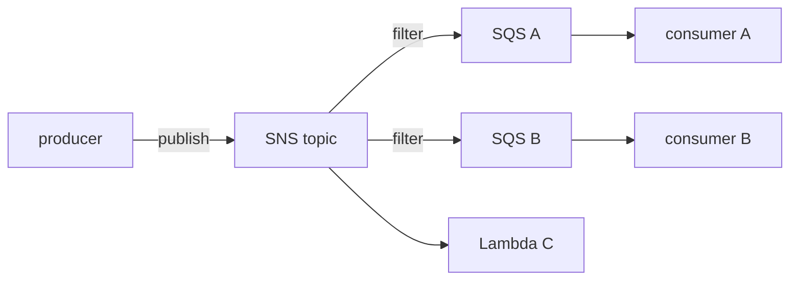
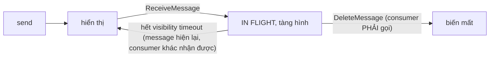
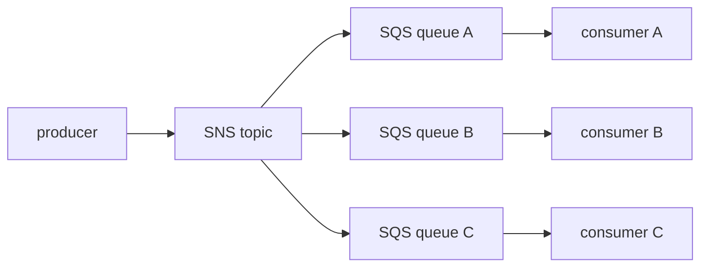

# Tuần 7 — Tách rời hệ thống và tích hợp

> Tuần này trả lời câu hỏi: **làm sao để một thành phần chết mà cả hệ thống không
> chết theo, và làm sao để một thành phần chậm mà cả hệ thống không chậm theo.**
> Câu trả lời luôn là chèn một thứ gì đó vào giữa. Phần khó không phải là biết
> SQS tồn tại — mà là chọn đúng cái để chèn vào giữa, giữa SQS, SNS, EventBridge,
> Kinesis và MQ. Đề SAA hỏi đúng chỗ đó, gần như chắc chắn.

## Học xong bài này bạn phải trả lời được

1. Vì sao gọi HTTP đồng bộ giữa các service làm giảm cả availability lẫn khả năng
   scale — chứng minh bằng số?
2. Visibility timeout tính thế nào cho đúng, và đặt sai theo mỗi hướng thì hỏng gì?
3. SQS standard và FIFO khác nhau ở bốn trục nào? Khi nào bạn **thật sự** cần FIFO?
4. DLQ hoạt động ra sao, redrive là gì, và vì sao không có DLQ thì một message
   hỏng làm tắc cả queue?
5. SNS, EventBridge, SQS — vẽ được ranh giới rõ ràng giữa ba cái?
6. Kinesis Data Streams, Firehose và SQS khác nhau ở ba điểm cốt lõi nào?
7. Amazon MQ tồn tại để làm gì, khi đã có SQS và SNS?
8. Idempotency là gì và vì sao mọi consumer SQS standard đều phải có nó?
9. ASG scale theo độ sâu queue thì dùng metric nào, và vì sao không dùng
   `ApproximateNumberOfMessagesVisible` trực tiếp?

## Bản đồ khái niệm

**TRỤC 1: AI LẤY MESSAGE?**

| ĐẨY (push) | KÉO (pull) |
|---|---|
| SNS, EventBridge | SQS, Kinesis |
| → consumer bị gọi | → consumer tự quyết nhịp độ |
| → không có backpressure | → CÓ backpressure, đệm tải |

**TRỤC 2: MỘT HAY NHIỀU NGƯỜI NHẬN?**

```
SQS      1 message → ĐÚNG MỘT consumer xử lý, rồi xoá
SNS      1 message → MỌI subscriber, mỗi người một bản
Kinesis  1 record  → MỌI consumer đọc CÙNG dữ liệu, và ĐỌC LẠI ĐƯỢC
```

**MẪU GHÉP KINH ĐIỂN: FANOUT**



Vì sao chèn SQS vào giữa? Vì SNS đẩy thẳng vào Lambda thì consumer chậm =
mất message. Có SQS ở giữa thì message nằm chờ, retry được, có DLQ.

**KHI NÀO DÙNG EVENTBRIDGE THAY SNS?**

Cần lọc theo NỘI DUNG event (không chỉ attribute), cần nhiều target khác
loại, cần bắt sự kiện từ chính AWS hoặc SaaS, cần archive/replay → EventBridge

---

## 1. Coupling là kẻ thù của resilience và scalability

Bạn đã thấy điều này ở Kubernetes: một Deployment gọi thẳng Service của Deployment
khác qua HTTP. Nó hoạt động, cho tới lúc không.

**Availability nhân lên, không cộng lại.** Chuỗi bốn service gọi đồng bộ nhau, mỗi
cái 99,9%: `0,999^4 ≈ 99,6%`. Bạn vừa mất gấp bốn lần thời gian downtime chỉ bằng
cách chia nhỏ hệ thống. Chèn queue vào giữa thì service A không cần B sống **tại
cùng thời điểm** — đây gọi là gỡ **temporal coupling**.

**Scale bị khoá vào mắt xích chậm nhất.** A nhận 1.000 rps nhưng B chỉ xử lý được
100 rps. Gọi đồng bộ thì A phải chờ, thread bị giữ, rồi A cũng sập theo. Có queue
thì A ghi vào queue với tốc độ nào cũng được, B rút ra với tốc độ của nó, và độ sâu
queue trở thành **tín hiệu để scale** B — đó là *queue-based load leveling*.

**Thêm consumer = sửa producer.** Không có broker, muốn thêm hệ thống thứ ba nghe
sự kiện "đơn hàng mới" thì phải sửa và deploy lại producer. Có topic thì bạn thêm
một subscription, producer **không đổi một dòng nào**. Đây là ý nghĩa thật của
"tách rời".

Cái giá phải trả — luôn có, và đề thi thích cài ở đây:

| Bạn được | Bạn mất |
|---|---|
| Chịu lỗi từng phần | **Eventual consistency** — dữ liệu không nhất quán ngay |
| Đệm tải, scale độc lập | Khó debug: không còn một stack trace duy nhất |
| Thêm consumer không sửa producer | Phải tự lo **idempotency** và thứ tự |
| Retry và DLQ có sẵn | Thêm một thứ nữa phải giám sát và trả tiền |

---

## 2. SQS — hàng đợi kéo

Bắc cầu: gần nhất với một RabbitMQ queue mà bạn không phải vận hành. Khác biệt lớn:
consumer **poll** chứ không được đẩy, và message không tự mất khi được đọc — nó chỉ
**tàng hình** một lúc.

### Vòng đời một message



Điểm mấu chốt mà người mới luôn bỏ sót: **đọc message không xoá nó**. Consumer phải
gọi `DeleteMessage` sau khi xử lý xong. Đây chính là thứ khiến SQS chịu lỗi được —
consumer chết giữa chừng thì message tự quay lại.

### Visibility timeout — cách tính đúng

Quy tắc: **visibility timeout > thời gian xử lý tối đa của consumer** (cộng biên an toàn).

| Đặt sai | Hậu quả |
|---|---|
| Quá **ngắn** | Message hiện lại khi consumer đang xử lý → consumer thứ hai nhận → **xử lý trùng lặp** |
| Quá **dài** | Consumer chết thì message nằm chết theo tới hết timeout → **độ trễ khôi phục cao** |

Mặc định 30 giây, dải 0 giây – **12 giờ**. Với Lambda đọc SQS, khuyến nghị đặt
visibility timeout **ít nhất 6 lần** timeout của hàm (Lambda có thể nhận lại cùng
batch trong lúc scale). Nếu thời gian xử lý biến thiên khó đoán, dùng
`ChangeMessageVisibility` để gia hạn trong lúc chạy — gọi là *heartbeat*.

### Long polling và short polling

| | Short polling (`WaitTimeSeconds = 0`) | Long polling (`= 20`) |
|---|---|---|
| Hành vi | Hỏi một tập con server, trả về ngay kể cả rỗng | Giữ kết nối tối đa 20 giây, trả về ngay khi có message |
| Số API call | Rất nhiều, phần lớn rỗng | Ít |
| Chi phí | Cao — bạn trả tiền cho mọi request rỗng | **Thấp** |
| Độ trễ | Cao hơn (phải chờ vòng poll sau) | Thấp hơn |

**Luôn dùng 20.** Đây cũng là đáp án chuẩn cho câu hỏi "giảm chi phí SQS" và
"giảm số API call rỗng".

### Dead-letter queue và redrive

DLQ là một queue thường, được queue chính trỏ tới qua **redrive policy** gồm
`deadLetterTargetArn` và `maxReceiveCount`. Message bị nhận quá `maxReceiveCount`
lần mà chưa bị xoá thì SQS chuyển nó sang DLQ.

- Không có DLQ: message hỏng **quay vòng vô hạn** — tốn tiền, và với FIFO queue nó
  **chặn luôn** mọi message phía sau trong cùng message group.
- DLQ của FIFO queue phải là FIFO queue; DLQ của standard queue phải là standard.
- Đặt **retention của DLQ dài hơn** queue chính. Retention đếm từ lúc message được
  gửi lần đầu, không phải lúc vào DLQ.
- **Redrive** là thao tác đẩy message từ DLQ về queue gốc sau khi bạn đã sửa code.
  Console có nút sẵn. Quy trình thật: xem message hỏng → sửa → redrive.
- Cảnh báo trên `ApproximateNumberOfMessagesVisible` của DLQ là alarm quan trọng
  nhất của một hệ thống bất đồng bộ. DLQ có message = có thứ đang hỏng im lặng.

### Retention, delay queue, message timer

- **Retention**: mặc định **4 ngày**, dải 60 giây – **14 ngày**. Hết hạn thì message
  bị xoá dù chưa ai xử lý.
- **Delay queue**: mọi message mới bị giấu 0–**15 phút** trước khi hiển thị. Đặt ở
  mức queue.
- **Message timer**: giấu **một** message cụ thể 0–15 phút. Chỉ standard queue.
- **In-flight tối đa**: khoảng **120.000** message. Chạm trần thì `ReceiveMessage`
  báo lỗi — dấu hiệu consumer quá chậm hoặc quên `DeleteMessage`.
- **Kích thước message**: **256 KB**. Lớn hơn thì dùng mẫu **claim check**: đẩy
  payload lên S3, gửi con trỏ qua queue (SQS Extended Client Library làm sẵn, tới 2 GB).

### Standard và FIFO

| | **Standard** | **FIFO** |
|---|---|---|
| Thứ tự | **Best-effort**, không đảm bảo | Đảm bảo **trong mỗi message group** |
| Giao hàng | **At-least-once** — có thể trùng | **Exactly-once processing** trong cửa sổ dedup |
| Throughput | Gần như không giới hạn | **300 msg/s**; **3.000 msg/s** khi batch 10. Bật high throughput mode thì cao hơn nhiều (tuỳ region) |
| Tên queue | bất kỳ | phải kết thúc **`.fifo`** |
| Bắt buộc | — | `MessageGroupId`; `MessageDeduplicationId` (hoặc bật content-based dedup) |
| Cửa sổ dedup | — | **5 phút** |

Hai khái niệm FIFO phải hiểu đúng:

- **`MessageGroupId`** là đơn vị của thứ tự **và** của song song. Message cùng
  group được xử lý tuần tự; các group khác nhau chạy song song. Chọn group ID =
  `customerId` hay `accountId` là cách vừa giữ thứ tự vừa không giết throughput.
  Dùng một group ID duy nhất cho cả hệ thống là tự biến queue thành đơn luồng.
- **Dedup** chỉ chống trùng trong **5 phút**. Nó không phải bảo hiểm exactly-once
  vĩnh viễn. Consumer vẫn nên idempotent.

**Khi nào cần FIFO thật:** thứ tự thay đổi kết quả cuối cùng. Ví dụ đúng: lệnh
"tạo tài khoản" phải chạy trước "nạp tiền"; chuỗi cập nhật trạng thái đơn hàng của
**cùng một** đơn. Ví dụ sai: "gửi email thông báo" (thứ tự không quan trọng),
"ghi log" (không quan trọng), "xử lý ảnh" (độc lập). Chọn FIFO khi không cần là
tự trói mình vào trần 300 msg/s.

---

## 3. SNS — pub/sub đẩy

Một **topic** nhận `Publish`, đẩy bản sao tới mọi **subscription**. Subscriber gồm:
SQS, Lambda, HTTP/S endpoint, email, SMS, mobile push, Firehose.

| Đặc điểm | Số / hành vi |
|---|---|
| Kích thước message | **256 KB** |
| Subscription mỗi topic | 12,5 triệu (standard); **100** (FIFO) |
| Filter policy | 200 mỗi topic, 10.000 mỗi account; tối đa **5 key**; tổ hợp giá trị ≤ 150 |
| Retry tới SQS/Lambda | **100.015 lần trong 23 ngày** (không đổi được) |
| Retry tới HTTP/S | Tuỳ chỉnh được, tổng **không quá 3.600 giây** |
| Retry tới SMTP/SMS/push | 50 lần trong 6 giờ |
| DLQ | Đặt ở mức **subscription**, là một SQS queue |

**Fanout pattern.** Đây là mẫu ra thi nhiều nhất trong tuần này:



Vì sao chèn SQS vào giữa thay vì cho SNS đẩy thẳng vào Lambda? Vì SNS là **đẩy**:
nếu consumer chết hoặc quá tải, retry của SNS có giới hạn rồi message rơi vào DLQ
của subscription hoặc mất. Có SQS ở giữa thì message **nằm chờ bền vững**, consumer
tự chọn nhịp, có visibility timeout, có DLQ riêng, và bạn scale consumer theo độ sâu
queue. Nói gọn: **SNS cho ai nhận, SQS cho khi nào xử lý.**

**Filter policy** là JSON so khớp với **message attribute** (hoặc message body nếu
bật `MessageBody` filter scope). Lọc diễn ra **ở SNS, trước khi gửi** — bạn không
trả tiền cho message không liên quan, và consumer không phải viết code lọc. Đề hỏi
"làm sao mỗi consumer chỉ nhận loại sự kiện nó quan tâm" → **filter policy**.

**FIFO topic** chỉ đẩy được vào **FIFO SQS queue**, giữ thứ tự và dedup xuyên suốt
fanout. Đánh đổi: mất Lambda/HTTP/email làm subscriber trực tiếp.

**`RawMessageDelivery`**: tắt (mặc định) thì SNS bọc message trong phong bì JSON có
`Type`, `MessageId`, `TopicArn`, `Message`; consumer phải bóc lớp `Message`. Bật thì
payload đi thẳng. Chi tiết nhỏ nhưng làm người mới mất hàng giờ.

---

## 4. EventBridge — bus sự kiện có luật

Bắc cầu: nếu SNS là một topic thì EventBridge là một **router** đứng giữa mọi thứ.
Nó từng tên là CloudWatch Events; hai cái là **cùng một dịch vụ**, API cũ vẫn chạy.

Bốn khái niệm:

- **Event bus.** `default` nhận sự kiện từ chính các dịch vụ AWS (EC2 đổi trạng
  thái, ECS task dừng, CodePipeline chuyển stage…). **Custom bus** cho sự kiện ứng
  dụng của bạn. **Partner bus** cho SaaS (Datadog, Zendesk, Shopify…). Tối đa 100
  bus mỗi account mỗi region.
- **Rule** gồm một **event pattern** và tối đa **5 target**. Pattern so khớp trên
  **cấu trúc JSON của event** — không chỉ attribute rời như SNS. Hỗ trợ prefix,
  suffix, numeric range, `anything-but`, `exists`. Kích thước pattern tối đa 2.048
  ký tự; kích thước event 256 KB.
- **Target** là hơn 20 loại: Lambda, SQS, SNS, Step Functions, ECS task, Kinesis,
  API destination (gọi HTTP endpoint bên ngoài có auth), event bus của account khác.
  Có **input transformer** để nắn payload trước khi gửi. Retry tới **24 giờ** với
  backoff, và có **DLQ** cho target.
- **Schema registry** tự khám phá cấu trúc event đang chảy qua bus và sinh
  code binding. Ở mức SAA chỉ cần biết nó tồn tại và giải quyết vấn đề gì: cho phép
  team consumer biết chính xác hình dạng event mà không phải hỏi team producer.

**EventBridge Scheduler** là dịch vụ riêng, thay thế "scheduled rule" cũ: cron/rate,
one-time, có time zone, hạn mức **1 triệu schedule** mỗi account (so với **300 rule**
mỗi bus), granularity 1 phút, có retry và DLQ. Cần chạy một việc theo lịch mà không
muốn dựng cron server → đây là đáp án, không phải EC2 + crontab.

**Archive và replay**: lưu lại event trên bus rồi phát lại vào một khoảng thời gian.
Đây là điểm khác biệt lớn so với SNS, vốn không giữ gì cả.

---

## 5. Ranh giới SNS, SQS và EventBridge — bảng quyết định kỹ

Đây là dạng câu hỏi hay ra nhất trong Domain 2. Hãy đọc theo cột "dấu hiệu trong đề".

| | **SQS** | **SNS** | **EventBridge** |
|---|---|---|---|
| Mô hình | Hàng đợi, **kéo** | Pub/sub, **đẩy** | Bus + luật định tuyến, **đẩy** |
| Ai nhận một message | **Đúng một** consumer | **Mọi** subscriber | Mọi target khớp rule |
| Lưu trữ | **Tới 14 ngày** | Không giữ | Không giữ (trừ archive) |
| Lọc | Không (consumer tự lọc) | Filter policy trên **attribute** | Event pattern trên **toàn bộ JSON** |
| Thứ tự | FIFO queue có | FIFO topic có | Không |
| Nguồn sự kiện AWS/SaaS | Không | Không | **Có** — hơn 200 dịch vụ AWS + partner |
| Lịch (cron) | Không | Không | **Có** (Scheduler) |
| Replay | Không | Không | **Có** (archive + replay) |
| Độ trễ | Thấp nhất | Thấp | Cao hơn một chút (thường dưới giây) |
| Throughput | Cao nhất | Rất cao | Thấp hơn hai cái kia |
| Dấu hiệu trong đề | "đệm tải", "xử lý nền", "worker", "không mất việc khi consumer chết" | "thông báo tới nhiều hệ thống", "fanout", "gửi email/SMS" | "phản ứng khi trạng thái EC2 đổi", "tích hợp SaaS", "định tuyến theo nội dung", "chạy theo lịch", "kiến trúc event-driven nhiều team" |

Ba quy tắc rút gọn để dùng trong phòng thi:

1. Cần **đệm và retry bền vững cho công việc** → **SQS**. Nếu còn cần nhiều consumer
   nữa thì **SNS → nhiều SQS**.
2. Cần **thông báo** đơn thuần, nhiều người nghe, độ trễ thấp, subscriber gồm cả
   email/SMS → **SNS**.
3. Sự kiện đến **từ AWS hoặc SaaS**, hoặc cần **định tuyến theo nội dung**, hoặc
   cần **lịch**, hoặc cần **replay** → **EventBridge**.

Chúng không loại trừ nhau. Kiến trúc thật rất hay là: EventBridge làm router →
SQS làm đệm → Lambda làm consumer.

---

## 6. Kinesis Data Streams, Firehose và SQS

Đây là bộ ba thứ hai hay bị so sánh. Ba điểm cốt lõi: **replay được không, thứ tự
có không, nhiều consumer độc lập có không.**

| | **SQS** | **Kinesis Data Streams** | **Data Firehose** |
|---|---|---|---|
| Bản chất | Hàng đợi | **Log append-only chia shard** | **Đường ống nạp dữ liệu** |
| Message sau khi đọc | Bị xoá bởi consumer | **Vẫn nằm đó** tới hết retention | Không truy cập được |
| Retention | 60 giây – 14 ngày | **24 giờ mặc định, tới 365 ngày** | Không lưu (buffer rồi ghi) |
| Đọc lại (replay) | **Không** | **Có** — đọc lại từ bất kỳ vị trí nào | **Không** |
| Thứ tự | FIFO queue: trong message group | **Theo shard** (partition key quyết định shard) | Không đảm bảo |
| Nhiều consumer độc lập | Không — mỗi message một người | **Có** — mỗi consumer giữ vị trí riêng | Không (chỉ đích đến) |
| Scale | Tự động, vô hình | **Bạn quản shard** (hoặc on-demand mode) | Hoàn toàn tự động |
| Throughput mỗi đơn vị | — | 1 shard = 1 MB/s hoặc 1.000 record/s ghi; 2 MB/s đọc chia chung, hoặc 2 MB/s **riêng** mỗi consumer với enhanced fan-out (tối đa 20) | — |
| Đích đến | Bất kỳ consumer nào | Bất kỳ consumer nào | **S3, Redshift, OpenSearch, Splunk, HTTP endpoint** |
| Real-time | Gần real-time | **Real-time** (dưới giây) | **Gần** real-time (buffer theo giây/MB) |
| Chọn khi | Mỗi việc xử lý một lần rồi bỏ | Analytics thời gian thực, cần replay, nhiều team đọc cùng luồng | Chỉ cần đổ dữ liệu vào kho, không muốn viết consumer |

Cách phân biệt nhanh trong phòng thi:

- Đề nói **"nhiều ứng dụng cần đọc cùng một dữ liệu"** hoặc **"cần xử lý lại dữ
  liệu cũ khi sửa bug"** → **Kinesis Data Streams**.
- Đề nói **"không muốn quản lý gì, chỉ cần dữ liệu vào S3/Redshift/OpenSearch"** →
  **Firehose**.
- Đề nói **"mỗi việc do một worker xử lý rồi xong"** → **SQS**.
- Đề nhấn **"ít thao tác vận hành nhất"** trong bối cảnh streaming → Firehose,
  hoặc Kinesis Data Streams ở **on-demand mode** nếu vẫn cần replay.

Firehose còn làm biến đổi bằng Lambda, nén, và chuyển sang Parquet/ORC trên đường
đi. Nó **không** là nơi để nhiều consumer đọc — nó là một đường ống một chiều.

---

## 7. Amazon MQ — khi nào cần

Amazon MQ là **Apache ActiveMQ hoặc RabbitMQ có quản lý**. Lý do tồn tại duy nhất
đáng nhớ cho SAA: **lift-and-shift**.

Chọn MQ khi ứng dụng cũ đã nói các giao thức chuẩn — **JMS, AMQP 0-9-1/1.0, MQTT,
OpenWire, STOMP** — và bạn **không muốn sửa code**. SQS và SNS chỉ có API riêng của
AWS qua HTTPS; chuyển sang chúng nghĩa là viết lại tầng messaging.

Đánh đổi phải nói ra:

| | SQS / SNS | Amazon MQ |
|---|---|---|
| Giao thức | API AWS qua HTTPS | JMS, AMQP, MQTT, STOMP, OpenWire |
| Mô hình vận hành | Serverless, không có broker | **Có broker instance**, bạn chọn size, trả tiền theo giờ |
| Scale | Gần như vô hạn, tự động | Giới hạn bởi broker; scale dọc là chính |
| HA | Mặc định | Phải cấu hình active/standby đa AZ |
| Chọn khi | Ứng dụng mới trên AWS | **Di trú ứng dụng cũ, giữ nguyên code** |

Nguyên tắc: xây mới thì SQS/SNS/EventBridge. Chỉ chọn MQ khi đề nhắc tới giao thức
chuẩn hoặc "migrate mà không đổi ứng dụng".

---

## 8. Bốn mẫu kiến trúc phải nhận ra

**Queue-based load leveling.** Đặt queue giữa producer bùng nổ và consumer có công
suất hữu hạn. Consumer chạy đều với tốc độ nó chịu được; đỉnh tải biến thành độ sâu
queue thay vì lỗi 5xx. Đây là câu trả lời cho "hệ thống sập vào giờ cao điểm" và
cho "bảo vệ database phía sau".

**Fanout.** Một sự kiện, nhiều hệ quả độc lập. SNS → nhiều SQS (hoặc EventBridge →
nhiều target). Điểm cốt lõi: thêm consumer thứ tư **không đụng vào producer**.

**Idempotency.** SQS standard là **at-least-once**: message *sẽ* bị giao trùng, sớm
hay muộn. Nên consumer phải cho ra cùng kết quả khi xử lý cùng message nhiều lần.
Cách làm chuẩn:

- Producer gắn một **idempotency key** duy nhất vào message.
- Consumer ghi key đó vào DynamoDB với **conditional write** (`attribute_not_exists`)
  trước khi làm việc; ghi thất bại nghĩa là đã xử lý rồi → bỏ qua.
- Đặt TTL cho bảng đó để tự dọn.

Đây là câu trả lời cho mọi câu hỏi dạng "làm sao tránh xử lý trùng mà không dùng
FIFO". Và nhớ: **FIFO không miễn cho bạn khỏi idempotency** — cửa sổ dedup chỉ 5 phút.

**Saga — ở mức khái niệm.** Giao dịch phân tán không có two-phase commit. Chia
nghiệp vụ thành chuỗi bước cục bộ, mỗi bước có một **hành động bồi hoàn**
(compensating action). Bước 3 hỏng thì chạy bồi hoàn của bước 2 rồi bước 1. Hai
cách hiện thực trên AWS: **orchestration** bằng Step Functions (một state machine
biết toàn bộ luồng, dễ đọc, dễ debug) hoặc **choreography** bằng event trên
EventBridge (mỗi service tự phản ứng, lỏng hơn nhưng khó theo dõi). SAA chỉ cần bạn
nhận ra bài toán và biết Step Functions là công cụ điều phối.

---

## 9. ASG scale theo độ sâu queue

Mẫu chuẩn: producer → SQS → ASG worker EC2. Câu hỏi: scale theo metric nào?

Sai lầm là dùng thẳng `ApproximateNumberOfMessagesVisible`. Số message trong queue
**không tỉ lệ** với số instance cần có — nó phụ thuộc thời gian xử lý mỗi message
và độ trễ bạn chấp nhận được. Target tracking cần một metric mà *giá trị của nó
thay đổi ngược chiều với kích thước nhóm*.

Metric đúng là **backlog per instance**:

```
backlog per instance = ApproximateNumberOfMessages / GroupInServiceInstances

target = độ trễ chấp nhận được (giây) / thời gian xử lý trung bình mỗi message (giây)
```

Ví dụ của AWS: chấp nhận trễ 10 giây, mỗi message xử lý 0,1 giây → target = 100
message/instance. Queue đang có 1.500 message với 10 instance → backlog hiện tại
150 > 100 → scale out.

Cách hiện thực: dùng **metric math** trong target tracking policy
(`m1 / m2` với `m1 = ApproximateNumberOfMessagesVisible`, `m2 = GroupInServiceInstances`),
hoặc publish một custom metric. Với Lambda thay cho EC2 thì bạn không phải làm gì —
event source mapping tự scale, và bạn giới hạn bằng `ScalingConfig` maximum
concurrency (xem [Tuần 6](w06-serverless-api.md)).

---

## Bảng quyết định

| Tình huống trong đề | Chọn | Vì sao không chọn cái kia |
|---|---|---|
| Đệm tải, worker xử lý nền, không được mất việc | **SQS** | SNS đẩy — consumer chết là mất |
| Một sự kiện, ba hệ thống cần biết, mỗi hệ thống retry riêng | **SNS → 3 SQS** | SNS đẩy thẳng vào Lambda thì mất khả năng đệm và DLQ riêng |
| Chỉ cần thông báo email/SMS cho quản trị viên | **SNS** | Chèn SQS là thừa |
| Phản ứng khi EC2 chuyển sang `stopped` | **EventBridge** | SNS không nhận được sự kiện của dịch vụ AWS |
| Định tuyến theo **nội dung** JSON của event | **EventBridge** | Filter policy của SNS chỉ so khớp attribute |
| Chạy một việc mỗi 15 phút, không muốn dựng server | **EventBridge Scheduler** | EC2 + cron là thao tác vận hành thừa |
| Nhiều team cần đọc **cùng** luồng dữ liệu, đọc lại được | **Kinesis Data Streams** | SQS xoá message sau khi xử lý |
| Đổ log vào S3 và OpenSearch, ít vận hành nhất | **Firehose** | Data Streams bắt bạn viết consumer và quản shard |
| Thứ tự bắt buộc trong phạm vi một khách hàng | **SQS FIFO**, `MessageGroupId = customerId` | Standard không đảm bảo thứ tự |
| Cần thứ tự nhưng throughput trên 3.000 msg/s | FIFO **high throughput mode**, hoặc chia nhiều message group | FIFO thường chạm trần 300/3.000 msg/s |
| Di trú ứng dụng JMS/AMQP lên cloud, không sửa code | **Amazon MQ** | SQS/SNS không nói các giao thức đó |
| Message 5 MB | **Claim check**: S3 + con trỏ qua SQS | SQS giới hạn 256 KB |
| Message hỏng làm tắc consumer | **DLQ + `maxReceiveCount`** | Không có DLQ thì nó quay vòng vô hạn |
| Giảm chi phí và số API call rỗng của SQS | **Long polling 20 giây** | Short polling trả tiền cho response rỗng |
| Scale worker EC2 theo tải queue | Target tracking trên **backlog per instance** | `ApproximateNumberOfMessagesVisible` không tỉ lệ với số instance |
| Tránh xử lý trùng mà không muốn dùng FIFO | **Idempotency key + conditional write** | FIFO giới hạn throughput và vẫn chỉ dedup 5 phút |

## Số phải thuộc

| Số | Ý nghĩa |
|---|---|
| **256 KB** | Kích thước message tối đa của SQS **và** SNS |
| **4 ngày / 14 ngày / 60 giây** | Retention SQS: mặc định / tối đa / tối thiểu |
| **30 giây / 12 giờ** | Visibility timeout: mặc định / tối đa |
| **20 giây** | Long polling tối đa |
| **15 phút** | Delay queue và message timer tối đa |
| **120.000** | In-flight message tối đa mỗi queue |
| **300 / 3.000 msg/s** | Throughput FIFO: không batch / có batch 10 |
| **5 phút** | Cửa sổ dedup của FIFO |
| **100.015 lần / 23 ngày** | Retry của SNS tới SQS và Lambda |
| **3.600 giây** | Tổng thời gian retry tối đa của SNS tới HTTP/S |
| **5 target / rule**, **300 rule / bus** | Giới hạn EventBridge |
| **24 giờ / 365 ngày** | Retention Kinesis Data Streams: mặc định / tối đa |
| **1 MB/s hoặc 1.000 rec/s ghi, 2 MB/s đọc** | Công suất một shard Kinesis |
| **2 MB/s mỗi consumer, tối đa 20** | Enhanced fan-out |

## Bẫy kinh điển

**"Đọc message từ SQS là nó biến mất."** Không. Nó chỉ tàng hình trong visibility
timeout. Consumer **phải** gọi `DeleteMessage`. Quên gọi = message quay lại = xử lý
trùng vô hạn.

**"SQS đảm bảo thứ tự."** Chỉ FIFO queue, và chỉ **trong một message group**. Standard
queue là best-effort.

**"FIFO nghĩa là exactly-once tuyệt đối."** Dedup chỉ trong cửa sổ **5 phút**. Gửi
lại cùng message sau 6 phút là có hai bản. Consumer vẫn cần idempotency.

**"Cứ chọn FIFO cho an toàn."** FIFO trần 300 msg/s (3.000 khi batch). Chọn khi
không cần là tự giới hạn hệ thống và trả giá cao hơn.

**"SNS lưu message nếu subscriber chết."** Không lưu gì. SNS retry rồi bỏ. Muốn bền
vững thì chèn SQS vào giữa hoặc gắn DLQ cho subscription.

**"EventBridge là bản mới của SNS, nên luôn dùng EventBridge."** Sai hướng. SNS có
throughput cao hơn, độ trễ thấp hơn, và làm được email/SMS/push. EventBridge mạnh ở
định tuyến theo nội dung, nguồn AWS/SaaS, lịch, và replay.

**"Kinesis thay được SQS."** Kinesis không xoá record sau khi đọc và không có
visibility timeout — nó là log, không phải hàng đợi công việc. Dùng Kinesis cho
"mỗi việc một worker" là chọn sai công cụ và tự chuốc việc quản shard.

**"Firehose replay được."** Không. Firehose là đường ống một chiều tới đích. Cần
replay thì phải là Data Streams.

**"Visibility timeout dài cho chắc."** Consumer chết thì message nằm chết theo tới
hết timeout. Đặt vừa đủ, và gia hạn động bằng `ChangeMessageVisibility` nếu cần.

**"Có DLQ là xong."** DLQ chỉ hữu ích nếu có **alarm** trên nó. DLQ đầy mà không ai
biết thì bạn đã mất dữ liệu, chỉ là mất chậm hơn.

**"Scale ASG theo số message trong queue."** Dùng **backlog per instance**. Số
message thô không tỉ lệ với số instance cần có, nên target tracking sẽ dao động.

## Nối với lab

[`labs/w07-decoupling/`](../../learn-aws/labs/w07-decoupling/) dựng đúng mẫu fanout:
một SNS topic → hai SQS queue có filter policy khác nhau → hai Lambda consumer, cộng
một Step Functions ba bước và một EventBridge rule (mặc định **tắt**).

| Mục lý thuyết | Quan sát gì trong lab |
|---|---|
| Fanout + filter policy (mục 3) | Publish 3 `don-hang` + 2 `nhap-kho` vào **một** topic; queue đơn hàng nhận 3, queue kho nhận 5. Lọc xảy ra ở SNS, trước khi gửi |
| DLQ và `maxReceiveCount` (mục 2) | `-var gay_loi_don_hang=true` → message vào DLQ sau đúng 3 lần. Đọc `ApproximateReceiveCount` trong log để thấy số lần thử tăng dần |
| Visibility timeout (mục 2) | Sửa `visibility_timeout_seconds` từ 60 xuống 5 trong khi Lambda timeout 10 → tự tay tạo ra hiện tượng xử lý trùng lặp |
| Batch và partial failure (mục 8) | `batch_size = 5` không bật `report_batch_item_failures` → một message lỗi kéo cả batch thử lại. Đây là nguồn gốc thật của "sao message này chạy hai lần" |
| Step Functions Wait (mục 8, và [Tuần 6](w06-serverless-api.md)) | State `Wait 3s` không tính tiền theo thời gian chờ |

Nhớ **tắt EventBridge rule** (`terraform apply -var bat_lich=false`) trước khi kết
thúc buổi — một rule mỗi 5 phút sinh 8.640 lần gọi mỗi tháng, đủ làm bẩn CloudWatch
và che mất tín hiệu thật khi bạn cần debug.

## Tự kiểm tra

<details><summary>1. Bốn service gọi HTTP đồng bộ nối tiếp, mỗi service 99,95%. Availability chuỗi là bao nhiêu, và chèn queue giúp gì?</summary>

`0,9995^4 ≈ 99,8%` — khoảng 1,75 giờ downtime mỗi tháng thay vì 22 phút. Chèn queue
gỡ **temporal coupling**: A ghi vào queue rồi trả lời client ngay; B có sập vài phút
thì message vẫn nằm chờ. Availability nhìn từ phía client giờ chỉ phụ thuộc A và
queue, chứ không nhân với B, C, D.
</details>

<details><summary>2. Lambda timeout 30 giây đọc từ SQS. Đặt visibility timeout bao nhiêu, và vì sao?</summary>

Ít nhất **180 giây** — khuyến nghị là gấp 6 lần function timeout, vì Lambda có thể
nhận lại cùng batch trong lúc scale hoặc retry nội bộ. Đặt thấp hơn function timeout
(ví dụ 10 giây) là công thức chắc chắn để có xử lý trùng: message hiện lại khi hàm
đang chạy dở.
</details>

<details><summary>3. Vì sao mẫu SNS → SQS → Lambda tốt hơn SNS → Lambda trực tiếp?</summary>

Vì SQS thêm ba thứ SNS không có: (a) lưu trữ bền vững tới 14 ngày nên consumer chết
không mất message; (b) visibility timeout và `maxReceiveCount` cho retry có kiểm
soát cùng DLQ riêng cho từng consumer; (c) backpressure — consumer tự chọn nhịp,
kể cả khi đang bị throttle. SNS đẩy thẳng thì consumer chậm là bài toán của SNS,
và nó chỉ biết retry rồi bỏ.
</details>

<details><summary>4. Hệ thống cần thứ tự theo từng khách hàng, tổng tải 5.000 msg/s. FIFO thường có đủ không?</summary>

Không, nếu không batch: FIFO trần 300 msg/s, hoặc 3.000 msg/s khi batch 10. Hai lối
ra: bật **high throughput mode cho FIFO** (throughput cao hơn nhiều, tuỳ region), và
trong cả hai trường hợp phải dùng **nhiều `MessageGroupId`** — mỗi khách hàng một
group — vì thứ tự chỉ cần đúng trong phạm vi một khách. Dùng một group ID chung là
tự biến queue thành đơn luồng.
</details>

<details><summary>5. Cần phản ứng khi một object được tạo trong S3, đồng thời ghi log và gửi email. SNS hay EventBridge?</summary>

Cả hai đều làm được, nhưng phân biệt như sau: nếu chỉ là fanout đơn giản tới các
đích cố định thì **S3 event notification → SNS → nhiều SQS** là đủ và rẻ hơn. Nếu
bạn cần **định tuyến theo nội dung** (chỉ file `.csv` trong prefix `raw/` mới đi
đường A), cần thêm nguồn sự kiện AWS khác vào cùng luồng, hoặc cần archive/replay,
thì **EventBridge** (S3 bật `EventBridge notifications`) là lựa chọn đúng.
</details>

<details><summary>6. Team analytics và team fraud detection đều cần xử lý cùng luồng giao dịch, fraud cần đọc lại 3 ngày dữ liệu khi sửa model. Chọn gì?</summary>

**Kinesis Data Streams** với retention ≥ 3 ngày, hai consumer dùng **enhanced
fan-out** để mỗi bên có 2 MB/s riêng mỗi shard. SQS sai vì message bị xoá sau khi
một consumer xử lý; SNS → 2 SQS thì mỗi bên nhận được bản riêng nhưng **không đọc
lại được** dữ liệu cũ. "Đọc lại" là từ khoá quyết định.
</details>

<details><summary>7. Vì sao FIFO queue không có DLQ thì nguy hiểm hơn standard queue?</summary>

Vì FIFO đảm bảo thứ tự trong message group. Message đầu group xử lý mãi không xong
sẽ **chặn toàn bộ** message phía sau trong cùng group — không phải chỉ một message
hỏng, mà cả dòng công việc của khách hàng đó đứng im. Với standard queue, message
hỏng chỉ quay vòng và làm tốn tiền.
</details>

<details><summary>8. Consumer phải idempotent kiểu gì? Mô tả cách hiện thực rẻ nhất trên AWS.</summary>

Producer gắn một idempotency key duy nhất cho mỗi đơn vị công việc. Consumer, trước
khi làm việc, ghi key đó vào DynamoDB bằng `PutItem` với
`ConditionExpression="attribute_not_exists(pk)"`. Ghi thành công → chưa xử lý, làm
tiếp. Ghi thất bại vì điều kiện → đã xử lý rồi, xoá message và thoát. Bật **TTL**
trên bảng để tự dọn. Rẻ, không cần khoá phân tán, và nằm gọn trong 25 GB free của
DynamoDB.
</details>

<details><summary>9. Vì sao target tracking trên `ApproximateNumberOfMessagesVisible` cho kết quả dao động?</summary>

Vì target tracking giả định metric **giảm khi nhóm to ra**. Số message trong queue
không có quan hệ đó: thêm instance không làm số message tự nhỏ đi theo tỉ lệ, và
giá trị "đúng" phụ thuộc thời gian xử lý mỗi message. Metric đúng là **backlog per
instance** = số message / số instance InService, với target = độ trễ chấp nhận được
chia cho thời gian xử lý một message.
</details>

<details><summary>10. Ứng dụng Java cũ dùng JMS cần lên cloud trong 3 tháng, không được sửa code. Chọn gì và đánh đổi là gì?</summary>

**Amazon MQ** (ActiveMQ), vì SQS/SNS không nói JMS — chuyển sang chúng nghĩa là viết
lại tầng messaging. Đánh đổi: MQ có **broker instance** tính tiền theo giờ, scale
bị giới hạn bởi broker (chủ yếu scale dọc), và bạn phải tự cấu hình active/standby
đa AZ để có HA. Kế hoạch dài hạn hợp lý là dùng MQ để lên cloud trước, rồi tái cấu
trúc sang SQS/SNS sau.
</details>

## Ngoài phạm vi

- **Kinesis Data Analytics / Managed Service for Apache Flink** — xử lý luồng bằng SQL/Flink, biết tồn tại là đủ. [Doc](https://docs.aws.amazon.com/managed-flink/)
- **Amazon MSK** (Kafka có quản lý) — nhận ra use case "đã dùng Kafka, muốn managed" là đủ cho SAA.
- **EventBridge Pipes** — nối nguồn với đích kèm filter/enrich, mức chuyên sâu hơn SAA.
- **SQS Extended Client Library** chi tiết cách dùng — chỉ cần nhớ mẫu claim check.
- **AppFlow, Managed Workflows for Apache Airflow (MWAA)** — dịch vụ tích hợp đặc thù.
- **Cấu hình saga đầy đủ, transactional outbox** — thuộc thiết kế ứng dụng, không phải SAA.

## Nguồn

- [Amazon SQS endpoints and quotas](https://docs.aws.amazon.com/general/latest/gr/sqs-service.html)
- [Amazon SQS FIFO queue quotas](https://docs.aws.amazon.com/AWSSimpleQueueService/latest/SQSDeveloperGuide/quotas-fifo.html)
- [Amazon SQS visibility timeout](https://docs.aws.amazon.com/AWSSimpleQueueService/latest/SQSDeveloperGuide/sqs-visibility-timeout.html)
- [Amazon SQS dead-letter queues](https://docs.aws.amazon.com/AWSSimpleQueueService/latest/SQSDeveloperGuide/sqs-dead-letter-queues.html)
- [Amazon SNS endpoints and quotas](https://docs.aws.amazon.com/general/latest/gr/sns.html)
- [Amazon SNS message delivery retries](https://docs.aws.amazon.com/sns/latest/dg/sns-message-delivery-retries.html)
- [Filter policy constraints in Amazon SNS](https://docs.aws.amazon.com/sns/latest/dg/subscription-filter-policy-constraints.html)
- [Amazon EventBridge quotas](https://docs.aws.amazon.com/eventbridge/latest/userguide/eb-quota.html)
- [Rules in Amazon EventBridge](https://docs.aws.amazon.com/eventbridge/latest/userguide/eb-rules.html)
- [Introducing Amazon EventBridge Scheduler](https://aws.amazon.com/blogs/compute/introducing-amazon-eventbridge-scheduler/)
- [Kinesis Data Streams terminology and concepts](https://docs.aws.amazon.com/streams/latest/dev/key-concepts.html)
- [Change the data retention period (Kinesis)](https://docs.aws.amazon.com/streams/latest/dev/kinesis-extended-retention.html)
- [Develop enhanced fan-out consumers with dedicated throughput](https://docs.aws.amazon.com/streams/latest/dev/enhanced-consumers.html)
- [Scaling policy based on Amazon SQS](https://docs.aws.amazon.com/autoscaling/ec2/userguide/as-using-sqs-queue.html)
- [Lambda parameters for Amazon SQS event source mappings](https://docs.aws.amazon.com/lambda/latest/dg/services-sqs-parameters.html)
