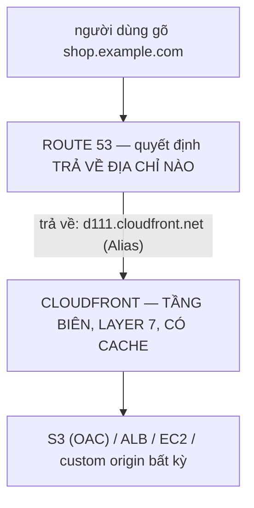
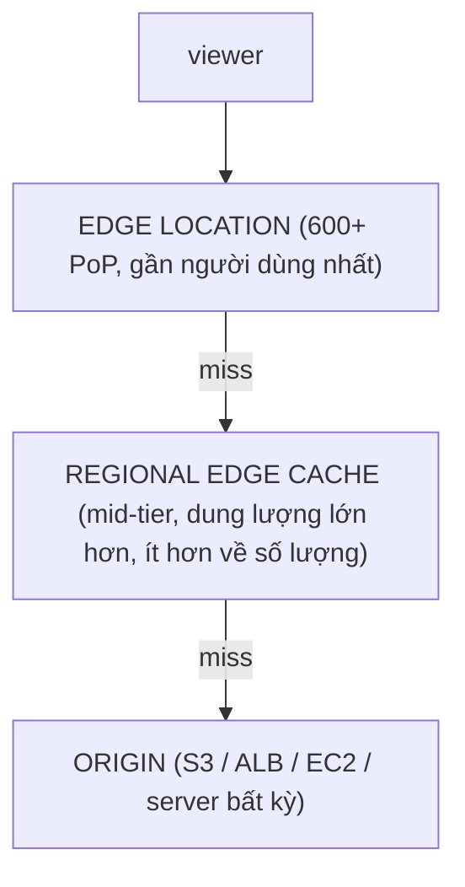
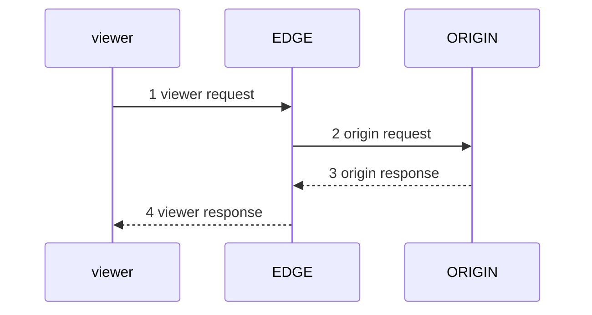

# Tuần 8 — DNS, CDN và tầng biên

> Tuần này trả lời câu hỏi: **request của người dùng đi qua những gì trước khi chạm
> tới hạ tầng của bạn, và bạn kiểm soát được gì ở từng chặng.** Ba chặng: phân giải
> tên (Route 53), điểm chạm gần người dùng (CloudFront hoặc Global Accelerator), và
> lớp lọc trước cửa (WAF, TLS). Đây là Domain 3 — hiệu năng — nhưng gần nửa số câu
> hỏi lại là câu hỏi về tính sẵn sàng và chi phí trá hình.

## Học xong bài này bạn phải trả lời được

1. Alias record khác CNAME ở đúng những chỗ nào, và vì sao ở zone apex bắt buộc
   phải dùng Alias?
2. Bảy routing policy của Route 53 — tình huống nào chọn cái nào? Cặp nào hay bị
   lẫn với nhau và phân biệt bằng gì?
3. TTL ảnh hưởng thế nào tới thời gian chuyển đổi khi failover? Công thức tính?
4. Cache key là gì, và vì sao đưa nhiều thứ vào cache key lại làm hệ thống **chậm
   hơn và đắt hơn**?
5. Invalidation và versioned object — vì sao versioned object gần như luôn là đáp
   án tốt hơn?
6. Signed URL và signed cookie khác nhau ở đâu, mỗi cái dùng khi nào?
7. CloudFront Functions và Lambda@Edge — chạy ở đâu, làm được gì, giới hạn gì?
8. CloudFront và Global Accelerator khác nhau ở tầng nào, và câu hỏi nào trong đề
   chỉ có một đáp án đúng?
9. Vì sao chứng chỉ ACM cho CloudFront **bắt buộc** ở `us-east-1`?

## Bản đồ khái niệm



- ROUTE 53: hosted zone (public / private) · record: A / AAAA / CNAME / MX / TXT / NS / ALIAS · routing policy: simple weighted latency failover geolocation geoproximity multivalue · health check → DNS failover · TTL quyết định BAO LÂU client mới hỏi lại
- CLOUDFRONT: edge location (600+) → (miss) → regional edge cache → (miss) → ORIGIN · cache key ← path + header/cookie/query bạn CHỌN · OAC khoá origin | signed URL/cookie | geo restriction · CloudFront Functions (viewer) | Lambda@Edge (cả 4 sự kiện) · WAF gắn ở đây (scope CLOUDFRONT, tạo ở us-east-1) · ACM cert BẮT BUỘC ở us-east-1

```
Cần TCP/UDP không phải HTTP, cần 2 IP tĩnh?  → GLOBAL ACCELERATOR
(layer 4, anycast, KHÔNG cache — nó tối ưu đường đi, không tối ưu nội dung)
```

---

## 1. Route 53 — hosted zone và bản chất

Route 53 là DNS có quản lý, **global** (không có khái niệm region), SLA 100% cho
DNS. Bắc cầu: nó thay chỗ của BIND hay dnsmasq mà bạn từng dựng, cộng thêm health
check và logic định tuyến mà DNS thường không có.

Một **hosted zone** là một container chứa record cho một domain. Hai loại:

| | **Public hosted zone** | **Private hosted zone** |
|---|---|---|
| Ai phân giải được | Cả internet | **Chỉ các VPC bạn gắn vào zone** |
| Dùng để | Domain công khai | Tên nội bộ: `db.internal`, `api.corp` |
| Điều kiện | Delegate NS từ registrar | VPC phải bật `enableDnsSupport` **và** `enableDnsHostnames` |

Gắn **cùng một tên miền** vào cả public và private zone là mẫu **split-horizon
DNS**: người trong VPC nhận IP riêng, người ngoài nhận IP công khai. Đây là câu trả
lời cho "cùng một hostname nhưng nội bộ phải đi đường riêng".

Chi phí: **$0,50 mỗi hosted zone mỗi tháng** (25 zone đầu), cộng phí truy vấn —
nhưng truy vấn tới **Alias record trỏ tới tài nguyên AWS là miễn phí**. Con số
$0,50 là lý do lab tuần này để Route 53 sau một biến `enable_route53`.

**Domain registration khác hosted zone.** Đăng ký domain là mua quyền dùng tên
(trả theo năm cho từng TLD); hosted zone là nơi lưu record. Bạn có thể đăng ký ở
GoDaddy rồi host zone ở Route 53 (chỉ cần trỏ NS), hoặc ngược lại. Đề thi hay dùng
điều này để loại đáp án "phải chuyển domain về AWS mới dùng được Route 53" — sai.

---

## 2. Các loại record, và Alias

| Record | Trả về | Ghi chú cho SAA |
|---|---|---|
| **A** | Địa chỉ IPv4 | |
| **AAAA** | Địa chỉ IPv6 | |
| **CNAME** | **Một tên khác** (không phải IP) | **Không đặt được ở zone apex**; không cùng tồn tại với record khác cùng tên |
| **MX** | Mail server + priority | |
| **TXT** | Chuỗi tự do | SPF, DKIM, xác minh sở hữu domain |
| **NS** | Name server của zone | Đây là thứ bạn dán vào registrar để delegate |
| **SOA** | Thông tin quản trị zone | Tạo tự động cùng zone |
| **ALIAS** | **Riêng của Route 53** — trỏ tới tài nguyên AWS | Xem bên dưới |

### Alias và CNAME — bảng phải thuộc

| | **Alias** | **CNAME** |
|---|---|---|
| Đặt được ở **zone apex** (`example.com`) | **Được** | **Không** |
| Chi phí truy vấn | **Miễn phí** | Tính tiền |
| Trỏ tới | ELB, CloudFront, S3 website endpoint, API Gateway, Global Accelerator, VPC endpoint, record khác trong **cùng zone** | **Bất kỳ** tên miền nào, kể cả ngoài AWS |
| Loại record thấy được | Xuất hiện như **A hoặc AAAA** | CNAME |
| TTL | **Kế thừa từ tài nguyên đích**, bạn không đặt được (với ELB/CloudFront) | Bạn đặt |
| Theo dõi sức khoẻ đích | Có tuỳ chọn `Evaluate Target Health` | Không |
| Đích đổi IP | Route 53 tự cập nhật | Phụ thuộc DNS của đích |

**Vì sao zone apex không dùng được CNAME.** Đây là ràng buộc của chính chuẩn DNS
(RFC 1034), không phải hạn chế của AWS: một tên có CNAME thì **không được có record
nào khác**. Nhưng zone apex bắt buộc có SOA và NS. Nên `example.com` không thể là
CNAME. Alias giải quyết bằng cách: Route 53 lưu nội bộ như một con trỏ, nhưng khi
trả lời truy vấn thì **trả về địa chỉ IP như một record A** — hợp lệ hoàn toàn với
mọi resolver.

> Đề hỏi *"trỏ `example.com` (không có `www`) tới một ALB"* → **Alias A record**.
> Đây gần như là câu hỏi có tỉ lệ xuất hiện cao nhất về Route 53.

---

## 3. Bảy routing policy

| Policy | Route 53 quyết định thế nào | Dùng khi |
|---|---|---|
| **Simple** | Một record, trả về giá trị (có thể nhiều IP, client tự chọn) | Trường hợp đơn giản nhất. **Không dùng được health check** |
| **Weighted** | Chia lưu lượng theo trọng số (90/10, 0–255) | **Canary / blue-green deploy**, A/B testing. Đặt weight = 0 để rút một endpoint ra |
| **Latency** | Trả endpoint có **độ trễ mạng đo được** thấp nhất tới người dùng | Nhiều region, tối ưu tốc độ |
| **Failover** | PRIMARY nếu health check pass, không thì SECONDARY | **DR active/passive** |
| **Geolocation** | Theo **vị trí địa lý của người dùng** (châu lục / quốc gia / bang US) | Nội dung theo ngôn ngữ, tuân thủ pháp lý, bản quyền |
| **Geoproximity** | Theo **khoảng cách** tới tài nguyên, có **bias** (−99 đến +99) chỉnh được | Dịch chuyển dần lưu lượng giữa region. Cần bật Traffic Flow |
| **Multivalue answer** | Trả tối đa **8 record khoẻ mạnh**, ngẫu nhiên | Cân bằng tải "nghèo" có health check, **không thay thế được LB** |

Ba cặp hay bị lẫn:

- **Latency vs Geolocation.** Latency dùng dữ liệu đo độ trễ mạng thực tế; geolocation
  dùng vị trí địa lý. Chúng khác nhau: một người ở Hà Nội có thể có latency tới
  Singapore thấp hơn tới một datacenter gần hơn về khoảng cách. Đề nói "hiệu năng
  tốt nhất" → latency. Đề nói "người dùng ở Đức phải được phục vụ từ Frankfurt vì
  luật" → geolocation.
- **Geolocation vs Geoproximity.** Geolocation là quy tắc cứng theo ranh giới hành
  chính; geoproximity tính khoảng cách và cho bạn kéo lưu lượng bằng bias. Đề nói
  "chuyển dần 20% lưu lượng sang region mới" → geoproximity với bias (hoặc weighted).
- **Multivalue vs Simple với nhiều IP.** Simple trả nhiều IP nhưng **không kiểm tra
  sức khoẻ** — client vẫn có thể nhận IP của máy đã chết. Multivalue chỉ trả record
  đang khoẻ. Đề nói "cải thiện tính sẵn sàng mà không dùng load balancer" →
  **multivalue answer**.

Route 53 còn có **IP-based routing** (định tuyến theo CIDR của client) — biết là có,
hiếm khi ra thi.

---

## 4. Health check và DNS failover

Ba loại health check:

| Loại | Kiểm tra gì |
|---|---|
| **Endpoint** | Route 53 gọi HTTP/HTTPS/TCP tới một IP hoặc domain |
| **Calculated** | Gộp kết quả của nhiều health check con (tới 256), theo luật "ít nhất N cái khoẻ" |
| **CloudWatch alarm** | Theo trạng thái một alarm — dùng khi endpoint nằm trong private subnet, Route 53 không gọi tới được |

Thông số:

- **Interval**: mặc định **30 giây**; tuỳ chọn **fast 10 giây** (đắt hơn, và tạo
  gấp ba lượng request tới endpoint).
- **Failure threshold**: số lần liên tiếp phải quan sát được trước khi đổi trạng
  thái. Dải **1–10**, mặc định **3**.
- Health check được thực hiện từ nhiều region; endpoint được coi là khoẻ nếu đủ tỉ
  lệ checker báo khoẻ.

**Công thức thời gian failover — nhớ nguyên văn:**

```
thời gian chuyển đổi ≈ TTL + (interval × failure threshold)
```

Ví dụ: TTL 60 giây, interval 10 giây, threshold 5 → khoảng **110 giây**.

Đây là lý do TTL là biến số quan trọng nhất trong bài toán DR bằng DNS: bạn không
thể failover nhanh hơn TTL, vì resolver và client vẫn đang cache câu trả lời cũ.

**DNS failover** = failover routing policy + health check. Kết hợp kinh điển:
PRIMARY là ALB ở region chính, SECONDARY là một trang tĩnh trên S3 làm "sorry page",
hoặc là ALB ở region dự phòng (Pilot Light / Warm Standby — [Tuần 11](w11-dr-hybrid.md)).

---

## 5. TTL — con dao hai lưỡi

| TTL thấp (60 giây) | TTL cao (86.400 giây) |
|---|---|
| Failover nhanh | Failover chậm — client kẹt với IP cũ cả ngày |
| Đổi hạ tầng linh hoạt | Đổi IP là mất một ngày mới lan hết |
| **Nhiều truy vấn hơn → hoá đơn Route 53 cao hơn** | Ít truy vấn, rẻ |
| Tải lên resolver cao hơn | Nhẹ |

Chiến thuật thật: giữ TTL cao khi ổn định; **hạ TTL xuống 60 giây trước** khi làm
migration hay chuyển đổi có kế hoạch, đợi TTL cũ hết hạn, rồi mới đổi. Với Alias
record trỏ tới ELB/CloudFront thì TTL do AWS quản lý — bớt được cả một mối lo.

---

## 6. CloudFront — kiến trúc cache

Hai tầng cache, và người ta hay chỉ nhớ tầng đầu:



Regional edge cache tồn tại để **gộp request**: nhiều edge location cùng miss một
object thì origin chỉ nhận một request. Với nội dung ít phổ biến (long tail), object
bị đẩy khỏi edge location nhanh nhưng vẫn còn ở regional edge cache — nên tỉ lệ hit
tổng thể cao hơn nhiều so với chỉ một tầng. **Origin Shield** là một tầng thứ ba
tuỳ chọn, đặt cạnh origin, gộp tiếp request từ mọi regional edge cache.

### Origin và cách khoá nó lại

| Loại origin | Ghi chú |
|---|---|
| **S3 REST endpoint** | Dùng với **OAC**. Bucket giữ Block Public Access bật hoàn toàn |
| **S3 static website endpoint** | CloudFront coi là **custom origin** — mất OAC, phải để bucket public. Chỉ dùng khi cần tính năng của website endpoint (redirect, index document ở thư mục con) |
| **ALB / EC2 / server ngoài AWS** | Custom origin. Khoá bằng custom header bí mật + rule trên ALB, và/hoặc security group chỉ mở cho prefix list của CloudFront |
| **VPC origin** | Cho ALB/NLB/EC2 **không có IP công khai** |

**Origin Access Control (OAC)** là cách hiện tại để CloudFront ký request tới S3
bằng SigV4; bucket policy chỉ cho phép principal `cloudfront.amazonaws.com` với
điều kiện `AWS:SourceArn` là distribution của bạn. **OAI** là cơ chế cũ — vẫn chạy
nhưng không hỗ trợ SSE-KMS, không hỗ trợ PUT/POST, không có ở mọi region. Đề hỏi
"khoá S3 chỉ cho CloudFront truy cập" → **OAC** (đáp án cũ hơn là OAI, vẫn tính
đúng nếu OAC không có trong danh sách).

**Origin group** = hai origin với failover tự động theo mã lỗi (500, 502, 503, 504,
403, 404). Đây là failover ở tầng CloudFront, nhanh hơn DNS failover vì không phụ
thuộc TTL.

### Cache key — phần đáng học nhất

**Cache key** là vân tay của một request. Hai request cùng cache key thì CloudFront
coi là cùng một thứ và trả cùng một bản cache.

Cache key mặc định gồm **tên distribution + đường dẫn**. Bạn thêm vào bằng **cache
policy**: chọn header, cookie, query string nào tham gia.

> Quy tắc vàng: **càng nhiều thứ trong cache key → càng nhiều bản cache riêng biệt →
> tỉ lệ hit càng thấp → càng nhiều request tới origin → chậm hơn VÀ đắt hơn.**

Ba sai lầm kinh điển:

1. **Đưa tất cả query string vào cache key.** `/trang?utm_source=facebook` và
   `/trang?utm_source=google` thành hai bản cache khác nhau dù nội dung y hệt. Một
   chiến dịch marketing 50 nguồn UTM là tỉ lệ hit sụp đổ.
2. **Đưa cookie vào cache key.** Cookie thường chứa session ID — mỗi người một giá
   trị. Nghĩa là **mỗi người dùng một bản cache riêng**, tức là gần như không cache
   gì cả. Gần như luôn để `none`.
3. **Forward tất cả header.** `User-Agent` có hàng chục nghìn giá trị. Nếu cần
   phân biệt thiết bị thì dùng các header `CloudFront-Is-Mobile-Viewer` /
   `CloudFront-Is-Desktop-Viewer` — chỉ vài giá trị.

Phân biệt hai policy, đây là chỗ hay nhầm:

| | **Cache policy** | **Origin request policy** |
|---|---|---|
| Quyết định | Cái gì vào **cache key** | Cái gì được **chuyển tiếp tới origin** |
| Ảnh hưởng tỉ lệ hit | **Có** | Không |
| Dùng khi | Giá trị đó **đổi nội dung** trả về | Origin **cần biết** giá trị đó nhưng nó không đổi nội dung (ví dụ header phân tích, `CloudFront-Viewer-Country` để ghi log) |

Còn **response headers policy** để thêm security header (HSTS, CSP, X-Frame-Options)
và CORS mà không đụng tới origin.

### TTL — ba con số

| | Giá trị mặc định | Ý nghĩa |
|---|---|---|
| **Minimum TTL** | 0 | Sàn: header của origin nhỏ hơn thì lấy sàn |
| **Default TTL** | **86.400 giây (1 ngày)** | Dùng khi origin **không** gửi `Cache-Control`/`Expires` |
| **Maximum TTL** | **31.536.000 giây (1 năm)** | Trần: header của origin lớn hơn thì lấy trần |

Đặt cả ba bằng nhau = **ghi đè hoàn toàn** header của origin. Đây là cách kiểm soát
cache khi bạn không sửa được ứng dụng phía sau.

### Invalidation và versioned object

| | **Invalidation** | **Versioned object** |
|---|---|---|
| Cách làm | Gọi API xoá path khỏi cache | Đổi tên file: `app.a1b2c3.js` |
| Chi phí | **1.000 path/tháng miễn phí**, sau đó ~$0,005/path | **Miễn phí** |
| Độ trễ | Thường 10–100 giây để lan hết | **Tức thì** — URL mới chưa từng được cache |
| Rollback | Khó | Dễ — chỉ cần trỏ lại URL cũ |
| Ảnh hưởng | Cả bản cũ lẫn mới cùng biến mất | Bản cũ vẫn nằm trong cache, không hại ai |

**Versioned object gần như luôn là đáp án đúng** cho tài sản tĩnh (JS, CSS, ảnh).
Invalidation dành cho trường hợp khẩn cấp hoặc HTML không có tên băm. Lưu ý cách
tính: một path có `*` (ví dụ `/api/*`) tính là **một** path dù nó xoá hàng nghìn file.

### Signed URL và signed cookie

Cả hai đều là cách phát nội dung riêng tư qua CloudFront, dùng cặp khoá trong một
**key group**.

| | **Signed URL** | **Signed cookie** |
|---|---|---|
| Phạm vi | **Một file** mỗi URL | **Nhiều file** theo policy (wildcard) |
| URL có đổi không | Có — chứa chữ ký | **Không đổi** |
| Dùng khi | Tải một file cài đặt, một video đơn lẻ | Toàn bộ thư viện nội dung sau đăng nhập, streaming HLS nhiều segment |
| Client không xử lý được cookie | Vẫn dùng được | Không dùng được |

Phân biệt với **S3 presigned URL** (nhớ lại [Tuần 4](w04-s3-cloudfront.md)): presigned
URL đi thẳng tới S3, dùng credential IAM, bỏ qua CloudFront. Signed URL của
CloudFront đi qua edge — nên vẫn được cache, được WAF bảo vệ, và bạn khoá được S3
bằng OAC. Đề nói "phát nội dung riêng tư **qua CDN**" → signed URL/cookie của
CloudFront, không phải presigned URL của S3.

### Geo restriction và price class

- **Geo restriction**: allowlist hoặc blocklist theo **quốc gia**, chặn ngay ở edge
  với mã 403. Miễn phí. Cần chi tiết hơn quốc gia (bang, thành phố) thì phải dùng
  dịch vụ định vị bên thứ ba kết hợp signed URL.
- **Price class**: `All` (mọi edge location), `200` (bỏ những vùng đắt nhất),
  `100` (chỉ Bắc Mỹ và châu Âu). Giảm giá, đổi lại người dùng ở vùng bị loại phải
  đi xa hơn. Đề nói "giảm chi phí CloudFront, người dùng chỉ ở Mỹ và EU" →
  **Price Class 100**.

---

## 7. CloudFront Functions và Lambda@Edge

Bốn điểm chèn code trong vòng đời một request CloudFront:



| | **CloudFront Functions** | **Lambda@Edge** |
|---|---|---|
| Sự kiện | **Chỉ** viewer request, viewer response | **Cả bốn** |
| Chạy ở | **Mọi edge location** | Regional edge cache |
| Ngôn ngữ | JavaScript (runtime riêng) | **Node.js, Python** |
| Thời gian tối đa | **Dưới 1 ms** (đo bằng compute utilization) | **5 giây** ở sự kiện viewer, **30 giây** ở sự kiện origin |
| Memory | **2 MB** | 128 MB ở viewer; như Lambda thường ở origin |
| Kích thước code | **10 KB** | 50 MB (nén) |
| Gọi mạng | **Không** | **Có** (S3, DynamoDB, API…) |
| Đọc request body | **Không** | **Có** (tuỳ chọn Include Body) |
| Giá | Rẻ hơn nhiều lần | Đắt hơn |
| Ràng buộc khác | Không truy cập filesystem, không timer | Hàm phải ở **us-east-1**, phải dùng **version có số** (không `$LATEST`), không VPC, không layer, không env var, không provisioned concurrency |

**Quy tắc chọn:** thao tác header/URL/cookie đơn giản, tốc độ cực cao, tần suất cực
lớn → **CloudFront Functions** (chèn security header, chuẩn hoá URL, redirect, kiểm
tra token đơn giản, A/B bucketing). Cần gọi mạng, đọc body, hoặc can thiệp ở tầng
origin (chọn origin động, viết lại request tới origin) → **Lambda@Edge**.

---

## 8. Global Accelerator và CloudFront

Đây là cặp so sánh chắc chắn ra thi. Điểm mấu chốt: **một cái là cache ở layer 7,
một cái là mạng ở layer 4.**

| | **CloudFront** | **Global Accelerator** |
|---|---|---|
| Bản chất | **CDN — cache nội dung** ở edge | **Tối ưu đường mạng** qua backbone AWS |
| Tầng | Layer 7 (HTTP/HTTPS, WebSocket, gRPC) | **Layer 4 — TCP/UDP bất kỳ** |
| Địa chỉ vào | Tên miền `*.cloudfront.net`, IP đổi | **2 IP tĩnh anycast** |
| Có cache không | **Có** | **Không** |
| Xử lý ở edge | Có (Functions, Lambda@Edge) | Không |
| Đích | Origin bất kỳ (S3, ALB, custom) | ALB, NLB, EC2, Elastic IP |
| Failover | Origin group theo mã lỗi | Health check + chuyển hướng gần như tức thì, **không phụ thuộc DNS/TTL** |
| Chọn khi | Web, API, video, nội dung tĩnh | **Game, VoIP, IoT, MQTT**, ứng dụng cần **IP tĩnh** để whitelist, chuyển vùng đa region cho non-HTTP |

Ba dấu hiệu trong đề chỉ Global Accelerator, không có đáp án khác:

1. **"Cần địa chỉ IP tĩnh"** để khách hàng đưa vào firewall allowlist.
2. **"Giao thức không phải HTTP"** — UDP cho game, SIP cho thoại, MQTT cho IoT.
3. **"Failover đa region nhanh, không chờ DNS TTL"**.

Cả hai đều chạy trên mạng biên AWS, và dùng chung được: CloudFront cho nội dung
tĩnh, Global Accelerator cho luồng động. Nhưng Global Accelerator ~$0,025/giờ cho
mỗi accelerator (~$18/tháng) cộng phí data transfer — trong khoá học này **chỉ học
lý thuyết, đừng bật**.

---

## 9. TLS termination, ACM, và bẫy us-east-1

**TLS termination** là điểm mà kết nối mã hoá của client được giải mã. Trên AWS nó
thường nằm ở CloudFront hoặc ở ALB — nghĩa là request từ đó tới origin có thể là
HTTP hoặc HTTPS mới. Ba lý do terminate ở biên: bắt tay TLS xảy ra gần người dùng
(nhanh hơn nhiều), origin bớt tải mã hoá, và bạn quản lý chứng chỉ ở một chỗ.

**ACM (AWS Certificate Manager)** cấp chứng chỉ public **miễn phí** và **tự động gia
hạn** — miễn là bạn dùng nó với dịch vụ tích hợp (CloudFront, ALB, API Gateway). Xác
thực sở hữu domain bằng **DNS validation** (thêm một CNAME, khuyến nghị vì gia hạn
tự động vĩnh viễn) hoặc email validation.

**Bẫy kinh điển, gần như chắc chắn ra thi:**

| Dịch vụ | Chứng chỉ ACM phải ở đâu |
|---|---|
| **CloudFront** | **`us-east-1`** — luôn luôn, dù distribution phục vụ toàn cầu |
| **ALB / NLB** | **Cùng region** với load balancer |
| **API Gateway edge-optimized** | **`us-east-1`** |
| **API Gateway regional** | Cùng region với API |

Lý do: CloudFront là dịch vụ global, và control plane của nó sống ở `us-east-1`.
Cert ở region khác đơn giản là **không xuất hiện trong danh sách chọn** — và đây là
nguyên nhân của rất nhiều giờ bối rối.

Hai chi tiết nữa: ACM **không xuất được private key**, nên không dùng nó cho một
web server EC2 tự quản (phải import cert hoặc dùng ACM Private CA). Và
**AWS WAF** gắn được vào **CloudFront, ALB, API Gateway REST API, AppSync,
Cognito user pool và App Runner** — nhưng **không** gắn trực tiếp vào HTTP API hay
NLB. Mẫu chuẩn khi cần WAF trước HTTP API: đặt CloudFront ở trước rồi gắn WAF vào
CloudFront. Chi tiết rule, rate-based rule, managed rule group và so sánh Shield
Standard/Advanced để dành [Tuần 9](w09-security-deep.md).

---

## Bảng quyết định

| Tình huống trong đề | Chọn | Vì sao không chọn cái kia |
|---|---|---|
| Trỏ `example.com` (zone apex) tới ALB | **Alias A record** | CNAME không đặt được ở apex |
| Trỏ `www.example.com` tới một domain ngoài AWS | **CNAME** | Alias chỉ trỏ tới tài nguyên AWS |
| Canary 10% lưu lượng sang phiên bản mới | **Weighted** | Latency không cho bạn chọn tỉ lệ |
| Người dùng phải được phục vụ từ region nhanh nhất | **Latency** | Geolocation dựa vào vị trí, không phải tốc độ |
| Người dùng ở Đức phải vào server EU vì luật | **Geolocation** | Latency có thể gửi họ đi nơi khác |
| Dịch chuyển dần lưu lượng giữa hai region | **Geoproximity** (bias) hoặc weighted | Geolocation là quy tắc cứng |
| DR active/passive, tự chuyển khi site chính chết | **Failover + health check** | Simple không dùng được health check |
| Tăng sẵn sàng cho vài web server, không muốn dựng LB | **Multivalue answer** | Simple trả cả IP đã chết |
| Endpoint nằm trong private subnet, cần health check | **CloudWatch alarm health check** | Endpoint health check không gọi tới được |
| Failover phải xảy ra trong vài giây, không chờ DNS | **Global Accelerator** hoặc origin group của CloudFront | DNS failover bị chặn dưới bởi TTL |
| Khoá S3 bucket, chỉ CloudFront đọc được | **OAC** + Block Public Access | S3 website endpoint buộc bucket phải public |
| Deploy JS/CSS mới, muốn người dùng thấy ngay | **Versioned object** (tên có hash) | Invalidation tốn tiền, tốn thời gian lan |
| Xoá gấp một file bị lộ khỏi cache | **Invalidation** | Đổi tên file không xoá bản cũ đang nằm ở edge |
| Bán một file cài đặt cho từng khách | **Signed URL** | Signed cookie cấp quyền cho cả tập nội dung |
| Thư viện video sau đăng nhập, hàng nghìn segment | **Signed cookie** | Ký từng URL cho từng segment là bất khả thi |
| Chèn security header vào mọi response | **CloudFront Functions** hoặc response headers policy | Lambda@Edge quá nặng và đắt cho việc này |
| Chọn origin động dựa trên dữ liệu trong DynamoDB | **Lambda@Edge** (origin request) | CloudFront Functions không gọi mạng được |
| Cần 2 IP tĩnh cho client whitelist | **Global Accelerator** | IP của CloudFront thay đổi |
| Game multiplayer UDP, người chơi toàn cầu | **Global Accelerator** | CloudFront chỉ nói HTTP |
| Giảm chi phí CloudFront, người dùng chỉ ở Mỹ và EU | **Price Class 100** | Geo restriction chặn truy cập, không giảm giá |
| Cần WAF trước một HTTP API | **CloudFront + WAF** ở trước, hoặc đổi sang REST API | WAF không gắn trực tiếp vào HTTP API |
| Cert cho CloudFront với domain riêng | **ACM ở `us-east-1`** | Cert region khác không chọn được |

## Số phải thuộc

| Số | Ý nghĩa |
|---|---|
| **$0,50 / zone / tháng** | Giá hosted zone Route 53 (kiểm tra lại trang pricing) |
| **Truy vấn Alias tới tài nguyên AWS = miễn phí** | Lý do luôn ưu tiên Alias |
| **7** | Số routing policy phải thuộc (còn IP-based là thứ 8, hiếm ra) |
| **8** | Số record tối đa multivalue answer trả về mỗi truy vấn |
| **30 giây / 10 giây** | Interval health check: mặc định / fast |
| **1–10, mặc định 3** | Failure threshold của health check |
| **TTL + (interval × threshold)** | Công thức thời gian DNS failover |
| **0 / 86.400 / 31.536.000 giây** | Min / Default / Max TTL của CloudFront |
| **1.000 path/tháng** | Hạn mức invalidation miễn phí mỗi account |
| **10–100 giây** | Thời gian một invalidation lan hết |
| **1 ms, 2 MB, 10 KB** | CloudFront Functions: thời gian, memory, kích thước code |
| **5 giây / 30 giây** | Lambda@Edge timeout: sự kiện viewer / sự kiện origin |
| **128 MB** | Memory tối đa Lambda@Edge ở sự kiện viewer |
| **2 IP tĩnh anycast** | Global Accelerator cấp cho mỗi accelerator (IPv4) |
| **`us-east-1`** | Nơi cert ACM cho CloudFront **phải** nằm |

## Bẫy kinh điển

**"Dùng CNAME cho `example.com` là được, chỉ cần Route 53 hỗ trợ."** Không phải
hạn chế của AWS mà của chuẩn DNS: apex đã có SOA và NS nên không thể là CNAME.
Alias là lời giải, và nó còn miễn phí truy vấn.

**"TTL thấp thì luôn tốt hơn."** Failover nhanh hơn, nhưng số truy vấn tăng và hoá
đơn Route 53 tăng theo. Chiến thuật đúng là hạ TTL **trước** một thay đổi có kế
hoạch, rồi nâng lại.

**"Health check là của record."** Health check là tài nguyên độc lập, **gắn vào**
record. Và **simple routing policy không dùng được health check** — đây là chỗ
người ta hay mất điểm.

**"Latency routing dựa trên khoảng cách địa lý."** Không. Nó dựa trên độ trễ mạng
đo được giữa người dùng và các region AWS. Cái dựa trên địa lý là geolocation và
geoproximity.

**"Multivalue answer thay được load balancer."** Không. Nó không cân bằng theo tải,
không terminate TLS, không định tuyến theo path, và client vẫn có thể cache một IP.
Nó chỉ là simple + health check + xáo trộn.

**"Cache tất cả để nhanh hơn."** Ngược lại. Đưa cookie, tất cả query string hay
`User-Agent` vào cache key làm phân mảnh cache, tỉ lệ hit tụt, origin nhận nhiều
request hơn — chậm hơn và đắt hơn.

**"Invalidation là cách deploy phiên bản mới."** Tốn tiền sau 1.000 path, mất thời
gian lan, và bạn xoá luôn cả nội dung đang phục vụ tốt. Dùng tên file có hash.

**"Signed URL của CloudFront cũng như presigned URL của S3."** Khác nhau: presigned
URL đi thẳng tới S3 bằng credential IAM; signed URL của CloudFront đi qua edge, dùng
key group, và cho phép bạn khoá S3 hoàn toàn bằng OAC.

**"CloudFront Functions gọi được API để kiểm tra token."** Không. Không có mạng,
không đọc được body, dưới 1 ms, 2 MB memory. Cần gọi mạng là phải Lambda@Edge.

**"Global Accelerator là CloudFront nhanh hơn."** Nó **không cache gì cả**. Nó là
layer 4, tối ưu đường đi và cho bạn IP tĩnh. Đề nói "nội dung tĩnh, cache" thì đáp
án luôn là CloudFront.

**"Cert ACM ở region của origin là được."** Với CloudFront thì **phải là
`us-east-1`**, bất kể origin ở đâu. Với ALB thì phải **cùng region** với ALB.

**"WAF gắn được vào mọi thứ."** CloudFront, ALB, API Gateway REST API, AppSync,
Cognito user pool, App Runner — có. HTTP API và NLB — không. Đặt CloudFront ở trước
là lối đi vòng chuẩn.

## Nối với lab

[`labs/w08-dns-cdn-edge/`](../../learn-aws/labs/w08-dns-cdn-edge/) dựng một
distribution CloudFront có ba cache behavior, hai CloudFront Function, và một khối
Route 53 để sau biến `enable_route53` (mặc định tắt vì tốn ~$1/tháng).

| Mục lý thuyết | Quan sát gì trong lab |
|---|---|
| Cache key (mục 6) | `--tags cache`: `?utm_source=facebook` và `?utm_source=google` đều **Hit** (utm không nằm trong cache key), còn `?trang=1` thì **Miss**. Đây là lý thuyết mục 6 hiện ra thành số |
| Thứ tự cache behavior | `ordered_cache_behavior` xét theo thứ tự khai báo, cái khớp đầu tiên thắng. Đặt `*` trước `/api/*` là lỗi kinh điển — pattern hẹp không bao giờ được dùng |
| CloudFront Functions (mục 7) | Một function chèn security header ở viewer-response, một function chuẩn hoá đường dẫn và gán nhóm A/B ở viewer-request. `verify.sh` kiểm tra 4 header |
| Invalidation (mục 6) | `--tags invalidate`: `/api/*` tính là **một** path trong hạn mức 1.000/tháng |
| Routing policy (mục 3) | Chỉ bật khi chấp nhận chi ~$0,05: weighted và failover với health check, xem trong console rồi `-var enable_route53=false` để xoá |

Nếu muốn tiết kiệm tuyệt đối thì bỏ hẳn phần Route 53 — bảy routing policy là kiến
thức **nhớ**, không cần tay chạm. Nhưng đừng bỏ phần đo cache: hiểu cache key bằng
số liệu thật là thứ không đọc mà có được.

## Tự kiểm tra

<details><summary>1. Vì sao Alias record rẻ hơn CNAME, và nó "rẻ hơn" ở chỗ nào cụ thể?</summary>

Truy vấn tới Alias record trỏ tới tài nguyên AWS (ELB, CloudFront, S3, API Gateway)
**không bị tính phí truy vấn**, trong khi CNAME thì có. Ngoài ra Alias tiết kiệm
một vòng phân giải: CNAME buộc resolver hỏi thêm một lần nữa để có IP, còn Alias
trả thẳng IP ngay trong câu trả lời đầu tiên.
</details>

<details><summary>2. Site chính ở us-east-1 chết. TTL 300 giây, health check interval 30 giây, threshold 3. Người dùng bị gián đoạn bao lâu?</summary>

`300 + (30 × 3) = 390 giây`, khoảng 6,5 phút. Muốn nhanh hơn: hạ TTL xuống 60 và
bật fast interval 10 giây với threshold 3 → `60 + 30 = 90 giây`. Muốn nhanh hơn nữa
thì phải rời khỏi DNS: Global Accelerator hoặc origin group của CloudFront.
</details>

<details><summary>3. Tỉ lệ cache hit của bạn là 12%. Nêu ba nguyên nhân cấu hình khả dĩ nhất.</summary>

(a) Cookie nằm trong cache key — mỗi session một bản cache. (b) Forward tất cả query
string — tham số UTM/tracking sinh vô số biến thể. (c) Forward header có độ biến
thiên cao như `User-Agent`. Kiểm tra thêm: origin không gửi `Cache-Control` và
Minimum TTL đang là 0, khiến mọi thứ hết hạn ngay.
</details>

<details><summary>4. Vì sao versioned object tốt hơn invalidation khi deploy frontend?</summary>

URL mới chưa từng được cache nên có hiệu lực **tức thì** ở mọi edge location, không
phải chờ 10–100 giây lan truyền; miễn phí thay vì tính theo path sau 1.000 path đầu;
và bản cũ vẫn nằm trong cache phục vụ những client đang tải dở trang cũ, nên rollback
chỉ là trỏ lại URL cũ. Invalidation xoá cả cái đang chạy tốt.
</details>

<details><summary>5. Bạn cần chặn người dùng ngoài Việt Nam và giảm hoá đơn CloudFront. Hai tính năng nào, và chúng khác nhau ra sao?</summary>

**Geo restriction** để chặn (allowlist Việt Nam) — đây là kiểm soát truy cập, trả
403 ở edge, miễn phí. **Price class** để giảm giá bằng cách chỉ dùng một nhóm edge
location — đây là kiểm soát chi phí, không chặn ai. Chúng độc lập: geo restriction
không làm hoá đơn giảm, price class không làm ai bị chặn.
</details>

<details><summary>6. Cần viết lại đường dẫn và chọn origin khác nhau tuỳ theo bảng ánh xạ trong DynamoDB. Dùng gì?</summary>

**Lambda@Edge** ở sự kiện **origin request** — vì (a) chỉ Lambda@Edge gọi được
mạng, (b) chỉ sự kiện origin mới đổi được origin, và (c) đặt ở origin request nghĩa
là hàm chỉ chạy khi **cache miss**, rẻ hơn nhiều so với chạy ở viewer request.
CloudFront Functions không làm được vì không có mạng.
</details>

<details><summary>7. Ứng dụng IoT dùng MQTT over TCP, khách hàng doanh nghiệp yêu cầu IP cố định để mở firewall. Chọn gì?</summary>

**Global Accelerator**: nó hoạt động ở layer 4 nên nói được TCP/UDP bất kỳ, và cấp
**2 IP tĩnh anycast** không đổi suốt vòng đời accelerator. CloudFront chỉ nói HTTP
và IP của nó thay đổi. Nhớ giá ~$18/tháng cho mỗi accelerator.
</details>

<details><summary>8. Distribution CloudFront với domain `shop.example.com` báo không chọn được cert dù ACM đã cấp thành công. Nguyên nhân?</summary>

Cert được cấp ở region khác `us-east-1`. CloudFront chỉ nhìn thấy cert ACM ở
`us-east-1`, dù distribution phục vụ toàn cầu. Cấp lại (hoặc import lại) ở
`us-east-1` là xong. Kiểm tra thêm: cert phải bao phủ đúng tên miền, và tên miền đó
phải nằm trong danh sách alternate domain name (CNAME) của distribution.
</details>

<details><summary>9. Bạn có bốn web server EC2 không dùng load balancer và muốn tăng sẵn sàng bằng DNS. Chọn policy nào và giới hạn là gì?</summary>

**Multivalue answer** với một health check cho mỗi record: Route 53 chỉ trả về các
IP đang khoẻ, tối đa 8 record mỗi truy vấn. Giới hạn: nó không cân bằng theo tải
thật, không terminate TLS, không định tuyến theo path, và client có thể cache một
IP trong suốt TTL. Cần những thứ đó thì phải là ALB.
</details>

<details><summary>10. Vì sao regional edge cache làm tăng tỉ lệ hit tổng thể, dù người dùng không bao giờ chạm tới nó trực tiếp?</summary>

Vì nội dung ít phổ biến bị đẩy khỏi edge location (dung lượng nhỏ, cạnh tranh cao)
rất nhanh, nhưng vẫn còn ở regional edge cache vốn lớn hơn nhiều. Miss ở edge trở
thành hit ở tầng giữa thay vì đi tới origin. Thêm nữa, nhiều edge location cùng
miss một object thì regional edge cache **gộp** lại thành một request duy nhất tới
origin — vừa tăng hit vừa giảm tải origin.
</details>

## Ngoài phạm vi

- **Route 53 Resolver inbound/outbound endpoint** cho DNS hybrid — thuộc [Tuần 11](w11-dr-hybrid.md). [Doc](https://docs.aws.amazon.com/Route53/latest/DeveloperGuide/resolver.html)
- **Route 53 Traffic Flow, traffic policy có phiên bản** — công cụ quản lý, hiếm ra thi.
- **Route 53 Application Recovery Controller** — mức Professional.
- **DNSSEC cho Route 53** — biết là có, chi tiết ngoài phạm vi SAA.
- **CloudFront KeyValueStore, continuous deployment, field-level encryption, real-time log** — tính năng chuyên sâu.
- **CloudFront cho video streaming (MediaPackage, HLS/DASH)** — dịch vụ đặc thù ngành.
- **Global Accelerator custom routing accelerator, BYOIP** — mức Professional.
- **Chi tiết WAF rule, Shield Advanced, Firewall Manager** — để dành [Tuần 9](w09-security-deep.md).
- **ACM Private CA** — biết nó tồn tại cho PKI nội bộ là đủ.

## Nguồn

- [Choosing a routing policy (Route 53)](https://docs.aws.amazon.com/Route53/latest/DeveloperGuide/routing-policy.html)
- [Choosing between alias and non-alias records](https://docs.aws.amazon.com/Route53/latest/DeveloperGuide/resource-record-sets-choosing-alias-non-alias.html)
- [How Amazon Route 53 determines whether a health check is healthy](https://docs.aws.amazon.com/Route53/latest/DeveloperGuide/dns-failover-determining-health-of-endpoints.html)
- [Route 53 Health Check Improvements – Faster Interval and Configurable Failover](https://aws.amazon.com/blogs/aws/route-53-health-check-improvements-faster-interval-and-configurable-failover/)
- [Amazon Route 53 FAQs](https://aws.amazon.com/route53/faqs/)
- [Cache behavior settings (CloudFront TTL)](https://docs.aws.amazon.com/AmazonCloudFront/latest/DeveloperGuide/DownloadDistValuesCacheBehavior.html)
- [Pay for file invalidation](https://docs.aws.amazon.com/AmazonCloudFront/latest/DeveloperGuide/PayingForInvalidation.html)
- [Use Amazon CloudFront Origin Shield](https://docs.aws.amazon.com/AmazonCloudFront/latest/DeveloperGuide/origin-shield.html)
- [Restrictions on CloudFront Functions](https://docs.aws.amazon.com/AmazonCloudFront/latest/DeveloperGuide/cloudfront-function-restrictions.html)
- [Restrictions on Lambda@Edge](https://docs.aws.amazon.com/AmazonCloudFront/latest/DeveloperGuide/lambda-at-edge-function-restrictions.html)
- [Amazon CloudFront quotas](https://docs.aws.amazon.com/AmazonCloudFront/latest/DeveloperGuide/cloudfront-limits.html)
- [Amazon CloudFront endpoints and quotas](https://docs.aws.amazon.com/general/latest/gr/cf_region.html)
- [Requirements for using SSL/TLS certificates with CloudFront](https://docs.aws.amazon.com/AmazonCloudFront/latest/DeveloperGuide/cnames-and-https-requirements.html)
- [How AWS Global Accelerator works](https://docs.aws.amazon.com/global-accelerator/latest/dg/introduction-how-it-works.html)
- [AWS Global Accelerator components](https://docs.aws.amazon.com/global-accelerator/latest/dg/introduction-components.html)
