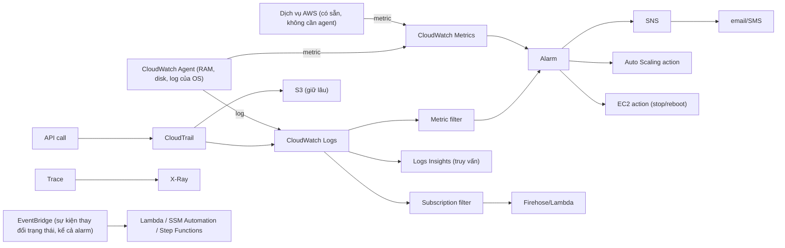

# Tuần 10 — Giám sát, vận hành và hạ tầng dạng mã

> Chín tuần trước bạn học cách **dựng** hệ thống. Tuần này trả lời ba câu hỏi khác:
> **làm sao biết nó đang hỏng, làm sao vào được máy để sửa, và làm sao dựng lại y hệt
> ở account khác.** Domain 4 (tối ưu chi phí, 20% đề) cũng nằm phần lớn ở đây, vì
> muốn tối ưu thì phải đo được trước.

---

## Học xong bài này bạn phải trả lời được

1. Metric nào của EC2 có sẵn trong CloudWatch, metric nào **không** — và vì sao?
2. Một alarm ở trạng thái `ALARM` mãi không về `OK` thì cấu hình nào sai?
3. CloudTrail management event, data event và Insights event khác nhau ở đâu, cái nào
   tính tiền?
4. "Ai đã xoá cái này?" — dùng dịch vụ nào, và giới hạn 90 ngày ảnh hưởng thế nào?
5. Vì sao Session Manager thay được SSH, và nó bỏ đi được những thứ gì trong kiến trúc?
6. Change set, drift detection, StackSet là gì trong CloudFormation — và tương ứng
   với cái gì bạn đã dùng trong Terraform?
7. Savings Plans khác Reserved Instance ở đâu, và khi nào đề thi muốn cái nào?
8. Trusted Advisor, Compute Optimizer, Cost Explorer, Budgets — mỗi cái trả lời câu
   hỏi tiền bạc nào?

---

## Bản đồ khái niệm



```
VẬN HÀNH: Systems Manager (Session Manager · Run Command · Patch Manager ·
          State Manager · Inventory · Automation · Parameter Store) · AWS Backup
IaC:      CloudFormation → Stack → Change set · Drift detection · StackSet
TIỀN:     Cost Explorer (nhìn lại) · Budgets (cảnh báo trước) · Cost Allocation Tag
          Trusted Advisor (best practice) · Compute Optimizer (right-sizing)
```

---

## 1. CloudWatch Metrics — và cái bẫy metric không tồn tại

### Cấu trúc một metric

| Khái niệm | Nghĩa | Tương đương bạn đã biết |
|---|---|---|
| **Namespace** | Không gian tên, ví dụ `AWS/EC2`, `AWS/Lambda`, `CWAgent` | Prefix của metric trong Prometheus |
| **Metric name** | `CPUUtilization`, `Errors`, `Duration` | Tên metric |
| **Dimension** | Cặp key-value định danh, ví dụ `InstanceId=i-abc` | Label |
| **Statistic** | `Average`, `Sum`, `Minimum`, `Maximum`, `SampleCount`, `p99` | Hàm gộp |
| **Resolution** | **Standard 60 giây** hoặc **high-resolution 1 giây** | Scrape interval |

Một tổ hợp (namespace + tên + đúng bộ dimension) là **một metric riêng biệt**. Đây là
lý do custom metric tính tiền theo số tổ hợp — đừng đặt dimension là request ID.

**Retention** (con số này ra thi):

| Chu kỳ dữ liệu | Giữ bao lâu |
|---|---|
| < 60 giây (high-resolution) | 3 giờ |
| 60 giây | 15 ngày |
| 300 giây (5 phút) | 63 ngày |
| 3600 giây (1 giờ) | **455 ngày (15 tháng)** |

Dữ liệu không bị xoá, nó bị **gộp lại thô dần**. Cần giữ lâu hơn ở độ phân giải cao
thì phải export ra chỗ khác.

### Metric nào KHÔNG có sẵn — bẫy kinh điển nhất của cả bài

EC2 gửi cho CloudWatch những gì **hypervisor nhìn thấy**: CPU, network in/out, disk
read/write **ở mức volume**, status check. Hypervisor **không nhìn được vào bên trong
OS**, nên không có:

- **Memory / RAM utilization**
- **Disk space used / free** (mức filesystem)
- Số process, swap, trạng thái service

Muốn có ba nhóm này: cài **CloudWatch Agent** (unified agent), nó đẩy lên namespace
`CWAgent` dưới dạng **custom metric** (có tính phí). Agent này cũng là thứ đẩy log
của OS và của ứng dụng lên CloudWatch Logs.

> Đề thi hỏi gần như nguyên văn: *"Cần cảnh báo khi bộ nhớ của EC2 vượt 80%. Làm thế nào?"*
> Đáp án: cài CloudWatch Agent. Mọi đáp án kiểu "tạo alarm trên metric
> `MemoryUtilization` có sẵn" đều sai vì metric đó không tồn tại.

Hai chế độ thu thập của EC2:

| | Basic monitoring | Detailed monitoring |
|---|---|---|
| Chu kỳ | **5 phút** | **1 phút** |
| Giá | Miễn phí | Tính phí |
| Bật ở đâu | Mặc định | Lúc launch hoặc bật sau |

Auto Scaling phản ứng nhanh hơn khi bật detailed monitoring — đó là đánh đổi tiền lấy
thời gian phản ứng.

### Ba cách tạo custom metric, theo thứ tự chi phí

| Cách | Chi phí | Dùng khi |
|---|---|---|
| **Metric filter** trên log | Rẻ nhất — bạn đã trả tiền cho log rồi | Đếm sự kiện đơn giản: số lần đăng nhập hỏng, số đơn bị huỷ |
| `PutMetricData` từ code | Phí API mỗi lần gọi | Ít metric, cần xuất hiện tức thì |
| **Embedded Metric Format (EMF)** | Rẻ nhất khi khối lượng lớn | Nhiều metric, nhiều dimension, log và metric cùng một lần ghi |

---

## 2. Alarm — nơi cấu hình sai gây hậu quả im lặng

Ba trạng thái: `OK`, `ALARM`, `INSUFFICIENT_DATA`.

Bốn tham số quyết định hành vi:

| Tham số | Nghĩa |
|---|---|
| **Period** | Độ dài một khoảng đánh giá (ví dụ 60 giây) |
| **Evaluation periods** | Nhìn lại bao nhiêu khoảng gần nhất |
| **Datapoints to alarm** | Cần bao nhiêu khoảng vượt ngưỡng trong số đó thì mới kêu |
| **Treat missing data** | Coi khoảng không có dữ liệu là gì |

`Datapoints to alarm` nhỏ hơn `Evaluation periods` cho ra luật **"M trên N"** — ví dụ
3 trên 5 — dùng để lọc nhiễu tạm thời mà không phải nới ngưỡng.

### `treat_missing_data` — tham số bị hiểu sai nhiều nhất

| Giá trị | Nghĩa | Dùng cho |
|---|---|---|
| `missing` (mặc định) | Giữ nguyên trạng thái trước đó | Hiếm khi đúng |
| **`notBreaching`** | Coi như bình thường | **Metric lỗi** (Lambda `Errors`, `5XX`) |
| **`breaching`** | Coi như đang lỗi | **Metric heartbeat** — "hệ thống còn sống" |
| `ignore` | Không đánh giá lại | Metric rời rạc, theo lô |

Vì sao quan trọng: nhiều metric của AWS **không gửi số 0**. Lambda không phát
`Errors=0` khi không có lỗi — nó đơn giản là không gửi gì. Để mặc định `missing` thì
sau lần lỗi **đầu tiên**, alarm **kẹt ở `ALARM` vĩnh viễn**, vì không bao giờ có dữ
liệu mới kéo nó về `OK`. Bạn đã tự thấy điều này trong lab tuần 10.

### Hành động của alarm

Một alarm gắn được nhiều action cho từng chuyển trạng thái:

- **SNS topic** → email, SMS, HTTP endpoint, Lambda, SQS. Đây là đường phổ biến nhất.
- **Auto Scaling action** → scale out/in (đây chính là target tracking policy của tuần 3).
- **EC2 action** → stop, terminate, reboot, recover instance.
- **Systems Manager** → tạo OpsItem hoặc chạy Automation.

### Composite alarm

`alarm_rule = ALARM(co-loi) AND ALARM(p99-cham)` — chỉ kêu khi nhiều điều kiện cùng
sai. Lý do tồn tại: một sự cố thật làm hàng chục alarm kêu cùng lúc, bạn nhận 20 email
cho một sự cố, và lần sau bạn bắt đầu bỏ qua email. **Alarm fatigue mới là nguyên nhân
thật khiến sự cố bị bỏ lỡ**, không phải thiếu alarm.

### EventBridge liên thông với alarm

Mọi thay đổi trạng thái alarm phát ra một event trên **default event bus**
(`source: aws.cloudwatch`, `detail-type: CloudWatch Alarm State Change`). Từ đó bạn
lái đi đâu cũng được: Lambda tự chữa, SSM Automation chạy runbook, Step Functions
điều phối, ticket hệ thống.

Phân biệt hai đường:

| | Alarm → SNS | Alarm → EventBridge rule |
|---|---|---|
| Mục đích | **Báo cho người** | **Kích hoạt tự động hoá** |
| Lọc | Không | Pattern matching trên nội dung event |
| Đích | Email, SMS, HTTP, Lambda, SQS | Hơn 20 loại target, kèm input transformer |

---

## 3. CloudWatch Logs

Cấu trúc: **log group** (một ứng dụng, một Lambda, một log file) chứa nhiều
**log stream** (một nguồn cụ thể: một instance, một container, một lần khởi tạo Lambda).

### Retention — bẫy chi phí số một

**Mặc định của log group là `Never expire`.** Không phải 7 ngày, không phải 30 ngày —
**vĩnh viễn**. Một Lambda lỗi lặp vô hạn ghi log 24/7 sẽ ăn hết 5 GB miễn phí rồi
tính tiền đều đặn, mãi mãi, kể cả sau khi bạn đã xoá hàm đó.

Đặt retention là việc đầu tiên phải làm với mọi log group. Trong repo này đã có sẵn:

```bash
./scripts/set-log-retention.sh 7
```

Đây cũng là câu hỏi Domain 4 rất hay gặp: *"giảm chi phí CloudWatch Logs"* →
đặt retention, và với log cần giữ lâu thì **export sang S3** rồi áp lifecycle sang
Glacier, vì lưu trong Logs đắt hơn nhiều lần lưu trong S3.

### Metric filter

Biến một mẫu trong log thành metric để đặt alarm lên đó:

```
pattern = "{ $.level = \"ERROR\" }"
```

Bắt buộc đặt `default_value = 0`, nếu không metric chỉ xuất hiện khi *có* lỗi và bạn
rơi lại đúng cái bẫy `treat_missing_data` ở trên.

Metric filter **chỉ áp cho log ghi vào sau khi tạo filter**. Nó không quét ngược quá khứ.

### Logs Insights

Ngôn ngữ truy vấn riêng, tính tiền theo **lượng dữ liệu quét**:

```
fields @timestamp, user, duration_ms
| filter duration_ms > 1000
| sort duration_ms desc
| limit 20
```

Đây là lý do phải in **log có cấu trúc (JSON)**. Với log tự do
`"Xu ly xong trong 1234ms"` bạn phải `parse` bằng regex — chậm hơn, đắt hơn, và vỡ
ngay khi ai đó sửa câu chữ.

### Subscription filter

Đẩy log **theo thời gian thực** sang OpenSearch, Kinesis Data Streams, Firehose hoặc
Lambda. Đây là đáp án cho *"phân tích log tập trung, gần thời gian thực, nhiều account"*.

### Dashboard

Widget từ nhiều metric, nhiều region, nhiều account. Điểm đáng nhớ cho phòng thi:
dashboard là **global**, không thuộc region nào; ba dashboard đầu tiên miễn phí.

Một widget nên vẽ **cùng lúc** `Average`, `p50`, `p99` và `Maximum` của cùng một metric
độ trễ. Bạn sẽ thấy tận mắt vì sao trung bình là con số dối trá: 3 request 3,5 giây và
20 request 1 ms cho ra trung bình ~457 ms — trông chấp nhận được — trong khi 13% người
dùng vừa phải đợi 3,5 giây.

---

## 4. CloudTrail — sổ cái của account

| Loại event | Ghi mặc định? | Tính tiền? | Ví dụ |
|---|---|---|---|
| **Management event** | **Có** | Bản đầu tiên miễn phí | `RunInstances`, `CreateBucket`, `AssumeRole`, `DeleteSecurityGroup` |
| **Data event** | **Không** | **Có**, khối lượng rất lớn | `s3:GetObject`, `s3:PutObject`, `lambda:Invoke`, `dynamodb:PutItem` |
| **Insights event** | Không | Có | Cảnh báo khi nhịp gọi API lệch bất thường so với đường nền |

**Event history**: 90 ngày gần nhất, miễn phí, chỉ management event, **theo từng region**.
Muốn giữ lâu hơn, phân tích, hoặc gộp nhiều account → tạo **trail**.

Cấu hình một trail cho đúng:

- **Multi-region trail** — bắt sự kiện ở *mọi* region. Không bật thì kẻ tấn công tạo
  tài nguyên ở region bạn không ngó tới và bạn không có log nào.
- **Đích S3** — lưu lâu, rẻ, áp lifecycle được, bật Object Lock nếu cần chống sửa.
- **Đích CloudWatch Logs (song song)** — để đặt **metric filter + alarm**. Đây là cách
  bạn nhận cảnh báo *ngay khi* có ai gọi `DeleteTrail`, `StopLogging`, hoặc đăng nhập
  bằng root.
- **Log file validation** — sinh file digest ký số, chứng minh log không bị sửa.
- **Organization trail** — một trail cho toàn tổ chức, account con không tắt được.

### Điều tra "ai đã xoá cái này"

```
1. Sự việc trong 90 ngày qua?  → CloudTrail Event history, lọc theo Event name
                                  (DeleteBucket, TerminateInstances, ...)
2. Lâu hơn 90 ngày?            → Truy vấn log trong S3 bằng Athena
3. Cần biết tài nguyên trước   → AWS Config timeline (tuần 9)
   khi bị xoá trông thế nào?
4. Cần dựng lại chuỗi sự kiện? → Detective (tuần 9)
```

Mỗi event chứa `userIdentity` (ai), `eventTime`, `sourceIPAddress`, `userAgent`,
`requestParameters`. Nếu hành động đi qua một role thì `userIdentity` cho bạn cả
session name — đó là lý do đặt session name có ý nghĩa lúc `AssumeRole` là thói quen tốt.

---

## 5. X-Ray — ở mức khái niệm

Distributed tracing. Nếu bạn đã dùng Jaeger hay Zipkin thì không có gì mới về ý tưởng.

Ba thứ cần biết cho SAA:

- **Trace** = hành trình của một request qua nhiều dịch vụ; **segment** = phần việc của
  một dịch vụ; **subsegment** = một lời gọi con (query DB, gọi API ngoài).
- **Service map** — sơ đồ tự sinh cho thấy dịch vụ nào gọi dịch vụ nào, độ trễ và tỉ lệ
  lỗi ở mỗi cạnh. Đây là hình mà đề thi mô tả khi hỏi *"xác định thành phần nào gây chậm
  trong kiến trúc microservices"*.
- **Sampling rule** — không trace 100% request, vì tốn tiền và tốn hiệu năng.

Bật ở đâu: Lambda (một tuỳ chọn cấu hình), API Gateway (bật tracing trên stage), ECS/EC2
(chạy X-Ray daemon). Cần quyền IAM tương ứng cho function/task.

Ranh giới với CloudWatch: CloudWatch trả lời *"cái gì đang sai"*, X-Ray trả lời
*"sai ở đâu trong chuỗi gọi"*.

---

## 6. Systems Manager — bộ công cụ vận hành

SSM là cái tên gộp cho khoảng chục tính năng rời. Điều kiện chung: instance phải có
**SSM Agent** (có sẵn trên Amazon Linux 2023, Ubuntu bản AWS) và một **IAM instance
profile** có `AmazonSSMManagedInstanceCore`. Không có role thì instance không xuất hiện
trong danh sách managed node — đây là lỗi hay gặp nhất khi mới dùng.

### Session Manager — vì sao nó thay được SSH

Đây là phần bạn quan tâm nhất, và cũng là mẫu kiến trúc đề thi ưu ái.

Cơ chế: SSM Agent trên instance **chủ động mở kết nối ra** tới endpoint của Systems
Manager (outbound HTTPS 443). Khi bạn mở session, lưu lượng đi qua kênh đã có sẵn đó.
**Không có kết nối nào đi vào instance.**

Bảng thứ bạn **bỏ đi được** khi chuyển từ SSH sang Session Manager:

| Thứ bỏ được | Vấn đề nó từng gây ra |
|---|---|
| **Port 22 mở trong Security Group** | Bề mặt tấn công; inbound rule là thứ bị quét liên tục |
| **Bastion host / jump box** | Một EC2 chạy 24/7 phải vá, phải giám sát, phải trả tiền |
| **Public IP hoặc Elastic IP** | ~$3,6/tháng mỗi IP, và một đường vào từ internet |
| **Quản lý SSH key** | Cấp phát, xoay vòng, thu hồi khi nhân viên nghỉ việc |
| **Log phiên tự dựng** | Session Manager ghi toàn bộ phiên vào S3 hoặc CloudWatch Logs |

Cái bạn **được thêm**:

- Quyền truy cập điều khiển bằng **IAM policy**, không phải bằng file `authorized_keys`.
  Thu hồi quyền của một người là sửa một policy, tức thì, cho toàn bộ fleet.
- Mọi phiên xuất hiện trong **CloudTrail** — audit được ai vào máy nào, lúc nào.
- Port forwarding (`AWS-StartPortForwardingSession`) để tunnel tới RDS hay web UI nội bộ.
- Chạy được cả với instance **không có internet**, nếu bạn tạo **VPC Interface Endpoint**
  cho `ssm`, `ssmmessages`, `ec2messages`.

Đánh đổi thật, đừng bỏ qua: phụ thuộc vào SSM Agent còn sống và endpoint còn tới được.
Nếu network stack của instance hỏng thì bạn mất luôn đường vào — trong khi console
serial của EC2 vẫn còn. Và Interface Endpoint tốn khoảng $7,2/tháng mỗi AZ, nên với
lab thì rẻ hơn là để instance đi qua NAT hoặc để nó ở public subnet không có inbound rule.

Bạn đã làm đúng mẫu này từ tuần 2: EC2 trong private subnet, không public IP, không
SSH key, vẫn vào được.

### Các tính năng còn lại — mức nhận diện

| Tính năng | Giải bài toán gì | Từ khoá trong đề |
|---|---|---|
| **Run Command** | Chạy một lệnh/script trên hàng trăm instance cùng lúc, không SSH | "thực thi lệnh trên toàn fleet", "không dùng SSH" |
| **Patch Manager** | Quét và vá OS theo lịch, theo patch baseline, theo maintenance window | "vá lỗi tự động", "tuân thủ chính sách patch" |
| **State Manager** | Giữ instance ở một cấu hình mong muốn, áp lại định kỳ | "đảm bảo agent luôn được cài", "chống drift cấu hình" |
| **Inventory** | Kiểm kê phần mềm, phiên bản, cấu hình trên toàn fleet | "biết máy nào đang cài phiên bản nào" |
| **Automation** | Runbook nhiều bước có phê duyệt (ví dụ: tạo AMI, restart theo thứ tự) | "runbook", "tự động khắc phục" |
| **Parameter Store** | Cấu hình và secret (đã học tuần 9) | "lưu chuỗi kết nối", "chi phí thấp nhất" |
| **Maintenance Window** | Khung giờ được phép làm gián đoạn | "chỉ vá ngoài giờ làm việc" |

State Manager với Ansible: State Manager là mô hình **pull, định kỳ, đảm bảo trạng thái
mong muốn** — gần với `ansible-pull` chạy bằng cron hơn là `ansible-playbook` từ máy bạn.

---

## 7. AWS Backup

Một chỗ để định nghĩa chính sách backup cho nhiều dịch vụ: EBS, EC2, RDS, Aurora,
DynamoDB, EFS, FSx, Storage Gateway volume, S3.

Bốn khái niệm:

- **Backup plan** — lịch (cron), cửa sổ backup, **lifecycle** (chuyển sang cold storage
  sau N ngày, xoá sau M ngày).
- **Backup vault** — nơi chứa recovery point, mã hoá bằng KMS. **Vault Lock** đặt chế độ
  WORM: không ai xoá được backup trước hạn, kể cả root. Đây là đáp án cho
  *"chống ransomware / đáp ứng yêu cầu lưu trữ bất biến"*.
- **Backup selection** — chọn tài nguyên **theo tag** thay vì liệt kê ARN. Tài nguyên mới
  có tag đúng sẽ tự được backup mà không phải sửa gì. Đây là cách làm đúng.
- **Cross-Region / cross-account copy** — nền tảng cho chiến lược DR ở tuần 11.

Nhận diện trong đề: *"chính sách backup tập trung cho nhiều dịch vụ và nhiều account,
có báo cáo tuân thủ"* → AWS Backup, không phải script snapshot tự viết.

**Luôn đặt `delete_after`.** Không có nó thì backup tích luỹ vĩnh viễn — cùng loại bẫy
với retention của log group.

---

## 8. Hạ tầng dạng mã

Bạn đã hiểu vì sao IaC quan trọng. Phần này chỉ ánh xạ từ vựng, vì **đề thi hỏi về
CloudFormation**, không hỏi về Terraform.

| Bạn đã biết (Terraform) | CloudFormation | Ghi chú cho phòng thi |
|---|---|---|
| `terraform plan` | **Change set** | Xem trước thay đổi trước khi áp |
| `terraform apply` | Create / Update stack | |
| `terraform destroy` | Delete stack | |
| `terraform.tfstate` | **Stack** — AWS tự giữ | CFN không có file state để mất |
| Module | **Nested stack** | Tái sử dụng một khối tài nguyên |
| Workspace | Stack riêng cho mỗi môi trường | |
| Drift phát hiện qua `plan` | **Drift detection** | Ai đó sửa tay ngoài IaC |
| `for_each` qua provider alias | **StackSet** | Deploy một template ra **nhiều account và nhiều region** cùng lúc |
| `prevent_destroy` | **DeletionPolicy: Retain / Snapshot** | Giữ tài nguyên khi xoá stack |
| — | **UpdateReplacePolicy** | Giữ tài nguyên cũ khi update buộc phải thay thế |
| — | **Stack policy** | Cấm update một số tài nguyên trong stack |

Ba khái niệm CloudFormation phải thuộc:

1. **Change set** — trả lời câu hỏi *"làm sao biết trước bản cập nhật sẽ thay thế hay
   sửa tại chỗ tài nguyên nào"*. Đây là điều kiện an toàn khi update production.
2. **Drift detection** — trả lời *"làm sao biết có ai sửa tay ngoài IaC"*. CloudFormation
   không tự chặn được việc sửa tay; nó chỉ phát hiện được.
3. **StackSet** — trả lời *"triển khai baseline bảo mật cho 200 account trong Organization"*.
   Nếu đáp án nào nói "chạy stack thủ công ở từng account" thì loại.

Template gồm các section: `Parameters`, `Mappings`, `Conditions`, `Resources`
(section duy nhất bắt buộc), `Outputs`, `Metadata`, `Transform`. `Transform: AWS::Serverless-2016-10-31`
biến template thành **SAM** — phần mở rộng của CloudFormation dành cho serverless.

### CloudFormation vs Terraform vs CDK — so sánh khách quan

| | CloudFormation | Terraform | CDK |
|---|---|---|---|
| Ngôn ngữ | YAML/JSON khai báo | HCL khai báo | TypeScript/Python/Java/Go — **sinh ra CloudFormation** |
| Phạm vi | Chỉ AWS | Đa cloud + hàng nghìn provider | Chỉ AWS (CDKTF thì đa cloud) |
| State | AWS quản lý | **Bạn quản lý** (file, S3 backend, Terraform Cloud) | Do CloudFormation quản lý |
| Dịch vụ mới của AWS | Thường có ngay | Chờ provider cập nhật | Theo CloudFormation |
| Rollback tự động khi lỗi | **Có, mặc định** | Không — apply hỏng giữa chừng thì state ở trạng thái dở dang | Có (qua CFN) |
| Trừu tượng hoá | Yếu, phải viết dài | Module | **Mạnh nhất** — construct đóng gói best practice |
| Chi phí học | Thấp | Trung bình | Cao (phải biết cả CFN lẫn ngôn ngữ) |
| Với kỳ thi SAA | **Đây là thứ được hỏi** | Không được hỏi tên | **Nằm trong danh sách out-of-scope của exam guide** |

Kết luận thực dụng: dùng Terraform để làm việc (repo này làm vậy), học CloudFormation
để thi. Hai thứ không mâu thuẫn — bảng ánh xạ ở trên là toàn bộ khoảng cách.

---

## 9. Trusted Advisor, Compute Optimizer, Health Dashboard

| Dịch vụ | Trả lời câu hỏi | Ghi chú |
|---|---|---|
| **Trusted Advisor** | *Tôi có đang vi phạm best practice không?* | 5 nhóm: Cost Optimization, Performance, Security, Fault Tolerance, Service Limits |
| **Compute Optimizer** | *Máy của tôi có bị quá cỡ không?* | Dùng lịch sử CloudWatch để gợi ý instance type/size. **Miễn phí** |
| **AWS Health Dashboard** | *Sự cố này là của AWS hay của tôi?* | Có phần "your account" — sự kiện ảnh hưởng trực tiếp tới tài nguyên của bạn |

**Giới hạn của Trusted Advisor rất hay ra thi:** account ở gói **Basic** và **Developer**
Support chỉ thấy một nhóm nhỏ check (một số check bảo mật cốt lõi và các check về
service quota). **Toàn bộ** check chỉ mở cho **Business Support trở lên**. Nếu đề nói
"khách hàng dùng Basic Support" thì đáp án "dùng Trusted Advisor để tìm EC2 chạy phí"
là sai.

Compute Optimizer phủ: EC2, Auto Scaling group, EBS volume, Lambda, ECS trên Fargate,
RDS. Nó là câu trả lời cho *"right-sizing"* — trong khi Cost Explorer chỉ cho bạn thấy
tiền đã tiêu.

---

## 10. Domain 4 — quản lý và tối ưu chi phí

### Bốn công cụ, bốn thời điểm

| Công cụ | Nhìn về | Dùng để |
|---|---|---|
| **Cost Explorer** | **Quá khứ** (tới 13 tháng) + dự báo 12 tháng | Phân tích, lọc theo service/tag/account, tìm chỗ tiêu bất thường |
| **AWS Budgets** | **Tương lai** | Đặt ngưỡng và **cảnh báo trước khi vượt**; có 4 loại: cost, usage, reservation, Savings Plans |
| **Cost Anomaly Detection** | Liên tục | Học nhịp chi tiêu, báo khi lệch. Miễn phí |
| **Cost and Usage Report (CUR)** | Chi tiết nhất | Đổ vào S3, truy vấn bằng Athena, dựng dashboard QuickSight |

**Budget Actions** là chi tiết đáng nhớ: budget vượt ngưỡng có thể **tự động gắn một
IAM policy hạn chế**, dừng EC2/RDS, hoặc target một SCP. Đây là đáp án cho
*"ngăn chi tiêu vượt ngân sách, không chỉ cảnh báo"*.

### Cost Allocation Tag — cách bổ dọc hoá đơn

Hoá đơn AWS mặc định bổ theo **dịch vụ**. Muốn biết "team A tiêu bao nhiêu" hay
"môi trường prod tốn bao nhiêu" thì phải gắn tag và **kích hoạt tag đó làm cost
allocation tag** trong Billing console.

Ba điều làm người mới mất thời gian:

1. Gắn tag thôi **chưa đủ** — phải vào Billing console kích hoạt.
2. Kích hoạt **không hồi tố**: dữ liệu chi phí chỉ được bổ theo tag từ lúc kích hoạt trở đi.
3. Có hai loại: **AWS-generated** (`aws:createdBy`) và **user-defined** (tag của bạn).

Chiến thuật thi: hễ đề nói *"phân bổ chi phí cho từng phòng ban / dự án"* → cost
allocation tag. Hễ đề nói *"tách biệt hoàn toàn về mặt hoá đơn và quyền hạn"* →
**nhiều account trong Organizations**.

### Savings Plans vs Reserved Instances vs Spot

| | On-Demand | **Spot** | **Reserved Instance** | **Savings Plans** |
|---|---|---|---|---|
| Giảm giá | 0 | **tới ~90%** | tới **72%** (Standard) / **66%** (Convertible) | tới **66%** (Compute) / **72%** (EC2 Instance) |
| Cam kết | Không | Không | 1 hoặc 3 năm, theo **cấu hình instance** | 1 hoặc 3 năm, theo **$/giờ** |
| Bị thu hồi? | Không | **Có**, báo trước 2 phút | Không | Không |
| Linh hoạt | Tối đa | Tối đa (nhưng có thể mất máy) | Standard: thấp. Convertible: đổi được family | **Compute SP: cao nhất** — phủ EC2 mọi family/size/region, **Fargate và Lambda** |
| Giữ chỗ công suất | Không | Không | **Có, nếu là zonal RI** | **Không** |
| Bán lại được | — | — | **Standard RI bán được** trên Marketplace | Không |

Hai điểm phân biệt quyết định, thuộc là đủ:

> **Savings Plans cam kết bằng tiền ($/giờ), Reserved Instance cam kết bằng hiện vật
> (một cấu hình instance cụ thể).**
>
> **Chỉ zonal RI mới giữ chỗ công suất. Savings Plans không bao giờ giữ chỗ.**

Ánh xạ workload → mô hình giá (đây chính là dạng câu hỏi):

| Đặc điểm workload | Chọn |
|---|---|
| Tải nền ổn định, chạy 24/7, nhiều loại compute (EC2 + Fargate + Lambda) | **Compute Savings Plans** |
| Tải nền ổn định, cố định một instance family trong một region | **EC2 Instance Savings Plans** hoặc Standard RI |
| Cần **đảm bảo có máy** trong một AZ cụ thể (DR, sự kiện) | **Zonal RI** hoặc On-Demand Capacity Reservation |
| Batch, CI, render, xử lý dữ liệu — **chịu được gián đoạn** | **Spot** |
| Tải khó đoán, ngắn hạn, thử nghiệm | **On-Demand** |
| Yêu cầu giấy phép phần mềm tính theo socket vật lý | **Dedicated Host** |

---

## Bảng quyết định

| Tình huống | Chọn | Không chọn — vì sao |
|---|---|---|
| Cảnh báo khi RAM của EC2 vượt ngưỡng | **CloudWatch Agent** + custom metric + alarm | Metric `MemoryUtilization` không tồn tại sẵn |
| Alarm cho metric lỗi hay bị "kẹt ALARM" | `treat_missing_data = notBreaching` | Mặc định `missing` giữ nguyên trạng thái cũ |
| Alarm cho metric heartbeat | `treat_missing_data = breaching` | Không có dữ liệu chính là dấu hiệu chết |
| Giảm số email cảnh báo cho một sự cố | **Composite alarm** | Nới ngưỡng chỉ làm mất cảnh báo thật |
| Đếm số lần đăng nhập hỏng từ log ứng dụng | **Metric filter** | `PutMetricData` đắt hơn cho việc đơn giản |
| Phân tích log gần thời gian thực sang OpenSearch | **Subscription filter** | Export S3 là theo lô, có độ trễ |
| Giảm chi phí CloudWatch Logs | Đặt **retention**, export sang S3 + lifecycle | Xoá log group là mất bằng chứng |
| "Ai đã xoá security group hôm qua" | **CloudTrail Event history** | Config biết nó mất, không biết ai |
| Vào máy trong private subnet để debug | **SSM Session Manager** | Bastion host tốn tiền và mở thêm đường vào |
| Chạy một script trên 200 instance | **SSM Run Command** | SSH vòng lặp không audit được |
| Vá OS theo lịch, có báo cáo tuân thủ | **SSM Patch Manager** | Cron tự viết không có báo cáo |
| Backup nhiều dịch vụ, nhiều account, có báo cáo | **AWS Backup** | Script snapshot tự viết không mở rộng được |
| Xem trước tác động của bản cập nhật hạ tầng | **Change set** | Update thẳng có thể thay thế tài nguyên ngoài ý muốn |
| Triển khai baseline cho 200 account | **StackSet** | Chạy stack thủ công không khả thi |
| Tìm instance quá cỡ | **Compute Optimizer** | Cost Explorer chỉ cho thấy tiền, không gợi ý size |
| Ngăn chi tiêu vượt ngân sách (không chỉ báo) | **Budget Actions** | Budget thường chỉ gửi mail |
| Biết mỗi phòng ban tiêu bao nhiêu | **Cost Allocation Tag** đã kích hoạt | Cost Explorer không tự biết phòng ban là gì |
| Giảm giá compute mà vẫn linh hoạt EC2+Fargate+Lambda | **Compute Savings Plans** | RI chỉ áp cho EC2/RDS/... theo cấu hình |
| Cần chắc chắn có máy ở một AZ | **Zonal RI** / Capacity Reservation | Savings Plans không giữ chỗ |

---

## Số phải thuộc

| Con số | Nội dung |
|---|---|
| **5 phút / 1 phút** | Chu kỳ metric EC2: basic monitoring / detailed monitoring |
| **1 giây** | Chu kỳ của high-resolution custom metric (giữ 3 giờ) |
| **15 ngày / 63 ngày / 455 ngày** | Retention CloudWatch metric ở chu kỳ 1 phút / 5 phút / 1 giờ |
| **Never expire** | Retention **mặc định** của CloudWatch log group — bẫy chi phí số một |
| **90 ngày** | CloudTrail Event history, miễn phí, chỉ management event |
| **3 dashboard** | Số dashboard CloudWatch miễn phí |
| **`OK` / `ALARM` / `INSUFFICIENT_DATA`** | Ba trạng thái của alarm |
| **1 hoặc 3 năm** | Kỳ hạn của cả Savings Plans lẫn Reserved Instance |
| **~90%** | Mức giảm giá tối đa của Spot; báo trước **2 phút** khi thu hồi |
| **72% / 66%** | Giảm tối đa: Standard RI và EC2 Instance SP / Convertible RI và Compute SP |
| **13 tháng** | Dữ liệu lịch sử Cost Explorer *(kiểm tra lại trang tài liệu)* |
| **Business Support** | Gói tối thiểu để mở toàn bộ check của Trusted Advisor |

---

## Bẫy kinh điển

1. **"Metric RAM của EC2 có sẵn."** Không. Hypervisor không nhìn vào trong OS.
   Cần CloudWatch Agent. Disk space cũng vậy.
2. **"Log group tự hết hạn."** Mặc định là giữ **vĩnh viễn**. Phải đặt retention.
3. **"Alarm kẹt ở ALARM là do metric."** Thường là do `treat_missing_data` để mặc định
   trong khi metric không gửi số 0.
4. **"CloudTrail ghi mọi thứ."** Chỉ management event là mặc định. `s3:GetObject` là
   data event, phải bật riêng và tính tiền.
5. **"Trail mặc định bắt mọi region."** Phải chọn multi-region trail. Không chọn thì
   chỉ có region hiện tại.
6. **"Session Manager cần mở port 22."** Ngược lại hoàn toàn — nó tồn tại để bạn đóng
   port 22. Instance chỉ cần **outbound** 443.
7. **"Instance không thấy trong SSM là do agent."** Trước khi nghi agent, kiểm tra
   **IAM instance profile** — thiếu `AmazonSSMManagedInstanceCore` là nguyên nhân phổ biến hơn.
8. **"Trusted Advisor luôn có đủ check."** Basic/Developer Support chỉ thấy một phần nhỏ.
9. **"Savings Plans giữ chỗ công suất."** Không. Chỉ zonal RI và Capacity Reservation
    mới giữ chỗ.
10. **"Gắn tag là hoá đơn tự tách."** Phải kích hoạt cost allocation tag, và nó **không hồi tố**.
11. **"Drift detection tự sửa lại."** Nó chỉ **phát hiện**. Muốn tự sửa thì cần
    Config remediation hoặc SSM State Manager.

---

## Nối với lab

[`labs/w10-observability-iac/`](../../learn-aws/labs/w10-observability-iac/) dựng đúng
những mảnh của bài này:

| Lab làm gì | Khái niệm ở bài này |
|---|---|
| Alarm trên `Errors` của Lambda → SNS → **email thật** | Mục 2, và lý do phải bấm "Confirm subscription" |
| `--tags loi` gọi Lambda lỗi rồi đợi alarm chuyển `OK → ALARM` | Evaluation period, datapoints to alarm |
| Alarm tự về `OK` sau đó | `treat_missing_data = notBreaching` |
| Metric filter `{ $.muc = "ERROR" }` với `default_value = 0` | Mục 3 |
| Composite alarm `ALARM(a) AND ALARM(b)` | Chống alarm fatigue |
| `--tags cham` rồi so sánh trung bình với p99 trên dashboard | Vì sao trung bình là con số dối trá |
| Chuyển state Terraform lên S3 + DynamoDB lock | Vì sao IaC cần state chung và lock |

Quan sát quan trọng nhất khi chạy: **điện thoại bạn rung**. Một alarm không tới được
người thì không phải alarm. Đó cũng là lý do bước xác nhận subscription của SNS phải
làm thủ công — Terraform không bấm hộ được, và đây là một trong số rất ít chỗ IaC phải
dừng chờ con người.

---

## Tự kiểm tra

<details>
<summary>1. Vì sao CloudWatch không có sẵn metric bộ nhớ của EC2, trong khi nó có sẵn metric CPU?</summary>

CPU utilization đo được từ phía hypervisor — nó biết nó cấp bao nhiêu chu kỳ CPU cho
VM. Bộ nhớ đã dùng thì chỉ hệ điều hành bên trong VM mới biết (page cache, buffer,
process nào giữ gì), hypervisor chỉ thấy một khối RAM đã cấp. Muốn có thì phải có thứ
chạy *bên trong* OS đẩy ra: CloudWatch Agent.
</details>

<details>
<summary>2. Một alarm trên `Errors` của Lambda vào ALARM rồi ở đó mãi. Nguyên nhân và cách sửa?</summary>

Lambda không phát `Errors = 0` khi không có lỗi; nó không gửi datapoint nào. Với
`treat_missing_data = missing` (mặc định), CloudWatch giữ nguyên trạng thái trước đó,
nên alarm không bao giờ được kéo về `OK`. Sửa: đặt `notBreaching`. Với metric filter
thì thêm `default_value = 0` để metric luôn có điểm dữ liệu.
</details>

<details>
<summary>3. Đề nói: "cần biết ai đã đọc một object nhạy cảm trong S3 sáu tháng trước". Cần những gì?</summary>

Hai điều kiện, và cả hai phải có **từ trước**: (a) trail đã bật **data event** cho
bucket đó — management event không ghi `GetObject`; (b) trail đã đẩy log vào S3, vì
Event history chỉ giữ 90 ngày và cũng chỉ có management event. Sau đó truy vấn bằng
Athena. Nếu chưa bật data event từ trước thì không có cách nào lấy lại.
</details>

<details>
<summary>4. Session Manager bỏ được bastion host, port 22 và SSH key. Cái giá phải trả là gì?</summary>

Bạn phụ thuộc vào SSM Agent còn chạy và endpoint SSM còn tới được. Network stack hỏng
là mất luôn đường vào (lúc đó phải dùng EC2 Serial Console). Instance hoàn toàn không
có internet thì cần ba VPC Interface Endpoint (`ssm`, `ssmmessages`, `ec2messages`),
mỗi endpoint tốn tiền theo giờ và theo AZ. Đổi lại: không còn inbound rule, không còn
quản lý khoá, và mọi phiên đều nằm trong CloudTrail.
</details>

<details>
<summary>5. Workload chạy 24/7 gồm EC2, Fargate và Lambda. Chọn Savings Plans hay Reserved Instance, vì sao?</summary>

Compute Savings Plans. RI chỉ áp cho EC2 (và RDS/ElastiCache/... theo từng dịch vụ
riêng), không phủ Fargate và Lambda. Compute SP cam kết bằng $/giờ nên áp được cho cả
ba, mọi family, mọi size, mọi region. Đánh đổi: giảm giá thấp hơn EC2 Instance SP một
chút, và không giữ chỗ công suất.
</details>

<details>
<summary>6. Bạn gắn tag `Team=platform` cho mọi tài nguyên từ ba tháng trước, nhưng Cost Explorer không tách được theo tag đó. Vì sao?</summary>

Chưa kích hoạt nó làm **cost allocation tag** trong Billing console. Và khi kích hoạt
thì việc bổ chi phí **chỉ áp dụng từ thời điểm đó trở đi** — ba tháng dữ liệu cũ không
được gán tag hồi tố.
</details>

---

## Ngoài phạm vi

- **CloudWatch Application Signals, RUM, Synthetics Canary** và **CloudTrail Lake** —
  biết tên là đủ. [Docs](https://docs.aws.amazon.com/awscloudtrail/latest/userguide/cloudtrail-lake.html)
- **AWS CDK** — nằm trong danh sách **out-of-scope** của exam guide SAA-C03; bài này chỉ
  so sánh để bạn định vị công cụ.
- **AWS OpsWorks, AWS Chatbot, AWS Distro for OpenTelemetry** — cũng nằm trong danh sách
  out-of-scope.
- **CloudFormation Registry, custom resource, macro, Managed Grafana/Prometheus** —
  mức Professional/DevOps.

---

## Nguồn

- [AWS Certified Solutions Architect – Associate (SAA-C03) Exam Guide, v1.1](https://d1.awsstatic.com/training-and-certification/docs-sa-assoc/AWS-Certified-Solutions-Architect-Associate_Exam-Guide.pdf)
- [CloudWatch concepts — metric, dimension, resolution, retention](https://docs.aws.amazon.com/AmazonCloudWatch/latest/monitoring/cloudwatch_concepts.html)
- [Gửi metric bộ nhớ và ổ đĩa của EC2 lên CloudWatch (cần CloudWatch Agent)](https://repost.aws/knowledge-center/cloudwatch-memory-metrics-ec2)
- [Working with CloudTrail event history (90 ngày)](https://docs.aws.amazon.com/awscloudtrail/latest/userguide/view-cloudtrail-events.html)
- [Chọn giữa data event và management event trong CloudTrail](https://repost.aws/knowledge-center/cloudtrail-data-management-events)
- [AWS Systems Manager Session Manager](https://docs.aws.amazon.com/systems-manager/latest/userguide/session-manager.html)
- [AWS Backup Vault Lock](https://docs.aws.amazon.com/aws-backup/latest/devguide/vault-lock.html)
- [Compute Savings Plans — mức giảm giá và kỳ hạn](https://aws.amazon.com/savingsplans/compute-pricing/)
- [Amazon EC2 Reserved Instances — Standard vs Convertible, regional vs zonal](https://aws.amazon.com/ec2/pricing/reserved-instances/)
- [AWS Premium Support FAQs — Trusted Advisor theo gói support](https://aws.amazon.com/premiumsupport/faqs/)
