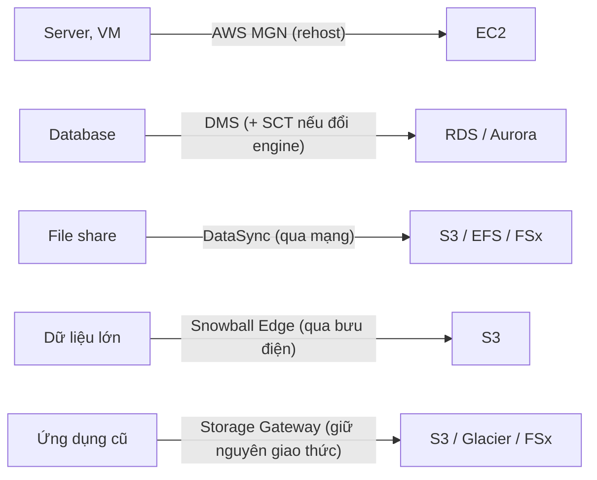
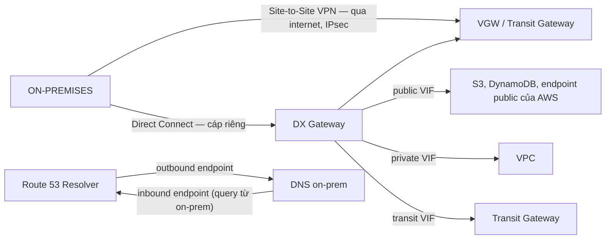
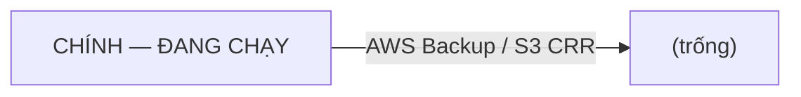
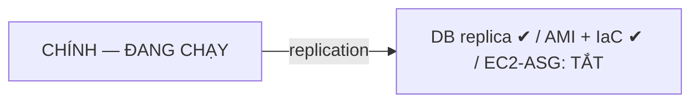
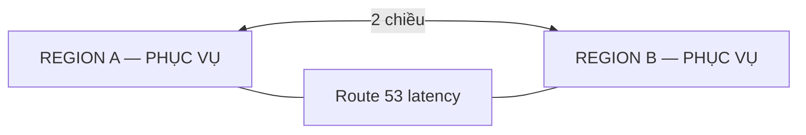
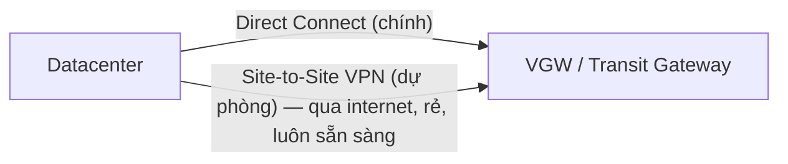

# Tuần 11 — Di trú, hybrid và khôi phục thảm họa

> Tuần này trả lời câu hỏi kiến trúc đắt tiền nhất: **hệ thống được phép chết bao lâu,
> được phép mất bao nhiêu dữ liệu, và bạn trả bao nhiêu mỗi tháng cho hai con số đó.**
> Cộng thêm hai câu hỏi thực tế đi kèm: làm sao đưa 200 TB từ datacenter lên AWS, và
> làm sao nối hai mạng lại với nhau.

Đây cũng là tuần bản lề cho mục tiêu dài hạn của bạn — thiết kế DR site cho hybrid
cloud. Direct Connect, Transit Gateway và VPN không lab được vì quá đắt, nhưng đề thi
không hỏi bạn đã bấm nút nào. Nó hỏi bạn **chọn kiến trúc nào cho ràng buộc nào**.

---

## Học xong bài này bạn phải trả lời được

1. RTO và RPO khác nhau ở đâu, và mỗi con số quy ra quyết định kiến trúc gì?
2. Bốn chiến lược DR — nhận ra chúng qua từ khoá nào trong đề, và mỗi cái để lại gì
   ở region phụ?
3. Multi-AZ và multi-Region giải quyết **loại thất bại** nào khác nhau?
4. 7R của migration là gì, và đề thi mô tả từng chữ R bằng câu nào?
5. Có 300 TB và đường 1 Gbps — truyền qua mạng hay dùng thiết bị vật lý? Tính ra sao?
6. DMS, SCT, DataSync, Storage Gateway, Snow Family — mỗi cái vào đúng bài toán nào?
7. Direct Connect và Site-to-Site VPN khác nhau ở đâu, và vì sao mẫu kiến trúc kinh
   điển lại là **cả hai**?
8. Public VIF và private VIF khác nhau thế nào, Direct Connect Gateway giải bài toán gì?
9. Khi nào cần Route 53 Resolver endpoint, và inbound khác outbound ra sao?

---

## Bản đồ khái niệm

**ON-PREMISES → KẾT NỐI → AWS**



MẠNG:



**KHÔI PHỤC THẢM HỌA — trục đánh đổi duy nhất**

| | Backup & Restore | Pilot Light | Warm Standby | Multi-Site Active/Active |
|---|---|---|---|---|
| RTO | giờ–ngày | chục phút | phút | ~0 |
| RPO | giờ | phút | giây | ~0 |
| $ | thấp nhất | thấp | trung bình | cao nhất |

---

## 1. RTO và RPO — hai con số sinh ra mọi quyết định

```
        sự cố xảy ra
             │
   ──────────┼──────────────────────────▶ thời gian
    ◀── RPO ─┤─────── RTO ───────▶
   backup     │                  hệ thống
   gần nhất   │                  chạy lại
             │
   RPO = lượng dữ liệu bạn chấp nhận mất  (nhìn về QUÁ KHỨ)
   RTO = thời gian bạn chấp nhận ngừng    (nhìn về TƯƠNG LAI)
```

| | RTO — Recovery **Time** Objective | RPO — Recovery **Point** Objective |
|---|---|---|
| Câu hỏi | *Chịu được downtime bao lâu?* | *Chịu mất dữ liệu của bao nhiêu phút gần nhất?* |
| Quyết định | Hạ tầng ở region phụ có sẵn tới đâu | **Tần suất và cơ chế sao chép dữ liệu** |
| Rút ngắn bằng | Giữ sẵn máy đang chạy, tự động hoá failover, đổi DNS nhanh | Sao chép liên tục thay vì snapshot theo lịch |
| Chi phí tăng theo | Hạ tầng nhàn rỗi ở region phụ | Băng thông và độ phức tạp của replication |

Mẹo nhớ: **T**ime = **T**hời gian ngừng. **P**oint = **P**hần dữ liệu mất.

**Hai con số này độc lập với nhau.** Một hệ thống có thể có RPO 5 giây (replication
đồng bộ) nhưng RTO 4 giờ (phải dựng lại hạ tầng bằng tay). Đề thi hay cho một con số
chặt và một con số lỏng — đó chính là chỗ phân biệt hai đáp án gần giống nhau.

Quy chiếu nhanh từ con số ra kiến trúc:

| Ràng buộc trong đề | Cơ chế dữ liệu | Chiến lược |
|---|---|---|
| RPO 24 giờ | Snapshot hằng ngày, S3 CRR | Backup & Restore |
| RPO vài phút | Read replica cross-region, DynamoDB Global Tables | Pilot Light trở lên |
| RPO gần 0 | Replication đồng bộ / multi-master | Multi-Site |
| RTO vài ngày | Dựng lại từ IaC | Backup & Restore |
| RTO vài chục phút | Hạ tầng đã có nhưng đang tắt | Pilot Light |
| RTO vài phút | Bản thu nhỏ đang chạy | Warm Standby |
| RTO ~0, "không được downtime" | Cả hai region đang phục vụ traffic | Multi-Site Active/Active |

---

## 2. Bốn chiến lược DR

| | **Backup & Restore** | **Pilot Light** | **Warm Standby** | **Multi-Site Active/Active** |
|---|---|---|---|---|
| RTO | Giờ → ngày | Chục phút | Phút | **Gần 0** |
| RPO | Giờ | Phút | Giây | **Gần 0** |
| Chi phí | **Thấp nhất** | Thấp | Trung bình | **Cao nhất** |
| Độ phức tạp | Thấp | Trung bình | Cao | **Cao nhất** |
| Ở region phụ có gì | Chỉ backup và dữ liệu | Dữ liệu đã sao chép + hạ tầng lõi **đang tắt** | Bản sao **thu nhỏ đang chạy** | Bản sao **đầy đủ, phục vụ traffic thật** |
| Việc phải làm khi sự cố | Dựng lại từ IaC + restore dữ liệu | **Promote** replica, bật ASG lên, đổi DNS | **Scale up** rồi đổi DNS | Health check tự loại region hỏng |
| Rủi ro lớn nhất | Kịch bản restore chưa bao giờ được diễn tập | Region phụ thiếu quota để scale ngay | Chi phí nhàn rỗi đáng kể | Xung đột ghi, độ phức tạp dữ liệu |

### Sơ đồ bốn cấp

**BACKUP & RESTORE**



**PILOT LIGHT**



**WARM STANDBY**


**MULTI-SITE ACTIVE/ACTIVE**



### Nhận diện qua từ khoá — bảng ăn điểm

| Từ khoá trong đề | Chiến lược |
|---|---|
| "chi phí thấp nhất", "chấp nhận downtime vài giờ", "dữ liệu ít thay đổi" | **Backup & Restore** |
| "khôi phục trong vòng 30 phút", "ngân sách hạn chế", "không muốn trả tiền cho máy nhàn rỗi" | **Pilot Light** |
| "downtime tối thiểu", "sẵn sàng trả thêm", "hệ thống phải sống sẵn" | **Warm Standby** |
| "không được downtime", "phục vụ người dùng toàn cầu", "RTO và RPO gần bằng 0" | **Multi-Site Active/Active** |

Hai điều cần thuộc thêm:

- **Backup & Restore chỉ đáng tin nếu bạn có IaC.** Không có template thì "dựng lại"
  là một dự án, không phải một thao tác. Đây là lý do thật sự khiến tuần 10 quan trọng.
- **Pilot Light chỉ nhanh nếu region phụ có đủ quota.** Bật một ASG lên 50 instance ở
  region chưa bao giờ dùng là công thức để gặp `InsufficientInstanceCapacity` đúng lúc
  tệ nhất. Diễn tập là bắt buộc, không phải tuỳ chọn.

> Với kiến trúc serverless (API Gateway + Lambda + DynamoDB Global Tables), Multi-Site
> Active/Active **rẻ hơn nhiều** so với kiến trúc EC2, vì không có traffic thì không có
> hoá đơn. Đây là một lập luận rất mạnh khi đi phỏng vấn, và cũng là bài tập của lab tuần này.

---

## 3. Backup và restore trên các dịch vụ chính

| Dịch vụ | Cơ chế backup | Điểm phải nhớ |
|---|---|---|
| **EBS** | Snapshot (incremental), lưu trong S3 do AWS quản lý | Snapshot là **regional**; copy sang region khác để có DR. Fast Snapshot Restore trả tiền để bỏ giai đoạn hâm nóng |
| **RDS** | **Automated backup** (1–35 ngày, cho phép PITR) và **manual snapshot** (giữ tới khi bạn xoá) | Xoá instance là **mất automated backup**; manual snapshot thì còn. Đây là bẫy hay gặp |
| **Aurora** | Backup liên tục lên S3, PITR trong retention window | Storage layer đã có 6 bản qua 3 AZ — đó là chống lỗi, không phải backup |
| **DynamoDB** | **PITR** (35 ngày) + on-demand backup; **Global Tables** cho multi-Region | PITR khôi phục ra **bảng mới**, không ghi đè bảng cũ |
| **S3** | Versioning + **Replication (CRR/SRR)** + Object Lock | Replication chỉ áp cho object tạo **sau** khi bật rule; object cũ cần S3 Batch Replication |
| **EFS** | AWS Backup | |
| **Toàn bộ** | **AWS Backup** — plan, vault, lifecycle, cross-Region/cross-account copy | Chọn tài nguyên **theo tag**, và luôn đặt `delete_after` |

Ba điều kiện của S3 Replication (ra thi nguyên văn):

1. **Cả hai** bucket phải bật versioning.
2. Cần một IAM role cho S3 assume.
3. Chỉ object tạo **sau** khi bật rule mới được sao chép.

Phân biệt hai chữ hay bị dùng lẫn: **backup** chống *xoá nhầm và hỏng dữ liệu*;
**replication** chống *mất cả một region*. Replication sao chép cả thao tác xoá nếu bạn
cấu hình như vậy — nó không thay thế backup.

---

## 4. Multi-AZ vs multi-Region — hai loại thất bại khác nhau

Đây là chỗ người mới hay gộp làm một, và đề thi biết điều đó.

| | Multi-AZ | Multi-Region |
|---|---|---|
| Chống loại thất bại nào | Mất **một datacenter**: điện, mạng, cháy, lỗi phần cứng | Mất **cả một region**: thiên tai diện rộng, sự cố dịch vụ cấp region |
| Độ trễ giữa các bản sao | **Vài mili giây** (AZ trong cùng region nối bằng cáp riêng) | Hàng chục đến hàng trăm ms |
| Replication khả thi | **Đồng bộ** (RDS Multi-AZ, EBS trong AZ, S3 nhiều AZ) | Thực tế chỉ **bất đồng bộ** → RPO > 0 |
| Chi phí | Nhân đôi tài nguyên trong cùng region | Nhân đôi + phí data transfer cross-region |
| Độ phức tạp | Thấp — phần lớn là một tuỳ chọn tick chọn | Cao — DNS, IAM, KMS key, quota đều phải nhân bản |
| Ai lo failover | Phần lớn AWS lo (RDS tự failover, ALB tự bỏ AZ hỏng) | **Bạn lo** — Route 53 health check, promote replica |

**Luật rút ra:** multi-AZ là mặc định cho **high availability**; multi-Region là công cụ
của **disaster recovery** và của **độ trễ toàn cầu**. Câu hỏi nói "chịu được lỗi một AZ"
mà bạn chọn kiến trúc multi-Region là chọn đáp án đắt gấp nhiều lần mà không cần thiết —
và đề SAA phạt đúng lỗi đó.

Ba trường hợp buộc phải multi-Region: yêu cầu pháp lý về vị trí dữ liệu, người dùng
phân bố toàn cầu cần độ trễ thấp, và RTO/RPO đòi hỏi sống sót qua sự cố cấp region.

---

## 5. Di trú: 7R

| Chữ R | Nghĩa | Ví dụ | Đề thi mô tả bằng câu nào |
|---|---|---|---|
| **Rehost** | "Lift and shift" — bê nguyên lên | VM on-prem → EC2 bằng AWS MGN | *"nhanh nhất", "không sửa ứng dụng", "thời hạn gấp"* |
| **Replatform** | "Lift, tinker and shift" — chỉnh nhẹ để dùng managed | MySQL tự quản → RDS | *"giảm gánh vận hành mà sửa code tối thiểu"* |
| **Repurchase** | Bỏ, mua sản phẩm khác | CRM tự viết → SaaS | *"chuyển sang giải pháp SaaS"* |
| **Refactor** | Viết lại kiến trúc | Monolith → serverless | *"tận dụng tối đa cloud-native", "chấp nhận đầu tư lớn"* |
| **Retire** | Bỏ hẳn, không di trú | Ứng dụng không ai dùng | *"phát hiện hệ thống không còn ai truy cập"* |
| **Retain** | Giữ nguyên on-prem | Ràng buộc pháp lý, phần cứng đặc thù | *"chưa thể chuyển vì lý do tuân thủ"* |
| **Relocate** | Chuyển nguyên tầng hypervisor | VMware Cloud on AWS | *"chuyển hàng trăm VM VMware mà không đổi công cụ"* |

**Rehost** và **Replatform** là hai đáp án xuất hiện nhiều nhất. Phân biệt bằng một câu:
Rehost = *không đổi gì*; Replatform = *đổi nền tảng chạy, không đổi ứng dụng*.

### Công cụ di trú

| Công cụ | Dùng cho | Ghi chú |
|---|---|---|
| **Application Discovery Service** | Khảo sát on-prem **trước** khi di trú: server nào, phụ thuộc nhau ra sao | Có agentless (qua vCenter) và agent-based |
| **Migration Hub** | Bảng điều khiển theo dõi tiến độ di trú của nhiều công cụ | Không tự di trú gì cả |
| **AWS MGN** (Application Migration Service) | **Rehost** server: replicate block-level rồi cutover | Thay thế cho SMS đã ngừng |
| **DMS** (Database Migration Service) | Di trú **dữ liệu** database, **chạy liên tục được** (CDC) | Nguồn vẫn chạy trong lúc di trú → downtime tối thiểu |
| **SCT** (Schema Conversion Tool) | Chuyển **schema và stored procedure** sang engine khác | Chỉ cần khi **đổi engine** |
| **DataSync** | Đồng bộ file on-prem ↔ S3/EFS/FSx, có lịch, có kiểm tra toàn vẹn | Tăng tốc, mã hoá, xử lý được hàng triệu file |
| **Transfer Family** | Endpoint **SFTP/FTPS/FTP** đi vào S3/EFS | Dùng khi đối tác của bạn chỉ biết nói SFTP |

**Cặp hay nhầm nhất:** DMS di trú **dữ liệu**; SCT chuyển đổi **schema**.
Cùng engine (MySQL → RDS MySQL) thì chỉ cần DMS. Khác engine (Oracle → PostgreSQL) thì
cần **cả hai**.

**Cặp hay nhầm thứ hai:** DataSync là **di chuyển dữ liệu, một chiều, theo lịch**;
Storage Gateway là **giữ nguyên lối truy cập tại chỗ, dữ liệu nằm trên cloud**. Đề nói
"di trú xong thì bỏ on-prem" → DataSync. Đề nói "ứng dụng cũ vẫn phải thấy một NFS share"
→ Storage Gateway.

---

## 6. Chuyển dữ liệu lớn: mạng hay thiết bị vật lý

### Công thức ước lượng, luôn tính trước khi chọn

```
Thời gian (giây) = Dung lượng (bit) / (Băng thông (bit/s) × Hiệu suất)

Đơn giản hoá dùng được trong phòng thi:
        Số ngày ≈ Dung lượng (TB) × 8000 / ( Băng thông (Mbps) × 0,7 ) / 86400
```

Hệ số 0,7 là phần băng thông thực tế dùng được sau overhead — thực tế thường còn thấp
hơn nếu đường truyền đang phục vụ việc khác.

Vài mốc để cảm nhận:

| Dung lượng | Đường 100 Mbps | Đường 1 Gbps | Đường 10 Gbps |
|---|---|---|---|
| 10 TB | ~13 ngày | ~1,3 ngày | ~3 giờ |
| 100 TB | ~4 tháng | ~13 ngày | ~1,3 ngày |
| 500 TB | không khả thi | ~66 ngày | ~7 ngày |

**Quy tắc thực dụng:** nếu truyền qua mạng mất **hơn một tuần**, thiết bị vật lý rẻ hơn
và nhanh hơn. Đề thi cho bạn dung lượng và băng thông chính là để bạn làm phép tính này.

### Snow Family

| Thiết bị | Dung lượng | Dùng khi |
|---|---|---|
| **Snowball Edge Storage Optimized (210 TB)** | 210 TB NVMe | Di trú hàng chục TB đến hàng PB; ghép nhiều thiết bị thành cluster |
| **Snowball Edge Compute Optimized** | 28 TB NVMe, 104 vCPU, 416 GB RAM | Xử lý tại chỗ ở nơi mạng kém: tàu biển, mỏ, nhà máy |
| **Snowcone** | 8 TB / 14 TB, nhỏ và nhẹ | *(Đã ngừng cung cấp từ 12/11/2024)* |
| **Snowmobile** | Xe container, quy mô exabyte | *(Không còn xuất hiện trên trang Snow Family hiện tại)* |

> **Cảnh báo về độ mới:** đề SAA-C03 vẫn hỏi Snowcone/Snowball/Snowmobile theo mô hình
> cũ (chọn thiết bị theo dung lượng), nên vẫn phải thuộc. Nhưng ngoài đời AWS đã ngừng
> Snowcone từ 12/11/2024, và **thông báo dừng hỗ trợ Snowball ở mọi region thương mại
> vào 31/12/2026**. Hướng thay thế mà AWS khuyến nghị: **DataSync** cho truyền qua mạng
> và **AWS Data Transfer Terminal** cho chuyển vật lý. Kiểm tra lại trang Snow Family
> trước khi thiết kế thật.

### Chọn công cụ theo bài toán

| Bài toán | Chọn |
|---|---|
| Vài TB, có đường mạng ổn | **DataSync** |
| Hàng chục–hàng trăm TB, mạng chậm hoặc đắt | **Snowball Edge** |
| Đồng bộ liên tục on-prem ↔ AWS, không phải một lần | **DataSync** theo lịch, hoặc **File Gateway** |
| Đối tác đẩy file lên bằng SFTP | **Transfer Family** |
| Database đang chạy, không được downtime lâu | **DMS** với CDC |
| Xử lý dữ liệu ngay tại chỗ trước khi gửi đi | **Snowball Edge Compute Optimized** |

---

## 7. Storage Gateway — ba chế độ

Một VM (hoặc thiết bị phần cứng) chạy trong datacenter của bạn, nói giao thức mà ứng
dụng cũ đã biết, và lưu dữ liệu thật trên AWS. Có cache cục bộ nên truy cập nóng vẫn nhanh.

| Chế độ | Giao thức phía on-prem | Dữ liệu nằm ở đâu | Dùng khi |
|---|---|---|---|
| **S3 File Gateway** | **NFS / SMB** | Object trong S3, **đọc trực tiếp được từ S3** | Mở rộng file share, đưa file cũ lên cloud mà không sửa ứng dụng |
| **FSx File Gateway** | **SMB** | FSx for Windows File Server | File share Windows, cần cache tại chỗ |
| **Volume Gateway** | **iSCSI** (block) | S3, chụp thành **EBS snapshot** | Ứng dụng cần block storage; backup dạng snapshot lên cloud |
| **Tape Gateway** | **iSCSI VTL** (virtual tape library) | S3, archive sang Glacier / Deep Archive | **Thay thư viện băng từ vật lý mà không đổi phần mềm backup** |

Volume Gateway có hai kiểu:

- **Cached volumes** — dữ liệu chính nằm trên S3, chỉ cache phần nóng tại chỗ. Dung
  lượng lớn, tiết kiệm đĩa on-prem.
- **Stored volumes** — **toàn bộ** dữ liệu nằm on-prem, sao lưu bất đồng bộ lên S3.
  Độ trễ thấp nhất, nhưng bạn vẫn phải mua đủ đĩa.

Câu hỏi nhận diện gần như nguyên văn: *"thay hệ thống backup băng từ mà không đổi phần
mềm backup đang dùng"* → **Tape Gateway**. Đây là câu hỏi được lặp lại nhiều nhất về
Storage Gateway.

---

## 8. Kết nối hybrid

### Site-to-Site VPN vs Direct Connect

| | **Site-to-Site VPN** | **Direct Connect (DX)** |
|---|---|---|
| Đường truyền | **Qua internet**, IPsec | **Cáp riêng** tới Direct Connect location |
| Băng thông | **Tới 1,25 Gbps mỗi tunnel** (tuỳ chọn large: tới 5 Gbps); gộp nhiều tunnel bằng ECMP qua Transit Gateway | Dedicated: **1, 10, 100, 400 Gbps**. Hosted: 50 Mbps – 25 Gbps |
| Độ trễ | Thay đổi theo internet | **Thấp và ổn định** |
| Thời gian triển khai | **Vài phút** | **Vài tuần đến vài tháng** |
| Chi phí | Thấp (~$0,05/giờ + data transfer) | Cao: phí cổng + phí data transfer (nhưng **rẻ hơn** trên mỗi GB) |
| Mã hoá | **Có sẵn** (IPsec) | **KHÔNG mặc định** — phải thêm VPN hoặc MACsec |
| Tính sẵn sàng | Hai tunnel tới hai endpoint AWS | Một kết nối là **một điểm hỏng duy nhất** |

Ba câu trả lời cần thuộc:

1. *"Cần kết nối ngay hôm nay"* → **VPN**. DX cần đặt cáp, không có đường tắt.
2. *"Cần băng thông ổn định và độ trễ dự đoán được, chấp nhận chờ"* → **DX**.
3. *"Cần DX nhưng dữ liệu phải mã hoá trên đường truyền"* → **DX + VPN chạy trên DX**,
   hoặc MACsec. Bản thân DX không mã hoá — đây là bẫy rất hay ra.

### Mẫu kiến trúc kinh điển: DX làm chính, VPN làm dự phòng



DX cho hiệu năng, VPN cho tính sẵn sàng khi cáp đứt. BGP tự chuyển đường. Đây là đáp án
cho *"kết nối hybrid vừa nhanh vừa có dự phòng, tối ưu chi phí"* — rẻ hơn nhiều so với
mua hai đường DX.

Nếu đề đòi **dự phòng thật sự cho DX** (không chấp nhận rơi xuống internet) thì đáp án
là **hai kết nối DX ở hai Direct Connect location khác nhau**, đắt hơn hẳn.

### Virtual Interface (VIF) — ba loại

| Loại VIF | Nối tới | Dùng cho |
|---|---|---|
| **Private VIF** | VGW của một VPC, hoặc **Direct Connect Gateway** | Truy cập tài nguyên **trong VPC** bằng IP riêng |
| **Public VIF** | Endpoint **public** của AWS | Truy cập S3, DynamoDB, các API public — **qua cáp riêng thay vì internet** |
| **Transit VIF** | **Transit Gateway** qua DX Gateway | Nhiều VPC, nhiều region, qua một kết nối |

Public VIF là chỗ hay nhầm: nó **không** cho bạn ra internet chung. Nó chỉ cho phép tới
các dải IP public của AWS. Nhận diện trong đề: *"truy cập S3 từ on-prem qua Direct
Connect mà không đi qua internet"* → **public VIF** (hoặc private VIF + Interface
Endpoint nếu muốn hoàn toàn dùng IP riêng).

### Direct Connect Gateway

Một private VIF gắn thẳng vào VGW thì chỉ phục vụ **một VPC, trong một region**.

**Direct Connect Gateway** là một tài nguyên global đứng giữa: một VIF → một DX Gateway →
nhiều VGW ở **nhiều VPC và nhiều region** (cùng account, hoặc chia sẻ cho account khác).
Nó giải bài toán *"một đường DX phục vụ toàn bộ tổ chức"*.

Giới hạn quan trọng: DX Gateway **không cho hai VPC nói chuyện với nhau qua nó**. Nó chỉ
là hub cho traffic từ on-prem đi vào. Muốn VPC-to-VPC thì cần peering hoặc Transit Gateway.

### Transit Gateway trong ngữ cảnh hybrid

| | VPC Peering | **Transit Gateway** |
|---|---|---|
| Mô hình | Điểm-điểm | **Hub-and-spoke** |
| Transitive | **Không** — A↔B và B↔C không cho A↔C | **Có** |
| Số kết nối cho N VPC | N(N−1)/2 — 10 VPC là 45 kết nối | N attachment |
| Kết nối VPN / DX | Từng VPC tự lo | **Một chỗ cho tất cả**, có route table riêng |
| Giá | **Miễn phí** (chỉ trả data transfer) | ~$0,05/giờ/attachment + phí xử lý dữ liệu |

Ngưỡng quyết định: vài VPC thì peering (miễn phí, đơn giản). Chục VPC trở lên, hoặc cần
nối cả on-prem, hoặc cần phân đoạn mạng bằng nhiều route table → **Transit Gateway**.

Trong hybrid, TGW là chỗ **duy nhất** bạn phải cấu hình định tuyến: một transit VIF từ
DX, một VPN attachment dự phòng, và mọi VPC gắn vào đó. Thêm một VPC mới là thêm một
attachment, không phải sửa N kết nối.

### Hạ tầng AWS đặt ngoài region — nhận diện là đủ

| | Là gì | Nhận diện trong đề |
|---|---|---|
| **Outposts** | Rack phần cứng AWS **đặt trong datacenter của bạn**, chạy API AWS tại chỗ | *"dữ liệu bắt buộc ở tại chỗ vì lý do pháp lý"*, *"độ trễ cực thấp tới hệ thống on-prem"* |
| **Local Zones** | Mở rộng của region tới một thành phố lớn | *"độ trễ một chữ số mili giây cho người dùng ở thành phố X"* |
| **Wavelength** | Nhúng trong mạng 5G của nhà mạng | *"ứng dụng di động 5G cần độ trễ cực thấp"* |

---

## 9. DNS lai: Route 53 Resolver endpoint

Trong mỗi VPC có sẵn một resolver ở địa chỉ `VPC_CIDR_base + 2` (thường gọi là
"Amazon-provided DNS" hay `.2 resolver`). Nó giải được tên public và tên trong private
hosted zone gắn với VPC đó. Mặc định nó **chỉ nhận query từ bên trong VPC**.

Kiến trúc hybrid cần hai chiều, và mỗi chiều là một loại endpoint:

| Endpoint | Chiều | Ai hỏi ai | Cấu hình đi kèm |
|---|---|---|---|
| **Inbound endpoint** | On-prem → AWS | DNS server on-prem hỏi tên trong private hosted zone | Tạo **conditional forwarder trên DNS server on-prem** trỏ về IP của endpoint |
| **Outbound endpoint** | AWS → On-prem | Tài nguyên trong VPC hỏi tên nội bộ của datacenter | Tạo **Resolver rule** (forward `corp.example.com` → IP DNS on-prem) và gắn rule vào VPC |

Mẹo nhớ: gọi tên theo **chiều query đi vào AWS**. Query **vào** VPC → inbound. Query
**ra khỏi** VPC → outbound.

Ba chi tiết đáng nhớ:

- Endpoint là ENI thật trong subnet của bạn, nên **có Security Group** — phải mở TCP và
  UDP cổng 53. Đây là nguyên nhân hỏng phổ biến nhất.
- Đặt endpoint ở **ít nhất hai AZ** để có dự phòng.
- Resolver rule **chia sẻ được qua AWS RAM** — một outbound endpoint dùng chung cho
  hàng chục VPC, không cần tạo ở từng VPC.

Toàn bộ luồng này đi trên DX hoặc VPN — Resolver endpoint không tự tạo kết nối mạng.

---

## Bảng quyết định

| Tình huống | Chọn | Không chọn — vì sao |
|---|---|---|
| "Chi phí thấp nhất, chấp nhận downtime vài giờ" | **Backup & Restore** | Warm Standby trả tiền cho máy nhàn rỗi |
| "RTO 30 phút, ngân sách hạn chế" | **Pilot Light** | Multi-Site đắt gấp nhiều lần |
| "Không được downtime, người dùng toàn cầu" | **Multi-Site Active/Active** | Pilot Light vẫn cần chục phút |
| "Chịu được lỗi một AZ" | **Multi-AZ** | Multi-Region là thừa và đắt |
| "Chịu được lỗi cả một region" | **Multi-Region** | Multi-AZ không cứu được |
| Di trú 500 VM, hạn gấp, không sửa ứng dụng | **Rehost bằng AWS MGN** | Refactor mất hàng tháng |
| Chuyển MySQL tự quản sang managed, ít sửa nhất | **Replatform → RDS** | Refactor là quá tay |
| Oracle → Aurora PostgreSQL | **SCT + DMS** | DMS một mình không chuyển được stored procedure |
| Database phải sống trong lúc di trú | **DMS với CDC** | Dump/restore gây downtime dài |
| 200 TB, đường 500 Mbps | **Snowball Edge** | Truyền qua mạng mất hàng tháng |
| 5 TB, đường 1 Gbps, cần lặp lại hằng đêm | **DataSync** | Snowball không dùng cho việc lặp lại |
| Ứng dụng cũ vẫn cần một NFS share | **S3 File Gateway** | DataSync là di chuyển một chiều |
| Thay thư viện băng từ, giữ phần mềm backup | **Tape Gateway** | File Gateway không nói giao thức VTL |
| Cần kết nối on-prem ngay trong tuần này | **Site-to-Site VPN** | DX cần vài tuần đến vài tháng |
| Cần băng thông ổn định, độ trễ dự đoán được | **Direct Connect** | VPN phụ thuộc internet |
| DX nhưng dữ liệu phải mã hoá | **VPN chạy trên DX**, hoặc MACsec | DX không mã hoá mặc định |
| Hybrid vừa nhanh vừa có dự phòng, tối ưu chi phí | **DX chính + VPN dự phòng** | Hai đường DX đắt hơn nhiều |
| Một đường DX phục vụ nhiều VPC ở nhiều region | **Direct Connect Gateway** | VIF gắn thẳng VGW chỉ phục vụ một VPC |
| Truy cập S3 từ on-prem qua DX, không qua internet | **Public VIF** | Private VIF chỉ tới IP riêng trong VPC |
| 15 VPC cần nối nhau và nối on-prem | **Transit Gateway** | Peering thành 105 kết nối và không transitive |
| Tài nguyên trong VPC cần phân giải `corp.local` | **Resolver outbound endpoint** + rule | `.2 resolver` không biết tên nội bộ của bạn |
| DNS server on-prem cần phân giải private hosted zone | **Resolver inbound endpoint** | `.2 resolver` chỉ nghe từ trong VPC |

---

## Số phải thuộc

| Con số | Nội dung |
|---|---|
| **1,25 Gbps** | Băng thông tối đa **mỗi tunnel** của Site-to-Site VPN (tuỳ chọn large bandwidth: tới 5 Gbps) |
| **1 / 10 / 100 / 400 Gbps** | Tốc độ cổng Direct Connect **dedicated** |
| **50 Mbps – 25 Gbps** | Dải tốc độ Direct Connect **hosted** (qua partner) |
| **2 tunnel** | Số tunnel của một Site-to-Site VPN connection, tới hai endpoint AWS |
| **210 TB** | Dung lượng Snowball Edge Storage Optimized thế hệ hiện tại |
| **1–35 ngày** | Khoảng giữ automated backup của RDS (cho phép PITR) |
| **35 ngày** | Cửa sổ Point-in-Time Recovery của DynamoDB |
| **~1 tuần** | Ngưỡng thực dụng: truyền lâu hơn thế thì dùng thiết bị vật lý |
| **7** | Số chiến lược migration (7R) |
| **4** | Số chiến lược DR |
| **31/12/2026** | Mốc AWS dừng hỗ trợ Snowball ở region thương mại *(kiểm tra lại trang Snow Family)* |

---

## Bẫy kinh điển

1. **Lẫn RTO với RPO.** RTO là *thời gian ngừng*, RPO là *dữ liệu mất*. Đề hay cho một
   con số chặt và một con số lỏng để phân biệt hai đáp án.
2. **"Multi-AZ là DR."** Không. Multi-AZ là high availability trong một region. Region
   sập thì multi-AZ chết theo.
3. **"Replication thay được backup."** Không. Replication nhân bản cả sai lầm. Xoá nhầm
   ở region chính thì region phụ cũng mất.
4. **"Xoá RDS instance thì snapshot vẫn còn."** Automated backup bị xoá theo instance.
   Chỉ **manual snapshot** sống sót.
5. **"S3 Replication sao chép cả object cũ."** Không. Chỉ object tạo **sau** khi bật rule;
   object cũ cần S3 Batch Replication.
6. **"Direct Connect có mã hoá sẵn."** **Không.** DX là cáp riêng, không phải cáp mã hoá.
   Cần thì chạy VPN trên nó hoặc dùng MACsec.
7. **"VPN nhanh hơn vì không phải chờ lắp cáp."** Đúng về thời gian triển khai, sai nếu
   đề hỏi về băng thông hoặc độ ổn định độ trễ.
8. **"Public VIF cho phép ra internet."** Không. Chỉ tới các dải IP public của AWS.
9. **"Direct Connect Gateway nối được hai VPC với nhau."** Không. Nó chỉ là hub cho
   traffic từ on-prem. VPC-to-VPC cần peering hoặc Transit Gateway.
10. **"VPC Peering là transitive."** Không bao giờ. A↔B và B↔C không tạo ra A↔C.
11. **"DMS chuyển được schema khi đổi engine."** Không. Cần SCT đi kèm.
12. **"DataSync và Storage Gateway thay thế nhau."** DataSync **di chuyển** dữ liệu đi;
    Storage Gateway **giữ** lối truy cập tại chỗ trong khi dữ liệu nằm trên cloud.
13. **"Pilot Light bật lên là chạy ngay."** Chỉ khi region phụ đủ quota và bạn đã diễn tập.
14. **"Resolver endpoint tự tạo kết nối mạng."** Không. Nó dựa trên DX hoặc VPN đã có,
    và Security Group của nó phải mở cổng 53 cả TCP lẫn UDP.

---

## Nối với lab

[`labs/w11-dr-hybrid/`](../../learn-aws/labs/w11-dr-hybrid/) **cố tình không có
`terraform/`**: DX cần cổng vật lý, VPN ~$36/tháng, TGW ~$36+/tháng. Ba thứ này học
bằng sơ đồ, và đó cũng chính là thứ đề thi kiểm tra.

Ba việc lab **có** làm, và mỗi việc ánh xạ vào một mục ở trên:

| Việc trong lab | Khái niệm ở bài này |
|---|---|
| AWS Backup plan cho EBS snapshot theo lịch, chọn theo tag, có `delete_after` | Mục 3 — backup tập trung |
| Bật S3 CRR ở [tuần 4](w04-s3-cloudfront.md) rồi tắt ngay | Mục 3 — Backup & Restore thu nhỏ |
| Route 53 failover ở [tuần 8](w08-dns-cdn-edge.md) | Cơ chế "đổi DNS" trong Pilot Light và Warm Standby |

**Bài tập bắt buộc, quan trọng hơn cả code:** vẽ bốn sơ đồ DR cho chính ứng dụng
capstone của tuần 6 (S3 + CloudFront + API Gateway + Lambda + DynamoDB). Với mỗi cấp
ghi rõ: cần thêm tài nguyên gì ở region phụ, RTO/RPO ước tính, chi phí hàng tháng ước
tính, và các bước phải làm khi sự cố xảy ra. Giữ lại toàn bộ sơ đồ — đây là nền cho dự
án DR hybrid bạn muốn làm sau khi thi.

Và đọc **trọn vẹn** whitepaper *Disaster Recovery of Workloads on AWS: Recovery in the
Cloud*. Nó là nguồn trực tiếp của các câu hỏi DR trong đề.

---

## Tự kiểm tra

<details>
<summary>1. Một hệ thống có RPO 5 giây nhưng RTO 6 giờ. Điều đó nói lên gì về kiến trúc?</summary>

Dữ liệu được sao chép gần như liên tục (replication đồng bộ hoặc gần đồng bộ), nhưng
hạ tầng ứng dụng ở region phụ **không có sẵn** — phải dựng lại từ IaC rồi mới chạy được.
Đây là hình dạng của một biến thể Backup & Restore có replication tốt. Muốn rút RTO thì
phải bỏ tiền giữ hạ tầng sẵn, tức là đi lên Pilot Light hoặc Warm Standby.
</details>

<details>
<summary>2. Đề nói "chịu được lỗi một AZ, chi phí thấp nhất". Vì sao đáp án multi-Region là sai dù nó cũng chịu được lỗi AZ?</summary>

Vì nó thoả yêu cầu bằng cái giá cao hơn nhiều lần mà đề không đòi. Multi-Region kéo theo
data transfer cross-region, nhân bản KMS key, quota, IAM, DNS failover và độ phức tạp
vận hành. Câu hỏi SAA luôn có một ràng buộc quyết định — ở đây là "chi phí thấp nhất" —
và đáp án đúng là đáp án nhỏ nhất **vừa đủ** thoả yêu cầu.
</details>

<details>
<summary>3. 400 TB dữ liệu, đường 1 Gbps dùng chung với sản xuất. Chọn gì và trình bày phép tính?</summary>

Với 1 Gbps và giả định 70% khả dụng: 400 TB × 8000 / (1000 × 0,7) / 86400 ≈ **53 ngày**,
và con số này còn tệ hơn vì đường đang phục vụ việc khác. Vượt xa ngưỡng một tuần →
**Snowball Edge** (hai thiết bị 210 TB, hoặc một cluster). Nếu sau đó vẫn cần đồng bộ
phần thay đổi thì dùng DataSync cho phần delta.
</details>

<details>
<summary>4. Vì sao "Direct Connect an toàn hơn nên không cần mã hoá" là câu sai?</summary>

DX là một đường cáp riêng, không đi qua internet công cộng — nhưng nó vẫn đi qua thiết
bị của nhà cung cấp và của Direct Connect location. Nó **không mã hoá dữ liệu**. Nếu
yêu cầu tuân thủ đòi mã hoá trên đường truyền thì phải chạy IPsec VPN bên trên DX, hoặc
dùng MACsec ở tầng 2.
</details>

<details>
<summary>5. Bạn có 12 VPC ở 3 region và một datacenter. Thiết kế kết nối thế nào, và vì sao không dùng peering?</summary>

Transit Gateway ở mỗi region, peering giữa các TGW, và một transit VIF từ Direct Connect
qua DX Gateway vào TGW. Peering sai vì: 12 VPC cần 66 kết nối, peering **không transitive**
nên on-prem không tới được VPC không nối trực tiếp, và mỗi lần thêm VPC là sửa hàng chục
route table.
</details>

<details>
<summary>6. Ứng dụng trong VPC cần phân giải `db.corp.local` của datacenter, và DNS on-prem cần phân giải private hosted zone của bạn. Cần gì?</summary>

Cả hai loại endpoint. **Outbound endpoint** + một Resolver rule forward `corp.local` tới
IP DNS on-prem (gắn rule vào VPC). **Inbound endpoint** + conditional forwarder trên DNS
server on-prem trỏ về IP của endpoint. Cả hai đều cần Security Group mở TCP/UDP 53 và
cần DX hoặc VPN đã thông.
</details>

<details>
<summary>7. "Thay hệ thống backup băng từ mà không đổi phần mềm backup" — vì sao đáp án là Tape Gateway chứ không phải S3 lifecycle sang Glacier?</summary>

Vì ràng buộc là **không đổi phần mềm backup**. Phần mềm đó nói giao thức VTL qua iSCSI;
nó không biết gọi API S3. Tape Gateway giả lập đúng một thư viện băng từ, nên phần mềm
không nhận ra gì thay đổi, trong khi dữ liệu thật đã nằm trên S3 và archive được sang
Glacier Deep Archive.
</details>

<details>
<summary>8. Vì sao Pilot Light rẻ hơn Warm Standby nhưng RTO lại tệ hơn?</summary>

Pilot Light chỉ giữ cho **tầng dữ liệu** sống (replica đang đồng bộ) còn tầng compute thì
tắt — bạn không trả tiền cho instance nhàn rỗi. Đổi lại, khi sự cố xảy ra phải bật ASG,
chờ instance boot, chờ health check, rồi mới đổi DNS. Warm Standby giữ một bản thu nhỏ
**đang chạy và đã pass health check**, nên chỉ cần scale up — nhanh hơn nhiều nhưng trả
tiền liên tục.
</details>

---

## Ngoài phạm vi

- **AWS Elastic Disaster Recovery (DRS)** — dịch vụ DR liên tục cho server; biết tên là đủ.
  [Docs](https://docs.aws.amazon.com/drs/latest/userguide/what-is-drs.html)
- **Aurora Global Database write forwarding, Transit Gateway Connect, VPC Lattice,
  AWS Cloud WAN** — mức Professional/Networking Specialty.
- **BGP tuning, AS path prepending, MACsec chi tiết** — Networking Specialty.
- **Application Recovery Controller (ARC), zonal shift** — ngoài phạm vi SAA.

---

## Nguồn

- [AWS Certified Solutions Architect – Associate (SAA-C03) Exam Guide, v1.1](https://d1.awsstatic.com/training-and-certification/docs-sa-assoc/AWS-Certified-Solutions-Architect-Associate_Exam-Guide.pdf)
- [Disaster Recovery of Workloads on AWS: Recovery in the Cloud (whitepaper)](https://docs.aws.amazon.com/whitepapers/latest/disaster-recovery-workloads-on-aws/disaster-recovery-workloads-on-aws.html)
- [AWS Site-to-Site VPN quotas — băng thông mỗi tunnel](https://docs.aws.amazon.com/vpn/latest/s2svpn/vpn-limits.html)
- [Scaling VPN throughput using AWS Transit Gateway (ECMP)](https://aws.amazon.com/blogs/networking-and-content-delivery/scaling-vpn-throughput-using-aws-transit-gateway/)
- [AWS Direct Connect FAQs — tốc độ cổng dedicated và hosted](https://aws.amazon.com/directconnect/faqs/)
- [Hybrid network connections — private, public, transit VIF](https://docs.aws.amazon.com/whitepapers/latest/hybrid-connectivity/hybrid-network-connections.html)
- [AWS Snowball Edge device hardware information (210 TB)](https://docs.aws.amazon.com/snowball/latest/developer-guide/device-differences.html)
- [AWS Snow device updates — Snowcone ngừng 12/11/2024, Snowball dừng hỗ trợ 31/12/2026](https://aws.amazon.com/blogs/storage/aws-snow-device-updates/)
- [AWS Storage Gateway FAQs — ba loại giao diện](https://aws.amazon.com/storagegateway/faqs/)
- [Route 53 Resolver endpoints and forwarding rules (whitepaper hybrid DNS)](https://docs.aws.amazon.com/whitepapers/latest/hybrid-cloud-dns-options-for-vpc/route-53-resolver-endpoints-and-forwarding-rules.html)
- [Migration and transfer services overview](https://docs.aws.amazon.com/whitepapers/latest/aws-overview/migration-services.html)
