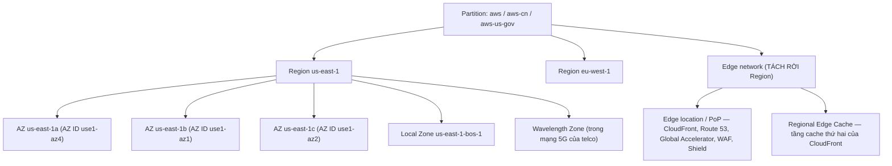
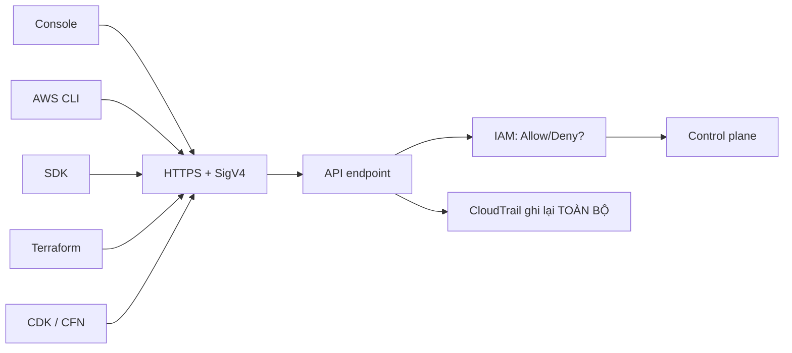

# Nền tảng — địa lý, ranh giới, trách nhiệm, tiền

> **Tra nhanh:** file này trả lời "cái khung mà mọi dịch vụ AWS nằm trong đó là gì" —
> AWS đặt máy ở đâu, thứ gì đi qua được ranh giới nào, ai chịu trách nhiệm phần nào,
> và tiền chảy theo chiều nào.

`Domain 1 · Secure (30%) — Domain 2 · Resilient (26%) — Domain 3 · High-Performing (24%) — Domain 4 · Cost (20%)`

Đây là file duy nhất trong sổ tay không thuộc riêng một miền nào. Bốn miền đều
đứng trên nó. Nếu bạn chỉ đọc một file trước khi bước vào phòng thi, đọc file này
rồi đọc [`21-tu-khoa-de-thi.md`](21-tu-khoa-de-thi.md).

---

## Bản đồ

| Mục | Khi nào bạn cần đọc mục này |
|---|---|
| [1. Địa lý AWS](#1-địa-lý-aws--cái-nào-ra-thi-cái-nào-không) | Đề nhắc "another Availability Zone", "second Region", "closest to users", "5G", "single-digit millisecond to on-prem" |
| [2. Bốn ranh giới](#2-bốn-ranh-giới-phải-thuộc-lòng) | Đề hỏi "resource X ở account/Region/AZ/VPC này dùng được ở kia không" |
| [3. Shared Responsibility](#3-shared-responsibility-model--đường-kẻ-dịch-chỗ-theo-dịch-vụ) | Đề hỏi "who is responsible for…", hoặc bạn phải chọn giữa tự làm và để AWS làm |
| [4. Well-Architected để loại đáp án](#4-well-architected--dùng-để-loại-đáp-án-không-phải-để-học-thuộc) | Bạn còn hai đáp án đều chạy được và phải chọn một |
| [5. AWS là một tập API](#5-aws-là-một-tập-api-mọi-thứ-khác-là-client) | Đề nhắc Console vs CLI vs CloudFormation, CloudTrail, control plane vs data plane |
| [6. Mô hình giá](#6-mô-hình-giá--bạn-đang-trả-cho-cái-gì) | Bất kỳ câu nào có chữ "cost", và mọi câu về data transfer |
| [Bảng số phải nhớ](#bảng-số-phải-nhớ) | 30 phút trước giờ thi |
| [Bẫy đề thi](#bẫy-đề-thi) | Sau khi làm sai một đề mock |

---

## 1. Địa lý AWS — cái nào ra thi, cái nào không



- Partition: IAM ARN bắt đầu bằng đây; không cross partition
- AZ: cô lập điện/làm mát/mạng, nối nhau bằng cáp riêng, RTT thường 1–2 ms
- Local Zone: phần mở rộng của Region
- Region eu-west-1: cô lập hoàn toàn với us-east-1

### Region — đơn vị cô lập lỗi lớn nhất

Region là ranh giới mà đề thi coi là "một thảm họa không vượt qua được". Bốn lý do
Region tồn tại, theo đúng thứ tự tần suất ra thi:

1. **Chủ quyền dữ liệu.** Từ khóa `GDPR`, `data residency`, `must remain in country X`
   → câu trả lời luôn là "chọn Region ở đó", không bao giờ là "mã hóa rồi để đâu cũng được".
2. **Cô lập lỗi.** Region sập không kéo Region khác sập. Đây là lý do tồn tại của
   [DR multi-Region](13-khoi-phuc-tham-hoa.md#3-bốn-chiến-lược-dr).
3. **Độ trễ tới người dùng.** Nhưng cẩn thận: nếu đề nói "người dùng toàn cầu, giảm
   latency cho **nội dung tĩnh**", đáp án là CloudFront chứ không phải Region thứ hai.
4. **Giá và service availability.** `us-east-1` rẻ nhất và có dịch vụ mới sớm nhất.
   `ap-southeast-1` đắt hơn khoảng 10–25%.

**Dịch vụ global (không thuộc Region nào):** IAM, Route 53, CloudFront, WAF (khi
gắn CloudFront), Shield, Organizations, Billing. Ba thứ trong đó có control plane
neo ở `us-east-1`: IAM, Route 53, CloudFront. Đề thi hỏi kiểu "tạo IAM user ở Region
nào" — bẫy, IAM không có Region.

### Availability Zone — ranh giới lỗi THẬT SỰ

Một AZ là một hoặc nhiều data center có **nguồn điện, hệ thống làm mát và mạng
độc lập**. Đây là câu định nghĩa cần thuộc: cái làm nên AZ không phải khoảng cách
địa lý mà là **sự độc lập của hạ tầng phụ trợ**. Hai data center cách nhau 500 m
nhưng chung một trạm biến áp thì không phải hai AZ.

Ba con số về AZ:

- **RTT giữa hai AZ trong cùng Region: 1–2 ms** (AWS thiết kế dưới 2 ms, thực tế
  thường dưới 1 ms). Đủ thấp để chạy **replication đồng bộ** — đây chính là cơ chế
  của RDS Multi-AZ và Aurora. Đủ thấp để bạn không phải nghĩ về nó khi thiết kế
  ứng dụng web bình thường.
- **RTT giữa hai Region: 10–200 ms** tùy cặp. Cao đến mức replication đồng bộ
  cross-Region là bất khả thi về hiệu năng → mọi thứ cross-Region đều **bất đồng bộ**
  → RPO cross-Region không bao giờ bằng 0. Nhớ chuỗi suy luận này, nó giải được
  rất nhiều câu DR.
- **Số AZ tối thiểu mỗi Region: 3.** Một số Region cũ hơn có 2 (`ca-west-1`,
  `eu-central-2` từng có ít hơn — kiểm tra lại trang Global Infrastructure).

**AZ name không phải AZ ID.** `us-east-1a` trong account của bạn và `us-east-1a`
trong account của đồng nghiệp là **hai AZ vật lý khác nhau**. AWS xáo trộn ánh xạ
name → ID theo từng account để trải đều tải. Cái cố định là **AZ ID** (`use1-az1`).

```bash
aws ec2 describe-availability-zones --profile learn \
  --query 'AvailabilityZones[].{Name:ZoneName,Id:ZoneId}' --output table
```

Điều này ra thi trong đúng một tình huống: **kiến trúc multi-account cần đặt tài
nguyên cùng chỗ vật lý** (ví dụ hai account nối bằng VPC peering, muốn tránh phí
cross-AZ). Lúc đó phải khớp theo AZ ID, không phải theo tên.

### Local Zone, Wavelength, Outposts — chỉ cần nhận diện từ khóa

Ba thứ này ra thi ở mức "một câu, nhận ra từ khóa rồi chọn". Không cần biết chi tiết.

| Thứ | Là gì | Từ khóa trong đề | Nhầm với |
|---|---|---|---|
| **Local Zone** | Phần mở rộng của Region đặt ở thành phố lớn, chạy được EC2/EBS/ALB | "single-digit millisecond latency to end users in <thành phố>", "media rendering", "real-time gaming" | Edge location (không chạy EC2 của bạn) |
| **Wavelength Zone** | Hạ tầng AWS đặt **bên trong** mạng 5G của nhà mạng | "5G", "mobile edge", "ultra-low latency for mobile devices" | Local Zone (không dính 5G) |
| **Outposts** | Rack AWS đặt trong data center **của bạn** | "must stay on-premises", "data residency in our own facility", "low latency to on-prem systems" | Local Zone (Local Zone là cơ sở của AWS) |

### Edge location — thứ hay bị hiểu sai nhất

Edge location **không** chạy EC2, không chạy RDS, không phải là "Region nhỏ". Nó là
điểm hiện diện của mạng CDN/DNS. Chỉ những dịch vụ sau sống ở đó: CloudFront,
Route 53, AWS Global Accelerator, AWS WAF (gắn CloudFront), AWS Shield,
Lambda@Edge / CloudFront Functions, S3 Transfer Acceleration.

Hệ quả ra thi: đề nói "giảm latency cho người dùng ở châu Âu truy cập **API động**".
Nếu bạn nghĩ "edge = cache = CloudFront chỉ cho ảnh" thì bạn loại nhầm. CloudFront
vẫn giúp API động vì nó rút ngắn đoạn TCP/TLS handshake và đi trên backbone của AWS.
Nhưng nếu đề nhấn "non-HTTP protocol" hoặc "static IP address" thì là
**Global Accelerator**, xem [12-hieu-nang.md](12-hieu-nang.md#10-global-accelerator-vs-cloudfront).

### Ranh giới lỗi thật sự nằm ở đâu

Đây là mục quan trọng nhất của phần địa lý, và là chỗ đề thi phân biệt thí sinh.

```
   Cái gì hỏng            Multi-AZ cứu được?   Multi-Region cứu được?
   ─────────────────────────────────────────────────────────────────
   Một EC2 instance            có                  có
   Một rack / một AZ           CÓ                  có
   Một Region                  KHÔNG               CÓ
   Lỗi cấu hình của bạn        KHÔNG               KHÔNG
   Xóa nhầm dữ liệu            KHÔNG               KHÔNG  ← chỉ backup cứu được
   Ransomware / account bị chiếm  KHÔNG            KHÔNG  ← cần cross-account + immutable backup
   Lỗi trong chính code bạn deploy  KHÔNG          KHÔNG  ← cần canary/blue-green
```

Ba dòng cuối là lý do vì sao **replication không phải backup**. S3 Cross-Region
Replication sao chép cả thao tác xóa nếu bạn cấu hình thế; DynamoDB Global Tables
sao chép cả bản ghi hỏng. Đề thi gài chỗ này thường xuyên: "protect against
accidental deletion" → đáp án là **versioning + MFA Delete + backup**, không phải
replication.

---

## 2. Bốn ranh giới phải thuộc lòng

Đề SAA rất hay hỏi biến thể của một câu duy nhất: *"thứ X ở bên này có dùng được
ở bên kia không?"* Bốn ranh giới, thuộc bảng này là trả lời được phần lớn.

### Ranh giới Account

Account là **ranh giới thanh toán và ranh giới bảo mật mạnh nhất** của AWS. Mặc định,
account A không thấy gì trong account B.

| Cross account được bằng cách nào | Không cross được |
|---|---|
| IAM role + `sts:AssumeRole` (cơ chế chuẩn cho mọi thứ) | IAM user, IAM group |
| Resource-based policy: S3 bucket policy, SQS/SNS policy, KMS key policy, Lambda resource policy | Security Group **tham chiếu SG khác** — chỉ được trong cùng VPC hoặc VPC đã peering |
| Chia sẻ tài nguyên bằng **AWS RAM**: subnet, Transit Gateway, License, Route 53 Resolver rule | Default VPC, default anything |
| Chia sẻ AMI, EBS snapshot, RDS snapshot (kèm quyền dùng KMS key) | Reserved Instance — chỉ chia sẻ trong cùng một Organization đã bật RI sharing |
| VPC peering, Transit Gateway | Instance profile |

Bẫy kinh điển: **snapshot mã hóa bằng AWS managed key (`aws/ebs`) không chia sẻ
được cross-account.** Phải mã hóa bằng customer managed key rồi chia sẻ cả key.
Đây là một trong những câu ra thi nhiều nhất về KMS.

### Ranh giới Region

| Cross Region được | Không cross Region được |
|---|---|
| S3 Cross-Region Replication, S3 Multi-Region Access Point | Security Group, NACL, subnet |
| EBS/RDS snapshot copy, AMI copy | EBS volume (gắn được vào instance cùng AZ thôi) |
| DynamoDB Global Tables | Elastic IP |
| Aurora Global Database, RDS cross-Region read replica | VPC endpoint gateway |
| VPC peering (inter-Region peering có, nhưng không hỗ trợ một số tính năng) | Placement group |
| Route 53 (global), CloudFront (global) | KMS key — key là **per-Region**, phải tạo multi-Region key nếu muốn |

Bẫy: **KMS key gắn Region.** Copy một EBS snapshot mã hóa sang Region khác thì
snapshot đích phải được mã hóa lại bằng key của Region đích. Đề hay hỏi "vì sao
cross-Region copy thất bại" → thiếu quyền trên key đích.

### Ranh giới AZ

| Gắn với AZ (không rời đi được) | Trải rộng nhiều AZ |
|---|---|
| Subnet — **một subnet nằm trong đúng một AZ** | VPC |
| EBS volume — chỉ attach được vào instance cùng AZ | S3 (trong Region) |
| EC2 instance | ELB (mỗi AZ một node, phải bật subnet ở AZ đó) |
| RDS instance (một node) | Auto Scaling Group |
| ElastiCache node | DynamoDB (tự động 3 AZ) |
| EFS mount target (một cái mỗi AZ, nhưng file system thì regional) | EFS file system, Aurora storage (6 bản trên 3 AZ) |
| Instance store | Route table, NACL, Security Group (định nghĩa ở VPC) |

Câu hỏi kiểm tra hiểu đúng: *"EBS volume ở `us-east-1a`, instance ở `us-east-1b` —
làm sao dùng được?"* → Snapshot rồi tạo volume mới ở `1b`. Không có cách nào
"move" trực tiếp. Đề thi hỏi dạng này để loại người học vẹt.

### Ranh giới VPC

VPC là ranh giới mạng. Mặc định hai VPC không nói chuyện được, kể cả trong cùng
account cùng Region.

| Nối VPC bằng gì | Đặc điểm phải nhớ |
|---|---|
| **VPC peering** | Không transitive. A↔B và B↔C **không** cho A↔C. CIDR không được chồng lấn. |
| **Transit Gateway** | Là hub, transitive được. Giải bài toán "n VPC nối nhau" mà peering cần n(n-1)/2 kết nối. |
| **PrivateLink / interface endpoint** | Nối **một dịch vụ**, không nối cả mạng. Một chiều: consumer gọi provider. |
| **VPN / Direct Connect** | Nối VPC với on-premises. Xem [13](13-khoi-phuc-tham-hoa.md#9-hybrid--direct-connect-vs-vpn). |

Đề thi kinh điển về non-transitive: công ty có VPC-A (shared services), VPC-B, VPC-C.
B và C đều peer với A. Đề hỏi "B gọi được service ở C không" → **không**, và giải
pháp là Transit Gateway.

---

## 3. Shared Responsibility Model — đường kẻ dịch chỗ theo dịch vụ

Câu một dòng: **AWS lo security OF the cloud, bạn lo security IN the cloud.**
Câu đó vô dụng khi làm bài. Cái có ích là biết đường kẻ nằm ở đâu cho từng dịch vụ.

```
        │ Dữ liệu │ Phân │ IAM │ Cấu hình  │ Mã hóa │ OS   │ Engine/  │ Hạ tầng │
        │         │ loại │     │ mạng (SG) │ at-rest│ patch│ runtime  │ vật lý  │
  ──────┼─────────┼──────┼─────┼───────────┼────────┼──────┼──────────┼─────────┤
  EC2   │  BẠN    │ BẠN  │ BẠN │   BẠN     │  BẠN   │ BẠN  │   BẠN    │   AWS   │
  RDS   │  BẠN    │ BẠN  │ BẠN │   BẠN     │ BẠN bật│ AWS  │   AWS    │   AWS   │
  Lambda│  BẠN    │ BẠN  │ BẠN │  BẠN (VPC)│ BẠN bật│ AWS  │   AWS    │   AWS   │
  S3    │  BẠN    │ BẠN  │ BẠN │ BẠN (policy)│BẠN bật│ AWS │   AWS    │   AWS   │
```

Đọc bảng theo cột, không theo hàng. Ba cột **luôn** thuộc về bạn ở mọi dịch vụ:

1. **Dữ liệu** — nội dung, phân loại, ai được xem.
2. **IAM** — ai được gọi API nào. AWS không bao giờ quyết định hộ bạn.
3. **Cấu hình** — bucket có public không, SG có mở 0.0.0.0/0 không. **Mọi sự cố rò
   rỉ S3 nổi tiếng đều là lỗi ở cột này**, và đó là lý do nó ra thi nhiều.

Đường kẻ dịch chỗ ở đâu:

- **IaaS (EC2, EBS):** bạn patch OS, bạn quản lý agent, bạn lo antivirus, bạn cấu
  hình firewall trong máy. AWS lo hypervisor trở xuống. Từ khóa đề: "patch the
  operating system", "install security agent" → là việc của bạn, và công cụ AWS
  cho việc đó là **Systems Manager Patch Manager**, không phải "AWS tự patch".
- **PaaS (RDS, ElastiCache, EMR):** AWS patch OS và engine trong **maintenance
  window** bạn chọn. Bạn vẫn quản lý user trong database, schema, và quyết định
  bật mã hóa. Bạn **không** SSH được vào host RDS — đề hay đưa đáp án "SSH vào RDS
  để chỉnh `my.cnf`", luôn sai; đúng là **parameter group**.
- **SaaS/serverless (S3, DynamoDB, Lambda, SQS):** AWS lo tới tận runtime. Bạn còn
  đúng ba cột trên cộng với mã nguồn (với Lambda) và thư viện bạn nhúng vào.
  Lỗ hổng trong dependency của bạn là của bạn, không phải của AWS.

Bốn câu hỏi mẫu, trả lời được là xong mục này:

| Câu hỏi | Ai |
|---|---|
| Vá lỗ hổng kernel trên EC2 | Bạn |
| Vá lỗ hổng engine MySQL trên RDS | AWS (trong maintenance window) |
| Vá lỗ hổng trong thư viện npm bạn đóng gói vào Lambda | Bạn |
| Đảm bảo ổ đĩa hỏng trong data center được hủy an toàn | AWS |

**Điểm mấu chốt:** dùng dịch vụ managed hơn = ít trách nhiệm hơn = ít việc vận hành
hơn. Đây là cầu nối trực tiếp sang từ khóa `LEAST operational overhead` của đề thi.
Xem cách khai thác ở [mục 4](#4-well-architected--dùng-để-loại-đáp-án-không-phải-để-học-thuộc).

---

## 4. Well-Architected — dùng để loại đáp án, không phải để học thuộc

Bạn sẽ không bị hỏi "kể tên sáu trụ cột". Bạn sẽ bị hỏi một tình huống có bốn
đáp án đều chạy được, và phải chọn cái "BEST". Sáu trụ cột chính là bộ tiêu chí
mà người ra đề dùng để định nghĩa "best".

Cách dùng thực tế: **đọc câu hỏi, tìm tính từ so sánh, tính từ đó chỉ ra trụ cột,
trụ cột chỉ ra tiêu chí loại đáp án.**

| Tính từ trong đề | Trụ cột | Loại ngay đáp án nào |
|---|---|---|
| `MOST secure`, `meets compliance` | Security | Bất kỳ đáp án nào có access key trong code, bucket public, `0.0.0.0/0` trên port không phải 80/443 |
| `MOST resilient`, `highly available`, `withstand AZ failure` | Reliability | Bất kỳ đáp án nào single-AZ, single instance, hoặc dựa vào thao tác thủ công khi có sự cố |
| `MOST performant`, `lowest latency`, `reduce response time` | Performance Efficiency | Đáp án tăng size máy khi vấn đề là số lượng request; đáp án bỏ qua cache |
| `MOST cost-effective`, `minimize cost` | Cost Optimization | Đáp án dùng tài nguyên chạy 24/7 cho tải chỉ có 2 giờ/ngày; đáp án dùng NAT Gateway khi Gateway Endpoint làm được |
| `LEAST operational overhead`, `minimal management`, `fully managed` | Operational Excellence | Bất kỳ đáp án nào có "install", "configure a cluster", "write a cron job", "maintain a fleet of" |
| `reduce environmental impact` | Sustainability | Hiếm khi ra. Nếu ra thì đáp án là Graviton / serverless / right-sizing |

Ba luật rút ra từ bảng trên, áp dụng được cho khoảng một phần ba đề thi:

1. **`LEAST operational overhead` gần như luôn nghĩa là "chọn dịch vụ managed hơn".**
   Thứ tự managed tăng dần: EC2 tự quản → EC2 + ASG → ECS on EC2 → ECS on Fargate →
   Lambda. Nếu hai đáp án cùng đúng về kỹ thuật, chọn cái ở bên phải hơn.
2. **`MOST cost-effective` không có nghĩa là "rẻ nhất bất chấp".** Đáp án phải vẫn
   thỏa mọi ràng buộc cứng trong đề. Đề nói "must be highly available" rồi hỏi
   "most cost-effective" → đáp án single-AZ bị loại dù rẻ hơn.
3. **Đáp án phức tạp hơn mà không giải quyết thêm ràng buộc nào thì luôn sai.**
   Người ra đề cố tình đặt một đáp án "kiến trúc hoành tráng" để bẫy người thích
   thể hiện. Nếu đề chỉ cần chép file lên S3 mỗi đêm, đáp án không phải là
   Step Functions + Lambda + EventBridge + DynamoDB.

Trụ cột Reliability và Performance Efficiency đôi khi mâu thuẫn với Cost. Khi mâu
thuẫn, **ràng buộc cứng trong đề thắng**. Từ khóa ràng buộc cứng: `must`,
`required`, `regulation requires`, `SLA of`, `no more than`, `within X minutes`.

---

## 5. AWS là một tập API, mọi thứ khác là client



Đây không phải chuyện triết học, nó có ba hệ quả ra thi:

**Hệ quả 1 — IAM là hàng rào duy nhất, và nó không quan tâm bạn dùng công cụ gì.**
Không có "quyền chỉ dùng được ở Console". Nếu policy cho phép `ec2:TerminateInstances`
thì cả Console, CLI, Terraform và một script Python đều làm được. Đề đưa đáp án
kiểu "hạn chế bằng cách không cho họ dùng CLI" → luôn sai.

**Hệ quả 2 — CloudTrail thấy mọi thứ, vì mọi thứ là API call.** Câu hỏi "ai đã xóa
security group này" luôn có đáp án CloudTrail. Phân biệt cho rõ ba dịch vụ:

| Câu hỏi | Dịch vụ |
|---|---|
| *Ai đã làm gì, lúc nào?* | **CloudTrail** (nhật ký API) |
| *Hệ thống đang chạy thế nào?* | **CloudWatch** (metric, log, alarm) |
| *Cấu hình hiện tại có tuân thủ không, và nó đã thay đổi ra sao?* | **AWS Config** (trạng thái + lịch sử cấu hình + rule) |

**Hệ quả 3 — control plane và data plane hỏng độc lập nhau.**

| Lớp | Là gì | Hỏng thì sao |
|---|---|---|
| Control plane | API tạo/sửa/xóa tài nguyên | Không launch được instance mới; instance đang chạy **vẫn chạy** |
| Data plane | Đường đi của traffic thật | Instance không phục vụ được request |

Kiến trúc DR tốt là kiến trúc mà **data plane không phụ thuộc control plane lúc
xảy ra sự cố**. Đây chính là lý do đề thi ưu tiên "pre-provision tài nguyên ở
Region phụ" hơn là "dùng Lambda tạo tài nguyên khi thảm họa xảy ra" — lúc thảm
họa thì control plane của Region đó có thể cũng đang quá tải.

**Eventual consistency.** Nhiều API của AWS là eventually consistent: tạo IAM role
xong gán ngay vào EC2 có thể lỗi; tạo S3 bucket xong `ListBuckets` chưa thấy. Đề
thi hiếm khi hỏi trực tiếp, nhưng nó giải thích vì sao Terraform đôi khi cần
`depends_on` và vì sao script của bạn cần retry với exponential backoff. Ngoại lệ
đáng nhớ: **S3 đã strong read-after-write consistency từ tháng 12/2020** — mọi tài
liệu cũ nói "S3 eventually consistent cho overwrite" đều đã lỗi thời.

---

## 6. Mô hình giá — bạn đang trả cho cái gì

Ba nguyên tắc gốc, mọi thứ khác suy ra từ đây:

1. **Trả theo thời gian tài nguyên tồn tại** — EC2, RDS, NAT Gateway, ALB, EIP
   chưa gắn. Tính theo giờ hoặc giây. Tài nguyên bị quên = tiền bị đốt.
2. **Trả theo dung lượng lưu trữ** — S3, EBS, EFS, snapshot. Tính theo GB-tháng.
   **EBS tính theo dung lượng bạn cấp phát, không phải dung lượng bạn dùng.**
   Volume 500 GB dùng 10 GB vẫn trả tiền 500 GB. S3 thì ngược lại, trả đúng phần dùng.
3. **Trả theo số lần gọi** — Lambda request, S3 request, API Gateway request,
   DynamoDB read/write unit, KMS request.

Cộng thêm một chiều thứ tư mà người mới luôn quên: **data transfer**.

### Data transfer — luật một dòng

> **Đi vào (ingress) miễn phí. Đi ra internet (egress) tốn tiền. Đi ngang qua ranh
> giới AZ hoặc Region cũng tốn tiền.**

| Chiều đi | Có tốn tiền không | Ghi chú |
|---|---|---|
| Internet → AWS | **Miễn phí** | Mọi Region, mọi dịch vụ |
| AWS → internet | **Tốn**, khoảng $0,09/GB ở `us-east-1` sau 100 GB đầu miễn phí mỗi tháng | Đây là dòng lớn nhất trên hóa đơn của phần lớn công ty |
| Trong cùng AZ, dùng private IP | Miễn phí | Điều kiện: **private IP**. Dùng public IP thì bị tính. |
| Giữa hai AZ trong cùng Region | **Tốn $0,01/GB, tính CẢ HAI ĐẦU** | Nghĩa là 1 GB đi qua AZ tốn $0,02 tổng |
| Giữa hai Region | **Tốn**, khoảng $0,02/GB | Rẻ hơn ra internet nhưng không miễn phí |
| S3 → CloudFront → internet | Đoạn S3→CloudFront **miễn phí**; đoạn CloudFront→internet tính theo giá CloudFront | Đây là lý do CloudFront vừa nhanh hơn vừa **rẻ hơn** khi phục vụ nội dung tĩnh |
| EC2 → S3 trong cùng Region qua Gateway Endpoint | **Miễn phí** | Cứu tinh của Domain 4 |
| EC2 → S3 trong cùng Region qua NAT Gateway | Tốn phí xử lý NAT $0,045/GB | Cùng một đường đi, khác giá gấp vô hạn lần |

Chi tiết và các bài toán tính tiền nằm ở
[10-chi-phi.md](10-chi-phi.md#6-data-transfer--nguồn-hóa-đơn-bất-ngờ-số-1).

### Free Tier đã đổi từ 15/07/2025

Account mở sau mốc đó **không còn** "750 giờ EC2 miễn phí 12 tháng". Thay vào đó là
credit ($100 + $100 từ nhiệm vụ onboarding) và hơn 30 dịch vụ "always free".
Chi tiết ở [`aws-saa-plan.md`](../../learn-aws/aws-saa-plan.md). Đề thi không hỏi
Free Tier, nhưng ví của bạn thì có.

---

## Bảng số phải nhớ

| Con số | Giá trị | Vì sao ra thi |
|---|---|---|
| RTT giữa hai AZ | 1–2 ms | Đủ cho replication đồng bộ → RDS Multi-AZ, Aurora |
| RTT giữa hai Region | 10–200 ms | Quá cao cho đồng bộ → mọi thứ cross-Region là async → RPO > 0 |
| Số AZ tối thiểu mỗi Region | 3 | "Deploy across at least 2 AZs" là mức tối thiểu của HA |
| Data transfer vào | $0/GB | Luật một dòng |
| Data transfer ra internet | ~$0,09/GB (100 GB đầu/tháng miễn phí) | Dòng lớn nhất hóa đơn |
| Data transfer cross-AZ | $0,01/GB **mỗi chiều** | Tổng $0,02/GB cho một lượt đi-về |
| Data transfer cross-Region | ~$0,02/GB | Giá của DR multi-Region |
| Gateway Endpoint (S3, DynamoDB) | **$0** | Đáp án của bài toán tiết kiệm kinh điển |
| Interface Endpoint (PrivateLink) | ~$0,01/giờ/AZ + ~$0,01/GB | Nhiều AZ = nhân lên |
| NAT Gateway | ~$0,045/giờ + ~$0,045/GB | "Kẻ giết credit số 1" |
| S3 durability | 99,999999999% (11 số 9) | Đề dùng con số này để loại đáp án "cần backup S3 sang EBS" |
| S3 Standard availability SLA | 99,9% | Phân biệt với durability |

Giá tham chiếu `us-east-1`, tính đến **2026-08**. Kiểm tra lại trang pricing trước
khi tin con số cuối cùng — nhưng **thứ hạng** giữa chúng thì không đổi, và đề thi
hỏi thứ hạng chứ không hỏi con số.

---

## Bẫy đề thi

**Bẫy 1 — "us-east-1a của tôi và của bạn là cùng một chỗ"**

> *Hai account cùng Organization, cần EC2 ở account A và EFS ở account B nằm cùng
> một AZ vật lý để tránh phí cross-AZ. Làm sao?*

- Đáp án sai hấp dẫn: "Đặt cả hai ở `us-east-1a`."
- Đáp án đúng: Đối chiếu **AZ ID** (`use1-az1`) qua `describe-availability-zones`,
  rồi chọn subnet ở AZ có cùng ID.
- Vì sao: AWS ánh xạ AZ name → AZ ID khác nhau theo từng account để trải đều tải.
  Tên giống nhau không đảm bảo cùng vị trí vật lý.

**Bẫy 2 — Edge location được coi như Region nhỏ**

> *Cần chạy một xử lý ảnh nặng gần người dùng ở Boston với latency dưới 10 ms.*

- Đáp án sai hấp dẫn: "Chạy Lambda@Edge ở edge location gần Boston."
- Đáp án đúng: **Local Zone** `us-east-1-bos-1` với EC2/EBS ở đó.
- Vì sao: Lambda@Edge có giới hạn nghiêm ngặt (thời gian chạy, kích thước, không có
  VPC access ở viewer trigger) và edge location không chạy được khối lượng tính toán
  nặng. Local Zone thì chạy EC2 thật.

**Bẫy 3 — "AWS backup dữ liệu của tôi"**

> *Ai chịu trách nhiệm nếu developer chạy `DELETE FROM orders` không có `WHERE` trên RDS?*

- Đáp án sai hấp dẫn: "AWS, vì RDS là managed service và có automated backup."
- Đáp án đúng: **Bạn.** AWS cung cấp *cơ chế* (automated backup, PITR), nhưng bật
  nó, đặt retention đủ dài, và thực hiện restore là việc của bạn.
- Vì sao: Shared Responsibility — dữ liệu luôn thuộc cột của bạn. AWS bảo đảm
  hạ tầng chạy đúng, không bảo đảm bạn dùng đúng.

**Bẫy 4 — replication bị nhầm là backup**

> *Cần bảo vệ dữ liệu S3 khỏi việc bị xóa nhầm.*

- Đáp án sai hấp dẫn: "Bật Cross-Region Replication sang Region khác."
- Đáp án đúng: **Versioning** (+ MFA Delete, + S3 Object Lock nếu đề nhắc
  `WORM`/`compliance`/`immutable`).
- Vì sao: CRR sao chép trạng thái, không sao chép lịch sử. Xóa ở nguồn có thể lan
  sang đích. Versioning giữ lại bản cũ ngay tại chỗ.

**Bẫy 5 — chọn Region theo latency khi đề đang hỏi compliance**

> *Công ty châu Âu, dữ liệu khách hàng phải ở lại EU. Người dùng chủ yếu ở Mỹ.*

- Đáp án sai hấp dẫn: "Deploy ở `us-east-1` để gần người dùng."
- Đáp án đúng: Dữ liệu ở Region EU; dùng **CloudFront** để phục vụ người dùng Mỹ nhanh.
- Vì sao: Ràng buộc pháp lý là ràng buộc cứng, latency là ràng buộc mềm. Luôn thỏa
  ràng buộc cứng trước, rồi mới tối ưu cái còn lại.

**Bẫy 6 — data transfer vào cũng tính tiền**

> *Upload 50 TB lên S3 mỗi tháng từ data center. Chi phí data transfer là bao nhiêu?*

- Đáp án sai hấp dẫn: "50 TB × $0,09/GB."
- Đáp án đúng: **$0 cho phần transfer vào AWS.** Bạn chỉ trả tiền lưu trữ và request.
- Vì sao: AWS miễn phí ingress — đó là chiến lược thương mại (dễ vào, khó ra).
  Nhớ luật một dòng: vào miễn phí, ra tốn tiền.

---

## Cây quyết định

**Chọn Region:**
1. Có ràng buộc pháp lý về nơi lưu dữ liệu không? → Có: Region bị ràng buộc thắng, dừng.
2. Dịch vụ bạn cần có ở Region đó không? (dịch vụ mới thường ra `us-east-1` trước) → Không: đổi Region.
3. Người dùng ở đâu? → Chọn Region gần nhất **cho phần ghi dữ liệu**; phần đọc dùng CloudFront.
4. Còn nhiều lựa chọn? → Chọn cái rẻ hơn. `us-east-1` thường rẻ nhất.

**Bao nhiêu AZ:**
- Dev/test không quan trọng → 1 AZ, chấp nhận rủi ro, tiết kiệm phí cross-AZ.
- Production bình thường → **2 AZ tối thiểu**. Đây là ngưỡng mặc định của đề thi.
- Cần chịu được mất 1 AZ mà **không giảm capacity** → 3 AZ, mỗi AZ chạy 50% tải
  (mất 1 AZ còn 2 AZ × 50% = 100%). Với 2 AZ thì mỗi AZ phải chạy 100% tải — đắt gấp đôi.
- Hệ thống có quorum (etcd, ZooKeeper, Aurora storage) → **3 AZ**, không có lựa chọn khác.

**Có cần Region thứ hai không:**
1. Đề có nhắc "Region-wide outage", "regional failure", "RTO/RPO" không? → Không: dừng, một Region là đủ.
2. Có ràng buộc pháp lý cần dữ liệu ở nhiều nơi không? → Có: multi-Region.
3. Người dùng có phân bố toàn cầu và cần **ghi** với latency thấp không? → Có: multi-Region active-active.
4. Chỉ cần đọc nhanh trên toàn cầu? → **CloudFront hoặc read replica cross-Region**, không cần full multi-Region.

Toàn bộ cây quyết định chi tiết hơn nằm ở [`20-cay-quyet-dinh.md`](20-cay-quyet-dinh.md).

---

## Nối với thực hành

| Lab | Chạm vào mục nào của file này | Quan sát gì |
|---|---|---|
| [`labs/w01-iam-foundations/`](../../learn-aws/labs/w01-iam-foundations/) | Mục 2 (ranh giới Account), mục 5 (AWS là tập API) | Cùng một quyền dùng được từ CLI và Console; CloudTrail ghi cả hai giống nhau |
| [`labs/w02-vpc-networking/`](../../learn-aws/labs/w02-vpc-networking/) | Mục 1 (AZ), mục 2 (ranh giới AZ và VPC) | Subnet buộc phải chọn đúng một AZ; route table quyết định gói đi đâu |
| [`labs/w03-ec2-alb-asg/`](../../learn-aws/labs/w03-ec2-alb-asg/) | Mục 1 (ranh giới lỗi thật), mục 4 (Reliability) | `chaos.yml` giết instance — ASG thay thế, ALB ngừng gửi traffic |
| [`labs/w04-s3-cloudfront/`](../../learn-aws/labs/w04-s3-cloudfront/) | Mục 1 (edge location), mục 6 (data transfer) | Header `X-Cache: Hit from cloudfront` — request không chạm origin, không tốn egress của S3 |
| [`labs/w11-dr-hybrid/`](../../learn-aws/labs/w11-dr-hybrid/) | Mục 1 (ranh giới Region), mục 2 (cross-Region) | Snapshot copy cross-Region cần key ở Region đích |
| [`labs/w12-exam-review/`](../../learn-aws/labs/w12-exam-review/) | Toàn bộ | Ghép mọi ranh giới trong một kiến trúc |
| [`labs-self/`](../../learn-aws/labs-self/) — lab `w02` (tự thiết kế VPC) | Mục 2 (bốn ranh giới) | Bạn tự chọn số AZ và tự chịu hậu quả về giá |
| [`labs-self/`](../../learn-aws/labs-self/) — lab `w01` (permission boundary) | Mục 3 (Shared Responsibility), mục 5 (IAM là hàng rào duy nhất) | `AccessDenied` từ boundary trông khác `AccessDenied` từ policy thiếu quyền |

Đọc trước bài tuần tương ứng: [`docs/aws/00-nen-tang-aws.md`](../aws/00-nen-tang-aws.md).

---

## Nguồn nói khác

| Chỗ | Nguồn `aws-saa-c03/` nói | Thực tế (2026-08) |
|---|---|---|
| Các file F, G, H, I, J, N, O | `README.md` và `A-nen-tang-kien-truc.md` link tới `G-toi-uu-chi-phi.md`, `H-high-availability.md` | **Không file nào tồn tại.** Nội dung đó nằm ở chính năm file này: [10](10-chi-phi.md), [11](11-san-sang-cao.md), [12](12-hieu-nang.md), [13](13-khoi-phuc-tham-hoa.md) và file này |
| Số Region / AZ | `A-nen-tang-kien-truc.md`: "33+ regions, 105+ AZs" | Con số này tăng liên tục và **không ra thi**. Đừng học thuộc. Cái ra thi là "mỗi Region tối thiểu 3 AZ" và "AZ độc lập về điện/mát/mạng". [Global Infrastructure](https://aws.amazon.com/about-aws/global-infrastructure/) |
| S3 là SaaS | `A-nen-tang-kien-truc.md` xếp S3 vào SaaS | Cách phân loại này gây hiểu lầm. AWS gọi mô hình này là "abstracted services" trong [Shared Responsibility Model](https://aws.amazon.com/compliance/shared-responsibility-model/). Điều quan trọng là **đường kẻ nằm ở đâu**, không phải nhãn IaaS/PaaS/SaaS |
| Edge location | Nguồn ghi "600+ locations" | Con số hiện tại lớn hơn và vẫn tăng. Không ra thi. Cái ra thi: edge location **không chạy EC2 của bạn** |
| S3 consistency | Nhiều tài liệu cũ (kể cả khóa học) nói S3 eventually consistent | S3 đã **strong read-after-write consistency** cho mọi thao tác từ 12/2020. [S3 consistency model](https://docs.aws.amazon.com/AmazonS3/latest/userguide/Welcome.html#ConsistencyModel) |
| Trọng số miền | `00-tong-quan-overview.md`: 30/26/24/20 | **Đúng.** Giữ nguyên. Sổ tay này dùng đúng bộ số đó ở mọi file |

---

## Ngoài phạm vi

- **AWS Outposts chi tiết** (rack size, networking model) — chỉ cần nhận diện từ khóa. [Outposts](https://docs.aws.amazon.com/outposts/latest/userguide/what-is-outposts.html)
- **Wavelength và mạng 5G** — một câu nhận diện, không hơn. [Wavelength](https://docs.aws.amazon.com/wavelength/latest/developerguide/what-is-wavelength.html)
- **AWS Partition** (`aws-cn`, `aws-us-gov`) — chỉ ảnh hưởng khi bạn làm cho chính phủ Mỹ hoặc Trung Quốc. Không ra SAA.
- **Well-Architected Tool và Lens** — công cụ đánh giá, không phải kiến thức thi. [WA Tool](https://docs.aws.amazon.com/wellarchitected/latest/userguide/intro.html)
- **AWS Local Zone list đầy đủ** — thay đổi liên tục, không ai hỏi.
- **Sustainability pillar chi tiết** — biết nó tồn tại và biết Graviton/serverless là câu trả lời mẫu là đủ.

---

## Tự kiểm tra

**1.** Vì sao replication đồng bộ chạy được giữa hai AZ nhưng không chạy được giữa
hai Region? Nêu con số làm căn cứ, và nêu hệ quả với RPO.

<details><summary>Đáp án</summary>

RTT giữa hai AZ là 1–2 ms. Mỗi lần commit đồng bộ phải chờ AZ kia xác nhận, cộng
thêm 1–2 ms vào độ trễ ghi — chấp nhận được. RTT giữa hai Region là 10–200 ms;
cộng chừng đó vào mỗi transaction thì throughput ghi sụp đổ.

Hệ quả: mọi cơ chế cross-Region (S3 CRR, Aurora Global Database, DynamoDB Global
Tables, RDS cross-Region read replica) đều **bất đồng bộ**. Bất đồng bộ nghĩa là
tại thời điểm Region chính chết, một lượng dữ liệu chưa kịp sao chép sẽ mất →
**RPO cross-Region không bao giờ bằng 0**, chỉ tiệm cận (Aurora Global Database
điển hình dưới 1 giây).
</details>

**2.** Một EBS volume mã hóa bằng key `aws/ebs` (AWS managed key). Bạn cần chia sẻ
snapshot của nó sang một account khác. Chuyện gì xảy ra và phải làm gì?

<details><summary>Đáp án</summary>

Không chia sẻ được. Snapshot mã hóa bằng **AWS managed key** không thể chia sẻ
cross-account — bạn không có quyền sửa key policy của key AWS quản lý, nên account
kia không bao giờ có quyền `kms:Decrypt`.

Cách làm: copy snapshot sang một snapshot mới, chỉ định **customer managed key**
(CMK) khi copy. Sau đó (a) sửa key policy của CMK cho phép account đích dùng, và
(b) chia sẻ snapshot với account đích. Account đích copy snapshot đó về, mã hóa
lại bằng key của họ.

Đây là câu ra thi thường xuyên vì nó kiểm tra hai thứ cùng lúc: ranh giới account
và cơ chế KMS.
</details>

**3.** Đề nói: *"A company must reduce operational overhead of its batch processing
system, which currently runs on a fleet of EC2 instances managed by a team of
engineers."* Ba đáp án là: (A) chuyển sang EC2 với Auto Scaling Group, (B) chuyển
sang AWS Batch trên Fargate, (C) chuyển sang EC2 Spot với script tự viết để xử lý
interruption. Chọn cái nào và giải thích tại sao hai cái kia sai **theo từ khóa**.

<details><summary>Đáp án</summary>

**(B).** Từ khóa là `reduce operational overhead` → trụ cột Operational Excellence
→ luật "chọn dịch vụ managed hơn".

- (A) ASG giảm được việc thay thế instance hỏng, nhưng bạn vẫn patch OS, vẫn quản
  lý AMI, vẫn quản lý fleet. Overhead giảm ít.
- (C) **Tăng** overhead, không giảm: bạn tự viết và tự bảo trì logic xử lý
  interruption. Spot là câu trả lời cho `cost`, không phải cho `operational overhead`.
  Đây là bẫy đổi trụ cột.
- (B) Fargate xóa hẳn lớp quản lý instance; AWS Batch xóa hẳn lớp quản lý hàng đợi
  job. Đúng trụ cột.

Bài học chung: nhận diện tính từ so sánh trong đề trước, rồi mới nhìn đáp án. Nếu
bạn nhìn đáp án trước, Spot trông rất hấp dẫn.
</details>

**4.** VPC-A peer với VPC-B, VPC-A peer với VPC-C. Instance ở VPC-B cần gọi một API
chạy ở VPC-C. Nêu hai giải pháp và đánh đổi của từng cái.

<details><summary>Đáp án</summary>

VPC peering **không transitive**, nên B không đi qua A để tới C được.

Giải pháp 1: **peer trực tiếp B↔C.** Đơn giản, rẻ (chỉ trả data transfer). Nhược
điểm: số kết nối tăng theo n(n-1)/2. Với 3 VPC là 3 kết nối, với 10 VPC là 45 —
không quản lý nổi.

Giải pháp 2: **Transit Gateway.** Là hub, transitive được, mỗi VPC chỉ cần một
attachment. Nhược điểm: tốn tiền theo giờ cho mỗi attachment (~$0,05/giờ) cộng phí
xử lý dữ liệu (~$0,02/GB). Với 3 VPC là đắt hơn peering; với 10 VPC là rẻ hơn nhiều
về cả tiền lẫn công sức.

Giải pháp 3 (nếu đề chỉ cần **một dịch vụ**, không cần nối cả mạng): **PrivateLink**
— tạo endpoint service ở VPC-C, interface endpoint ở VPC-B. Ưu điểm lớn: CIDR
được phép chồng lấn, và chỉ lộ đúng một dịch vụ thay vì cả mạng. Đề dùng từ khóa
`expose a single service`, `overlapping CIDR` → chọn cái này.
</details>

**5.** Vì sao đưa nội dung tĩnh qua CloudFront lại vừa nhanh hơn vừa **rẻ hơn** so
với cho người dùng tải thẳng từ S3?

<details><summary>Đáp án</summary>

Nhanh hơn: nội dung được cache tại edge location gần người dùng; TLS handshake kết
thúc ở edge; đoạn từ edge về origin đi trên backbone riêng của AWS thay vì internet
công cộng.

Rẻ hơn vì hai lý do cộng lại:
1. **Data transfer từ S3 (hoặc bất kỳ origin AWS nào) sang CloudFront là miễn phí.**
   Bạn chỉ trả cho đoạn CloudFront → internet.
2. Giá egress của CloudFront thấp hơn giá egress trực tiếp từ Region, và cache hit
   nghĩa là request thứ hai trở đi **không chạm S3** — bạn tiết kiệm luôn cả phí
   GET request của S3.

Đây là một trong số ít trường hợp "nhanh hơn" và "rẻ hơn" đi cùng nhau, và đề thi
rất thích nó vì đáp án thỏa cả Performance lẫn Cost.
</details>

**6.** Đề hỏi: *"Who is responsible for patching the guest operating system of an
Amazon RDS instance?"* Trả lời, rồi giải thích vì sao câu hỏi này lại là bẫy nếu đề
đổi RDS thành EC2 chạy MySQL.

<details><summary>Đáp án</summary>

RDS: **AWS**. AWS patch cả OS lẫn database engine, thực hiện trong maintenance
window mà bạn cấu hình.

Đổi thành EC2 chạy MySQL: **bạn**, hoàn toàn. Bạn patch OS, bạn patch MySQL, bạn
quản lý backup, bạn cấu hình replication.

Bẫy nằm ở chỗ: cùng một khối lượng công việc (chạy một MySQL), nhưng đường kẻ trách
nhiệm dịch chỗ chỉ vì bạn chọn dịch vụ khác. Đề thi dùng chính điều này để hỏi
"most cost-effective **và** least operational overhead" — RDS đắt hơn EC2 tính theo
giờ máy, nhưng khi đề tính cả chi phí vận hành thì RDS thắng. Nếu đề chỉ hỏi giá hạ
tầng thuần thì EC2 có thể thắng. Đọc kỹ đề đang tính chi phí nào.
</details>

**7.** Bạn có một hệ thống chạy trên 3 AZ. Yêu cầu: mất một AZ vẫn phải phục vụ 100%
tải mà không giảm hiệu năng. Mỗi AZ phải chạy bao nhiêu phần trăm capacity? Nếu chỉ
có 2 AZ thì sao? Rút ra bài học gì về chi phí?

<details><summary>Đáp án</summary>

3 AZ: mỗi AZ chạy **50%** capacity. Mất một AZ → còn 2 × 50% = 100%. Tổng capacity
phải cấp phát là 150% của nhu cầu.

2 AZ: mỗi AZ phải chạy **100%** capacity. Mất một AZ → còn 1 × 100% = 100%. Tổng
capacity phải cấp phát là **200%** của nhu cầu.

Bài học: **nhiều AZ hơn thì rẻ hơn cho cùng một mức chịu lỗi**, không phải đắt hơn.
Đây là điều phản trực giác và đề thi có ra. Với N AZ, mỗi AZ cần chạy 1/(N-1) tải,
tổng dư thừa là N/(N-1). Với N=2 là 200%, N=3 là 150%, N=4 là 133%.

Đánh đổi ngược lại: nhiều AZ hơn = nhiều traffic cross-AZ hơn = nhiều phí $0,01/GB
hơn. Với hệ thống chatty giữa các tier, chi phí này có thể vượt cả tiền máy.
</details>

**8.** Giải thích vì sao "kiến trúc DR tốt là kiến trúc mà data plane không phụ
thuộc control plane", kèm một ví dụ cụ thể về đáp án bị loại nhờ nguyên tắc này.

<details><summary>Đáp án</summary>

Lúc một Region gặp sự cố lớn, control plane của Region đó thường là thứ quá tải
đầu tiên — hàng nghìn khách hàng cùng lúc gọi API để launch instance, tạo volume,
scale ASG. Nếu kế hoạch DR của bạn *bắt đầu* bằng việc gọi control plane, bạn đang
xếp hàng cùng tất cả mọi người, đúng lúc tệ nhất.

Ví dụ đáp án bị loại: đề nói RTO 15 phút cho DR sang Region phụ. Một đáp án là
"dùng EventBridge + Lambda để tự động chạy CloudFormation dựng toàn bộ hạ tầng ở
Region phụ khi phát hiện sự cố". Nghe rất tự động và hiện đại, nhưng nó phụ thuộc
hoàn toàn vào control plane tại thời điểm xấu nhất, và CloudFormation dựng một
kiến trúc đầy đủ hiếm khi xong trong 15 phút.

Đáp án đúng: **Warm Standby** — hạ tầng đã chạy sẵn ở Region phụ với quy mô nhỏ,
DR chỉ còn là đổi Route 53 record và scale ASG lên. Việc scale vẫn cần control
plane, nhưng scale một ASG đã tồn tại nhẹ hơn nhiều so với dựng mới từ đầu, và
data plane (máy đang chạy, database đang replicate) đã sẵn sàng.

Chi tiết ở [13-khoi-phuc-tham-hoa.md](13-khoi-phuc-tham-hoa.md#3-bốn-chiến-lược-dr).
</details>
