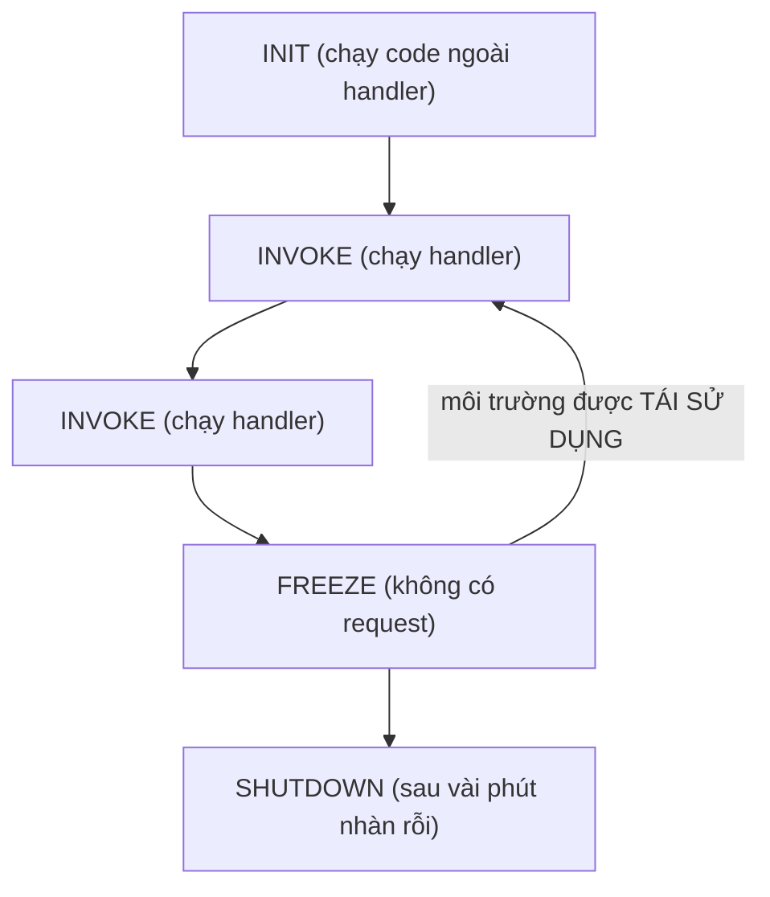

# Compute

> **Tra nhanh:** chọn EC2 / Lambda / container nào, cấu hình ra sao, và con số nào
> chặn bạn lại khi tải tăng.

`Domain 2 · Design Resilient Architectures (26% đề)` · `Domain 3 · Design High-Performing Architectures (24%)` · `Domain 4 · Design Cost-Optimized Architectures (20%)`

Tuần 3 ([`../aws/w03-ec2-alb-asg.md`](../aws/w03-ec2-alb-asg.md)) và tuần 6
([`../aws/w06-serverless-api.md`](../aws/w06-serverless-api.md)) dạy đủ để làm lab;
file này đi sâu hơn: cơ chế, con số chặn, và chỗ tài liệu ôn thi dạy sai.

## Bản đồ

| Mục | Đọc khi bạn cần |
|---|---|
| [Đọc tên instance](#1-đọc-tên-instance-và-thứ-bảng-family-không-nói) | Đề cho `r6gd.4xlarge`, phải suy ra đây là máy gì |
| [Mô hình mua](#2-mô-hình-mua--cơ-chế-chứ-không-chỉ-phần-trăm) | Câu hỏi "rẻ nhất", "cam kết 3 năm", "chịu được gián đoạn" |
| [ENI và enhanced networking](#3-eni-enhanced-networking-efa) | Đề nói về IP tĩnh cho máy, NAT instance, HPC, MPI |
| [Placement group](#4-placement-group) | "latency thấp nhất giữa các node", "không được cùng chết" |
| [IMDSv2, user data](#5-imdsv2-user-data-và-cloud-init) | Bảo vệ credential trên EC2, script boot không chạy lại |
| [AMI và lifecycle](#6-ami-và-vòng-đời-của-nó) | Golden AMI, copy sang region khác, chi phí snapshot mồ côi |
| [EBS vs instance store](#7-ebs-hay-instance-store-nhìn-từ-phía-compute) | Chọn ổ cho instance; trần IOPS thật nằm ở đâu |
| [Auto Scaling Group](#8-auto-scaling-group-đầy-đủ) | Mọi câu hỏi có chữ "elastic", "self-healing", "rolling update" |
| [Lambda](#9-lambda) | Serverless, cold start, concurrency, Lambda trong VPC |
| [ECS, EKS, Fargate](#10-ecs-eks-fargate) | Container; **task role vs execution role** là bẫy số một |
| [Batch, Beanstalk, Lightsail, App Runner](#11-batch-beanstalk-lightsail-app-runner) | Chỉ cần biết "khi nào chọn" |
| [Bảng số phải nhớ](#bảng-số-phải-nhớ) · [Bẫy đề thi](#bẫy-đề-thi) | Ôn 30 phút trước giờ thi; kiểm tra xem bạn có đang tin điều sai không |

Lưu trữ đi kèm compute nằm ở [`02-storage.md`](02-storage.md) — EBS chi tiết, EFS,
instance store ở góc độ dữ liệu.

---

## 1. Đọc tên instance, và thứ bảng family không nói

```
r 6 g d n . 4xlarge
│ │ │ │ │    └── size
│ │ │ │ └────── n  = băng thông mạng/EBS cao hơn
│ │ │ └──────── d  = có NVMe instance store gắn kèm
│ │ └────────── g  = Graviton (arm64); a = AMD; i = Intel; z = xung nhịp cao;
│ │                  e = thêm RAM/đĩa; flex = Flex (không giữ được 100% CPU liên tục)
│ └──────────── generation
└────────────── series
```

Tỉ lệ **vCPU : GiB RAM** là thứ đề thi thật sự hỏi, không phải chữ cái:

| Series | vCPU : RAM | Dấu hiệu trong đề |
|---|---|---|
| `t` | 1:2 đến 1:4, **có trần CPU** | "dev/test", "tải thấp và thất thường", "chi phí thấp nhất" |
| `m` | **1:4** | Không có yêu cầu đặc biệt. Mặc định |
| `c` | **1:2** | Batch, encode, mã hoá, game server, HPC nhẹ |
| `r` | **1:8** | In-memory cache, database, Spark executor |
| `x`, `u` | 1:16 đến 1:32 | SAP HANA, in-memory analytics rất lớn |
| `i`, `d` | có NVMe local rất lớn | NoSQL cần IOPS local, data warehouse tạm |
| `p`, `g`, `inf`, `trn` | GPU / chip AI | ML training, inference, transcode |

### T-family: cơ chế credit, và hoá đơn bất ngờ

`t` không phải "máy yếu". Nó là máy **bị giới hạn CPU trung bình theo thời gian**.
Mỗi instance kiếm CPU credit theo giờ, 1 credit = 1 vCPU chạy 100% trong 1 phút.
Baseline là phần trăm CPU bạn được dùng vô hạn:

| Instance | Baseline mỗi vCPU | Credit/giờ | Trần tích luỹ (= 24 giờ) |
|---|---|---|---|
| `t3.nano` | 5% | 6 | 144 |
| `t3.micro` | 10% | 12 | 288 |
| `t3.small` / `t3.medium` | 20% | 24 | 576 |
| `t3.large` | 30% | 36 | 864 |

Hai chế độ, và đây là chỗ mất tiền:

- **standard** — hết credit thì CPU bị bóp về baseline. Ứng dụng chậm đi, không tốn thêm tiền.
- **unlimited** — hết credit vẫn chạy full CPU, phần vượt tính là **surplus credit**
  và bị tính tiền theo vCPU-giờ.

**`t2` mặc định standard. `t3`, `t3a`, `t4g` mặc định `unlimited`.** Bật một
`t3.micro` chạy build liên tục và quên nó đi là bạn trả tiền surplus mãi mà không
thấy dòng nào tên "surplus" trong đầu. Đề Domain 4 hỏi "hoá đơn EC2 cao bất thường
dù instance nhỏ" → nghi ngờ T unlimited trước tiên.

Từ khoá đề: **"burstable", "tải thất thường, phần lớn thời gian nhàn rỗi"** → T.
**"cần CPU ổn định 24/7"** → **không** dùng T, dù nó rẻ hơn trên giấy.

### Graviton

`g` = Graviton, arm64. Rẻ hơn ~20% so với x86 cùng size và thường nhanh hơn trên
workload web/Java/Go. Đánh đổi duy nhất: binary phải build cho arm64. Đề hỏi
*"giảm chi phí compute mà không đổi kiến trúc, không giảm hiệu năng"* → Graviton là
đáp án hợp lệ, cùng hạng với "chuyển gp2 sang gp3".

---

## 2. Mô hình mua — cơ chế chứ không chỉ phần trăm

| Mô hình | Cơ chế thật sự | Giảm giá | Cam kết |
|---|---|---|---|
| **On-Demand** | Trả theo giây (Linux, tối thiểu 60 giây) | 0% | Không |
| **Savings Plans** | **Giảm giá ở tầng hoá đơn.** Bạn cam kết chi $X/giờ; AWS tự áp giá SP cho phần usage khớp | tới ~72% | 1 hoặc 3 năm |
| **Reserved Instance** | Cũng là giảm giá hoá đơn, nhưng **khoá vào một cấu hình**. Zonal RI thì kèm **capacity reservation** | tới ~72% | 1 hoặc 3 năm |
| **Spot** | Mua capacity thừa. AWS đòi lại khi cần | tới ~90% | Không |
| **On-Demand Capacity Reservation** | **Giữ chỗ, không giảm giá.** Trả tiền dù có chạy hay không | 0% (ghép được với SP/RI) | Không, huỷ lúc nào cũng được |
| **Dedicated Instance** | Phần cứng không chia sẻ với account khác | Đắt hơn | Không |
| **Dedicated Host** | Nguyên máy vật lý, bạn thấy socket/core | Đắt nhất | Có thể mua RI cho host |

### Savings Plans khác Reserved Instance ở đâu

Điểm nhiều người hiểu sai: **Savings Plans không giữ chỗ capacity.** Nó chỉ là hợp
đồng giá. Nếu AZ hết máy, SP không cứu bạn.

| | Compute SP | EC2 Instance SP | Regional RI | Zonal RI |
|---|---|---|---|---|
| Đổi được instance family | Có | **Không** | Không | Không |
| Đổi được region | Có | Không | Không | Không |
| Đổi được OS / tenancy | Có | Có | Có | Có |
| Áp cho Fargate và Lambda | **Có** | Không | Không | Không |
| **Giữ chỗ capacity** | Không | Không | **Không** | **Có** |
| Bán lại trên Marketplace | Không | Không | Có (Standard RI) | Có |

Regional RI có **AZ flexibility** và **instance size flexibility** trong cùng family,
tính theo *normalization factor*: `nano` 0,25 · `micro` 0,5 · `small` 1 · `medium` 2 ·
`large` 4 · `xlarge` 8, nhân đôi mỗi bậc. Một RI `m5.4xlarge` (factor 32) phủ đúng 8
con `m5.large` (factor 4).

Chọn nhanh trong phòng thi: **mặc định là Compute Savings Plans.** Chỉ chọn RI khi
đề nhấn *"cần đảm bảo capacity trong một AZ cụ thể"* (→ zonal RI) hoặc *"muốn bán lại
cam kết nếu không dùng nữa"* (→ Standard RI trên Marketplace).

### Spot: ba điều hay bị hiểu sai

**Một — không còn đấu giá.** Từ 2017 giá Spot do AWS đặt, biến động chậm theo cung
cầu dài hạn. "Bid price" trong tài liệu cũ là khái niệm đã chết; cái còn lại chỉ là
`max-price` tuỳ chọn, và mặc định là **bằng giá On-Demand**.

**Hai — bị đòi lại không chỉ vì giá.** Nguyên nhân phổ biến nhất là **thiếu capacity
trong pool đó**. Vì vậy chiến lược phân bổ đúng là `price-capacity-optimized`, không
phải `lowest-price`.

**Ba — có hai tín hiệu, không phải một.**

| Tín hiệu | Báo trước | Đi qua đâu |
|---|---|---|
| **Rebalance recommendation** | Sớm hơn, không cam kết thời gian | EventBridge + IMDS |
| **Interruption notice** | Đúng **2 phút** | EventBridge + IMDS (`/latest/meta-data/spot/instance-action`) |

ASG bật **Capacity Rebalancing** sẽ hành động ở tín hiệu thứ nhất: sinh máy thay thế
trước rồi mới bỏ máy cũ. Đây là đáp án cho *"giảm gián đoạn khi dùng Spot trong ASG"*.

Hành vi khi bị đòi lại: `terminate` (mặc định), `stop`, hoặc `hibernate` — hai cái sau
chỉ dùng được với Spot request `persistent` và EBS-backed.

### Dedicated Host so với Dedicated Instance

| | Dedicated Instance | Dedicated Host |
|---|---|---|
| Phần cứng riêng | Có | Có |
| Thấy socket / core / host ID | **Không** | **Có** |
| BYOL tính theo core vật lý | **Không làm được** | **Làm được** |
| Kiểm soát instance nằm ở host nào | Không | Có (`host affinity`) |
| Tính tiền | Theo instance | Theo **host**, chạy bao nhiêu VM cũng vậy |

Đề nhắc **licence Oracle/Windows tính theo socket hoặc physical core** → Dedicated
Host. Đề chỉ nói **"compliance, không chia sẻ phần cứng"** → Dedicated Instance.

---

## 3. ENI, enhanced networking, EFA

**ENI (Elastic Network Interface)** là card mạng ảo. Điểm mấu chốt: MAC address,
private IP, Elastic IP, security group và `source/dest check` **thuộc về ENI, không
thuộc về instance**. Nên bạn tháo ENI khỏi máy chết gắn sang máy sống được — địa chỉ
đi theo. Đó là cơ chế failover thủ công cổ điển, và cũng là cách chạy phần mềm có
licence khoá theo MAC.

- ENI chính (`eth0`) **không tháo được** khi instance còn sống.
- Số ENI và số IP mỗi ENI bị chặn theo **instance type** — máy nhỏ được ít. Đây là
  giới hạn thật khi chạy ECS `awsvpc` hay EKS trên EC2: mỗi task/pod ăn một IP.
- **`source/dest check` phải tắt** thì instance mới forward gói không mang IP của
  chính nó — điều kiện bắt buộc của NAT instance và của appliance định tuyến.

**Enhanced networking** dùng SR-IOV để bỏ qua lớp ảo hoá mạng:

| Cơ chế | Trần | Ghi chú |
|---|---|---|
| **ENA** | tới 100–200 Gbps tuỳ instance | Mặc định trên mọi instance Nitro |
| **ENA Express** (SRD) | nâng **single-flow** lên tới **25 Gbps** | Chỉ trong cùng AZ, phải bật ở cả hai đầu |
| **EFA** | ENA + đường **OS-bypass** riêng | MPI, NCCL. Chỉ hoạt động **trong cùng subnet**, không định tuyến qua router |

Con số hay bị bỏ qua: một **luồng TCP đơn** bị chặn ở **5 Gbps**, kể cả khi instance
có 100 Gbps. Trong **cluster placement group** trần single-flow là **10 Gbps**. Muốn
dùng hết băng thông thì phải chạy nhiều luồng song song — đây chính là lý do
`aws s3 cp` mặc định chia file thành nhiều part và tải song song.

EFA khác ENA ở chỗ nó cho ứng dụng (libfabric) nói thẳng với phần cứng, bỏ qua kernel
TCP/IP. Đề nói **"HPC", "MPI", "tightly coupled"** → EFA + cluster placement group.
Đề chỉ nói "băng thông cao" → ENA là đủ.

---

## 4. Placement group

Mặc định AWS đã rải instance ra nhiều phần cứng. Placement group là khi bạn **ép**
cách rải. Không mất phí.

| Loại | Cơ chế | Giới hạn cứng | Đề cho tình huống |
|---|---|---|---|
| **Cluster** | Cùng một AZ, cùng segment mạng high-bisection | Không giới hạn số máy, nhưng **một AZ**. Nên xin đủ máy trong **một lần launch** | HPC, MPI, latency thấp nhất, single-flow 10 Gbps |
| **Spread** | Mỗi instance một **rack** riêng (nguồn điện + switch riêng) | **7 instance đang chạy / AZ / group** | 3–7 máy quan trọng, không được cùng chết: node quorum, master |
| **Partition** | Chia thành partition, mỗi partition có bộ rack riêng | **7 partition / AZ**, số máy mỗi partition không giới hạn | HDFS, Cassandra, Kafka — hệ tự biết topology và nhân bản chéo partition |

Ba chi tiết ít tài liệu ôn thi nhắc: **spread group trải được nhiều AZ** trong cùng
region (giới hạn 7 là *mỗi AZ*), trong khi cluster theo định nghĩa là một AZ; cluster
group **trải được qua VPC đã peering** cùng region; và launch từng máy một vào cluster
group dễ gặp `InsufficientInstanceCapacity` hơn xin một lần — cách chữa là stop cả
group rồi start lại.

Mẹo nhớ: **Cluster = nhanh · Spread = an toàn cho ít máy · Partition = an toàn cho nhiều máy.**

---

## 5. IMDSv2, user data và cloud-init

Cơ chế IMDSv2 và lý do nó chặn SSRF đã có ở [tuần 3](../aws/w03-ec2-alb-asg.md#4-user-data-và-instance-metadata-service).
Ở đây là phần sổ tay bổ sung.

**Ba mức khoá, chọn đúng mức trong đề:**

| Cấu hình | Hiệu quả |
|---|---|
| `HttpTokens=required` | Bắt buộc IMDSv2. **Đáp án mặc định** cho mọi câu hỏi bảo vệ credential EC2 |
| `HttpPutResponseHopLimit=1` | Gói metadata không ra khỏi host — container trên máy không đọc được |
| `HttpEndpoint=disabled` | Tắt hẳn IMDS. Chỉ làm được khi instance **không** cần IAM role |

Ép ở quy mô tổ chức thì dùng SCP hoặc IAM policy với condition key
`ec2:MetadataHttpTokens`, `ec2:MetadataHttpPutResponseHopLimit` — chặn ngay ở lúc
`RunInstances`, không phải đi sửa từng máy.

**User data không phải nơi để bí mật.** Mọi process trên máy đọc được nó qua IMDS, và
`describe-instance-attribute` cũng trả về. Mật khẩu, token → Secrets Manager hoặc SSM
Parameter Store, lấy lúc runtime bằng IAM role.

**User data chạy mấy lần?** Với cloud-init trên Amazon Linux/Ubuntu, script
`#!/bin/bash` chạy **một lần duy nhất** ở lần boot đầu tiên — cloud-init ghi nhớ
`instance-id` đã xử lý. Reboot không chạy lại. Muốn chạy mỗi lần boot thì dùng
cloud-config:

```yaml
#cloud-config
cloud_final_modules:
  - [scripts-user, always]
```

Giới hạn **16 KB** trước base64 — dài hơn thì user data chỉ nên tải script thật từ S3
rồi chạy. Log ở `/var/log/cloud-init-output.log`, chỗ đầu tiên phải xem khi ASG sinh
máy rồi giết máy trong vòng lặp.

---

## 6. AMI và vòng đời của nó

AMI **không chứa dữ liệu**. Nó là một bản ghi metadata gồm: block device mapping,
tham chiếu tới các **EBS snapshot**, kiến trúc (x86_64/arm64), virtualization type,
loại boot (BIOS/UEFI), và quyền truy cập.

Hệ quả trực tiếp, và đây là chỗ đề hay hỏi:

- **AMI thuộc về một region.** Muốn dùng ở region khác phải `copy-image` — thao tác
  này copy luôn snapshot nền. Nền của DR bằng AMI.
- **Xoá AMI (`deregister-image`) KHÔNG xoá snapshot.** Snapshot mồ côi tiếp tục tính
  tiền và không hiện ở màn hình AMI. Đây là khoản tiền âm thầm phổ biến nhất sau
  volume mồ côi.
- **Share AMI cross-account:** phải share cả AMI *và* snapshot nền. AMI mã hoá bằng
  KMS key thì phải share cả key. **AMI mã hoá không public được** — chỉ share cho
  account cụ thể.
- Block device mapping trong AMI quyết định `DeleteOnTermination`: **mặc định `true`
  cho root volume, `false` cho volume phụ**. Đây là lý do bạn terminate máy xong vẫn
  còn volume tính tiền.

**Golden AMI hay bootstrap lúc boot?** Bake sẵn cho máy sẵn sàng trong vài chục giây
thay vì vài phút, đổi lại là AMI cũ mang lỗ hổng chưa vá. Thực tế đúng là cả hai: AMI
bake phần nặng và ít đổi (runtime, agent), user data lo phần cấu hình theo môi trường.
Đề hỏi *"giảm thời gian ASG đưa máy vào phục vụ"* → **pre-baked AMI** (và **warm
pool**, xem mục ASG). **EC2 Image Builder** là dịch vụ tự động hoá vòng lặp build →
test → phân phối AMI đa region — biết tên là đủ.

---

## 7. EBS hay instance store, nhìn từ phía compute

Chi tiết từng loại volume nằm ở [`02-storage.md`](02-storage.md#ebs--chọn-loại-volume).
Ở đây chỉ là phần ảnh hưởng tới **lựa chọn instance**.

**Trần IOPS thật không nằm ở volume, nó nằm ở instance.** Một `io2` provision 256.000
IOPS gắn vào máy chỉ chịu 32.000 IOPS thì bạn trả tiền cho IOPS không bao giờ dùng
tới. Instance **Nitro** đạt tới **256.000 IOPS** (vẫn tuỳ instance type); instance
**không phải Nitro** trần **32.000 IOPS**. **EBS-optimized** tách băng thông EBS khỏi
băng thông mạng thường — mọi instance hiện đại bật sẵn, không tính thêm tiền.

Đề Domain 3 hay gài đúng chỗ này: "database chậm dù đã dùng io2 256.000 IOPS" →
nghi ngờ instance type quá nhỏ trước khi nghi ngờ volume.

| | Instance store | EBS |
|---|---|---|
| Vị trí | NVMe trên chính host vật lý | Qua mạng, trong 1 AZ |
| Sống sót `reboot` / `stop` / `terminate` / host hỏng | Có / **Không** / **Không** / **Không** | Có / Có / Có nếu `DeleteOnTermination=false` / Có |
| Snapshot, đổi kích thước nóng | **Không** | Có |
| Giá | Đã nằm trong giá instance | Riêng, theo GB-tháng |

**Hibernate** là trường hợp đặc biệt hay bị hỏi: nó ghi RAM xuống **root EBS volume**
rồi stop máy. Điều kiện: root volume phải **mã hoá**, đủ chỗ chứa RAM, RAM không quá
150 GiB, và instance type phải hỗ trợ. Instance store vẫn mất. Dùng khi muốn giữ
trạng thái in-memory qua đêm mà không trả tiền compute.

---

## 8. Auto Scaling Group đầy đủ

### Launch template — không còn lựa chọn nào khác

Launch configuration đã đóng cửa: **account tạo từ 01/10/2024 không tạo được launch
configuration bằng bất kỳ đường nào** (console, API, CLI, CloudFormation), và từ
01/01/2023 nó không hỗ trợ instance type mới. Đề còn nhắc launch configuration thì
đáp án đúng gần như luôn là *"migrate sang launch template"*.

Launch template có version; ASG trỏ tới một version cụ thể hoặc `$Latest`/`$Default`.
Trỏ `$Latest` nghĩa là máy mới sinh ra dùng cấu hình mới ngay — tiện mà nguy hiểm, vì
bạn không kiểm soát được lúc rollout xảy ra. Cách đúng: pin version rồi chạy
**instance refresh**.

### Scaling policy

| Loại | Cơ chế bên dưới | Chọn khi |
|---|---|---|
| **Target tracking** | Tự tạo **hai** CloudWatch alarm (high/low) và tự tính số máy để kéo metric về target | Mặc định. Đề nói "ít vận hành nhất" |
| **Step scaling** | Bạn khai báo từng bậc vượt ngưỡng và số máy thêm/bớt tương ứng | Cần phản ứng khác nhau theo mức độ vượt |
| **Simple scaling** | Một alarm, một hành động, rồi **chờ hết cooldown** | Thế hệ cũ, AWS khuyến nghị không dùng |
| **Scheduled** | Đặt `min`/`max`/`desired` theo cron hoặc mốc thời gian | Biết trước lịch tải |
| **Predictive** | ML học tối thiểu **24 giờ** lịch sử (tốt nhất 14 ngày), dự báo 48 giờ tới, scale **trước** | Tải có chu kỳ rõ **và** máy khởi động lâu |

Ba chi tiết ra thi:

- Metric target tracking dùng được: `ASGAverageCPUUtilization`, `ASGAverageNetworkIn/Out`,
  và **`ALBRequestCountPerTarget`**. Cái cuối là đáp án đúng cho ứng dụng web mà CPU
  không phản ánh tải (ví dụ chờ I/O).
- Target tracking **không bao giờ scale in xuống dưới `min`**, và mặc định **có** cả
  hành vi scale-in; muốn chỉ scale out thì đặt `DisableScaleIn=true`.
- Predictive scaling chạy được ở chế độ **`ForecastOnly`** để quan sát trước khi cho
  nó động vào capacity thật. Nó chỉ **tăng** capacity, không tự giảm — phần giảm vẫn
  do target tracking lo. Thực tế bật cả hai.

### Cooldown, warm-up, grace period — ba thứ khác nhau

| | Áp cho | Mặc định | Ý nghĩa |
|---|---|---|---|
| **Cooldown** | **Simple scaling** | **300 giây** | Sau một hành động, ASG đứng im |
| **Instance warm-up** | **Target tracking, step, instance refresh** | Kế thừa health check grace period | Máy mới **không được tính vào metric tổng hợp** cho tới khi ấm |
| **Health check grace period** | Mọi ASG | **300 giây** | Bỏ qua kết quả health check trong khoảng này sau khi máy khởi động |

Điểm mấu chốt: **target tracking và step scaling scale out ngay, không chờ cooldown**,
và ASG **không bao giờ chờ cooldown khi thay máy unhealthy**. Grace period đặt quá
ngắn là nguyên nhân số một của vòng lặp launch-kill: user data chưa cài xong nginx thì
health check đã fail, ASG giết máy, sinh máy mới, lặp lại.

### Health check

| Loại | Kiểm tra gì | Nginx chết, máy còn sống |
|---|---|---|
| `EC2` (mặc định) | System status check + instance status check | ASG **không làm gì** |
| `ELB` | Kết quả health check của target group | ASG thay máy |
| `EBS` | Trạng thái I/O của volume đính kèm | Bắt được volume bị stuck |
| **Custom** | Bạn tự gọi `set-instance-health` | Health check ở tầng nghiệp vụ |

Bất kỳ ASG nào đứng sau ELB đều phải đặt `health_check_type = ELB`. Đây là bẫy kinh
điển nhất của Domain 2.

### Lifecycle hook

Chèn một bước dừng vào vòng đời instance:

```
Pending → Pending:Wait → Pending:Proceed → InService
InService → Terminating → Terminating:Wait → Terminating:Proceed → Terminated
```

Ở trạng thái `*:Wait`, instance đứng yên tới khi bạn gọi `complete-lifecycle-action`
hoặc hết **heartbeat timeout** (mặc định 3600 giây, tối đa 100 lần heartbeat). Khi
timeout, ASG thực hiện `DefaultResult` — `ABANDON` (giết máy) hoặc `CONTINUE`.

Use case ra thi nhiều nhất: **`Terminating:Wait` để đẩy log ra S3/CloudWatch và
drain connection trước khi máy chết.** Máy do ASG terminate là mất sạch, user data
không giúp được vì nó chỉ chạy lúc sinh ra.

### Warm pool

Giữ sẵn một hồ instance đã bootstrap xong, ở trạng thái `Stopped` (rẻ nhất, chỉ trả
EBS — mặc định nên chọn), `Hibernated` (giữ luôn RAM, nhanh nhất, ràng buộc như
hibernate thường), hoặc `Running` (trả tiền đầy đủ, gần như không có lý do chọn). Khi
scale out, ASG kéo máy từ hồ ra thay vì launch từ đầu.

Đề nói *"ứng dụng mất 10 phút để khởi động, cần phản ứng nhanh với tải tăng"* →
**warm pool** (thường kết hợp pre-baked AMI và predictive scaling).

### Instance refresh

Rolling update ở tầng ASG. Đây là `kubectl rollout restart` của thế giới EC2.

| Tham số | Ý nghĩa |
|---|---|
| `MinHealthyPercentage` | Tối thiểu % máy khoẻ trong lúc thay. 90% = thay từng ít một |
| `MaxHealthyPercentage` | Cho phép vượt `desired` tạm thời → thay kiểu "thêm trước, bỏ sau", không hụt capacity |
| `InstanceWarmup` | Chờ bao lâu mới coi máy mới là khoẻ |
| `CheckpointPercentages` + `CheckpointDelay` | Dừng lại ở các mốc để bạn quan sát — canary thủ công |
| `SkipMatching` | Bỏ qua máy đã dùng đúng cấu hình đích. Rút ngắn refresh rất nhiều |
| `AutoRollback` | Tự quay về launch template version cũ khi refresh fail |

### Termination policy — thứ tự mặc định

Khi scale in, ASG chọn máy để giết theo trình tự: (1) chọn **AZ đang có nhiều máy
nhất** và có máy không bật scale-in protection; (2) trong AZ đó ưu tiên máy dùng **cấu
hình cũ** — launch configuration trước, rồi launch template khác template hiện tại,
rồi version cũ nhất của template hiện tại; (3) hoà thì chọn máy **gần mốc tính tiền
theo giờ tiếp theo nhất** (gần vô nghĩa vì nay EC2 tính theo giây); (4) vẫn hoà thì
ngẫu nhiên. Với **mixed instances group** có thêm bước 0: chọn purchase option cần
giảm để giữ đúng tỉ lệ Spot/On-Demand đã khai báo.

Ghi đè bằng `OldestInstance` (nâng cấp instance type), `NewestInstance` (rollback thử
nghiệm), `AllocationStrategy` (đổi danh sách instance type ưu tiên). **Máy unhealthy
bỏ qua toàn bộ termination policy** — nó bị thay ngay.

### Mixed instances policy

Một ASG chạy đồng thời nhiều instance type và cả Spot lẫn On-Demand:

- `OnDemandBaseCapacity` — số máy On-Demand đầu tiên, luôn giữ: "sàn an toàn".
- `OnDemandPercentageAboveBaseCapacity` — tỉ lệ On-Demand cho phần vượt sàn.
- Spot allocation strategy: **`price-capacity-optimized`** là khuyến nghị hiện tại;
  `capacity-optimized` khi ưu tiên tuyệt đối việc không bị ngắt; `lowest-price` cũ và
  hay bị ngắt nhất. Càng khai báo nhiều instance type, càng ít bị ngắt.

Đề mô tả *"chạy fleet lớn, chi phí thấp, chịu được mất vài máy nhưng không được sập
hẳn"* → mixed instances với `OnDemandBaseCapacity` > 0 + Capacity Rebalancing.

---

## 9. Lambda

### Vòng đời execution environment — gốc của mọi hành vi lạ



Hai hệ quả bị hỏi thẳng trong đề. **Biến toàn cục sống qua các invocation** — đó là
lý do bạn khởi tạo DB connection và SDK client **ngoài** handler (trả tiền một lần cho
nhiều request), và cũng là lý do không được dùng biến toàn cục giữ state của một
request. **Giữa hai invocation môi trường bị đóng băng** — thread nền, `setTimeout`,
promise chưa `await` dừng giữa chừng rồi "hồi sinh" ở invocation sau.

### Cold start và cách giảm

Cold start = tải code + khởi tạo runtime + chạy phần INIT. Độ lớn phụ thuộc runtime
(Node/Python nhanh, Java/.NET chậm nhất) và kích thước gói.

| Cách | Cơ chế | Đánh đổi |
|---|---|---|
| Giảm kích thước gói, bớt dependency | Ít byte để tải và parse | Không |
| Tăng memory | CPU cấp theo tỉ lệ memory → INIT nhanh hơn | Trả tiền GB-giây cao hơn, nhưng thường **tổng chi phí giảm** |
| **SnapStart** | Chụp snapshot Firecracker microVM **sau INIT**, khôi phục thay vì chạy lại | **Miễn phí**. Chỉ Java 11+, Python 3.12+, .NET 8+; chỉ trên version/alias đã publish; **không dùng chung với provisioned concurrency, EFS, `/tmp` > 512 MB** |
| **Provisioned concurrency** | Giữ sẵn N môi trường đã INIT xong | **Trả tiền theo giờ**, kể cả khi không có request |

Bẫy SnapStart: snapshot đóng băng cả **trạng thái ngẫu nhiên và kết nối mạng** tại
thời điểm chụp — sinh seed random hay mở connection trong INIT là mọi môi trường dùng
chung giá trị đó. Runtime hook `beforeCheckpoint`/`afterRestore` sinh ra để xử lý.

### Concurrency: hai khái niệm rất khác nhau

Số concurrency cần = **request/giây × thời gian xử lý trung bình (giây)**. 100 req/s
× 0,2 s = 20.

| | **Reserved concurrency** | **Provisioned concurrency** |
|---|---|---|
| Bản chất | **Chia phần** từ hạn mức region | **Giữ ấm** sẵn môi trường |
| Có chống cold start không | **Không** | **Có** |
| Có tính thêm tiền không | **Không** | **Có**, theo GB-giờ được giữ |
| Là trần hay là sàn | **Cả hai** — vừa đảm bảo vừa giới hạn | Là số môi trường ấm; vượt qua thì rơi về on-demand |
| Đặt = 0 nghĩa là | **Tắt hẳn function** (kill switch) | Không giữ ấm |

Reserved concurrency **trừ thẳng vào pool chung** của region, và AWS luôn giữ lại tối
thiểu **100 unreserved**. Use case kinh điển: **bảo vệ RDS phía sau** — Lambda scale
tới hàng nghìn, RDS chỉ chịu được vài trăm connection, nên reserved concurrency làm
van tiết lưu (đi cùng **RDS Proxy**).

**Tốc độ scale (2026):** mỗi function thêm **1.000 execution environment mỗi 10 giây**,
độc lập với function khác — con số "burst 500/1.000/3.000 tuỳ region" của tài liệu cũ
đã bị thay thế. Khi vượt concurrency: gọi đồng bộ nhận **HTTP 429
`TooManyRequestsException`**; gọi bất đồng bộ được giữ trong hàng đợi nội bộ tới 6 giờ.

### Ba kiểu gọi — phân biệt được là ăn điểm

| | **Đồng bộ** | **Bất đồng bộ** | **Event source mapping** |
|---|---|---|---|
| Ai giữ event | Người gọi | **Hàng đợi nội bộ của Lambda** | Nguồn (SQS/Kinesis/DDB Stream) |
| Ví dụ nguồn | API Gateway, ALB, Cognito, gọi trực tiếp | S3, SNS, EventBridge, CloudWatch Logs | SQS, Kinesis, DynamoDB Streams, MSK, Amazon MQ |
| Retry khi lỗi | **Không** — người gọi tự lo | **2 lần**, backoff, tối đa 6 giờ | Tuỳ nguồn (xem dưới) |
| Xử lý thất bại cuối | Trả lỗi về client | **On-failure destination** (SQS/SNS/EventBridge/Lambda) hoặc DLQ | DLQ của **queue nguồn**, hoặc `on-failure destination` |
| Payload tối đa | **6 MB** | **1 MB** | Theo batch |

Điểm khác biệt cốt lõi: với event source mapping, **Lambda chủ động poll** nguồn —
nguồn không "gọi" Lambda. Vì thế quyền nằm ở **execution role của Lambda** (đọc
queue/stream), không phải resource policy — ngược hoàn toàn với S3 hay SNS, nơi bạn
phải thêm `lambda:InvokeFunction` cho service principal.

Với SQS: batch tối đa **10.000** message (batching window tới 300 giây), payload batch
6 MB. **Visibility timeout của queue phải ≥ 6 lần timeout của function** — khuyến nghị
chính thức và là bẫy hay gặp. `ReportBatchItemFailures` để chỉ trả lại message lỗi.

Với Kinesis/DynamoDB Streams: mặc định **một concurrent invocation mỗi shard**,
`ParallelizationFactor` nâng lên tối đa **10**. Bật `BisectBatchOnFunctionError` cùng
`MaximumRetryAttempts` và `MaximumRecordAge` để một record độc không chặn cả shard.

### Lambda trong VPC — mục bị dạy sai nhiều nhất

Từ 2019 Lambda dùng **Hyperplane ENI**. Cơ chế:

- ENI được tạo **lúc bạn cấu hình function**, không phải lúc invoke — nên **hình phạt
  cold start ~10 giây của tài liệu cũ đã không còn**, và scale của function không còn
  ràng buộc vào số ENI.
- ENI dùng chung theo **mỗi cặp `security group : subnet` duy nhất trong account**.
  Quota **500 ENI mỗi VPC**, dùng chung với dịch vụ khác (EFS chẳng hạn).
- Function nhàn rỗi lâu ngày bị thu hồi ENI và chuyển `Inactive`; lần gọi đầu tiên sau
  đó **thất bại** và function chuyển `Pending` cho tới khi ENI sẵn sàng.

Điều **không** đổi: Lambda trong VPC **không có đường ra internet**. Đề hỏi "Lambda
trong VPC không gọi được S3/DynamoDB" → thiếu **Gateway endpoint**; "không gọi được
API bên thứ ba" → thiếu **NAT Gateway**. Quy tắc chọn: **chỉ gắn Lambda vào VPC khi nó
thật sự cần tài nguyên private** (RDS, ElastiCache). Gắn "cho an toàn" chỉ thêm chi
phí NAT và một lớp phức tạp.

### Layer, /tmp và các giới hạn còn lại

- **Layer:** tối đa **5 layer**; tổng giải nén (code + layer) **250 MB**. Layer có
  version, share cross-account được, và **không** giúp giảm cold start.
- **`/tmp`:** **512 MB đến 10.240 MB**, **sống theo execution environment** — file bạn
  ghi có thể còn ở invocation sau. Dùng làm cache được, đừng coi là bền.
- **EFS mount:** khi cần chia sẻ dữ liệu giữa các invocation hoặc > 10 GB. Phải gắn
  Lambda vào VPC; không dùng chung được với SnapStart.
- **Environment variable:** tổng **4 KB**, mã hoá at-rest bằng KMS.
- **Container image:** tới **10 GB**, thay gói zip khi dependency quá lớn.
- **Timeout 900 giây (15 phút).** Cần lâu hơn → Step Functions, Fargate task, hoặc Batch.
- **Memory 128–10.240 MB.** Ở **1.769 MB** bạn được đúng **1 vCPU**; muốn dùng nhiều
  core thì phải vượt mốc này *và* code phải đa luồng.

---

## 10. ECS, EKS, Fargate

### Ba loại IAM role của ECS — bẫy số một

| Role | Ai dùng nó | Dùng để làm gì | Thiếu nó thì lỗi gì |
|---|---|---|---|
| **Task execution role** | **ECS/Fargate agent**, trước khi container chạy | Pull image từ **ECR private**, gửi log bằng `awslogs`, đọc **Secrets Manager / SSM Parameter Store** để bơm vào biến môi trường | Task **không start được**: `CannotPullContainerError`, hoặc lỗi resolve secret |
| **Task role** | **Code trong container** | Gọi S3, DynamoDB, SQS... bằng SDK | Task chạy bình thường nhưng **`AccessDenied` lúc runtime** |
| **Container instance role** (`ecsInstanceRole`) | **EC2 agent** trên container instance | Đăng ký instance vào cluster, báo cáo trạng thái | Instance **không hiện trong cluster** |

Phân biệt trong 5 giây: **kéo image / ghi log / lấy secret** → execution role; **ứng
dụng gọi dịch vụ AWS** → task role; **EC2 tham gia cluster** → instance role (Fargate
không có, vì bạn không có instance). Credential của execution role **không** vào
container; task role thì vào qua **container credential provider** ở
`169.254.170.2$AWS_CONTAINER_CREDENTIALS_RELATIVE_URI`, không phải qua IMDS — đó là lý
do trên Fargate bạn không đọc `169.254.169.254` theo kiểu EC2.

Cảnh báo bảo mật: trên **EC2 launch type**, container **không phải ranh giới bảo mật**
— một container có thể chạm credential của task khác trên cùng host. Cần cách ly thật
thì dùng **Fargate**, nơi mỗi task có microVM riêng.

### Network mode

| Mode | Cơ chế | Đánh đổi |
|---|---|---|
| **`awsvpc`** | **Mỗi task một ENI riêng**, có IP trong subnet, có security group riêng | **Bắt buộc với Fargate.** Ăn IP và ăn hạn mức ENI của instance (trừ khi bật ENI trunking) |
| `bridge` | Docker bridge, port mapping | Port động, phải dựa vào service discovery. Chỉ EC2 |
| `host` | Dùng thẳng network namespace của host | Nhanh nhất, nhưng đụng port. Chỉ EC2 |
| `none` | Không mạng | Job xử lý cục bộ |

`awsvpc` là lý do bạn gán được security group **cho từng service** thay vì cho cả máy.

### Fargate: con số và giới hạn

- CPU/RAM: từ **0,25 vCPU / 0,5 GB** tới **16 vCPU / 120 GB**, và bậc **32 vCPU** với
  60/120/244 GB. Chỉ chọn được các tổ hợp hợp lệ, không tự do.
- Ephemeral storage: mặc định **20 GiB**, cấu hình tới **200 GiB**. Gắn được EFS.
- **Không có** GPU, không có `privileged`, không chạy được daemon set kiểu `host`,
  không có instance store.
- **Fargate Spot** giảm tới ~70%, bị đòi lại với báo trước **2 phút** qua
  `SIGTERM` + `stopTimeout` (mặc định 30 giây, tối đa 120).
- Tính tiền theo **vCPU-giây và GB-giây**, tối thiểu 1 phút.

Fargate đắt hơn EC2 theo đơn giá, nhưng EC2 chỉ rẻ hơn khi bạn **lấp đầy** được máy —
cluster chạy 40% utilization thì Fargate rẻ hơn. Đề nói "tải rời rạc, ít việc vận
hành" → Fargate; "chạy đều 24/7, muốn rẻ nhất" → ECS trên EC2 + Savings Plans/Spot.

### EKS

- Control plane do AWS chạy, **multi-AZ sẵn**, giá **$0,10/cluster-giờ** khi bản
  Kubernetes còn **standard support** (14 tháng) và **$0,60/cluster-giờ** khi rơi vào
  **extended support** (thêm 12 tháng). Câu hỏi Domain 4 dễ ăn điểm mà ít người biết.
- Node: **managed node group** (AWS lo AMI, drain, rolling update), **self-managed**,
  hoặc **Fargate profile** (pod chạy trên Fargate, chọn theo namespace/label).
- Quyền cho pod: **IRSA** (qua OIDC provider) hoặc **EKS Pod Identity** (mới hơn,
  không cần OIDC). Ở mức SAA chỉ cần biết: **không gán quyền vào instance role của
  node** — đó luôn là câu trả lời sai.
- "Đã có Kubernetes on-prem, muốn giữ nguyên manifest" → EKS. Không ràng buộc
  Kubernetes → **ECS đơn giản hơn và rẻ hơn**.

### Chọn giữa ba thứ

| | ECS on EC2 | ECS on Fargate | EKS |
|---|---|---|---|
| Bạn quản lý gì | Instance, AMI, scaling của node | Không gì | Node (trừ Fargate profile), addon |
| Phí control plane | 0 | 0 | **$0,10/giờ** |
| Cần biết Kubernetes | Không | Không | Có |
| Di chuyển sang cloud khác | Khó | Khó | Dễ nhất |
| GPU, instance store, `privileged` | Có | **Không** | Có |
| Khởi động task | Nhanh (máy sẵn) | Chậm hơn vài chục giây | Tuỳ node |

---

## 11. Batch, Beanstalk, Lightsail, App Runner

Bốn dịch vụ này chỉ cần trả lời được "khi nào chọn".

**AWS Batch** — chạy job container theo hàng đợi, tự cấp và tự thu compute environment
(EC2, Fargate, **EC2 Spot**), có job dependency và array job. Chọn khi đề nói **"hàng
nghìn job"**, **"chạy quá 15 phút"**, **"xử lý theo lô ban đêm"**. Đây là ranh giới
với Lambda: quá 15 phút hoặc cần nhiều CPU/RAM → Batch.

**Elastic Beanstalk** — PaaS dựng sẵn ASG + ELB + CloudWatch từ một file code, nhưng
bạn vẫn thấy và sửa được EC2 bên dưới. Chọn khi đề nói **"đội dev không có kinh nghiệm
hạ tầng"**, **"triển khai nhanh ứng dụng web truyền thống"**. Chiến lược deploy là thứ
hay ra thi nhất của nó: **immutable** khi đề nói "an toàn nhất, rollback dễ";
**rolling with additional batch** khi "không được giảm capacity"; **blue/green** khi
"zero downtime, đổi được ngay"; **all-at-once** khi "nhanh nhất, chấp nhận downtime".

**Lightsail** — VPS giá cố định hàng tháng, gói sẵn compute + storage + transfer + DNS.
Chọn khi đề nói **"chi phí dự đoán được"**, **"website nhỏ"**. Không có ASG thật, không
tích hợp sâu VPC — đề nhắc HA nhiều AZ thì Lightsail là đáp án sai.

**AWS App Runner** — container web từ image hoặc source, tự lo scaling và TLS. **Từ
30/04/2026 chuyển sang maintenance: không nhận khách hàng mới.** Nếu đề còn có nó, nó
đứng ở vị trí "container web ít cấu hình nhất"; kiến trúc mới thì chọn **ECS Fargate**
hoặc **Lambda + Function URL**.

---

## Bảng số phải nhớ

| Con số | Giá trị |
|---|---|
| Spot interruption notice | **2 phút** |
| Spread placement group | **7 instance đang chạy / AZ / group** |
| Partition placement group | **7 partition / AZ** |
| Single-flow TCP, ngoài placement group | **5 Gbps** |
| Single-flow TCP, trong cluster placement group | **10 Gbps** (ENA Express: 25 Gbps) |
| Trần IOPS EBS của instance Nitro / không Nitro | **256.000 / 32.000** |
| User data | **16 KB**, chạy **một lần** ở boot đầu |
| IMDS endpoint | `169.254.169.254` (IPv6 `fd00:ec2::254`) |
| ASG default cooldown | **300 giây** |
| ASG health check grace period mặc định | **300 giây** |
| Launch configuration | **Không tạo mới được** với account từ 01/10/2024 |
| Lambda timeout tối đa | **900 giây (15 phút)** |
| Lambda memory | **128 – 10.240 MB**; **1.769 MB = 1 vCPU** |
| Lambda `/tmp` | **512 – 10.240 MB** |
| Lambda layer | **5 layer**, tổng giải nén **250 MB** |
| Lambda deployment package | **50 MB** zip qua API, **250 MB** giải nén, **10 GB** container image |
| Lambda payload | **6 MB** đồng bộ, **1 MB** bất đồng bộ |
| Lambda concurrency mặc định | **1.000 / region**, scale **+1.000 môi trường mỗi 10 giây / function** |
| Lambda async retry | **2 lần**, giữ event tối đa **6 giờ** |
| SQS visibility timeout khi trigger Lambda | **≥ 6 × function timeout** |
| Fargate task | **0,25 vCPU / 0,5 GB** đến **16 vCPU / 120 GB**, có bậc **32 vCPU / 244 GB** |
| Fargate ephemeral storage | mặc định **20 GiB**, tối đa **200 GiB** |
| EKS control plane | **$0,10/giờ** standard support · **$0,60/giờ** extended support |
| T3 credit trần tích luỹ | **24 giờ** worth of credits |

---

## Bẫy đề thi

**"Lambda gắn vào VPC làm cold start tăng khoảng 10 giây."**
Sai từ 2019 — Hyperplane ENI được tạo lúc cấu hình function, không phải lúc invoke.
Đáp án "không gắn Lambda vào VPC để tránh cold start" là bẫy: lý do đúng để không gắn
VPC là *không cần tài nguyên private*, không phải hiệu năng.

**"Reserved concurrency giúp tránh cold start."**
Không. Reserved concurrency chỉ **chia phần** hạn mức. Thứ giữ môi trường ấm là
**provisioned concurrency** (mất tiền) hoặc **SnapStart** (miễn phí, giới hạn runtime).
Đáp án sai hấp dẫn vì cả hai đều có chữ "concurrency".

**"Task execution role là role cho ứng dụng gọi S3."**
Ngược. Execution role là của **agent** — pull image, ghi log, đọc secret. Ứng dụng gọi
S3 dùng **task role**. Triệu chứng phân biệt: task **không start được** → thiếu
execution role; task chạy rồi mới `AccessDenied` → thiếu quyền ở task role.

**"Savings Plans đảm bảo có máy khi cần."**
Không. SP chỉ là hợp đồng giá. Thứ giữ chỗ capacity là **zonal RI** hoặc **On-Demand
Capacity Reservation**.

**"Cooldown áp cho mọi scaling policy."**
Không. Cooldown là của **simple scaling**; target tracking và step scaling dùng
**instance warm-up** và scale out ngay. ASG cũng không chờ cooldown khi thay máy unhealthy.

**"Spot bị ngắt vì giá vượt trần bạn đặt."**
Nguyên nhân phổ biến hơn nhiều là **thiếu capacity trong pool**. Vì thế chiến lược
đúng là `price-capacity-optimized` và khai báo **nhiều instance type**, không phải
nâng `max-price`.

**"Health check `EC2` đủ để ASG tự chữa lành."**
Chỉ thấy máy sống hay chết. Ứng dụng treo mà OS còn chạy thì ASG không làm gì. Phải
đặt `health_check_type = ELB`.

**"Instance có 100 Gbps thì copy một file được 100 Gbps."**
Một luồng TCP đơn bị chặn ở 5 Gbps (10 Gbps trong cluster placement group). Phải
song song hoá.

**"Lambda `/tmp` là sandbox sạch mỗi lần chạy."**
Không. Nó sống theo execution environment và có thể còn dữ liệu của invocation trước.
Vừa là cơ hội cache, vừa là rủi ro rò rỉ dữ liệu giữa các request.

---

## Cây quyết định

**Bước 1 — thời gian chạy và mô hình tải.** Dưới 15 phút, event-driven, tải thất
thường → **Lambda** (cold start là vấn đề thì SnapStart hoặc provisioned concurrency;
gọi RDS thì reserved concurrency + RDS Proxy). Dưới 15 phút nhưng cần GPU, > 10 GB RAM
hoặc binary lạ → **Fargate task**.

**Bước 2 — chạy lâu.** Đóng gói container: đã có Kubernetes / cần portability →
**EKS**; không ràng buộc Kubernetes, ít vận hành nhất → **ECS + Fargate**; cần GPU /
instance store / `privileged` hoặc chạy đều 24/7 muốn rẻ nhất → **ECS + EC2**. Không
container: job theo lô chịu ngắt → **AWS Batch** trên Spot; web truyền thống, đội
không rành hạ tầng → **Elastic Beanstalk**; cần toàn quyền → **EC2 + ASG + ALB**;
website nhỏ muốn hoá đơn cố định → **Lightsail**.

**Bước 3 — cách mua.** 24/7 dài hạn → Compute Savings Plans. Chịu được ngắt → Spot
(mixed instances + Capacity Rebalancing). Cần đảm bảo có máy trong một AZ → zonal RI
hoặc Capacity Reservation. Licence theo core vật lý → Dedicated Host.

**Bước 4 — cách xếp máy.** Latency giữa node là ưu tiên số một → cluster placement
group. Vài máy quan trọng không được cùng chết → spread. Cụm dữ liệu lớn tự biết
topology → partition. Không yêu cầu gì đặc biệt → không dùng placement group.

---

## Nối với thực hành

Lab có lời giải: [`../../learn-aws/labs/w03-ec2-alb-asg/`](../../learn-aws/labs/w03-ec2-alb-asg/)
và [`../../learn-aws/labs/w06-serverless-api/`](../../learn-aws/labs/w06-serverless-api/).

| Mục trong file này | Lab chạm vào đâu |
|---|---|
| [Health check ELB vs EC2](#health-check) | `labs/w03-ec2-alb-asg` — `chaos.yml` phá `/health` nhưng để nginx sống. EC2 status check vẫn xanh; chỉ health check ELB bắt được. Đây là toàn bộ lý do lab đó tồn tại |
| [IMDSv2](#5-imdsv2-user-data-và-cloud-init) | `labs/w03-ec2-alb-asg` — launch template đặt `http_tokens = required`. Gọi metadata không kèm token để thấy **401** |
| [Cooldown và warm-up](#cooldown-warm-up-grace-period--ba-thứ-khác-nhau) | `labs/w03-ec2-alb-asg` — ghi mốc thời gian `healthy` → `unhealthy` → terminate → `InService`; đọc `/var/log/cloud-init-output.log` khi máy bị giết trong vòng lặp |
| [AMI và snapshot mồ côi](#6-ami-và-vòng-đời-của-nó) | `labs/w03-ec2-alb-asg` — `find-orphans.sh` quét đúng volume và snapshot bị bỏ lại |
| [Lambda concurrency và cold start](#9-lambda) | `labs/w06-serverless-api` — đo thời gian invocation đầu tiên so với các lần sau |
| [Ba kiểu gọi Lambda](#ba-kiểu-gọi--phân-biệt-được-là-ăn-điểm) | `labs/w06-serverless-api` — so sánh đường API Gateway (đồng bộ) với đường S3 event (bất đồng bộ) |

Lab tự viết (đề bài, không lời giải) ở `learn-aws/labs-self/w03-*/` và
`learn-aws/labs-self/w06-*/`, chấm bằng `verify.sh` trên hạ tầng thật — grace period,
warm-up, health check type là thứ bạn phải tự đặt đúng chứ không copy từ đâu được.

---

## Nguồn nói khác

Những chỗ `aws-saa-c03/01-compute-services.md` và các bộ đề luyện phổ biến đang dạy
sai hoặc đã lỗi thời. Kiểm tra lại tháng 08/2026.

| Nguồn nói | Thực tế | Docs |
|---|---|---|
| "Launch Configuration (legacy) — vẫn dùng được" | Account tạo **từ 01/10/2024 không tạo được** launch configuration bằng bất kỳ đường nào; từ 01/01/2023 không hỗ trợ instance type mới | [create-launch-config](https://docs.aws.amazon.com/autoscaling/ec2/userguide/create-launch-config.html) |
| Lambda async payload **256 KB** | **1 MB** | [Lambda quotas](https://docs.aws.amazon.com/lambda/latest/dg/gettingstarted-limits.html) |
| Lambda burst concurrency "500 / 1.000 / 3.000 tuỳ region" | Đã thay bằng **1.000 execution environment mỗi 10 giây, mỗi function**, độc lập giữa các function | [Lambda quotas](https://docs.aws.amazon.com/lambda/latest/dg/gettingstarted-limits.html) |
| "Lambda trong VPC làm cold start tăng ~10 giây" | Sai từ 2019 nhờ Hyperplane ENI. ENI tạo lúc cấu hình function | [configuration-vpc](https://docs.aws.amazon.com/lambda/latest/dg/configuration-vpc.html) |
| "SnapStart chỉ có cho Java" | **Java 11+, Python 3.12+, .NET 8+** | [snapstart](https://docs.aws.amazon.com/lambda/latest/dg/snapstart.html) |
| Fargate tối đa **16 vCPU / 120 GB** | Còn bậc **32 vCPU** với 60/120/**244 GB** | [fargate-tasks-services](https://docs.aws.amazon.com/AmazonECS/latest/developerguide/fargate-tasks-services.html) |
| "Scheduled Reserved Instances" là một trong các loại RI | AWS đã ngừng bán Scheduled RI. Còn lại **Standard** và **Convertible** | [ec2 pricing](https://aws.amazon.com/ec2/pricing/reserved-instances/) |
| Bảng pricing bỏ qua **On-Demand Capacity Reservation** | Đây mới là thứ *giữ chỗ* capacity; Savings Plans thì không | [capacity reservations](https://docs.aws.amazon.com/AWSEC2/latest/UserGuide/ec2-capacity-reservations.html) |
| "Spot: AWS có thể terminate với 2-minute warning" (chỉ một tín hiệu) | Có **hai** tín hiệu: rebalance recommendation (sớm hơn) và interruption notice (2 phút). ASG dùng tín hiệu đầu qua Capacity Rebalancing | [spot-interruptions](https://docs.aws.amazon.com/AWSEC2/latest/UserGuide/spot-interruptions.html) |
| App Runner được liệt kê như lựa chọn hiện hành | **Chuyển sang maintenance từ 30/04/2026** — không nhận khách hàng mới | [AWS service availability](https://aws.amazon.com/about-aws/whats-new/2026/03/aws-service-availability/) |
| Bảng ECS không phân biệt task role và execution role | Đây là bẫy ra thi thường xuyên nhất của phần container | [task_execution_IAM_role](https://docs.aws.amazon.com/AmazonECS/latest/developerguide/task_execution_IAM_role.html) |
| "Spread placement group: max 7 instance per AZ" (hiểu thành 7 tổng) | Spread group **trải được nhiều AZ**; giới hạn 7 là **mỗi AZ mỗi group** | [PlacementGroupSpreadLevel](https://docs.aws.amazon.com/cdk/api/v2/python/aws_cdk.aws_ec2/PlacementGroupSpreadLevel.html) |

---

## Ngoài phạm vi

- **EC2 Image Builder** pipeline chi tiết; **EC2 Fleet / Spot Fleet API** ở mức tham số — ASG mixed instances policy làm được việc tương đương. [Docs](https://docs.aws.amazon.com/AWSEC2/latest/UserGuide/ec2-fleet.html)
- **Nitro Enclaves**, **AWS Outposts**, **Wavelength**, **Local Zones** — mức Professional/Specialty. [Docs](https://docs.aws.amazon.com/outposts/)
- **EKS Auto Mode**, **Karpenter**, cấu hình OIDC cho IRSA — thuộc chứng chỉ container/DevOps. [Docs](https://docs.aws.amazon.com/eks/latest/userguide/automode.html)
- **Lambda Managed Instances / MicroVM**, durable execution — quá mới, chưa vào đề SAA-C03. [Docs](https://docs.aws.amazon.com/lambda/latest/dg/gettingstarted-limits.html)
- **Lambda@Edge và CloudFront Functions** — thuộc `04-networking.md`; **`.ebextensions`** của Beanstalk — thao tác vận hành, không ra thi.

---

## Tự kiểm tra

<details>
<summary>1. Một ECS task trên Fargate khởi động thành công, nhưng khi gọi <code>s3:PutObject</code> thì nhận <code>AccessDenied</code>. Bạn sửa role nào, và vì sao triệu chứng lại nói cho bạn biết điều đó?</summary>

Sửa **task role**. Lập luận nằm ở chỗ task **khởi động được**: agent đã pull được
image, ghi được log, đọc được secret — tức execution role đã đủ quyền. Lỗi chỉ xuất
hiện lúc code chạy, mà code chạy bằng credential của task role, lấy qua container
credential provider ở `169.254.170.2` (không phải IMDS).

Cách phân biệt nhanh nhất trong phòng thi: **lỗi trước khi container chạy →
execution role; lỗi sau khi container chạy → task role.**
</details>

<details>
<summary>2. Một function Lambda gọi RDS. Khi traffic tăng, RDS báo hết connection và toàn hệ thống sập. Vì sao "tăng max_connections của RDS" thường là đáp án sai, và đáp án đúng là gì?</summary>

Vì gốc vấn đề là **Lambda scale nhanh hơn database chịu được**: mỗi execution
environment mở connection riêng, và Lambda thêm tới 1.000 môi trường mỗi 10 giây.
Tăng `max_connections` chỉ đẩy trần lên chút ít, trong khi mỗi connection tốn RAM của
instance — bạn đổi lỗi "hết connection" lấy lỗi "hết RAM".

Hai đáp án đúng, thường đi cùng nhau: **reserved concurrency** làm van tiết lưu (chặn
cứng số môi trường đồng thời ở mức database chịu được), và **RDS Proxy** (pool
connection ở giữa, nhiều Lambda dùng chung một tập connection thật, lại failover nhanh
hơn).
</details>

<details>
<summary>3. ASG của bạn dùng target tracking giữ CPU ở 50%. Máy mất 8 phút để sẵn sàng phục vụ. Traffic tăng vọt lúc 9h00 mỗi ngày. Kể tên ba thay đổi và giải thích mỗi cái vá lỗ hổng nào.</summary>

Target tracking là **phản ứng**: nó chỉ hành động sau khi CPU đã cao, rồi còn phải chờ
8 phút. Trong 8 phút đó người dùng chịu trận.

- **Scheduled scaling** hoặc **predictive scaling** — nâng `desired` *trước* 9h00.
  Scheduled khi lịch cố định và bạn biết chắc; predictive khi chu kỳ có thật nhưng
  biên độ thay đổi (nó cần ≥ 24 giờ lịch sử, dự báo 48 giờ tới, và chỉ tăng chứ không
  tự giảm).
- **Warm pool** ở trạng thái `Stopped` — máy đã bootstrap sẵn, chỉ cần start, cắt phần
  lớn 8 phút. Chi phí chỉ là EBS.
- **Pre-baked AMI** — tấn công thẳng vào nguyên nhân 8 phút. Nếu phần lớn thời gian là
  cài package trong user data, bake sẵn vào AMI đưa nó về hàng chục giây.

Giữ target tracking lại để lo phần bất ngờ ngoài lịch. Ba cơ chế này bổ sung nhau,
không thay thế nhau.
</details>

<details>
<summary>4. Đề nói: "ứng dụng HPC gồm 40 node cần latency thấp nhất giữa các node, và phải chịu được mất một AZ." Vì sao hai yêu cầu này mâu thuẫn, và bạn trả lời thế nào?</summary>

Chúng mâu thuẫn thật. **Cluster placement group** — thứ duy nhất cho latency thấp nhất
và single-flow 10 Gbps — theo định nghĩa nằm **trong một AZ**, và **EFA chỉ hoạt động
trong cùng subnet**.

Câu trả lời đúng ở tầm kiến trúc: **không ép cả hai vào một cụm.** Chạy cụm HPC trong
một cluster placement group ở một AZ, và xử lý rủi ro AZ ở tầng job — checkpoint ra S3
hoặc FSx for Lustre, có sẵn định nghĩa cụm để dựng lại ở AZ khác. Đây là mô hình HPC
chuẩn: **fault tolerance bằng checkpoint và replay, không bằng đồng bộ đa AZ.**

Nếu đề buộc chọn một đáp án, dấu hiệu "latency thấp nhất / MPI / tightly coupled" luôn
thắng và đáp án là cluster placement group + EFA.
</details>

<details>
<summary>5. Bạn đặt <code>reserved concurrency = 900</code> cho một function trong account có hạn mức 1.000. Chuyện gì xảy ra với các function khác, và vì sao AWS vẫn không cho bạn đặt 1.000?</summary>

Reserved concurrency **cắt hẳn** phần đó ra khỏi pool chung của region. Mọi function
khác chia nhau 100 còn lại — kể cả những function chưa bao giờ chạm giới hạn. Đây là
cách nhanh nhất để một function "vô hại" bóp nghẹt cả account.

AWS luôn giữ tối thiểu **100 concurrency chưa reserve**, nên tổng reserved không vượt
được `hạn mức − 100` — để account không rơi vào trạng thái mọi function mới tạo đều
bị throttle ngay. Chi tiết ngược đời đáng nhớ: `reserved concurrency = 0` là **tắt hẳn
function**, kill switch chính thức khi một function đang gây sự cố.
</details>

<details>
<summary>6. Một ASG trải 3 AZ với 9 máy phải scale in xuống 6. Bạn muốn chắc chắn 3 máy đang chạy phiên bản cũ bị giết trước. Mặc định có làm đúng ý bạn không?</summary>

**Gần đúng, nhưng không đảm bảo.** Termination policy mặc định ưu tiên **cân bằng AZ
trước tiên**: chọn AZ đang có nhiều máy nhất, rồi mới trong AZ đó tìm máy dùng cấu
hình cũ. Nếu 3 máy cũ rải đều 3 AZ đang cân bằng, thứ tự thực tế phụ thuộc AZ nào được
chọn trước — một máy mới có thể bị giết trước một máy cũ.

Hai đường chữa: đặt policy thành **`OldestLaunchTemplate`**; hoặc tốt hơn, đừng dùng
scale in để phát hành phiên bản mà dùng **instance refresh** với `SkipMatching` — nó
giữ capacity suốt quá trình và tự rollback được. Và nhớ: **máy unhealthy bỏ qua toàn
bộ termination policy**, nó bị thay ngay.
</details>
