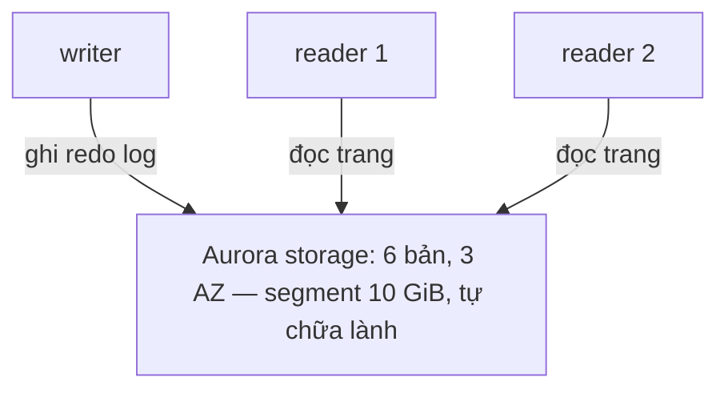

# Cơ sở dữ liệu

> **Tra nhanh:** đề cho một bài toán lưu trữ có cấu trúc — chọn engine nào, bật
> chế độ nhân bản nào, và con số nào chứng minh lựa chọn đó đúng.

`Domain 2 · Kiến trúc chịu lỗi (26% đề)` · `Domain 3 · Kiến trúc hiệu năng cao (24% đề)`

Bài tuần tương ứng: [Tuần 5 — Cơ sở dữ liệu](../aws/w05-databases.md) — tuần dạy đủ
để làm lab, file này là nơi tra khi bạn đã quên **vì sao**.

## Bản đồ

| Mục | Đọc khi bạn cần |
|---|---|
| [RDS — ba chế độ nhân bản](#1-rds) | đề trộn Multi-AZ instance, Multi-AZ cluster và read replica |
| [RDS — failover, backup, PITR](#13-failover-thực-sự-xảy-ra-thế-nào) | đề hỏi RTO/RPO, hoặc "xoá instance thì mất gì" |
| [RDS Proxy](#16-rds-proxy) | Lambda + RDS, "too many connections", rút ngắn failover |
| [Mã hoá, IAM auth, giám sát](#17-encryption-at-rest-và-vì-sao-không-bật-được-sau-khi-tạo) | "database hiện có chưa mã hoá"; chọn công cụ quan sát |
| [Aurora — storage](#21-storage-tách-khỏi-compute) | cần giải thích vì sao Aurora khác RDS về bản chất |
| [Aurora — endpoint](#22-endpoint-cluster-reader-custom) | app đọc phải reader nhưng vẫn đập vào writer |
| [Aurora Global Database](#24-global-database-và-rporto-thật) | DR đa Region, đề đưa số RPO/RTO |
| [Serverless v2, Backtrack, clone](#25-serverless-v2-khác-v1-thế-nào) | tải bất thường; "lỡ chạy DELETE thiếu WHERE"; môi trường test |
| [DynamoDB — partition key](#31-partition-key-và-hot-partition) | throttle dù capacity còn dư |
| [LSI vs GSI](#32-lsi-vs-gsi) | đề hỏi index, hoặc "thêm index sau khi tạo bảng" |
| [Capacity, RCU/WCU](#33-capacity-mode-on-demand-vs-provisioned) | đề hỏi chi phí, hoặc bắt tính số đơn vị |
| [Consistency, transaction, TTL, Streams, DAX, Global Tables](#35-eventually-consistent-vs-strongly-consistent) | mọi tính năng DynamoDB còn lại |
| [ElastiCache](#4-elasticache) | cache, session store, leaderboard, stale data |
| [Redshift và bốn dịch vụ chuyên biệt](#5-redshift--khi-nào-chọn) | nhận diện từ khoá, không đi sâu |
| [Bảng số phải nhớ](#bảng-số-phải-nhớ) | ôn 10 phút trước khi thi |
| [Nguồn nói khác](#nguồn-nói-khác) | con số trong `aws-saa-c03/` đã sai |

---

## 1. RDS

RDS là "EC2 chạy database mà bạn không `ssh` vào được": mất quyền root, đổi lại AWS
lo patch OS, patch engine, backup và chuyển đổi dự phòng.

### 1.1 Engine và cái nó khoá bạn lại

| Engine | Bạn chọn khi | Cái bị khoá |
|---|---|---|
| MySQL / MariaDB | ứng dụng cũ, lift-and-shift | không có |
| PostgreSQL | cần extension (`PostGIS`, `pg_partman`), JSONB | tập extension do AWS duyệt |
| Oracle | license doanh nghiệp đã mua | BYOL hoặc license-included, đắt |
| SQL Server | stack Microsoft, AD integration | max storage **16 TiB**, ít replica |
| Aurora MySQL/PostgreSQL | cần hiệu năng và HA cao hơn | chỉ hai phương ngữ này |
Con số hay ra thi: storage tối đa **64 TiB** (MySQL/MariaDB/PostgreSQL/Oracle),
**16 TiB** (SQL Server), **128 TiB** (Aurora). Đề nói "dữ liệu sẽ vượt 64 TB" là đang
đẩy bạn sang Aurora.

Cơ chế quyết định mọi thứ còn lại: RDS chạy trên **EBS**. Hệ quả — IOPS bị trần
theo loại volume, storage **không tự co lại** sau khi nở, và khôi phục là khôi phục
snapshot EBS nên thời gian tỉ lệ với dung lượng. `Storage Auto Scaling` chỉ **tăng**,
cooldown 6 giờ, và `MaxAllocatedStorage` là hàng rào chi phí duy nhất.

### 1.2 Ba chế độ hay bị trộn

Chỗ đề SAA gài nhiều nhất cả mảng database — ba thứ khác hẳn nhau về mục đích nhưng
tên gọi giống nhau.

| | Multi-AZ **instance** | Multi-AZ **DB cluster** | **Read replica** |
|---|---|---|---|
| Cấu hình | 1 primary + 1 standby | 1 writer + **2 readable standby** | 1 primary + tới 15 replica |
| Số AZ | 2 | **3** | tuỳ bạn đặt |
| Nhân bản | **synchronous** (block-level) | **semi-synchronous** (chờ ack **1 trong 2**) | **asynchronous** (logical/binlog) |
| Standby đọc được? | **KHÔNG** | **CÓ** | có |
| Failover | tự động, **60–120 giây** | tự động, **thường < 35 giây** | **promote thủ công** |
| RPO | 0 | ~0 | = replication lag |
| Cross-Region | không | không | **có** |
| Engine | mọi engine | **chỉ MySQL và PostgreSQL** | mọi engine |
| Giá | ~2x | ~3x | +1x mỗi replica |

Ba câu tự kiểm tra:

- "Standby của Multi-AZ instance rảnh, cho nó đọc đi" — **không thể**, nó không có
  endpoint. Nó là một khối EBS được ghi song song; engine trên đó không nhận query.
- "Multi-AZ **cluster** là Aurora?" — **không**. Aurora chia sẻ storage; Multi-AZ DB
  cluster vẫn là RDS thường, mỗi instance có EBS riêng, chỉ khác là commit chờ ack
  từ standby. Nó là bậc trung gian giữa Multi-AZ instance và Aurora.
- "Read replica failover được?" — không tự động. `promote-read-replica` ngắt nhân
  bản và biến nó thành instance độc lập, **không quay lại được**.

Read replica tối đa **15** (MySQL/MariaDB/PostgreSQL), **5** (Oracle). Xếp tầng
được (replica của replica, MySQL tới 4 tầng), mỗi tầng thêm lag.

### 1.3 Failover thực sự xảy ra thế nào

Cơ chế: RDS phát hiện primary không phản hồi (health check nội bộ, không phải
CloudWatch) → **đổi bản ghi CNAME** của endpoint từ IP primary sang IP standby →
standby đã có sẵn toàn bộ dữ liệu nên chỉ cần recover crash và mở kết nối.

Hai điều rút ra. Một, endpoint **không đổi** nhưng **IP đằng sau đổi** — ứng dụng
cache DNS vĩnh viễn sẽ treo; JVM mặc định `networkaddress.cache.ttl=-1` (vô hạn),
phải đặt về 30–60 giây. Hai, mọi kết nối TCP đang mở **đứt hết**, ứng dụng bắt buộc
có retry. Failover không phải "không gián đoạn", nó là "gián đoạn ngắn, tự phục hồi".

AWS dùng chính cơ chế này để patch: patch standby, failover, rồi patch máy cũ.

```bash
aws rds reboot-db-instance --profile learn \
  --db-instance-identifier app-db --force-failover
```

### 1.4 Backup tự động vs snapshot thủ công

Bẫy tiền và bẫy mất dữ liệu cùng lúc.

| | Automated backup | Manual snapshot |
|---|---|---|
| Ai tạo | RDS, mỗi ngày trong backup window | bạn |
| Giữ bao lâu | **0–35 ngày** (`0` = tắt hẳn) | **đến khi bạn xoá** |
| Khi xoá DB instance | **BỊ XOÁ THEO** | **Ở LẠI, và vẫn tính tiền** |
| Copy sang Region khác | không trực tiếp | có |
| Chia sẻ sang account khác | không | có (nếu không dùng default KMS key) |
| Cho phép PITR | **có** | không |

Retention mặc định khác nhau tuỳ cách tạo: Console **7 ngày**, CLI/API/CloudFormation
**1 ngày**. Terraform không đặt `backup_retention_period` thì bạn có đúng một ngày.

**Final snapshot** lúc `delete-db-instance` là manual snapshot — sống sót và tính
tiền mãi mãi. Đề dạng *"đã xoá database tháng trước, hoá đơn vẫn có dòng RDS"* →
snapshot chưa xoá. Snapshot là **incremental** sau lần đầu; xoá một snapshot ở giữa
thì AWS gộp block cần thiết sang snapshot kế tiếp nên dung lượng không giảm như bạn tưởng.

### 1.5 PITR

PITR gồm hai mảnh: **snapshot ngày** + **transaction log đẩy lên S3 mỗi 5 phút**.
Khôi phục = lấy snapshot gần nhất trước mốc bạn chọn rồi replay log tới đúng giây.

Ba điều đề hay gài: PITR **luôn tạo instance MỚI** (không có restore-in-place trong
RDS — Aurora [Backtrack](#26-backtrack) mới có); điểm khôi phục gần nhất **trễ ~5 phút**
vì log đẩy theo chu kỳ (đề nói "RPO 0" thì phải là Multi-AZ, không phải backup); và
instance mới dùng **security group / parameter group mặc định** nếu bạn không chỉ
định — lý do phổ biến nhất của "restore xong không kết nối được".

### 1.6 RDS Proxy

Vấn đề nó giải: mỗi kết nối PostgreSQL là một **process** (~5–10 MB RAM). Lambda
scale ra 1.000 concurrent sẽ mở 1.000 kết nối và giết database — connection pool
trong ứng dụng không cứu được vì mỗi Lambda là một tiến trình riêng. RDS Proxy giữ
pool kết nối thật và **ghép** nhiều kết nối client vào ít kết nối đó.

Ba thứ cần nhớ. **Rút ngắn failover tới 66%** — proxy giữ kết nối client mở trong lúc
tự nối lại sang standby, ứng dụng thấy một khoảng lặng chứ không thấy connection reset.
**Chạy trong VPC**, không có endpoint public, nên Lambda phải nằm trong VPC. **Xác
thực**: proxy → database dùng credential trong **Secrets Manager** (hoặc IAM), client →
proxy dùng IAM — đây là cách bỏ password khỏi mã nguồn.

Đề nói *"Lambda + RDS, lỗi `too many connections`"* hoặc *"giảm thời gian failover mà
không đổi mã ứng dụng"* → **RDS Proxy**.

### 1.7 Encryption at rest và vì sao không bật được sau khi tạo

RDS mã hoá bằng KMS ở tầng **EBS volume**, không phải tầng engine. Data key gắn
vào volume **lúc tạo**, và không có API mã hoá tại chỗ — vì thế **không bật được
encryption cho instance đã tạo**. Quy trình bắt buộc, đề hỏi đúng theo thứ tự này:

```bash
aws rds create-db-snapshot --profile learn \
  --db-instance-identifier app-db --db-snapshot-identifier app-db-plain

# Chính bước copy này mới là bước mã hoá.
aws rds copy-db-snapshot --profile learn \
  --source-db-snapshot-identifier app-db-plain \
  --target-db-snapshot-identifier app-db-enc \
  --kms-key-id alias/aws/rds

aws rds restore-db-instance-from-db-snapshot --profile learn \
  --db-instance-identifier app-db-v2 --db-snapshot-identifier app-db-enc
```

Rồi trỏ ứng dụng sang instance mới — **có downtime**, trừ khi dùng DMS đồng bộ
trước rồi cắt. Chiều ngược lại **không gỡ được mã hoá**. Read replica của instance
đã mã hoá **bắt buộc** mã hoá, và cross-Region replica cần KMS key **ở Region đích**
(key không qua biên giới Region). Đã mã hoá thì mã hoá tất: dữ liệu, log, snapshot,
replica. Mã hoá **on the wire** là chuyện khác, do TLS: `rds.force_ssl=1` (PostgreSQL)
hoặc `require_secure_transport=ON` (MySQL) trong parameter group.

### 1.8 IAM database authentication

Thay password bằng **token sống 15 phút** sinh từ IAM credential.

```bash
TOKEN=$(aws rds generate-db-auth-token --profile learn \
  --hostname app-db.abc123.ap-southeast-1.rds.amazonaws.com \
  --port 5432 --username app_iam)
PGPASSWORD="$TOKEN" psql -h app-db.abc123.ap-southeast-1.rds.amazonaws.com -U app_iam appdb
```

Giới hạn quyết định: chỉ **MySQL/MariaDB/PostgreSQL** (và Aurora hai loại đó), token
**15 phút**, trần khoảng **200 kết nối mới mỗi giây** ở instance nhỏ. Hợp với **Lambda
và người quản trị**; web server mở kết nối liên tục thì dùng Secrets Manager kèm rotation.

### 1.9 Performance Insights và Enhanced Monitoring

Hai thứ khác nhau và đề có phân biệt:

- **Performance Insights** — nhìn **bên trong database**: query nào tốn thời gian,
  wait event nào chặn. Trục chính là `DBLoad` (average active sessions). Miễn phí
  ở mức giữ **7 ngày**; giữ lâu hơn (tới 24 tháng) thì trả tiền. Cần tối thiểu
  **2 ACU** nếu chạy trên Aurora Serverless v2.
- **Enhanced Monitoring** — nhìn **hệ điều hành**: CPU theo process, swap, IO từng
  thiết bị. Agent trên máy đẩy vào CloudWatch Logs, chu kỳ nhỏ nhất **1 giây**.
  CloudWatch metric thường của RDS lấy từ hypervisor, chu kỳ 60 giây, **không thấy**
  process nào ăn CPU.

"Truy vấn nào chậm" → Performance Insights. "Tiến trình nào ăn CPU/RAM trên máy DB"
→ Enhanced Monitoring.

---

## 2. Aurora

### 2.1 Storage tách khỏi compute

Đây là điều duy nhất phải hiểu về Aurora; mọi tính năng khác là hệ quả. Aurora
**tách** tầng lưu trữ thành một dịch vụ riêng trải qua 3 AZ; instance chỉ là compute.



Cơ chế cần thuộc:

- Volume chia thành **segment 10 GiB**, mỗi segment **6 bản sao trên 3 AZ**.
- Writer **không ghi trang dữ liệu**, chỉ ghi **redo log record**; tầng storage tự
  dựng lại trang. Đây là lý do Aurora nhanh — lưu lượng ghi qua mạng nhỏ hơn nhiều
  lần so với MySQL ghi cả page + binlog + double-write buffer.
- **Quorum ghi 4/6, đọc 3/6.** Suy ra trực tiếp: mất **cả một AZ** (2 bản) vẫn ghi
  được; mất **một AZ + 1 bản** vẫn đọc được và tự sửa.
- **Tự chữa lành**: storage quét checksum liên tục, dựng lại bản hỏng từ quorum.
- Reader **dùng chung đúng volume đó**. Thêm reader **không tốn thêm storage**, và
  lag chỉ **10–20 ms** — đó là thời gian reader áp redo log vào buffer pool của nó,
  không phải thời gian copy dữ liệu.

Hệ quả: "Aurora có cần bật Multi-AZ không?" — **storage luôn 3 AZ**; thứ bạn bật là
**reader ở AZ khác** để failover nhanh. Cluster một instance không mất dữ liệu khi
AZ chết nhưng mất khả năng ghi vài phút. Volume tự lớn bước **10 GiB** tới **128 TiB**
và **co lại được** — khác hẳn RDS.

### 2.2 Endpoint: cluster, reader, custom

| Endpoint | Trỏ tới | Đổi khi failover |
|---|---|---|
| **Cluster (writer)** | đúng instance đang là writer | có, tự động |
| **Reader** | vòng tròn DNS qua các reader đang khoẻ | có |
| **Custom** | tập instance bạn tự định nghĩa | theo tập đó |
| **Instance** | một instance cụ thể | không — tránh dùng trong app |
Reader endpoint là **DNS round-robin TTL 5 giây**, không phải load balancer. Hệ quả
hay ra thi: **connection pool giữ kết nối lâu** resolve DNS một lần rồi bám mãi vào
một reader — tải lệch hẳn. Sửa bằng max lifetime cho kết nối, hoặc driver nhận biết
cluster (AWS JDBC Driver).

Custom endpoint dùng khi instance **không đồng hạng** — hai reader nhỏ cho web, một
reader lớn cho BI. Đề nói "tách truy vấn phân tích nặng khỏi traffic thường mà không
lập cluster mới" → **custom endpoint**.

### 2.3 Replica auto scaling và failover priority

Aurora Replica tối đa **15**, mỗi replica có **failover tier 0–15**. Writer chết →
Aurora chọn replica **tier nhỏ nhất**, cùng tier thì chọn máy **lớn nhất**. Failover
thường **< 30 giây** khi có replica; cluster chỉ có writer thì AWS phải dựng instance
mới, mất vài phút.

**Aurora Auto Scaling** thêm/bớt reader theo `CPUUtilization` hoặc `DatabaseConnections`.
Reader nó tạo luôn ở **tier 15** — hợp lý, vì bạn không muốn failover sang máy vừa
sinh, buffer pool còn nguội. Điểm hay quên: nó chỉ chỉnh **số reader**, không chỉnh
kích thước instance và không chỉnh writer. Writer nghẽn CPU thì phải đổi instance
class, và đó là một lần failover.

### 2.4 Global Database và RPO/RTO thật

Cấu hình: 1 Region chính + tới **5 Region phụ**, tổng tới **90 reader**. Nhân bản
**ở tầng storage** chứ không qua binlog, nên không tốn CPU của writer. Đây là chỗ tài
liệu ôn thi nói mơ hồ nhất — hai kịch bản, hai bộ số:

| | **Switchover** (có kế hoạch) | **Failover** (mất Region) |
|---|---|---|
| Khi nào | diễn tập DR, xoay Region theo giờ | Region chính sập |
| RPO | **0** — AWS đồng bộ hết trước khi đổi | **> 0**, cỡ **giây** (bằng lag lúc sập) |
| RTO | vài phút | cỡ **phút** |
| Chiều nhân bản | tự đảo ngược | phải dựng lại topology |

Lag điển hình **< 1 giây**. Aurora PostgreSQL có tham số `rds.global_db_rpo` chặn
trần RPO — đánh đổi là writer **chặn commit** khi lag vượt ngưỡng.

Hai lựa chọn dễ nhầm: **cross-Region read replica của RDS** nhân bản logic, lag hàng
chục giây, tốn CPU primary, promote thủ công — rẻ hơn và chậm hơn. **DynamoDB Global
Tables** multi-active, ghi được ở mọi Region; Aurora Global Database chỉ **một** Region
ghi được. Đề nói "nhiều châu lục cùng **ghi**" → Global Tables.

### 2.5 Serverless v2 khác v1 thế nào

| | v1 (đã lỗi thời) | **v2** |
|---|---|---|
| Bước scale | nhân đôi ACU (2→4→8…) | **0,5 ACU**, mượt |
| Điều kiện scale | phải tìm được "scaling point" — không có transaction dài, không có bảng tạm | **không cần**, scale tại chỗ |
| Thời gian scale | phút, có thể ngắt kết nối | **giây**, không ngắt |
| Về 0 | pause hoàn toàn, resume mất ~30 giây | **min = 0 ACU** với auto-pause, resume nhanh |
| Reader | không có | **có**, dùng được mọi endpoint |
| Global Database, Backtrack, RDS Proxy | không | **có** |

Con số phải nhớ: **1 ACU ≈ 2 GiB RAM**, dải **0 (hoặc 0,5) → 256 ACU** (bản cũ trần
128), auto-pause khi min = 0 với `SecondsUntilAutoPause` **300–86.400 giây** (mặc
định 300).

Bẫy: bật **Performance Insights** thì min ACU phải **≥ 2**, và cluster đang pause
không thu thập metric — "scale to zero" và "quan sát sâu" đánh đổi nhau.

Không chọn Serverless v2 khi tải ổn định 24/7: provisioned rẻ hơn ở cùng dung lượng.
Serverless thắng khi tải **có đáy** — dev/test, ứng dụng nội bộ theo giờ hành chính.

### 2.6 Backtrack

"Tua ngược" cluster tại chỗ — không tạo cluster mới, không restore. Aurora giữ một
vòng đệm bản ghi thay đổi và áp ngược lại.

Ràng buộc chính là nội dung câu hỏi thi: **chỉ Aurora MySQL**; cửa sổ tối đa
**72 giờ**; phải **bật lúc tạo cluster** (cluster đang chạy thì phải snapshot →
restore sang cluster mới); tua **cả cluster**, không tua một bảng; không dùng chung
với **binlog replication**; database không phục vụ trong lúc tua nhưng chỉ mất
**vài phút** thay vì hàng giờ như restore.

Đề dạng *"lập trình viên chạy nhầm `DELETE`, cần quay lại trạng thái 10 phút trước,
nhanh nhất"* → **Backtrack** nếu là Aurora MySQL, ngược lại **PITR** (chậm hơn,
tạo cluster mới).

### 2.7 Clone copy-on-write

Cluster mới **dùng chung storage** với cluster gốc, gần như tức thì. Khi một bên
ghi vào một trang, Aurora mới copy trang đó ra — bạn trả tiền cho instance của clone
cộng **chỉ những trang đã đổi**.

Đây là đáp án cho *"cần môi trường test với dữ liệu production 5 TB, không muốn tốn
5 TB storage và không muốn chờ restore"*. Cùng Region, cùng account (chéo account
qua AWS RAM), tối đa **15 clone**.

---

## 3. DynamoDB

### 3.1 Partition key và hot partition

DynamoDB băm partition key rồi ánh xạ vào một **partition vật lý** có trần cứng:

| Trần mỗi partition | Giá trị |
|---|---|
| Dung lượng | **10 GB** |
| Đọc | **3.000 RCU/giây** |
| Ghi | **1.000 WCU/giây** |

Trần này **không phụ thuộc capacity mode** — on-demand cũng dính. Đây là lý do "tăng
capacity" không chữa được throttle do hot partition, và là bẫy DynamoDB phổ biến nhất.

**Adaptive capacity** giúp một phần: DynamoDB bơm thêm capacity cho partition nóng
(lấy từ phần chưa dùng của bảng) và có thể **tách partition** để cô lập item nóng.
Nhưng nó không vượt được trần 3.000/1.000 cho **một giá trị partition key**.

Cách sửa nằm ở **thiết kế khoá**: chọn khoá **cardinality cao** (`user_id` tốt,
`status` với 3 giá trị là thảm hoạ); **write sharding** — thay `event#2026-08-21`
bằng `event#2026-08-21#<0..9>`, ghi vào shard ngẫu nhiên rồi query 10 shard và gộp;
tránh khoá là dãy tăng dần (timestamp thuần luôn tạo hot partition ở "hiện tại").

Tìm khoá nóng bằng **CloudWatch Contributor Insights for DynamoDB** — nó liệt kê
đúng partition key bị truy cập và bị throttle nhiều nhất.

### 3.2 LSI vs GSI

| | **LSI** | **GSI** |
|---|---|---|
| Partition key | **giống bảng gốc** | tuỳ ý |
| Sort key | khác | tuỳ ý |
| Tạo lúc nào | **chỉ lúc `CreateTable`** | bất kỳ lúc nào |
| Xoá được không | **KHÔNG** | có |
| Số lượng | **5** mỗi bảng | **20** mặc định (xin tăng được) |
| Capacity | **dùng chung với bảng** | **riêng**, RCU/WCU của chính nó |
| Consistency | eventual **hoặc strong** | **chỉ eventual** |
| Ràng buộc kích thước | item collection ≤ **10 GB** cho mỗi partition key | không |

Hai hệ quả cơ chế mà bảng trên không nói hết:

**LSI khoá bạn vào 10 GB.** "Item collection" = mọi item trong bảng **và trong mọi
LSI** có cùng partition key. Bảng **có LSI** thì tổng đó không vượt 10 GB — vượt là
`ItemCollectionSizeLimitExceededException`, ghi hỏng. Bảng không có LSI thì không có
giới hạn này. Thêm một LSI là tự áp một trần lên mô hình dữ liệu, **vĩnh viễn**, vì
LSI không xoá được.

**GSI throttle ngược được bảng gốc.** Ghi vào bảng → nhân bản không đồng bộ sang GSI.
GSI hết capacity → hàng đợi nhân bản đầy → **ghi vào bảng gốc bị throttle** dù bảng
còn thừa capacity. Đây là lý do "đừng cấp cho GSI ít capacity hơn bảng".

Chọn: cần **strongly consistent read theo sort key khác** → chỉ LSI làm được, và
phải quyết từ lúc tạo bảng. Còn lại → **GSI**, vì nó sửa được. Projection quyết định
chi phí: `KEYS_ONLY` rẻ nhất nhưng mỗi lần đọc phải quay về bảng gốc (tốn thêm RCU);
`ALL` nhân đôi storage.

### 3.3 Capacity mode: on-demand vs provisioned

| | On-demand | Provisioned |
|---|---|---|
| Đơn vị tính tiền | **RRU / WRU** mỗi request | **RCU / WCU** mỗi giờ |
| Giá us-east-1 (2026-08) | **$0,625 / triệu WRU**, **$0,125 / triệu RRU** | **$0,00065 / WCU-giờ**, **$0,00013 / RCU-giờ** |
| Lập kế hoạch | không cần | phải ước lượng |
| Xử lý đỉnh | tức thì tới **2× đỉnh trước đó** | Auto Scaling phản ứng sau vài phút |
| Reserved capacity | không | có, tiết kiệm tới **~77%** |

Phép tính quyết định, làm một lần rồi nhớ: 1 WCU chạy full 1 giờ cho **3.600 lần
ghi** với giá $0,00065 → **$0,18 mỗi triệu ghi**. On-demand là $0,625 mỗi triệu.
Tỉ lệ ≈ **3,5 lần**.

Suy ra: **provisioned rẻ hơn khi mức dùng trung bình vượt ~29%**. Dưới ngưỡng đó
on-demand rẻ hơn *và* không cần vận hành. (Tài liệu cũ nói on-demand đắt "gấp 5 lần"
— đúng cho tới khi AWS giảm giá on-demand 50% cuối 2024, xem
[Nguồn nói khác](#nguồn-nói-khác).)

**Auto Scaling** dùng CloudWatch alarm nên phản ứng sau vài phút — đỉnh dốc đứng vẫn
throttle. Bù lại có **burst capacity**: DynamoDB để dành capacity chưa dùng của
**300 giây** trước đó. Đổi capacity mode được **một lần mỗi 24 giờ**.

### 3.4 Tính RCU và WCU

Quy tắc gốc, mọi thứ khác suy ra từ đây: **1 RCU** = 1 lần đọc **strongly consistent**
item ≤ **4 KB** mỗi giây; **1 WCU** = 1 lần ghi item ≤ **1 KB** mỗi giây; eventually
consistent rẻ **một nửa**; transactional đắt **gấp đôi**; luôn **làm tròn lên**.

Hai ví dụ, làm được là qua được mọi câu tính toán trong đề:

> Đọc **80 item/giây**, mỗi item **6,5 KB**, eventually consistent → 6,5 KB làm tròn
> lên bội của 4 KB = 8 KB = **2 đơn vị**; strong sẽ là 80 × 2 = 160 RCU; eventual chia
> đôi → **80 RCU**.
>
> Ghi **120 item/giây**, mỗi item **2,5 KB**, transactional → 2,5 KB làm tròn lên bội
> của 1 KB = 3 KB = **3 đơn vị**; thường 120 × 3 = 360 WCU; transactional gấp đôi →
> **720 WCU**.

Hai chỗ hay sai: làm tròn theo **4 KB cho đọc** nhưng **1 KB cho ghi**; và
`Query`/`Scan` tính RCU theo **tổng dung lượng đã đọc**, không theo số item trả về —
`FilterExpression` lọc **sau khi** đã đọc và đã tính tiền.

### 3.5 Eventually consistent vs strongly consistent

Mỗi lần ghi được xác nhận khi đã vào **2 trong 3 AZ**. Đọc eventually consistent có
thể rơi vào bản sao thứ ba chưa cập nhật — cửa sổ **thường dưới 1 giây**. Cơ chế đó
quyết định mọi giới hạn khác:

- Strongly consistent **luôn đi tới bản chính** → tốn **gấp đôi RCU**, độ trễ cao
  hơn, và **không khả dụng khi bản chính đang lỗi**.
- **GSI không bao giờ strongly consistent** — nó là bảng riêng cập nhật không đồng bộ.
- **DAX chỉ cache đọc eventually consistent**; yêu cầu strong đi thẳng xuống DynamoDB.
- **Global Tables eventually consistent giữa các Region**, xung đột giải bằng
  **last writer wins**.

### 3.6 Transaction

`TransactWriteItems` / `TransactGetItems`: all-or-nothing, ACID **trong một Region**.
Giới hạn cứng: **100 item** riêng biệt, tổng **4 MB**, không đụng cùng một item hai
lần, không hoạt động **xuyên Region** (Global Tables không giữ nguyên tử khi nhân
bản), và **không dùng được trên index**. Chi phí gấp đôi RCU/WCU — với nhiều bài
toán, `ConditionExpression` trên một `PutItem` (optimistic locking) đủ và rẻ một nửa.

### 3.7 TTL

Bạn chỉ định một thuộc tính chứa **Unix epoch giây**; DynamoDB có tiến trình nền quét
và xoá item đã hết hạn.

Ba điều đề gài. **Không tức thì** — AWS cam kết xoá "thường trong vòng **48 giờ**",
và item hết hạn chưa xoá **vẫn xuất hiện trong `Query`/`Scan`**, ứng dụng phải tự lọc.
**Miễn phí** — xoá do TTL **không tốn WCU**, đây là lý do TTL luôn là đáp án cho "giảm
chi phí lưu dữ liệu hết giá trị"; tự viết job `Scan` + `DeleteItem` tốn cả RCU lẫn WCU.
Và item bị TTL xoá **có xuất hiện trong Streams** với `userIdentity` là
`dynamodb.amazonaws.com` — mẫu chuẩn là TTL → Streams → Lambda → S3.

### 3.8 Streams và Lambda

Streams là **change data capture**: mọi thay đổi item thành một record, giữ **24 giờ**,
**xếp thứ tự theo partition key**. `StreamViewType` quyết định bạn thấy gì — chọn sai
là phải bật lại và mất lịch sử:

| Giá trị | Chứa |
|---|---|
| `KEYS_ONLY` | chỉ khoá |
| `NEW_IMAGE` | item sau khi đổi |
| `OLD_IMAGE` | item trước khi đổi |
| `NEW_AND_OLD_IMAGES` | cả hai — bắt buộc cho **Global Tables** |

Ghép với Lambda qua **event source mapping** (Lambda **poll**, không phải DynamoDB
push). Mặc định **1 invocation đồng thời mỗi shard**; `ParallelizationFactor` (tới 10)
tăng song song mà vẫn giữ thứ tự trong mỗi partition key. Xử lý lỗi: **một batch lỗi
chặn cả shard** cho tới hết `MaximumRetryAttempts` / `MaximumRecordAgeInSeconds` —
phải đặt `OnFailure` (SQS/SNS) và `BisectBatchOnFunctionError`, nếu không một poison
message nghẽn 24 giờ rồi mất dữ liệu.

Cần giữ **tới 365 ngày** hoặc nhiều consumer độc lập → dùng **Kinesis Data Streams
for DynamoDB** thay vì Streams.

### 3.9 DAX

Cache in-memory **chỉ dành cho DynamoDB**; API tương thích hoàn toàn nên đổi endpoint
là xong, không sửa mã.

| | Con số / hành vi |
|---|---|
| Độ trễ đọc trúng cache | **micro giây** (DynamoDB: milli giây) |
| Cụm | 1 primary + tới 10 replica = **11 node** |
| Item cache TTL mặc định | **5 phút** |
| Query cache | có, cache kết quả `Query`/`Scan` |
| Ghi | **write-through** — ghi qua DAX vào DynamoDB rồi cập nhật cache |
| Chạy ở đâu | **trong VPC của bạn** |

Giới hạn quyết định lựa chọn: DAX **không tăng tốc ghi** và **không phục vụ strongly
consistent read** — đề dùng đúng chi tiết này để loại đáp án. So với ElastiCache: DAX
chỉ cho DynamoDB, không sửa mã, không tự lo invalidation; ElastiCache tổng quát hơn
(session, leaderboard, cache truy vấn RDS) nhưng **phải sửa mã**.

### 3.10 Global Tables

Multi-Region, **multi-active** — ghi được ở mọi Region, nhân bản qua Streams, độ trễ
điển hình **dưới 1 giây**.

Yêu cầu **Streams bật với `NEW_AND_OLD_IMAGES`**. Xung đột giải bằng **last writer
wins** theo timestamp, không có hook tuỳ biến — ứng dụng không chịu được mất bản ghi
thì phải phân vùng ghi theo Region ở tầng ứng dụng. **Transaction không nguyên tử
xuyên Region.** Tính tiền **rWCU** cho mỗi Region đích cộng phí truyền dữ liệu.

Aurora Global Database vs Global Tables: **một Region ghi** vs **mọi Region ghi** —
đó là câu phân biệt duy nhất bạn cần.

### 3.11 PITR và on-demand backup

| | PITR | On-demand backup |
|---|---|---|
| Cửa sổ | **35 ngày**, tới từng **giây** | giữ tới khi xoá |
| Ảnh hưởng hiệu năng | **không** | không |
| Khôi phục | **bảng MỚI** | **bảng MỚI** |
| Chi phí | theo dung lượng bảng | theo dung lượng backup |

Cả hai **không ghi đè bảng cũ** — luôn tạo bảng mới, ứng dụng phải trỏ lại. Và bảng
khôi phục **không mang theo** auto scaling, TTL, Streams, IAM policy, tag, cài đặt
PITR. Phải dựng lại — vừa là câu hỏi thi vừa là lỗi vận hành thật.

---

## 4. ElastiCache

### 4.1 Redis OSS, Valkey và Memcached

Từ 2024 có **ba** engine chứ không phải hai — nguồn `aws-saa-c03/` viết trước mốc này
nên thiếu hẳn Valkey.

| | **Valkey** | **Redis OSS** | **Memcached** |
|---|---|---|---|
| Nguồn gốc | fork của Redis 7.2, Linux Foundation | Redis | Memcached |
| Kiểu dữ liệu | phong phú (list, set, sorted set, hash, stream) | như Valkey | **chỉ chuỗi** |
| Nhân bản, failover | có | có | **không** |
| Persistence (RDB/AOF) | có | có | **không** |
| Đa luồng | I/O đa luồng | I/O đa luồng (từ Redis 6) | **có, từ đầu** |
| Giá ElastiCache | **rẻ hơn 20%** (node) / **33%** (serverless) | chuẩn | chuẩn |
| Serverless tối thiểu | **100 MB** | 1 GB | — |

Với đề thi, **Valkey và Redis OSS coi như một** — khác biệt chỉ là giá và giấy phép,
nâng cấp tại chỗ không downtime. Memcached thắng ở đúng hai chỗ: **đa luồng thuần** và
**đơn giản**; đổi lại mất node là mất dữ liệu. Bốn từ khoá ép đáp án về Redis/Valkey:
*persistence*, *replication / Multi-AZ failover*, *sorted set / leaderboard*, *pub/sub*.

### 4.2 Cluster mode và replication group

**Replication group** = 1 primary + tới 5 replica trên cùng một tập dữ liệu.

| | Cluster mode **tắt** | Cluster mode **bật** |
|---|---|---|
| Số shard | **1** | tới **500** |
| Dữ liệu | toàn bộ trên mỗi node | **chia** theo 16.384 hash slot |
| Scale ghi | không (chỉ đổi node lớn hơn) | **có**, thêm shard |
| Client | endpoint thường | client phải **hiểu cluster protocol** |
| Đa khoá trong một lệnh | tự do | chỉ khi các khoá cùng slot (`{hashtag}`) |

Điểm hay ra thi: **cluster mode tắt chỉ scale ĐỌC** — ghi vẫn dồn vào một primary
và trần là RAM một node. Đề nói *"lượng ghi vào cache vượt khả năng một node"* →
**bật cluster mode, thêm shard**, không phải "thêm replica".

**Multi-AZ với automatic failover** promote replica thường **dưới 1 phút**, phải bật
tường minh. Đọc từ replica là **eventually consistent** — session store đọc ngay sau
khi ghi sẽ thấy dữ liệu cũ. **ElastiCache Serverless** tính theo GB-giờ và ECPU, hợp
tải khó đoán, đắt hơn ở tải ổn định — cùng đánh đổi như Aurora Serverless v2.

### 4.3 Chiến lược caching và bài toán stale data

**Lazy loading (cache-aside)** — đọc cache trước, miss thì đọc DB rồi nạp vào cache
kèm TTL:

```python
def get_user(uid):
    v = cache.get(f"user:{uid}")
    if v is None:                                # cache miss
        v = db.query("SELECT ... WHERE id=%s", uid)
        cache.setex(f"user:{uid}", 300, v)       # TTL 300s là mấu chốt
    return v
```

Được: chỉ cache thứ thật sự được đọc, cache chết không làm hỏng đường ghi. Mất: **mỗi
miss trả giá 3 chặng**, và dữ liệu **có thể cũ** tới khi hết TTL vì đường ghi không
đụng tới cache. **Write-through** — mỗi lần ghi DB thì ghi luôn vào cache — được cái
cache không bao giờ cũ, mất ở chỗ mỗi ghi thêm một chặng, cache cả thứ **không ai đọc**,
và cache mới dựng thì **rỗng** cho tới khi có ghi đi qua.

Đáp án đúng thường là **kết hợp cả hai + TTL**. Bài toán **stale data** hiểu bằng cơ
chế: nguồn cũ số một là **ghi không đi qua ứng dụng** (batch job, DBA sửa tay) — không
có TTL thì cache sai **vĩnh viễn**, nên TTL bắt buộc kể cả với write-through. **Ghi
rồi xoá cache** an toàn hơn ghi vào cache vì tránh cảnh hai luồng chèn nhau đặt giá
trị cũ đè lên giá trị mới. **Thundering herd** — khoá nóng hết TTL, hàng nghìn request
cùng miss — chống bằng TTL có jitter hoặc khoá phân tán để chỉ một luồng nạp lại.

---

## 5. Redshift — khi nào chọn

Kho dữ liệu **OLAP**: lưu theo **cột**, nén mạnh, xử lý song song qua nhiều compute
node dưới một leader node. **Không phải** database giao dịch — insert từng dòng là chống
chỉ định. Chọn khi đề có đồng thời **hàng TB tới PB**, **JOIN phân tích phức tạp**, và
**SQL/BI tool**. Hai đáp án hay nhầm: **Athena** (SQL trên S3, serverless, tính theo dữ
liệu quét) thắng khi truy vấn **thưa thớt**, Redshift thắng khi truy vấn **liên tục** và
cần độ trễ ổn định; **RDS/Aurora** là OLTP — đề nói "báo cáo nặng làm chậm ứng dụng" mà
báo cáo chạy trên dữ liệu giao dịch hiện tại thì **read replica hoặc Aurora custom
endpoint** rẻ và đúng hơn. **Redshift Spectrum** truy vấn thẳng S3 không nạp vào cluster
— đáp án cho "dữ liệu lịch sử ở S3, thỉnh thoảng join với dữ liệu nóng".
**Redshift Serverless** bỏ việc quản cluster.

## 6. Bốn dịch vụ chuyên biệt — chỉ cần nhận diện

| Dịch vụ | Từ khoá trong đề | Chọn khi |
|---|---|---|
| **DocumentDB** | "MongoDB", "document", "JSON schema linh hoạt" | đang chạy MongoDB, cần bản managed tương thích API |
| **Neptune** | "graph", "quan hệ nhiều tầng", "gợi ý", "phát hiện gian lận", "Gremlin/SPARQL" | truy vấn là *đi theo cạnh*, không phải JOIN |
| **Timestream** | "time-series", "IoT telemetry", "metric theo thời gian" | dữ liệu chỉ ghi thêm theo thời gian, cần hàm nội suy/cửa sổ |
| **Keyspaces** | "Cassandra", "CQL", "wide-column" | đang chạy Cassandra, muốn serverless |

Cả bốn không đi sâu trong đề SAA — nhận diện đúng từ khoá là đủ điểm.

---

## Bảng số phải nhớ

| Con số | Giá trị |
|---|---|
| RDS automated backup | **0–35 ngày**; Console mặc định 7, CLI/API mặc định **1** |
| RDS transaction log lên S3 | mỗi **5 phút** → PITR trễ ~5 phút so với hiện tại |
| RDS Multi-AZ **instance** failover | **60–120 giây**, standby **không đọc được** |
| RDS Multi-AZ **DB cluster** failover | **< 35 giây**, **2 standby đọc được**, chỉ MySQL/PostgreSQL |
| RDS read replica | **15** (MySQL/MariaDB/PostgreSQL), **5** (Oracle) |
| RDS storage tối đa · IAM auth token | **64 TiB** (SQL Server 16 TiB) · token **15 phút** |
| Aurora storage | **6 bản / 3 AZ**, ghi quorum **4/6**, đọc **3/6**, segment **10 GiB** |
| Aurora volume | tự lớn tới **128 TiB**, bước 10 GiB, **co lại được** |
| Aurora replica | **15**, lag **10–20 ms**, failover **< 30 giây**, tier **0–15** |
| Aurora Global Database | **5 Region phụ**, tới **90 reader**, lag **< 1 giây** |
| Aurora Global switchover / failover | RPO **0** / RPO **giây**, RTO **phút** |
| Aurora Serverless v2 | **0 hoặc 0,5 → 256 ACU**, 1 ACU ≈ **2 GiB RAM**, auto-pause 300–86.400 giây |
| Aurora Backtrack | **chỉ MySQL**, tối đa **72 giờ**, bật lúc tạo |
| Aurora clone · DynamoDB item | **15** clone copy-on-write · item tối đa **400 KB** |
| DynamoDB partition | **10 GB**, **3.000 RCU**, **1.000 WCU** — trần cứng |
| DynamoDB LSI / GSI | **5 LSI** (chỉ lúc tạo, không xoá) / **20 GSI** |
| LSI item collection | **10 GB** cho mỗi partition key |
| RCU / WCU | 1 RCU = **4 KB** strong (eventual ×0,5 · transactional ×2) · 1 WCU = **1 KB** |
| DynamoDB on-demand vs provisioned | **≈ 3,5×** đắt hơn ở 100% dùng → hoà vốn quanh **29%** |
| `Query`/`Scan` · Transaction | **1 MB** mỗi lần gọi · **100 item**, **4 MB**, một Region |
| Streams · TTL · PITR | **24 giờ** · xoá trong **48 giờ**, **0 WCU** · **35 ngày**, ra bảng mới |
| DAX | tối đa **11 node**, item TTL mặc định **5 phút**, không cache strong read |
| ElastiCache cluster mode bật | tới **500 shard**, **16.384** hash slot, 5 replica mỗi shard |
| ElastiCache Multi-AZ failover | thường **< 1 phút** |

## Bẫy đề thi

**"Read replica để đạt HA."** Sai hấp dẫn vì replica đúng là bản sao. Nhưng nó
**async** (có mất dữ liệu) và phải **promote thủ công** (downtime dài). HA tự động
là **Multi-AZ** — vì ghi synchronous nên RPO = 0, và đổi CNAME tự động nên RTO tính
bằng giây.

**"Multi-AZ giúp giảm tải đọc."** Standby của Multi-AZ **instance** không có endpoint,
không nhận một query nào. Nhưng Multi-AZ **DB cluster** thì standby **đọc được** —
đọc kỹ đề dùng từ nào.

**"Xoá RDS instance là hết tiền."** Automated backup bị xoá theo; **manual snapshot và
final snapshot ở lại và vẫn tính tiền** vì chúng thuộc vòng đời của bạn, không của
instance.

**"Bật encryption cho database đang chạy."** Không có API đó — phải snapshot → **copy
kèm KMS key** → restore, vì khoá gắn với volume lúc tạo.

**"Aurora là RDS nhanh hơn, cần bật Multi-AZ."** Storage Aurora **luôn** trải 3 AZ vì
dữ liệu nằm ở tầng tách rời; thứ bạn thêm là **reader ở AZ khác** để failover < 30 giây.

**"Reader endpoint cân bằng tải đều."** Nó là **DNS round-robin TTL 5 giây** — cân bằng
xảy ra lúc resolve DNS, không lúc gửi query, nên connection pool giữ kết nối lâu sẽ dồn
hết vào một reader.

**"Tăng RCU/WCU sẽ hết throttle."** Không, nếu nguyên nhân là **hot partition**. Trần
**3.000 RCU / 1.000 WCU mỗi partition** là cứng và on-demand cũng dính, vì một giá
trị khoá chỉ nằm trên một partition.

**"Bảng còn thừa capacity mà vẫn throttle ghi."** **GSI hết capacity** → hàng đợi
nhân bản đầy → DynamoDB throttle ghi vào **bảng gốc**, vì nó phải giữ GSI không tụt
hậu vô hạn.

**Hai bẫy index.** *"Thêm LSI sau khi tạo bảng"* — LSI **chỉ tạo lúc `CreateTable`**
và **không xoá được**, vì nó dùng chung partition vật lý với bảng; cần index sau →
**GSI**. *"Dùng GSI cho truy vấn strongly consistent"* — GSI **chỉ eventually
consistent**, không có tuỳ chọn nào bật; cần strong trên sort key khác → **LSI**, và
phải quyết từ đầu.

**"Viết Lambda quét và xoá dữ liệu cũ để giảm chi phí."** Tốn RCU cho `Scan` và WCU
cho mỗi `DeleteItem`. **TTL miễn phí** — nhưng nhớ item hết hạn vẫn trả về trong
`Query` cho tới khi bị xoá thật (trong vòng **48 giờ**), nên ứng dụng phải tự lọc.

**"DAX tăng tốc mọi thứ."** DAX **không tăng tốc ghi** và **không phục vụ strongly
consistent read** — hai chi tiết đề dùng để loại đáp án.

**"Global Tables và Aurora Global Database thay thế nhau."** Global Tables **ghi được
ở mọi Region**; Aurora Global Database **chỉ một Region ghi**. Đề nói nhiều châu lục
cùng **ghi** → Global Tables.

**Ba bẫy ElastiCache.** *"Memcached có failover"* — không replication, không
persistence, không backup; cần bất kỳ thứ nào → **Valkey/Redis**. *"Thêm replica để
chịu lượng ghi tăng"* — replica chỉ scale **đọc**, ghi vẫn dồn vào primary; cần scale
ghi → **bật cluster mode, thêm shard**. *"Write-through thì không cần TTL"* — mọi thay
đổi không đi qua ứng dụng sẽ làm cache sai vĩnh viễn.

**"On-demand luôn đắt hơn."** Chỉ đúng khi mức dùng trung bình **vượt ~29%**. Dưới
ngưỡng đó on-demand rẻ hơn *và* không cần vận hành auto scaling.

## Cây quyết định

**Bắt đầu từ hình dạng dữ liệu và mẫu truy vấn, không từ tên dịch vụ.** Dữ liệu
**quan hệ**, có JOIN và transaction:

- Cần engine/phiên bản cụ thể (Oracle, SQL Server) → **RDS**. Cần hiệu năng cao,
  failover < 30 giây, nhiều replica → **Aurora**.
- Trong nhóm RDS: chỉ cần HA → **Multi-AZ instance**; cần HA *và* standby phục vụ
  đọc, engine MySQL/PostgreSQL → **Multi-AZ DB cluster**; chỉ cần scale đọc →
  **read replica**; cần cả hai → Multi-AZ + read replica.
- Trong nhóm Aurora: tải ổn định 24/7 → **provisioned**; tải có đáy hoặc khó đoán →
  **Serverless v2**; nhiều Region đọc + DR → **Global Database**.

Dữ liệu **key-value / document**, truy vấn theo khoá đã biết → **DynamoDB**. Rồi:
tải khó đoán → **on-demand**; ổn định và > 29% → **provisioned + auto scaling**; cần
micro giây → **+ DAX**; cần ghi đa Region → **+ Global Tables**; cần phản ứng theo
thay đổi → **+ Streams + Lambda**. Đang chạy MongoDB → **DocumentDB**; Cassandra →
**Keyspaces**.

Câu hỏi "ai nối với ai qua mấy bước" → **Neptune**; dữ liệu chỉ ghi thêm theo thời
gian → **Timestream**.

**Phân tích** khối lớn: truy vấn liên tục, độ trễ ổn định → **Redshift**; thưa thớt
trên S3 → **Athena**; lịch sử ở S3 cần join dữ liệu nóng → **Redshift Spectrum**.

Cần **giảm độ trễ đọc / giảm tải database**: nguồn là DynamoDB và không muốn sửa mã
→ **DAX**; nguồn là RDS/Aurora, hoặc cần session/leaderboard/cache kết quả tính toán
→ **ElastiCache (Valkey/Redis)**; chỉ cache đơn giản và muốn đa luồng thuần →
**Memcached**.

## Nối với thực hành

Lab có lời giải — [`learn-aws/labs/w05-databases/`](../../learn-aws/labs/w05-databases/):
DynamoDB chạy trong hạn mức miễn phí, RDS bật đúng 2 tiếng. Chạm vào
[partition key và hot partition](#31-partition-key-và-hot-partition) và
[RCU/WCU](#34-tính-rcu-và-wcu) — playbook nạp 2.200 item rồi in `ConsumedCapacity`
thật của `Query` so với `Scan`. Bật RDS rồi chạy
`aws rds reboot-db-instance --force-failover` để **nhìn** failover thật mất bao lâu:
con số 60–120 giây ở [1.3](#13-failover-thực-sự-xảy-ra-thế-nào) sẽ dính vào đầu theo
cách đọc không bao giờ làm được.

Lab tự viết — `learn-aws/labs-self/w05-*/`, đề bài không có lời giải, xem
[quy ước](../../learn-aws/labs-self/CONVENTIONS.md): dựng bảng DynamoDB từ file rỗng
và tự chọn partition key; `verify.sh` bơm tải lệch để chứng minh khoá bạn chọn có tạo
hot partition hay không. Đây là bài duy nhất dạy được mục
[3.1](#31-partition-key-và-hot-partition) một cách thật.

Đáng tự làm thêm: hạ `WriteCapacityUnits` của một GSI xuống 1 rồi ghi liên tục vào
bảng, và xem `WriteThrottleEvents` **của bảng** (không phải của index) tăng lên — đó
là mục [3.2](#32-lsi-vs-gsi) chứng minh bằng số.

RDS và ElastiCache đều nằm trong subnet private, nên mọi thứ ở
[`04-networking.md`](04-networking.md) về security group và subnet group áp dụng trực
tiếp; lab [`w02-vpc-networking`](../../learn-aws/labs/w02-vpc-networking/) là tiền đề.

## Nguồn nói khác

Những chỗ `aws-saa-c03/` sai hoặc đã cũ. Đã kiểm chứng lại bằng docs chính thức
(mốc **2026-08**).

| Nguồn | Nói | Thực tế |
|---|---|---|
| `Q-service-comparisons.md` §3.2 | RDS read replica "up to 5" | **15** với MySQL/MariaDB/PostgreSQL; 5 với Oracle ([RDS FAQ](https://aws.amazon.com/rds/faqs/), [docs MySQL replica](https://docs.aws.amazon.com/AmazonRDS/latest/UserGuide/USER_MySQL.Replication.ReadReplicas.html)) |
| `03-database-services.md` §1, `E-kien-truc-database.md` | Multi-AZ failover "60–120 giây" là con số duy nhất | Đúng cho Multi-AZ **instance**. Multi-AZ **DB cluster** (1 writer + 2 standby đọc được, 3 AZ) failover **< 35 giây** ([docs](https://docs.aws.amazon.com/AmazonRDS/latest/UserGuide/multi-az-db-clusters-concepts-failover.html)). Nguồn **không hề nhắc** tới Multi-AZ DB cluster — đây là thiếu sót, không chỉ là sai số |
| `03-database-services.md` §2 | "Aurora Multi-Master" là một lựa chọn hiện hành | Chỉ từng tồn tại trên Aurora MySQL 5.6/5.7 và **không còn được cung cấp**. Bỏ hẳn khỏi bài ôn |
| `Q-service-comparisons.md` §3.3 | Serverless v2 "0,5–128 ACU", "cold start ~30 giây nếu paused" | **0 (auto-pause) hoặc 0,5 → 256 ACU** ([API reference](https://docs.aws.amazon.com/AmazonRDS/latest/APIReference/API_ServerlessV2ScalingConfigurationInfo.html)). "Cold start 30 giây" là hành vi của **v1**, không phải v2 |
| `Q-service-comparisons.md` §3.4 | On-demand "$1,25 / triệu ghi, $0,25 / triệu đọc"; on-demand đắt "gấp 5 lần" | AWS **giảm giá on-demand 50%** cuối 2024: **$0,625 / triệu WRU**, **$0,125 / triệu RRU** ([pricing](https://aws.amazon.com/dynamodb/pricing/)). Tỉ lệ so với provisioned giờ là **≈ 3,5×**, hoà vốn quanh **29%** mức dùng, không phải ~7% như tính theo giá cũ |
| `03-database-services.md` §4, `E-kien-truc-database.md`, `Q` §3.5 | ElastiCache chỉ có "Redis và Memcached" | Thiếu **Valkey** (2024) — rẻ hơn **20%** node / **33%** serverless, thay thế trực tiếp Redis OSS ([blog](https://aws.amazon.com/blogs/database/amazon-elasticache-and-amazon-memorydb-announce-support-for-valkey/)). Cũng thiếu **ElastiCache Serverless** |
| `Q-service-comparisons.md` §3.5 | "Redis single-threaded, ~100.000 ops/giây" | Redis 6+ và Valkey có **I/O đa luồng**; con số ops/giây phụ thuộc kích thước node và không phải hằng số để nhớ |
| `03-database-services.md` §1 | Automated backup "1–35 ngày (default 7)" | Dải là **0–35** (`0` = tắt hẳn, một chế độ có thật và hay bị chọn nhầm). Mặc định **7** chỉ đúng với Console; CLI/API/CloudFormation mặc định **1** |
| `03-database-services.md` §3 | RCU/WCU liệt kê nhưng không nói làm tròn | Đọc làm tròn theo bội **4 KB**, ghi theo bội **1 KB**; transactional **×2**; eventual **×0,5**. Không có quy tắc này thì không giải được câu tính toán nào |
| `E-kien-truc-database.md` | Aurora quorum "Write 4/6, Read 3/6" — đúng, nhưng không giải thích | Con số này là *lý do* Aurora chịu được mất cả một AZ khi ghi và AZ + 1 bản khi đọc. Xem [2.1](#21-storage-tách-khỏi-compute) |

Nguồn cũng **thiếu hẳn**, dù đều nằm trong đề SAA-C03 hiện hành: RDS Proxy,
Performance Insights, item collection 10 GB của LSI, GSI throttle ngược bảng gốc,
adaptive capacity, Aurora clone, custom endpoint, và phân biệt switchover với
failover của Aurora Global Database.

## Ngoài phạm vi

- **DMS và SCT** — di chuyển database, thuộc chủ đề migration: <https://docs.aws.amazon.com/dms/>
- **QLDB** — ledger, không còn đáng đầu tư cho SAA: <https://docs.aws.amazon.com/qldb/>
- **MemoryDB** — Valkey/Redis dùng như database chính chứ không phải cache: <https://docs.aws.amazon.com/memorydb/>
- **Aurora DSQL** — SQL phân tán active-active đa Region, quá mới cho SAA-C03: <https://docs.aws.amazon.com/aurora-dsql/>
- **Aurora Global Database write forwarding** — mức Professional, `docs/CONVENTIONS.md` loại tường minh: <https://docs.aws.amazon.com/AmazonRDS/latest/AuroraUserGuide/aurora-global-database-write-forwarding.html>
- **RDS Blue/Green Deployments** — nâng cấp phiên bản ít downtime, thuộc vận hành: <https://docs.aws.amazon.com/AmazonRDS/latest/UserGuide/blue-green-deployments.html>
- **DynamoDB PartiQL, export sang S3** — hữu ích thật nhưng đề không hỏi: <https://docs.aws.amazon.com/amazondynamodb/>

## Tự kiểm tra

**1.** Một cluster Aurora mất trọn một AZ. Giải thích bằng cơ chế vì sao ứng dụng
vẫn ghi được, và điều kiện nào khiến nó *không* ghi được.

<details><summary>Đáp án</summary>

Volume có **6 bản trên 3 AZ**, quorum ghi **4/6**. Mất một AZ = mất 2 bản, còn 4 —
vừa đủ quorum, ghi tiếp bình thường, storage tự dựng lại 2 bản đã mất.

Không ghi được khi **writer instance** nằm ở AZ đó và cluster **không có reader nào
khác**: storage nguyên vẹn nhưng không có compute, AWS phải dựng instance mới, mất
vài phút. Đó là lý do "storage luôn 3 AZ" không đồng nghĩa với "HA" — vẫn phải có ít
nhất một reader ở AZ khác để failover < 30 giây.
</details>

**2.** Bảng DynamoDB provisioned 5.000 WCU. CloudWatch cho thấy `ConsumedWriteCapacityUnits`
trung bình chỉ 1.200 nhưng `WriteThrottleEvents` liên tục khác 0. Nêu **hai**
nguyên nhân khác nhau và cách phân biệt chúng.

<details><summary>Đáp án</summary>

**Hot partition.** Capacity chia cho các partition; một giá trị partition key chỉ nằm
trên một partition với trần cứng **1.000 WCU** — tổng còn thừa không cứu được. Phân
biệt bằng **Contributor Insights for DynamoDB**, nó chỉ đúng khoá bị nện. Sửa bằng
write sharding hoặc đổi partition key.

**GSI hết capacity.** Hàng đợi nhân bản sang GSI đầy → DynamoDB **throttle ngược ghi
vào bảng gốc**. Phân biệt bằng `WriteThrottleEvents` **của index** (metric có dimension
`GlobalSecondaryIndexName`). Sửa bằng cấp thêm capacity cho GSI hoặc thu hẹp projection.
</details>

**3.** Ứng dụng cần đọc 200 item mỗi giây, mỗi item 9 KB, và bắt buộc strongly
consistent. Cần bao nhiêu RCU? Nếu chuyển sang transactional read thì bao nhiêu?

<details><summary>Đáp án</summary>

9 KB làm tròn lên bội của 4 KB = **12 KB** = **3 đơn vị**. Strongly consistent:
200 × 3 = **600 RCU**. Transactional read gấp đôi: **1.200 RCU**. (Eventually
consistent thì chia đôi: 300 RCU. Bẫy hay gặp là làm tròn theo 1 KB — đó là quy tắc
của **ghi**.)
</details>

**4.** Đề: "Người dùng ở Bắc Mỹ, châu Âu và Đông Á cùng **ghi** vào cùng một tập
dữ liệu, độ trễ ghi phải thấp ở cả ba nơi." Aurora Global Database có giải được
không? Vì sao?

<details><summary>Đáp án</summary>

**Không.** Aurora Global Database chỉ có **một Region ghi được**; Region phụ là
read-only, nên người dùng châu Âu vẫn ghi vượt đại dương về Region chính.

Đúng: **DynamoDB Global Tables** — multi-active, nhân bản dưới 1 giây. Đánh đổi phải
nói rõ: xung đột giải bằng **last writer wins** không có hook tuỳ biến, và
**transaction không nguyên tử xuyên Region**. Nếu bài toán bắt buộc quan hệ và
transaction chặt thì phải phân vùng ghi theo Region ở tầng ứng dụng — không có dịch
vụ nào làm hộ ở mức SAA.
</details>

**5.** Một lập trình viên chạy `DELETE FROM orders` thiếu `WHERE` trên Aurora MySQL
production lúc 14:32. Phát hiện lúc 14:41. Nêu hai cách khôi phục và chọn cách nào,
kèm lý do bằng con số.

<details><summary>Đáp án</summary>

**Backtrack:** tua cluster về 14:31 tại chỗ, mất **vài phút**, không tạo cluster mới,
không phải trỏ lại ứng dụng. Điều kiện: đã **bật lúc tạo cluster**, cửa sổ ≥ 10 phút,
không dùng binlog replication.

**PITR:** khôi phục ra **cluster MỚI** ở mốc 14:31 rồi trỏ ứng dụng sang; thời gian
tỉ lệ với dung lượng — hàng giờ với dữ liệu lớn. Luôn dùng được.

Chọn **Backtrack** nếu đã bật, vì RTO nhỏ hơn một bậc độ lớn. Bài học vận hành:
Backtrack **không bật được sau khi tạo cluster**, nên quyết định phải làm từ ngày
dựng hệ thống — lúc cần thì đã muộn.
</details>
