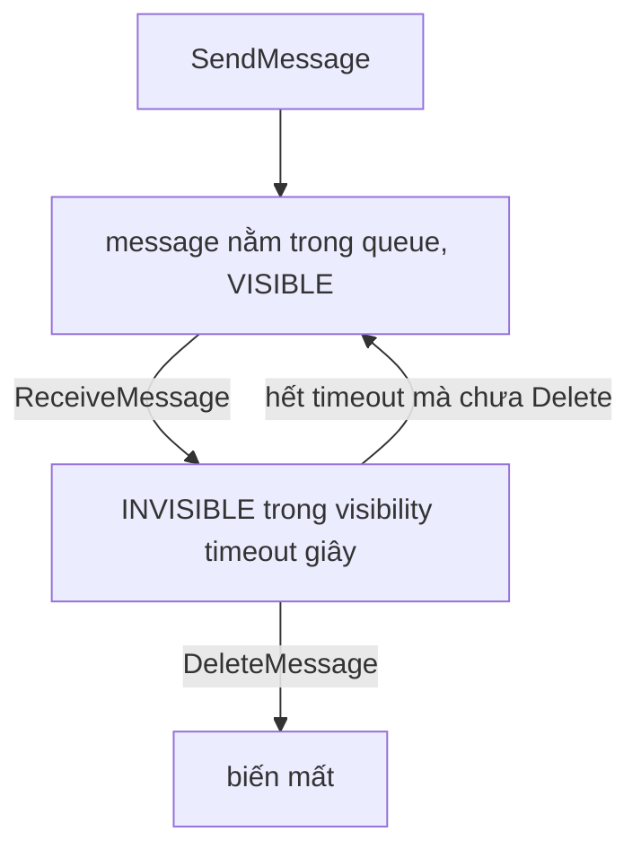

# Tích hợp ứng dụng

> **Tra nhanh:** hai thành phần cần nói chuyện với nhau — chọn hàng đợi, pub/sub, bus sự kiện, orchestrator hay API, và vì sao.

`Domain 2 · Design Resilient Architectures (26% đề)` · chạm cả `Domain 3 · Performance`

Đây là nhóm dịch vụ mà đề SAA hỏi bằng **kịch bản** chứ không bằng định nghĩa: một mô tả
hệ thống, bốn dịch vụ đều "chạy được", và chỉ một cái đúng vì một chi tiết trong đề.

## Bản đồ

| Mục | Khi nào bạn cần đọc |
|---|---|
| [1. Decouple mua được gì](#1-decouple-mua-được-gì) | Cần lý do để chọn async thay vì gọi thẳng |
| [2. SQS](#2-sqs--hàng-đợi-kéo) | Buffer, xử lý nền, retry, "order matters" |
| [3. SNS](#3-sns--pubsub-đẩy) | Một sự kiện, nhiều nơi cần biết |
| [4. SNS + SQS](#4-sns--sqs--bốn-mẫu-phải-nhận-ra-ngay) | Fanout, filter, chuỗi topic-queue |
| [5. EventBridge](#5-eventbridge--bus-có-luật) | Sự kiện từ dịch vụ AWS/SaaS, replay, lịch chạy |
| [6. Ranh giới SNS / SQS / EventBridge](#6-ranh-giới-sns--sqs--eventbridge) | Đề hỏi liên tục — đọc kỹ bảng này |
| [7. Step Functions](#7-step-functions--khi-nào-chuỗi-lambda-là-sai) | Nhiều bước, có lỗi, có chờ, có rẽ nhánh |
| [8. API Gateway](#8-api-gateway) | Public API, authorizer, throttling, caching |
| [9. Kinesis](#9-kinesis) | Streaming, nhiều consumer đọc cùng dữ liệu, replay |
| [10. Amazon MQ và AppSync](#10-amazon-mq-và-appsync) | Migrate broker cũ; GraphQL |

Liên quan: [compute](01-compute.md) cho Lambda, [tuần 7](../aws/w07-decoupling.md) và
[tuần 6](../aws/w06-serverless-api.md) cho lộ trình tuần tự, [bảo mật](05-security.md)
cho authorizer và mã hoá message.

---

## 1. Decouple mua được gì

Gọi thẳng từ A sang B (HTTP đồng bộ) là **temporal coupling**: A chỉ chạy được khi B
đang sống, và A nhanh tối đa bằng B. Đặt một hàng đợi vào giữa mua được ba thứ:

**Load leveling.** Producer đẩy 10.000 message/giây trong 30 giây; consumer xử lý
200/giây trong 25 phút. Không có hàng đợi thì bạn phải mua đủ compute cho đỉnh.

**Fault isolation.** B chết 2 giờ, message nằm trong queue. A không hề biết. Đây là khác
biệt lớn nhất so với retry ở phía client — retry vẫn cần A còn sống và còn giữ dữ liệu.

**Scaling độc lập.** ASG scale theo `ApproximateNumberOfMessagesVisible` chia cho số
instance (backlog per instance) — metric duy nhất phản ánh đúng công việc còn tồn.

Cái giá: **eventual consistency**, **at-least-once** (nên consumer phải idempotent), và
mất khả năng trả lỗi ngay cho người dùng. Nếu bạn quen Kubernetes: hàng đợi ở đây đóng
vai trò như một work queue giữa hai Deployment, chỉ khác là nó managed và có DLQ sẵn.

**Idempotency là trách nhiệm của bạn, không phải của SQS.** Cùng tinh thần Ansible: task
không tự idempotent, người viết task phải làm nó idempotent. Cách chuẩn là ghi
`MessageId` (hoặc một business key) vào DynamoDB với điều kiện `attribute_not_exists`.

---

## 2. SQS — hàng đợi kéo

Queue phân tán, message được nhân bản trên nhiều server trong region. Consumer **kéo**
(`ReceiveMessage`), SQS không đẩy đi đâu cả.

### Vòng đời một message — và vì sao visibility timeout hoạt động như vậy



message VẪN CÒN trong queue khi INVISIBLE; khi quay lại VISIBLE thì ReceiveCount++.

Điểm mấu chốt: **`ReceiveMessage` không xoá message**, nó chỉ *ẩn* message đi. Xoá là
một lời gọi riêng (`DeleteMessage`) mà consumer phát ra **sau khi xử lý xong**. Đây chính
là cơ chế bảo đảm at-least-once: consumer chết giữa chừng thì không ai gọi `DeleteMessage`,
timeout hết hạn, message hiện lại và một consumer khác nhận.

Hệ quả trực tiếp phải nhớ:

- **Visibility timeout ngắn hơn thời gian xử lý = message bị xử lý hai lần**, và cả hai
  lần đều "thành công". Triệu chứng: đơn hàng bị trừ tiền hai lần, log thấy cùng
  `MessageId` hai lần.
- Mặc định **30 giây**, đặt được **0 giây – 12 giờ**, ở mức queue hoặc mức từng message.
- Việc xử lý dài không đoán trước được → consumer gọi `ChangeMessageVisibility` định kỳ
  (heartbeat) để gia hạn, thay vì đặt timeout 12 giờ cho mọi message.
- Với **Lambda event source mapping**, AWS khuyến nghị visibility timeout **≥ 6 lần**
  timeout của function. Lý do: Lambda cần chỗ cho retry nội bộ trước khi message quay lại.

### Long polling vs short polling

Queue nằm trên nhiều server. **Short polling** (`WaitTimeSeconds = 0`) chỉ hỏi một tập
con server rồi trả lời ngay — nên nó **có thể trả về rỗng dù queue đang có message**, và
bạn phải poll liên tục (mỗi lần là một request tính tiền).

**Long polling** giữ kết nối tối đa `WaitTimeSeconds` (**1–20 giây**) và trả về ngay khi
có message. Ít API call hơn, ít tiền hơn, và độ trễ **thấp hơn** chứ không cao hơn — vì
message được trả ngay lúc nó tới thay vì chờ vòng poll kế tiếp. Không có lý do kỹ thuật
nào để dùng short polling; đặt `ReceiveMessageWaitTimeSeconds = 20` ở mức queue.

### Dead-letter queue và `maxReceiveCount`

DLQ không phải một loại queue đặc biệt — nó là một queue thường được chỉ định trong
**redrive policy** của queue nguồn. Cơ chế: mỗi lần message quay lại VISIBLE,
`ApproximateReceiveCount` tăng 1; khi vượt **`maxReceiveCount`**, SQS chuyển message sang
DLQ thay vì cho hiện lại.

Ba chi tiết ra thi:

- DLQ phải **cùng loại** với queue nguồn (standard ↔ standard, FIFO ↔ FIFO) và cùng
  account, cùng region.
- **Bẫy retention:** thời gian sống của message trong DLQ tính từ lúc nó vào **queue
  gốc**, không phải lúc vào DLQ. Queue gốc retention 4 ngày, message vật lộn 3 ngày rồi
  mới rơi vào DLQ có retention 14 ngày → nó vẫn chỉ còn 11 ngày. Cách đúng: đặt retention
  của DLQ **dài hơn hẳn** queue nguồn.
- **DLQ redrive** cho phép đẩy ngược message từ DLQ về queue gốc sau khi bạn vá bug —
  hỗ trợ cả standard và FIFO. Trước đó phải tự viết script.

`maxReceiveCount = 1` nghĩa là không retry lần nào; giá trị hợp lý cho lỗi tạm thời
thường là 3–5.

### Retention, delay queue, message timer

- **Retention**: 60 giây – **14 ngày**, mặc định **4 ngày**.
- **Delay queue**: `DelaySeconds` ở mức queue, **0–15 phút**, áp cho **mọi message mới**.
- **Message timer**: `DelaySeconds` ở mức từng message khi `SendMessage`, cũng 0–15 phút.
  **FIFO queue không hỗ trợ message timer** — chỉ đặt delay được ở mức queue.

### Giới hạn 256 KB và extended client

Payload tối đa **256 KB** (262.144 byte). Lớn hơn thì dùng **Amazon SQS Extended Client
Library**: thư viện tự ghi payload vào **S3** và chỉ gửi qua queue một con trỏ, cho phép
message tới **2 GB**. Consumer dùng cùng thư viện để tự đọc lại từ S3. Đây là đáp án cho
mọi câu "cần gửi file/ảnh/payload lớn qua SQS".

Lưu ý tính tiền: mỗi **64 KB** payload tính là **một** request. Message 256 KB = 4 request.

### Standard vs FIFO

| | Standard | FIFO (`.fifo`) |
|---|---|---|
| Throughput | không giới hạn | **300 TPS mỗi API action**, 3.000 với batching; high throughput mode tới **70.000 TPS** mỗi API action ở region lớn |
| Thứ tự | best-effort, **không đảm bảo** | đảm bảo **trong một message group** |
| Trùng lặp | at-least-once, **có thể trùng** | exactly-once processing trong cửa sổ dedup |
| Giá | $0,40 / triệu request | $0,50 / triệu request |

Hai tham số quyết định của FIFO:

**`MessageGroupId`** vừa là đơn vị **thứ tự** vừa là đơn vị **song song**. Message cùng
group được xử lý tuần tự; group khác nhau chạy song song. Chọn group ID = chọn mức độ
song song của bạn. Dùng `MessageGroupId = "all"` cho mọi message là biến FIFO thành hàng
đợi đơn luồng — sai lầm phổ biến nhất. Dùng `customer_id` hoặc `order_id` thì mỗi khách
hàng có thứ tự riêng và hệ thống vẫn song song được.

**`MessageDeduplicationId`** mở một **cửa sổ dedup 5 phút**: gửi lại cùng dedup ID trong
5 phút thì message thứ hai bị nuốt im lặng (`SendMessage` vẫn trả về thành công). Không
truyền thì bật *content-based deduplication* để SQS dùng SHA-256 của body. Bẫy: hai đơn
hàng khác nhau nhưng body giống hệt (ví dụ "ping") sẽ bị coi là trùng.

**Bẫy poison message trong FIFO:** message đầu group lỗi liên tục sẽ **chặn toàn bộ
group** cho tới khi nó vào DLQ. Đây là lý do FIFO **luôn** phải có DLQ với
`maxReceiveCount` nhỏ.

Mã hoá: **SSE-SQS bật mặc định** cho queue mới; dùng SSE-KMS khi cần khoá của bạn và audit
qua CloudTrail.

---

## 3. SNS — pub/sub đẩy

Publisher gửi một message tới **topic**, SNS **đẩy** bản sao tới mọi subscription. Không
ai phải poll.

Subscriber: **SQS, Lambda, HTTP/S endpoint, email, SMS, mobile push, Kinesis Data
Firehose**. Message tối đa **256 KB** (SNS cũng có extended client qua S3).

**SNS không lưu trữ message.** Không có subscriber, hoặc subscriber lỗi hết retry →
message biến mất, vĩnh viễn. Đây là khác biệt nền tảng với SQS và là lý do mẫu fanout
luôn đặt SQS phía sau SNS.

### Filter policy — lọc ở phía SNS, không ở phía consumer

Mỗi subscription có thể mang một **filter policy** dạng JSON. SNS chỉ đẩy message khớp:

```json
{ "loai_su_kien": ["don_hang_moi"], "gia_tri": [{ "numeric": [">=", 1000] }] }
```

Mặc định filter chạy trên **message attribute** (`FilterPolicyScope = MessageAttributes`).
Đặt `FilterPolicyScope = MessageBody` thì SNS soi thẳng **nội dung JSON của message** —
tiện khi bạn không kiểm soát được publisher để bắt nó gắn attribute.

Vì sao quan trọng: không có filter thì mọi consumer nhận mọi message rồi tự vứt bớt —
tốn Lambda invocation, tốn SQS request, tốn tiền. Filter đẩy việc lọc về phía SNS, miễn phí.

### FIFO topic, DLQ và retry

**FIFO topic** giữ thứ tự và dedup, nhưng subscriber phải là **SQS FIFO queue**. Hai chế
độ throughput: `fifoThroughputScope = Topic` (3.000 message/giây, 20 MB/giây, dedup soi
toàn topic) hoặc `MessageGroup` (throughput theo trần region, dedup chỉ trong một group).

**DLQ gắn vào subscription, không gắn vào topic.** Mỗi subscription có redrive policy
riêng — đúng logic, vì subscription A lỗi không liên quan gì tới subscription B.

Retry với endpoint HTTP/S: SNS thử lại theo chính sách có backoff, mặc định tổng cộng
**50 lần trải trong 23 ngày** trước khi bỏ vào DLQ. Với target AWS (SQS, Lambda), retry
nhanh hơn nhiều và ít lần hơn.

---

## 4. SNS + SQS — bốn mẫu phải nhận ra ngay

**Fanout.** `Producer → SNS topic → nhiều SQS queue → nhiều consumer`. Vì sao chèn SQS
giữa SNS và consumer thay vì cho SNS gọi thẳng Lambda: mỗi consumer có **buffer riêng,
retry riêng, DLQ riêng, tốc độ riêng**. Consumer chậm không kéo tụt consumer nhanh, và
consumer chết không làm mất message.

**Topic-queue-chaining.** Đặt SQS ngay trước một dịch vụ hay bị đỉnh tải để nó tự hấp thụ
burst thay vì scale gấp.

**Message filtering.** Một topic, nhiều queue, mỗi queue một filter policy. Thay cho việc
tạo 10 topic — ít thứ phải quản lý hơn hẳn.

**S3 event → nhiều pipeline.** S3 event notification cho phép nhiều destination nhưng
cấu hình dễ chồng lấn và khó bảo trì. Hai cách sạch: `S3 → SNS → nhiều SQS`, hoặc bật
**S3 gửi event sang EventBridge** rồi viết rule. Cách thứ hai là câu trả lời hiện đại và
cho bạn filter theo nội dung, archive và replay.

---

## 5. EventBridge — bus có luật

Nếu SNS là "gửi cho những ai đăng ký", EventBridge là "**router có luật**": event vào bus,
rule so khớp **nội dung** event, và định tuyến tới target.

- **Bus**: `default` (nhận event của dịch vụ AWS), **custom bus** (event của bạn),
  **partner bus** (Datadog, Zendesk, Shopify...).
- **Rule**: một **event pattern** (JSON so khớp theo trường, hỗ trợ prefix, anything-but,
  numeric, exists) hoặc một **schedule**. Tối đa **5 target mỗi rule**.
- **Input transformer**: đổi hình dạng event trước khi gửi tới target — không cần Lambda
  chỉ để map field.
- **Schema registry**: tự khám phá schema của event và sinh code binding.

### Archive và replay — thứ SNS và SQS không có

Bạn bật **archive** trên một bus (kèm event pattern lọc và thời gian giữ), EventBridge
lưu lại mọi event khớp. Khi cần, **replay** phát lại khoảng thời gian đó vào chính bus
hoặc vào một rule cụ thể.

Vì sao đây là tính năng quan trọng nhất của EventBridge: nó biến bus sự kiện thành một
**sổ cái phát lại được**. Bug trong consumer làm hỏng 6 giờ dữ liệu → vá bug, replay 6
giờ đó. Không có EventBridge thì bạn phải tự dựng cơ chế lưu event. Đây là từ khoá đề
thi: **"replay events" → EventBridge, không phải SNS.**

### Pipes và Scheduler — hai dịch vụ tách ra từ EventBridge

**EventBridge Pipes** nối **một nguồn tới một đích** theo kiểu point-to-point, kèm hai
bước tuỳ chọn ở giữa:

```
source (SQS, Kinesis, DynamoDB Stream, MQ, MSK) → filter → enrichment → target
```

Nó thay đúng loại Lambda "glue" mà ai cũng phải viết: đọc từ stream, lọc, gọi API làm
giàu dữ liệu, đẩy sang đích. Không có code, không có function phải vá.

**EventBridge Scheduler** là dịch vụ lịch riêng, tốt hơn hẳn `rate()`/`cron()` trên rule:

| | Rule kiểu schedule | EventBridge Scheduler |
|---|---|---|
| Biểu thức | `rate()`, `cron()` | thêm **`at()` chạy một lần** |
| Múi giờ | chỉ UTC | **múi giờ bất kỳ**, tự xử lý DST |
| Target | như target của rule | **hơn 6.000 API trên 270+ dịch vụ** |
| Retry / DLQ | không cấu hình được cho lịch | **có**, cấu hình riêng từng schedule |
| Quy mô | giới hạn theo rule/bus | hàng triệu schedule |
| Flexible time window | không | có — rải tải trong cửa sổ tới 1.440 phút |

Đề nói "chạy một tác vụ vào 3 giờ sáng theo giờ Việt Nam" hoặc "hàng triệu lịch riêng cho
từng người dùng" → **Scheduler**, không phải rule.

Đặc tính giao hàng của EventBridge: **at-least-once**, **không đảm bảo thứ tự**, retry
tới **24 giờ**, độ trễ điển hình dưới một giây (chậm hơn SNS rõ rệt).

---

## 6. Ranh giới SNS / SQS / EventBridge

Đề hỏi cái này liên tục. Bảng dưới là thứ đáng thuộc nhất trong cả file.

| | SQS | SNS | EventBridge |
|---|---|---|---|
| Mô hình | queue, consumer **kéo** | pub/sub, **đẩy** | bus có luật, **đẩy** |
| Ai quyết định ai nhận | consumer tự lấy | subscription | **rule so khớp nội dung** |
| Lọc | không | filter policy (attribute hoặc body) | **event pattern**, mạnh nhất |
| Lưu trữ | có, **tới 14 ngày** | **không** | archive tuỳ chọn |
| Replay | redrive từ DLQ | không | **archive + replay** |
| Thứ tự | FIFO queue | FIFO topic | không |
| Số target | 1 consumer group | rất nhiều subscription | **5 target mỗi rule** |
| Nguồn AWS/SaaS dựng sẵn | không | không | **có** — hàng trăm |
| Độ trễ điển hình | ms (long polling) | **ms, thấp nhất** | dưới một giây |
| Giá | $0,40 / triệu request | $0,50 / triệu publish | **$1,00 / triệu event** |
| Điểm mạnh nhất | buffer, chống mất, tự điều tiết | fanout nhanh, throughput cao | định tuyến theo nội dung, tích hợp sẵn |

Cách quyết định trong 10 giây:

- Cần **buffer**, cần message **không mất** khi consumer chết, cần tự điều tiết tốc độ →
  **SQS**.
- Cần **một-đến-nhiều với độ trễ thấp nhất và throughput cao nhất**, mọi subscriber đều
  của bạn → **SNS**.
- Cần **định tuyến theo nội dung**, nguồn là **dịch vụ AWS hoặc SaaS**, hoặc cần
  **archive/replay/schedule** → **EventBridge**.
- Cần cả fanout lẫn độ bền → **SNS + SQS**.

Bẫy giá thường bị bỏ qua: EventBridge đắt hơn SNS **gấp đôi** mỗi triệu event. Ở quy mô
hàng tỉ event, "dùng EventBridge cho mọi thứ" là một quyết định chi phí, không chỉ kiến trúc.

---

## 7. Step Functions — khi nào chuỗi Lambda là sai

Chuỗi Lambda gọi nhau trực tiếp hỏng ở bốn chỗ: logic điều phối **nằm lẫn trong code
nghiệp vụ**; retry và backoff phải tự viết ở mỗi function; **không nhìn thấy** workflow
đang đứng ở bước nào; và tổng thời gian bị chặn bởi **trần 15 phút** của Lambda.

Step Functions kéo phần điều phối ra thành một **state machine** khai báo bằng ASL
(Amazon States Language). State chính: `Task`, `Choice` (rẽ nhánh), `Parallel`, `Map`
(lặp trên mảng), `Wait`, `Pass`, `Succeed`, `Fail`.

### Standard vs Express

| | Standard | Express |
|---|---|---|
| Thời gian chạy tối đa | **1 năm** | **5 phút** |
| Bảo đảm thực thi | **exactly-once** | at-least-once (async) / at-most-once (sync) |
| Tốc độ khởi tạo | > 2.000 execution/giây | > **100.000** execution/giây |
| State transition | 4.000/giây | gần như không giới hạn |
| Lịch sử thực thi | trong Step Functions, xem trực tiếp | phải gửi sang **CloudWatch Logs** |
| `.sync` và `.waitForTaskToken` | **có** | **không** |
| Giá | **$25 / triệu state transition** | **$1 / triệu invocation** + theo GB-giờ |

Quy tắc chọn: workflow **dài, ít lần, cần audit và exactly-once** (xử lý thanh toán, ETL
có phê duyệt) → Standard. Workflow **ngắn, tần suất rất cao, idempotent** (xử lý stream,
backend IoT) → Express. Chạy workflow tần suất cao trên Standard là cách đốt tiền kinh
điển — mỗi bước là một state transition tính tiền.

### Error handling — cơ chế thật

```jsonc
"Retry": [{
  "ErrorEquals": ["States.TaskFailed", "Lambda.TooManyRequestsException"],
  "IntervalSeconds": 2, "MaxAttempts": 4, "BackoffRate": 2.0, "JitterStrategy": "FULL"
}],
"Catch": [{ "ErrorEquals": ["States.ALL"], "Next": "BuocDonDep",
            "ResultPath": "$.loi" }]
```

- `Retry` chạy **trước** `Catch`; chỉ khi hết `MaxAttempts` thì `Catch` mới bắt.
- `BackoffRate` là hệ số nhân: 2 giây → 4 → 8 → 16. `JitterStrategy: FULL` rải ngẫu nhiên
  để tránh cả đàn retry cùng lúc (thundering herd).
- Tên lỗi dựng sẵn: `States.ALL`, `States.TaskFailed`, `States.Timeout`,
  `States.Permissions`, `States.DataLimitExceeded`.
- `ResultPath` quyết định lỗi được nhét vào đâu trong state input — không đặt thì input
  gốc bị ghi đè và bước dọn dẹp mất ngữ cảnh.

Đây là điểm bán hàng thật của Step Functions: retry/backoff/jitter là **cấu hình**, không
phải code. Bạn đổi chính sách retry mà không deploy lại function nào.

### Ba mẫu tích hợp

- **Request-response** (mặc định): gọi rồi đi tiếp ngay.
- **`.sync`**: gọi và **chờ job xong** (ECS task, Batch job, EMR step, Glue job). Thay
  cho vòng lặp polling — vốn đốt state transition.
- **`.waitForTaskToken`**: dừng workflow cho tới khi ai đó gọi `SendTaskSuccess` với
  token. Đây là cách làm **human approval** hoặc chờ hệ thống ngoài. **Express không có
  hai mẫu sau.**

**Distributed Map** xử lý tập dữ liệu lớn từ S3 với tới 10.000 execution con chạy song
song — đáp án cho "xử lý hàng triệu file trong S3 theo lô".

---

## 8. API Gateway

### Ba loại API

| | REST API | HTTP API | WebSocket API |
|---|---|---|---|
| Giá (us-east-1) | **$3,50 / triệu** (333M đầu) | **$1,00 / triệu** (300M đầu), tính theo bước 512 KB | $1,00 / triệu message + phí connection-minute |
| Authorizer | IAM, **Cognito user pool**, Lambda (TOKEN và REQUEST) | IAM, **JWT**, Lambda (simple hoặc IAM policy) | IAM, Lambda (REQUEST) |
| Caching | **có** | **không** | không |
| Usage plan + API key | **có** | **không** | không |
| Request/response validation, mapping template VTL | **có** | rất hạn chế | có |
| AWS WAF | **có** | **không** | không |
| Canary deployment | **có** | không | không |
| Endpoint kiểu edge-optimized / private | **có** | regional | regional |
| Kết nối hai chiều | không | không | **có** |

Chọn: mặc định là **HTTP API** — rẻ hơn ~70%, độ trễ thấp hơn, đủ dùng cho REST/proxy
Lambda thông thường. Chuyển sang **REST API** khi đề nhắc **caching, API key/usage plan,
WAF, request validation, hoặc private endpoint**. **WebSocket** khi cần server chủ động
đẩy xuống client (chat, dashboard realtime, game).

### Authorizer — bốn loại

- **IAM (SigV4)**: caller là principal AWS. Dùng cho service-to-service, CLI, SDK.
- **Cognito user pool** (REST): API Gateway tự xác thực JWT của user pool.
- **JWT authorizer** (HTTP): bất kỳ IdP OIDC nào, gồm cả Cognito. Cấu hình `issuer` và
  `audience`, không cần code.
- **Lambda authorizer**: bạn tự viết logic (token bên thứ ba, kiểm tra trong DB). Hai
  kiểu: `TOKEN` (đọc một header) và `REQUEST` (đọc cả header, query, path, context).
  **Kết quả được cache** theo TTL (mặc định 300 giây, tối đa 3.600) — bẫy: đổi quyền
  người dùng mà không đợi cache hết hạn thì quyền cũ vẫn còn hiệu lực.

Thêm **mutual TLS (mTLS)** cho REST API khi client phải trình chứng chỉ.

### Throttling và usage plan

Có **bốn tầng**, áp theo thứ tự từ hẹp nhất:

1. **Account-level**, mỗi region: **10.000 request/giây** steady, **burst 5.000** —
   đây là token bucket, burst là dung tích thùng.
2. **Stage-level**: trần cho cả stage.
3. **Method-level**: trần cho từng route.
4. **Usage plan gắn với API key**: rate + burst + **quota** theo ngày/tuần/tháng.

Usage plan là cách duy nhất để nói "khách hàng Free được 1.000 lời gọi mỗi ngày, khách
Pro được 1 triệu". **API key một mình không xác thực gì cả** — nó chỉ để đo và giới hạn;
ai cầm key vẫn phải qua authorizer. Đề rất hay đưa "dùng API key để bảo mật API" làm mồi.

Vượt trần → HTTP **429 Too Many Requests**.

### Caching

Bật ở mức **stage**, chọn kích thước **0,5 GB – 237 GB**, **tính tiền theo giờ và không
có free tier** — bật rồi quên tắt là một khoản chi phí âm thầm. TTL mặc định **300 giây**,
đặt được **0–3.600**. Client xoá cache bằng header `Cache-Control: max-age=0` nhưng chỉ
khi bạn cấp quyền `execute-api:InvalidateCache`, nếu không ai cũng xoá được cache của bạn.

### Stage, và Lambda proxy vs non-proxy

**Stage** (`dev`, `prod`) là một bản deploy có URL riêng, có **stage variable** (dùng làm
alias Lambda hoặc endpoint backend khác nhau), và REST API còn có **canary deployment**
để chia phần trăm traffic sang bản mới.

**Lambda proxy (`AWS_PROXY`)**: API Gateway đẩy nguyên request thành một event JSON và
Lambda **phải** trả về đúng hình dạng:

```json
{ "statusCode": 200, "headers": {"Content-Type": "application/json"}, "body": "{\"ok\":true}" }
```

Trả sai hình dạng → API Gateway báo **502 Bad Gateway**. Đây là lỗi số một khi mới làm
serverless, và `body` phải là **chuỗi** chứ không phải object.

**Non-proxy (`AWS`)**: bạn viết **mapping template VTL** để biến request thành đúng cái
Lambda muốn và biến kết quả thành đúng cái client muốn. Đổi lại là một ngôn ngữ template
khó debug. Non-proxy chỉ đáng dùng khi phải giữ nguyên hợp đồng API cũ, hoặc khi tích hợp
thẳng với **dịch vụ AWS mà không cần Lambda** (API Gateway → SQS, → Kinesis, → DynamoDB) —
mẫu này bỏ hẳn một tầng compute và là đáp án cho "nhận webhook lưu lượng lớn, xử lý sau".

**Timeout tích hợp**: mặc định **29 giây**. Nâng được lên trên 29 giây bằng yêu cầu tăng
quota, nhưng **chỉ cho REST API kiểu Regional và Private**, và có thể phải đánh đổi bằng
việc giảm throttle quota mức account. Payload tối đa **10 MB**.

---

## 9. Kinesis

### Data Streams — log phân tán, không phải hàng đợi

Dữ liệu vào **shard**, mỗi shard là một log có thứ tự. Consumer đọc bằng **con trỏ vị
trí** của riêng nó, nên nhiều consumer đọc **cùng một dữ liệu** độc lập — khác hẳn SQS,
nơi một message chỉ đến một consumer.

Con số của một shard:

- Ghi: **1 MB/giây** hoặc **1.000 record/giây**, cái nào đụng trước.
- Đọc chia sẻ: **2 MB/giây**, **chia cho mọi consumer** không dùng enhanced fan-out.
- **Enhanced fan-out**: mỗi consumer đăng ký được **2 MB/giây riêng**, dữ liệu được
  **đẩy** xuống thay vì poll → độ trễ ~70 ms. Tối đa **20 consumer** mỗi stream (50 với
  On-demand Advantage). Tính phí riêng.
- **Retention**: mặc định **24 giờ**, tăng tới **365 ngày**.
- Thứ tự đảm bảo **trong một shard**; **partition key** quyết định record vào shard nào.
  Partition key lệch (một khách hàng chiếm 90% traffic) → **hot shard**, throttling dù
  tổng throughput còn dư.

Hai chế độ dung lượng: **provisioned** (bạn đếm shard, rẻ hơn khi tải ổn định) và
**on-demand** (tự scale, tính theo dữ liệu, đắt hơn nhưng không phải nghĩ).

### Firehose — đường ống nạp, không phải stream

Firehose **không lưu trữ** và **không cho đọc lại**. Nó nhận dữ liệu, gom theo
**buffer size (1–128 MB)** hoặc **buffer interval (60–900 giây)** — cái nào đến trước —
rồi ghi thẳng vào **S3, Redshift, OpenSearch, Splunk hoặc HTTP endpoint**. Tự scale hoàn
toàn, không có shard để đếm.

Nó làm được ba việc trên đường đi: gọi **Lambda để transform**, **đổi định dạng sang
Parquet/ORC** (giảm chi phí Athena rất nhiều), và **nén + mã hoá**.

Vì có buffer nên Firehose là **near-real-time** (thấp nhất khoảng 60 giây), không phải
real-time. Đề nói "real-time xử lý dưới một giây" → Data Streams; "nạp vào S3/OpenSearch,
ít công vận hành nhất" → Firehose.

**Managed Service for Apache Flink** (tên cũ: Kinesis Data Analytics) chạy SQL hoặc Flink
trên dòng dữ liệu để tổng hợp theo cửa sổ thời gian. Ở mức SAA chỉ cần nhận ra tên.

### Kinesis vs SQS

| | Kinesis Data Streams | SQS |
|---|---|---|
| Mô hình | log, con trỏ đọc | queue, message biến mất khi xoá |
| Nhiều consumer đọc **cùng** dữ liệu | **có** | không |
| Đọc lại dữ liệu cũ | **có**, trong retention | không (chỉ redrive DLQ) |
| Thứ tự | theo shard / partition key | chỉ FIFO queue |
| Scaling | **bạn quản shard** (hoặc on-demand) | tự động, vô hình |
| Giá | theo shard-giờ + PUT payload unit | theo request |
| Hợp với | telemetry, clickstream, log, analytics | task queue, job nền |

Từ khoá: **"replay", "multiple consumers", "ordered by key", "analytics"** → Kinesis.
**"decouple", "worker", "buffer", "task"** → SQS.

---

## 10. Amazon MQ và AppSync

**Amazon MQ** là ActiveMQ hoặc RabbitMQ do AWS vận hành. Dùng nó **chỉ khi cần giao thức
chuẩn** — JMS, AMQP 0-9-1, MQTT, STOMP, OpenWire, WSS — thường là vì ứng dụng cũ đã viết
theo API đó và bạn không muốn sửa code khi migrate. Đánh đổi rất thật: nó chạy trên
**broker instance** mà bạn chọn cỡ, **không tự scale**, HA phải cấu hình multi-AZ
active/standby, và trần throughput thấp hơn SQS nhiều bậc.

Quy tắc thi: đề nhắc **"lift-and-shift", "existing JMS/AMQP application", "MQTT"** →
Amazon MQ. Đề nói hệ thống mới, cloud-native → **SQS/SNS**, luôn luôn.

**AWS AppSync**: GraphQL managed, có subscription realtime qua WebSocket và đồng bộ
offline cho mobile. Đề xuất hiện chữ **"GraphQL"** thì đáp án là AppSync — mức độ đó là đủ.

---

## Bảng số phải nhớ

| Thứ | Con số |
|---|---|
| SQS message tối đa | **256 KB**; extended client qua S3 → **2 GB** |
| SQS visibility timeout | mặc định **30 giây**, đặt được **0 giây – 12 giờ** |
| SQS retention | **60 giây – 14 ngày**, mặc định **4 ngày** |
| SQS long polling | **1 – 20 giây** |
| SQS delay queue / message timer | **0 – 15 phút** (FIFO không có message timer) |
| SQS FIFO throughput | **300 TPS** mỗi API action, 3.000 với batching, **70.000** ở high throughput mode |
| SQS FIFO cửa sổ dedup | **5 phút** |
| SQS giá | $0,40 / triệu request (standard), $0,50 (FIFO); mỗi **64 KB** = 1 request |
| SNS message tối đa | **256 KB** |
| SNS retry HTTP/S | tổng **50 lần trong 23 ngày** (mặc định) |
| EventBridge | **5 target** mỗi rule, retry tới **24 giờ**, $1,00 / triệu event |
| Step Functions Standard | tối đa **1 năm**, exactly-once, **$25 / triệu state transition** |
| Step Functions Express | tối đa **5 phút**, at-least-once, **$1 / triệu invocation** |
| API Gateway throttle | **10.000 rps** steady, **burst 5.000** mỗi region mỗi account |
| API Gateway timeout tích hợp | **29 giây** mặc định (nâng được, chỉ REST Regional/Private) |
| API Gateway payload | **10 MB** |
| API Gateway cache | **0,5 GB – 237 GB**, TTL mặc định **300 giây** (0–3.600) |
| API Gateway giá | REST **$3,50** / triệu, HTTP **$1,00** / triệu |
| Kinesis shard | ghi **1 MB/giây** hoặc **1.000 record/giây**; đọc **2 MB/giây** chia sẻ |
| Kinesis enhanced fan-out | **2 MB/giây riêng** mỗi consumer, tối đa **20** consumer |
| Kinesis retention | mặc định **24 giờ**, tối đa **365 ngày** |
| Firehose buffer | **1 – 128 MB** hoặc **60 – 900 giây** |

---

## Bẫy đề thi

**1. "Message bị xử lý hai lần dù code đúng."**
Sai hấp dẫn: "SQS Standard có duplicate, chuyển sang FIFO". Đúng (thường gặp hơn):
**visibility timeout ngắn hơn thời gian xử lý**. `ReceiveMessage` không xoá message, nó
chỉ ẩn — hết timeout mà chưa `DeleteMessage` thì message hiện lại cho consumer khác. Sửa
bằng cách tăng timeout hoặc gọi `ChangeMessageVisibility` heartbeat. Chuyển sang FIFO
không cứu được vì exactly-once của FIFO nằm ở phía *gửi*, không phải phía xử lý quá giờ.

**2. "FIFO queue nên throughput thấp, không dùng được."**
Đúng: mặc định 300 TPS mỗi API action (3.000 với batching), nhưng **high throughput mode
đưa lên tới 70.000 TPS mỗi API action** ở các region lớn. Và cách tăng throughput thật sự
là **tăng số message group** — group là đơn vị song song, không phải queue.

**3. "SNS đảm bảo message tới nơi."**
Đúng: **SNS không lưu trữ**. Không subscriber hoặc hết retry → message mất vĩnh viễn. Mọi
kịch bản cần độ bền phải là **SNS → SQS**, không phải SNS → Lambda trực tiếp.

**4. "Cần nhiều dịch vụ nhận cùng event → dùng EventBridge."**
Sai hấp dẫn vì EventBridge nghe hiện đại hơn. Phân biệt: đề chỉ nói **fanout thuần, mọi
target đều của bạn, cần độ trễ thấp và throughput cao** → **SNS** (rẻ hơn một nửa, nhanh
hơn). Đề nói **định tuyến theo nội dung event**, nguồn là **dịch vụ AWS hoặc SaaS**, hoặc
cần **archive/replay** → EventBridge.

**5. "Cần phát lại sự kiện đã xảy ra để sửa lỗi consumer."**
Sai hấp dẫn: "đọc lại từ SNS" hoặc "redrive DLQ". Đúng: chỉ **EventBridge archive +
replay** (hoặc Kinesis, trong retention) làm được. SNS không lưu gì; DLQ chỉ chứa message
đã *thất bại*, không chứa message đã xử lý sai mà vẫn báo thành công.

**6. "Đặt DLQ retention 14 ngày là an toàn."**
Đúng: **retention của message tính từ lúc nó vào queue gốc**, không tính lại khi vào DLQ.
Message lăn lộn 3 ngày ở queue gốc rồi vào DLQ thì chỉ còn 11 ngày. Luôn đặt retention DLQ
dài hơn hẳn queue nguồn.

**7. "Dùng API key của API Gateway để bảo mật API."**
Đúng: **API key không xác thực gì cả**. Nó chỉ để gắn usage plan (rate, burst, quota).
Xác thực phải là IAM, Cognito/JWT, hoặc Lambda authorizer.

**8. "Lambda trả về JSON mà API Gateway báo 502."**
Đúng: tích hợp **proxy** đòi đúng hình dạng `{statusCode, headers, body}` với `body` là
**chuỗi**. Trả về object thuần → 502. Không phải lỗi quyền, không phải lỗi timeout.

**9. "Workflow chạy mỗi giây một lần, dùng Step Functions Standard cho chắc."**
Đúng: Standard tính **$25 mỗi triệu state transition** — một workflow 10 bước chạy
1 lần/giây là ~26 triệu transition mỗi tháng. **Express** ($1/triệu invocation) là đáp án,
với điều kiện workflow dưới 5 phút và idempotent.

**10. "Firehose để xử lý real-time dưới một giây."**
Đúng: Firehose **có buffer**, thấp nhất khoảng **60 giây** — nó là near-real-time. Cần
dưới một giây thì phải là **Kinesis Data Streams**.

**11. "Nhiều consumer cần đọc cùng một luồng dữ liệu → SQS với nhiều queue."**
Đúng: SQS xoá message khi một consumer xử lý xong; nhân bản sang nhiều queue thì phải
dùng SNS fanout, và vẫn **không đọc lại được**. Cần nhiều consumer độc lập đọc cùng dữ
liệu và tua lại → **Kinesis Data Streams**.

**12. "Cần lịch chạy theo giờ địa phương, có DST → EventBridge rule cron."**
Đúng: rule chỉ hiểu **UTC**. **EventBridge Scheduler** mới hỗ trợ múi giờ, `at()` chạy
một lần, retry và DLQ riêng cho từng schedule.

---

## Cây quyết định

**Hai thành phần cần nói chuyện.** Cần trả lời ngay cho người dùng → gọi đồng bộ (API
Gateway/ALB). Không cần trả lời ngay → async, đi tiếp bên dưới.

**Async, một người nhận.** → **SQS**. Cần thứ tự hoặc chống trùng → **SQS FIFO** với
`MessageGroupId` chọn đúng. Payload > 256 KB → **extended client + S3**.

**Async, nhiều người nhận.** Mọi target của bạn, cần nhanh và rẻ → **SNS** (thêm SQS phía
sau nếu cần độ bền). Cần lọc theo nội dung, nguồn AWS/SaaS, cần replay → **EventBridge**.

**Nhiều bước, có lỗi, có chờ, có rẽ nhánh.** → **Step Functions**. Dài/ít lần/cần audit
→ Standard. Ngắn/nhiều/idempotent → Express. Cần chờ người phê duyệt → Standard với
`.waitForTaskToken`.

**Dòng dữ liệu liên tục.** Nhiều consumer độc lập, cần tua lại, cần thứ tự theo key →
**Kinesis Data Streams**. Chỉ cần nạp vào S3/OpenSearch/Redshift với ít công nhất →
**Firehose**. Cần tổng hợp theo cửa sổ thời gian → **Managed Service for Apache Flink**.

**Cần API public.** Mặc định → **HTTP API**. Cần caching / usage plan / WAF / request
validation / private endpoint → **REST API**. Server phải chủ động đẩy xuống client →
**WebSocket API**. Nhận webhook lưu lượng lớn rồi xử lý sau → **API Gateway tích hợp
thẳng SQS**, không cần Lambda.

**Đang có ActiveMQ/RabbitMQ và không muốn sửa code.** → **Amazon MQ**. Mọi trường hợp
khác → SQS/SNS.

**Cần lịch chạy.** Đơn giản, UTC, ít lịch → EventBridge rule. Múi giờ, chạy một lần,
hàng triệu lịch, cần retry/DLQ → **EventBridge Scheduler**.

---

## Nối với thực hành

| Lab | Chạm vào mục nào |
|---|---|
| [`labs/w07-decoupling/`](../../learn-aws/labs/w07-decoupling/) | Mục 2–7: SNS topic + SQS queue + subscription, `aws_lambda_event_source_mapping`, EventBridge rule, Step Functions state machine. Chạy `terraform apply -var gay_loi_don_hang=true` rồi đợi ~2 phút để **xem message thật sự rơi vào DLQ** sau khi vượt `maxReceiveCount`. |
| [`labs-self/w07-decoupling/`](../../learn-aws/labs-self/w07-decoupling/) | Bản tự viết. Đây là chỗ đáng tự dựng FIFO queue để thấy `MessageGroupId` quyết định song song thế nào. |
| [`labs/w06-serverless-api/`](../../learn-aws/labs/w06-serverless-api/) | Mục 8: lab dùng `aws_apigatewayv2_*` (HTTP API) + Lambda proxy + DynamoDB. Thử trả về object thay vì `{statusCode, body}` để tự tạo lỗi 502 ở bẫy số 8. |
| [`labs-self/w06-serverless-api/`](../../learn-aws/labs-self/w06-serverless-api/) | Bản tự viết. |
| [`labs/w10-observability-iac/`](../../learn-aws/labs/w10-observability-iac/) | Mục 3: SNS topic + email subscription là đường đi của alarm — nhớ bấm "Confirm subscription", nếu không alarm kêu vào hư không. |

Hai quan sát đáng làm nhất trong lab w07: (1) đặt visibility timeout 5 giây cho một
consumer xử lý 20 giây rồi đếm số lần cùng `MessageId` xuất hiện trong log — bẫy số 1 xảy
ra ngay trước mắt; (2) so `ApproximateNumberOfMessagesVisible` với
`ApproximateNumberOfMessagesNotVisible` khi consumer đang chạy để hiểu hai trạng thái.

---

## Nguồn nói khác

Chỗ `aws-saa-c03/07-application-integration.md` và `11-api-integration.md` sai, cũ hoặc
thiếu (kiểm chứng ngày 2026-08-21):

| Nguồn nói | Thực tế | Docs |
|---|---|---|
| "FIFO: **300 TPS** without batching, 3,000 with batching" | Đúng cho mặc định, nhưng thiếu **high throughput mode**: tới **70.000 TPS mỗi API action** (700.000 message/giây với batching) ở các region lớn. Con số 300 khiến người học loại FIFO khỏi mọi bài toán throughput cao — sai. | [SQS FIFO throughput](https://aws.amazon.com/blogs/aws/announcing-throughput-increase-and-dead-letter-queue-redrive-support-for-amazon-sqs-fifo-queues/) |
| "FIFO: **Exactly-once processing**: No duplicates" | Nói quá. FIFO bảo đảm **exactly-once *delivery* trong cửa sổ dedup 5 phút**; nếu consumer chết sau khi xử lý mà trước khi `DeleteMessage` thì message **vẫn** được xử lý lại. Idempotency vẫn là việc của bạn. | [SQS FIFO](https://docs.aws.amazon.com/AWSSimpleQueueService/latest/SQSDeveloperGuide/FIFO-queues.html) |
| Không nhắc **`MessageGroupId` là đơn vị song song** | Đây là quyết định thiết kế quan trọng nhất khi dùng FIFO, và là nguyên nhân số một khiến FIFO "chậm" trong thực tế. | như trên |
| Không nhắc **giới hạn 256 KB** và extended client | Là bẫy trực tiếp trong đề ("cần gửi payload lớn qua queue"). Đáp án: extended client + S3, tới 2 GB. | [Extended client](https://docs.aws.amazon.com/AWSSimpleQueueService/latest/SQSDeveloperGuide/configure-large-message-payloads.html) |
| Không nhắc **EventBridge archive/replay, Pipes, Scheduler** | Cả ba đều ra thi. Archive/replay là điểm phân biệt EventBridge với SNS rõ nhất; Scheduler là đáp án cho lịch có múi giờ. | [EventBridge Scheduler](https://docs.aws.amazon.com/scheduler/latest/UserGuide/schedule-types.html) |
| "Step Functions Express: at-least-once" | Đúng cho gọi **async**; gọi **đồng bộ** thì Express là **at-most-once**. Khác biệt này quyết định việc bạn có phải viết retry ở client hay không. | [Step Functions welcome](https://docs.aws.amazon.com/step-functions/latest/dg/welcome.html) |
| "API Gateway **Throttling: 10,000 RPS default**" | Thiếu **burst 5.000** và thiếu chuyện đây là quota **mỗi region mỗi account**, chia cho mọi API. Cũng thiếu bốn tầng throttle và vai trò của usage plan. | [API Gateway quotas](https://docs.aws.amazon.com/apigateway/latest/developerguide/limits.html) |
| Không nhắc **timeout tích hợp 29 giây** | Đây là giới hạn gây lỗi 504 phổ biến nhất. Từ 2024 **nâng được lên trên 29 giây** nhưng chỉ cho REST API kiểu Regional và Private, và có thể phải giảm throttle quota mức account. | [tăng integration timeout](https://repost.aws/knowledge-center/api-gateway-timeout-limit) |
| Bảng "REST vs HTTP" chỉ ghi "**HTTP API**: Simpler, cheaper" | Thiếu toàn bộ danh sách tính năng HTTP API **không có** (caching, usage plan/API key, WAF, canary, VTL đầy đủ) — mà đề thi hỏi thẳng đúng danh sách đó. | [Chọn loại API](https://docs.aws.amazon.com/apigateway/latest/developerguide/http-api-vs-rest.html) |
| Không nhắc **enhanced fan-out** của Kinesis | Là đáp án cho "nhiều consumer, mỗi consumer cần throughput riêng, độ trễ thấp": 2 MB/giây riêng mỗi consumer, tối đa 20 (50 với On-demand Advantage). | [Enhanced fan-out](https://docs.aws.amazon.com/streams/latest/dev/enhanced-consumers.html) |

---

## Ngoài phạm vi

- **Amazon MSK** (Kafka managed) — ra thi rất ít; nhận diện: đề nói thẳng "Kafka" và
  "không muốn sửa code producer/consumer". [docs](https://docs.aws.amazon.com/msk/)
- **AWS AppFlow** — nối SaaS (Salesforce, SAP, Slack) với S3/Redshift không cần code.
  Một câu duy nhất có thể ra. [docs](https://docs.aws.amazon.com/appflow/)
- **Amazon SES / Pinpoint** — gửi email/SMS ở quy mô lớn; SNS đủ cho thông báo vận hành.
  [docs](https://docs.aws.amazon.com/ses/)
- **Step Functions Distributed Map, Workflow Studio, Synchronous Express** — chi tiết vận
  hành, không ra thi. [docs](https://docs.aws.amazon.com/step-functions/)
- **API Gateway VPC Link, mTLS, Verified Permissions** — mức chuyên sâu.
  [docs](https://docs.aws.amazon.com/apigateway/)

---

## Tự kiểm tra

**1.** Consumer xử lý mỗi message mất 45 giây. Queue để visibility timeout mặc định. Mô
tả chính xác chuyện gì xảy ra và tại sao, rồi nêu hai cách sửa.

<details><summary>Đáp án</summary>

Sau 30 giây message quay lại VISIBLE trong khi consumer thứ nhất **vẫn đang xử lý**. Một
consumer thứ hai nhận cùng message và xử lý lại. Consumer thứ nhất xong ở giây 45, gọi
`DeleteMessage` — nhưng receipt handle của nó đã hết hiệu lực, và bản sao thứ hai vẫn
chạy. Kết quả: mỗi message được xử lý ít nhất hai lần, `ApproximateReceiveCount` tăng dần
cho tới khi rơi vào DLQ.

Nguyên nhân gốc: `ReceiveMessage` **không xoá** message, chỉ ẩn nó. Xoá là lời gọi riêng.

Hai cách sửa: (1) tăng visibility timeout lên ≥ 2 lần thời gian xử lý (ví dụ 120 giây);
(2) consumer gọi `ChangeMessageVisibility` định kỳ (heartbeat) để gia hạn — cách đúng khi
thời gian xử lý không đoán trước được. Ngoài ra, consumer phải idempotent trong mọi trường
hợp, vì SQS chỉ hứa at-least-once.

</details>

**2.** Hệ thống cần xử lý đơn hàng **đúng thứ tự cho từng khách hàng** và phải chịu được
5.000 đơn/giây. Chọn gì và thiết kế `MessageGroupId` thế nào?

<details><summary>Đáp án</summary>

**SQS FIFO với high throughput mode**, `MessageGroupId = customer_id`.

Vì sao đúng: thứ tự chỉ cần đảm bảo **trong phạm vi một khách hàng**, không cần thứ tự
toàn cục. Message group là đơn vị vừa của thứ tự vừa của song song — hàng nghìn khách hàng
= hàng nghìn group chạy song song, nên 5.000 đơn/giây hoàn toàn đạt được (high throughput
mode lên tới 70.000 TPS mỗi API action).

Sai thường gặp: đặt `MessageGroupId` cố định (`"orders"`) — biến FIFO thành đơn luồng và
kẹt ở 300 TPS. Cũng sai: kết luận "FIFO chỉ 300 TPS nên phải dùng Standard rồi tự sắp xếp
lại" — vừa phức tạp vừa không đảm bảo được gì.

Bắt buộc kèm DLQ với `maxReceiveCount` nhỏ: một message lỗi ở đầu group sẽ **chặn cả
group** của khách hàng đó cho tới khi nó bị đẩy sang DLQ.

</details>

**3.** Một consumer có bug, xử lý sai 6 giờ dữ liệu nhưng vẫn báo thành công. Bạn đã vá
bug. Kiến trúc nào cho phép chạy lại đúng 6 giờ đó, và vì sao SNS hay DLQ không giúp được?

<details><summary>Đáp án</summary>

**EventBridge với archive bật sẵn** — replay khoảng thời gian đó vào bus hoặc vào riêng
rule của consumer đã sửa. Hoặc **Kinesis Data Streams** nếu dữ liệu còn trong retention
(mặc định 24 giờ, tới 365 ngày): consumer đọc lại từ một sequence number cũ.

Vì sao SNS không giúp: SNS **không lưu trữ gì**. Message đã đẩy đi là xong.

Vì sao DLQ không giúp: DLQ chỉ chứa message **thất bại** sau `maxReceiveCount` lần. Ở đây
consumer *thành công* — nó chỉ làm sai. Không có message nào rơi vào DLQ.

Bài học kiến trúc: khả năng replay phải được **thiết kế trước**, không thêm vào sau sự cố.

</details>

**4.** Đề: "nhận webhook từ đối tác, đỉnh 20.000 request/giây trong 2 phút mỗi giờ, xử lý
có thể chậm vài phút, không được mất request". Thiết kế, và giải thích vì sao không đặt
Lambda ngay sau API Gateway.

<details><summary>Đáp án</summary>

**API Gateway tích hợp thẳng SQS** (integration kiểu AWS service, non-proxy), rồi Lambda
hoặc ECS đọc queue theo tốc độ của nó.

Vì sao không Lambda ngay sau API Gateway: (1) 20.000 request/giây đồng thời sẽ đụng
**concurrency quota** của account và trả 429 cho đối tác — request bị **mất**;
(2) mỗi lỗi tạm thời của downstream biến thành một webhook thất bại mà đối tác phải tự
retry; (3) bạn trả tiền compute cho đúng lúc đỉnh.

Đặt SQS vào giữa: API Gateway chỉ làm một việc rẻ và nhanh (`SendMessage`), queue hấp thụ
đỉnh, consumer xử lý đều. Vẫn phải xin tăng **account throttle 10.000 rps** (steady) hoặc
dựa vào burst 5.000 — đây là con số phải nêu ra trong câu trả lời.

</details>

**5.** So sánh cơ chế bảo đảm giao hàng của SQS, SNS và EventBridge. Cái nào có thể **mất**
message, trong hoàn cảnh nào?

<details><summary>Đáp án</summary>

**SQS**: message nằm trong queue tới khi bị xoá hoặc hết retention (tối đa 14 ngày). Mất
chỉ khi hết retention hoặc bạn xoá nhầm. Bảo đảm at-least-once.

**SNS**: **không lưu trữ**. Đẩy tới subscriber, retry theo policy (HTTP/S: tới 50 lần
trong 23 ngày), hết retry mà không có DLQ thì **mất vĩnh viễn**. Không subscriber lúc
publish → message biến mất ngay, không có gì báo. Đây là kịch bản mất message thực tế
nhất trong ba dịch vụ.

**EventBridge**: at-least-once, retry tới **24 giờ**, có DLQ mức target. Không có rule
nào khớp thì event bị **bỏ im lặng** — không phải "mất do lỗi" nhưng hậu quả giống nhau,
và không có metric mặc định báo cho bạn.

Kết luận thực hành: dùng SNS thì gần như luôn phải có SQS phía sau hoặc DLQ cho từng
subscription; dùng EventBridge thì phải giám sát `FailedInvocations` và kiểm tra rule
thật sự khớp bằng lệnh `aws events test-event-pattern`.

</details>

**6.** Workflow 8 bước, chạy 200 lần/giây, mỗi lần xong trong 20 giây, các bước idempotent.
Chọn Standard hay Express? Tính nhẩm chênh lệch chi phí.

<details><summary>Đáp án</summary>

**Express.**

Standard: 200 execution/giây × 8 state transition = 1.600 transition/giây ≈ **4,15 tỉ
transition/tháng** × $25/triệu ≈ **$104.000/tháng**. Đó là chưa kể trần 4.000 state
transition/giây của Standard sẽ bị đụng ngay.

Express: 200 execution/giây ≈ **518 triệu invocation/tháng** × $1/triệu ≈ **$518**, cộng
phí GB-giờ theo thời lượng — vẫn thấp hơn hai bậc.

Điều kiện dùng Express phải nêu đủ: workflow **dưới 5 phút** (20 giây, đạt), các bước
**idempotent** (đề nói có, cần vì Express là at-least-once khi gọi async), và **không
dùng `.sync` hay `.waitForTaskToken`**. Đổi lại phải gửi lịch sử thực thi sang CloudWatch
Logs vì Express không lưu trong Step Functions.

</details>

**7.** Đề: "Nhiều đội cần đọc cùng một luồng clickstream, mỗi đội xử lý theo cách riêng,
một đội cần chạy lại 3 ngày dữ liệu sau khi sửa mô hình." Chọn gì, và cấu hình gì để đội
chậm không làm ảnh hưởng đội nhanh?

<details><summary>Đáp án</summary>

**Kinesis Data Streams**, retention đặt **ít nhất 3 ngày** (mặc định 24 giờ nên phải nâng
lên tới 7 ngày hoặc hơn — tối đa 365 ngày).

Mỗi đội là một consumer với con trỏ đọc riêng, nên ai cũng thấy **toàn bộ** dữ liệu và
tua lại được về sequence number cũ.

Để đội chậm không ảnh hưởng đội nhanh: bật **enhanced fan-out** và đăng ký từng đội làm
một consumer riêng — mỗi consumer nhận **2 MB/giây riêng cho mỗi shard**, được đẩy xuống
thay vì poll, độ trễ khoảng 70 ms. Không bật thì cả nhóm chia chung 2 MB/giây mỗi shard
và đội đọc nhiều sẽ bóp nghẹt đội còn lại. Trần: 20 consumer enhanced fan-out mỗi stream.

Vì sao không SQS: message biến mất khi một consumer xử lý xong, và không tua lại được.
SNS fanout ra nhiều queue cũng không giải quyết được yêu cầu "chạy lại 3 ngày".

</details>
