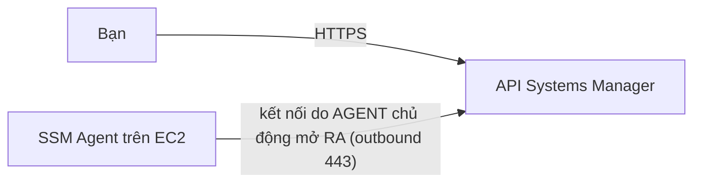

# Quản trị và giám sát

> **Tra nhanh:** bốn dịch vụ quan sát khác nhau ở chỗ nào, ai chặn được ai trong một tổ chức nhiều account, vào máy bằng đường nào khi không có SSH, và hạ tầng dạng mã trên AWS quản lý state ở đâu.

`Domain 1 · Secure (30%)` · `Domain 2 · Resilient (26%)` · `Domain 4 · Cost (20%)`

Chủ đề này không có miền riêng — nó rải khắp ba miền: CloudTrail và SCP là Domain 1,
alarm là Domain 2, log retention và Trusted Advisor là Domain 4. Nó ra thi nhiều hơn cảm
giác của bạn khi đọc tên file.

## Bản đồ

| Mục | Khi nào bạn cần đọc mục này |
|---|---|
| [1. Bốn dịch vụ quan sát](#1-bốn-dịch-vụ-quan-sát--mỗi-cái-trả-lời-một-câu-hỏi-khác-nhau) | Đề đưa bốn đáp án CloudWatch / CloudTrail / Config / X-Ray |
| [2. CloudWatch metric](#2-cloudwatch-metric--namespace-dimension-độ-phân-giải) | "Cảnh báo khi RAM đầy", "metric không thấy đâu" |
| [3. Alarm](#3-alarm--ba-trạng-thái-và-chỗ-cấu-hình-sai-im-lặng) | Alarm không kêu, hoặc kêu sai lúc |
| [4. CloudWatch Logs](#4-cloudwatch-logs--nơi-tiền-âm-thầm-chảy) | Metric filter, Logs Insights, hoá đơn log tăng đều |
| [5. CloudTrail](#5-cloudtrail--sổ-cái-api-của-account) | "Ai đã xoá cái này", audit, compliance |
| [6. AWS Config](#6-aws-config--trạng-thái-tài-nguyên-và-tuân-thủ) | "Tài nguyên có tuân thủ không", "cấu hình đã đổi thế nào" |
| [7. Organizations và SCP](#7-organizations--ranh-giới-tổ-chức) | Nhiều account, guardrail, hoá đơn gộp |
| [8. Systems Manager](#8-systems-manager--vào-máy-và-vận-hành-máy) | "Không mở port 22", patch hàng loạt, lưu config |
| [9. CloudFormation](#9-cloudformation--và-câu-chuyện-state) | IaC, change set, drift, nhiều account nhiều region |
| [10. Trusted Advisor, Service Quotas, Health](#10-trusted-advisor-service-quotas-health-dashboard) | "Best practice", "sắp chạm quota", "AWS có sự cố không" |
| [Bảng số phải nhớ](#bảng-số-phải-nhớ) | 30 phút trước giờ thi |

Liên quan: [bảo mật](05-security.md), [chi phí](10-chi-phi.md),
[tuần 10](../aws/w10-observability-iac.md).

---

## 1. Bốn dịch vụ quan sát — mỗi cái trả lời một câu hỏi khác nhau

Đây là bộ bốn đáp án đề SAA gài nhiều nhất. Đừng học thuộc bảng — học **câu hỏi** mà mỗi
dịch vụ trả lời được, rồi đọc đề xem nó đang hỏi câu nào.

| Dịch vụ | Trả lời câu hỏi | Đơn vị dữ liệu | Trục thời gian |
|---|---|---|---|
| **CloudWatch** | *"Hệ thống đang chạy thế nào?"* | metric, log event | **hiện tại và quá khứ gần** |
| **CloudTrail** | *"Ai đã gọi API gì, lúc nào, từ đâu?"* | API event | **quá khứ, bất biến** |
| **AWS Config** | *"Tài nguyên đang ở trạng thái nào, có tuân thủ không?"* | configuration item | **trạng thái tại từng mốc** |
| **X-Ray** | *"Request chậm ở đoạn nào?"* | trace, segment | **một request cụ thể** |

**Cặp bị nhầm nhiều nhất là CloudTrail và Config.** Hai câu để phân biệt dứt điểm:

- CloudTrail ghi **hành động**: `alice gọi ec2:AuthorizeSecurityGroupIngress lúc 14:02`.
  Nó biết ai làm, nhưng **không biết kết quả cuối cùng là gì**. Nếu ba người sửa cùng
  một security group trong một giờ, CloudTrail cho bạn ba dòng, còn trạng thái hiện tại
  thì bạn phải tự suy ra.
- Config ghi **trạng thái**: `sg-123 lúc 14:02 có rule 0.0.0.0/0:22 → KHÔNG tuân thủ`.
  Nó biết cái security group đang mở, nhưng bản thân nó **không biết ai mở** — Config
  đọc ngược lại CloudTrail để điền trường `relatedEvents`.

Quy tắc chọn đáp án: đề có chữ **who / audit / forensic / API call** → CloudTrail; có
chữ **compliant / configuration / desired state** → Config. Đề muốn cả hai ("phát hiện
security group bị mở và tự đóng lại") thì đáp án là **Config rule + remediation**, còn
CloudTrail chỉ là nguồn điều tra sau. Cách nhớ: CloudTrail là **camera an ninh**, Config
là **bản kiểm kê** — camera cho thấy người, kiểm kê cho thấy đồ.

---

## 2. CloudWatch metric — namespace, dimension, độ phân giải

Một metric được định danh bằng **ba** thứ, không phải một cái tên: **namespace**
(`AWS/EC2` — ai phát), **metric name** (`CPUUtilization`), và **dimensions**
(`InstanceId=i-abc` — tối đa **30** dimension mỗi metric).

**Đổi một dimension là tạo ra một metric hoàn toàn mới**, tính tiền riêng. Đây là cơ chế
đứng sau bẫy chi phí kinh điển: đẩy `request_id` hay `user_id` làm dimension thì mỗi
request sinh một metric mới và hoá đơn nổ. Namespace bắt đầu bằng `AWS/` là của AWS, bạn
không ghi vào được; custom metric nằm ở namespace của bạn (agent mặc định dùng `CWAgent`).

### Metric nào KHÔNG có sẵn — chỗ đề thi gài

Hypervisor thấy gì thì AWS cho bạn cái đó: CPU, gói tin ra vào, lệnh đọc ghi xuống EBS.
Nó **không** thấy bên trong hệ điều hành.

| Metric | Có sẵn? | Lấy bằng cách nào |
|---|---|---|
| `CPUUtilization`, `NetworkIn/Out`, status check | Có, `AWS/EC2` | mặc định |
| **Memory used** | **KHÔNG** | CloudWatch Agent → `CWAgent/mem_used_percent` |
| **Disk space used** (filesystem) | **KHÔNG** | CloudWatch Agent → `CWAgent/disk_used_percent` |
| Số process, log ứng dụng | **KHÔNG** | CloudWatch Agent (`procstat`) |
| EBS volume metric | Có, `AWS/EBS` | mặc định, chu kỳ 5 phút |

Vì sao RAM và dung lượng đĩa không có: cả hai là khái niệm **của hệ điều hành**. Ổ EBS
20 GB đang dùng bao nhiêu byte phụ thuộc filesystem bên trong — hypervisor chỉ thấy khối
block, không thấy inode. Phải có tiến trình chạy **trong** máy đọc `/proc/meminfo` và
`statfs()` rồi đẩy lên: đó chính là CloudWatch Agent.

Câu hỏi thi mẫu: *"cảnh báo khi bộ nhớ vượt 80%"* — đáp án sai hấp dẫn là "alarm trên
metric MemoryUtilization"; metric đó **không tồn tại**. Đáp án đúng luôn có hai vế: **cài
CloudWatch Agent** rồi mới tạo alarm. Agent cần IAM role có `CloudWatchAgentServerPolicy`;
mẹo vận hành: để file cấu hình agent trong **Parameter Store** rồi cho instance mới
`fetch-config` lúc khởi động, thay vì nhồi vào từng AMI.

### Độ phân giải — standard vs high-resolution

Standard resolution: chu kỳ nhỏ nhất **60 giây**, alarm period là bội số của 60. High
resolution (`StorageResolution: 1`, chỉ có ở custom metric): chu kỳ **1 giây**, và alarm
period hợp lệ là **10 hoặc 30 giây** — hai con số này ra thi.

**Detailed monitoring của EC2 là chuyện khác, đừng lẫn.** Nó chỉ chuyển metric EC2 từ
5 phút xuống **1 phút** (có tính phí), không liên quan gì tới high resolution 1 giây.
Đề nói *"phát hiện trong vòng một phút"* → detailed monitoring là đủ; đề nói
*"phản ứng trong vài giây"* → high-resolution custom metric.

### Metric hết hạn, và vì sao dashboard cũ trống trơn

CloudWatch **gộp dần** data point theo tuổi: chu kỳ dưới 60 giây giữ **3 giờ**, chu kỳ
60 giây giữ **15 ngày**, 300 giây giữ **63 ngày**, 3.600 giây giữ **455 ngày** (15 tháng).

Dữ liệu không bị xoá mà bị **hạ độ phân giải**: sau 15 ngày vẫn xem được nhưng chỉ ở mức
5 phút — muốn giữ số liệu 1 phút lâu hơn thì tự xuất ra S3. Chi tiết hay làm người ta
hoảng: **metric không có data point mới trong 2 tuần thì biến mất khỏi console** và khỏi
`list-metrics`, dù `get-metric-data` vẫn lấy được.

### Ba cách sinh custom metric, theo thứ tự chi phí

**Metric filter trên CloudWatch Logs** rẻ nhất — bạn đã trả tiền log rồi. **EMF
(Embedded Metric Format)** đứng thứ hai: ứng dụng in JSON có khối `_aws` vào log,
CloudWatch tự bóc thành metric, không tốn lời gọi API và giữ được cả log gốc — cách
khuyến nghị cho Lambda. **`PutMetricData`** đắt nhất và dễ bị throttle nhất; buộc phải
dùng thì gộp nhiều giá trị vào một lời gọi bằng `StatisticValues`.

---

## 3. Alarm — ba trạng thái và chỗ cấu hình sai im lặng

Ba trạng thái: `OK` (trong ngưỡng), `ALARM` (vượt ngưỡng đủ số chu kỳ), và
`INSUFFICIENT_DATA` (**không đủ data point để kết luận**). Cái thứ ba là nguồn gốc của
phần lớn sự cố giám sát.

`INSUFFICIENT_DATA` không phải lỗi — nó là câu trả lời trung thực "tôi không biết". Nhưng
nó **không kích hoạt hành động** của `ALARM`, nên alarm ở trạng thái này im lặng y hệt
alarm `OK`. Instance chết hẳn thì nó ngừng phát metric, alarm rơi vào `INSUFFICIENT_DATA`,
và bạn không nhận được gì cả.

### `M out of N` — hai tham số, đừng đặt bằng nhau theo phản xạ

`evaluation_periods` (N) là số chu kỳ nhìn lại; `datapoints_to_alarm` (M) là số chu kỳ
vượt ngưỡng cần có. Đặt `M = N` (mặc định) là đòi hỏi vượt ngưỡng **liên tiếp** — nhạy,
nhưng bỏ sót metric răng cưa. Đặt `M < N` ("3 trong 5") chống nhiễu tốt hơn với metric
gai. Đây là tham số phân biệt hai đáp án gần giống nhau khi đề nói *"tránh cảnh báo giả
do tải dao động"*.

### `treat_missing_data` — tham số bị hiểu sai nhiều nhất

Bốn giá trị, mặc định là `missing`:

| Giá trị | Chu kỳ thiếu dữ liệu được coi là | Dùng khi |
|---|---|---|
| `missing` (mặc định) | không tính, giữ nguyên trạng thái cũ | metric luôn có mặt |
| `notBreaching` | trong ngưỡng | metric chỉ xuất hiện khi có sự kiện (ví dụ `Errors` của Lambda) |
| `breaching` | vượt ngưỡng | **giám sát nhịp tim** — im lặng chính là dấu hiệu chết |
| `ignore` | bỏ qua hoàn toàn, giữ nguyên trạng thái | metric rời rạc và bạn không muốn nó tự đổi trạng thái |

**Bẫy tinh vi:** với `missing`, nếu CloudWatch nhận một data point vượt ngưỡng rồi sau
đó toàn dữ liệu trống, alarm **vẫn có thể chuyển sang `ALARM`** — nó lấy data point hợp
lệ gần nhất làm tín hiệu, nên số chu kỳ thực sự vượt ngưỡng ít hơn bạn cấu hình.

Quy tắc quyết định: hỏi *"không có dữ liệu là tin tốt hay tin xấu?"*. Với alarm kiểu
"job cron phải chạy mỗi giờ", không có dữ liệu là tin **xấu** → `breaching`. Với alarm
"số lỗi 5xx", không có dữ liệu là tin **tốt** → `notBreaching`.

### Composite alarm — chống bão cảnh báo

Alarm thường trỏ vào một metric; **composite alarm** trỏ vào biểu thức logic của các alarm
khác, ví dụ `ALARM(app-5xx-cao) AND NOT ALARM(db-dang-bao-tri)`. Hai công dụng ra thi: **gộp** (một sự cố hạ tầng làm 40 alarm kêu, composite gửi **một**
thông báo) và **chặn nhiễu** (`NOT ALARM(...)` để im lặng trong cửa sổ bảo trì). Nó không
tự đọc metric nên rẻ hơn và không rơi vào `INSUFFICIENT_DATA` vì lý do metric.

### Hành động của alarm

Bốn nhóm: **SNS**, **Auto Scaling** (scaling policy), **EC2 action**
(stop/terminate/reboot/recover), **Systems Manager** (OpsItem/incident). `recover` đáng
nhớ riêng: dùng cho `StatusCheckFailed_System` (lỗi phía hạ tầng AWS), di chuyển instance
sang phần cứng khác **giữ nguyên instance ID, private IP, Elastic IP và metadata** — đáp
án cho "phục hồi instance mà không đổi IP", khác hẳn ASG (thay bằng instance **mới**).

---

## 4. CloudWatch Logs — nơi tiền âm thầm chảy

Ba tầng: **log group** (`/aws/lambda/xu-ly-anh` — đơn vị cấu hình: retention, KMS, log
class) chứa **log stream** (một nguồn phát: một instance, một Lambda container) chứa
**log event** (một dòng có timestamp).

### Retention mặc định là VÔ HẠN — bẫy tiền số một

Tạo log group mà không đặt gì thì AWS giữ log **mãi mãi** — không cảnh báo, không mặc
định 30 ngày. Ingest tính tiền một lần (bậc đầu **$0,50/GB** ở us-east-1, giảm dần theo
bậc), nhưng **storage $0,03/GB mỗi tháng thì tính mãi mãi**: một cụm đẩy 100 GB log mỗi
tháng, sau ba năm là 3,6 TB log không ai đọc, khoảng $108/tháng chỉ để giữ. Giá trị
retention là danh sách rời rạc (1, 3, 5, 7, 14, 30, ... , **3.653** ngày = 10 năm) hoặc
"Never expire" — không đặt được 45 ngày.

```bash
# Rà toàn bộ log group chưa đặt retention — chạy ở mọi account, mọi region
aws logs describe-log-groups --profile learn \
  --query 'logGroups[?retentionInDays==`null`].logGroupName' --output text
```

Đề diễn đạt bẫy này bằng câu *"chi phí CloudWatch Logs tăng đều mỗi tháng dù lưu lượng
ổn định"*: nguyên nhân là storage cộng dồn, cách sửa rẻ nhất là **đặt retention**.

### Log class — Standard vs Infrequent Access

Chọn lúc **tạo** log group và **không đổi được sau đó**. Infrequent Access rẻ hơn khoảng
**50% ở phần ingest** (giá storage và giá Logs Insights thì như nhau), đổi lại mất
**metric filter và alarm**, **subscription filter**, **export sang S3**, Live Tail và
Container/Lambda Insights; Logs Insights và cross-account thì vẫn còn.

Hệ quả trực tiếp: log dùng để **cảnh báo** phải nằm ở Standard, log giữ để **audit** thì
IA. Chọn IA rồi mới phát hiện cần metric filter là phải tạo log group mới.

### Metric filter — biến log thành metric

CloudWatch alarm **không đọc được log**. Muốn cảnh báo theo nội dung log phải qua hai
bước: metric filter đếm số dòng khớp mẫu → sinh metric → alarm trên metric đó.

```hcl
resource "aws_cloudwatch_log_metric_filter" "loi_dang_nhap" {
  log_group_name = aws_cloudwatch_log_group.ung_dung.name
  pattern        = "{ $.eventName = \"ConsoleLogin\" && $.errorMessage = \"Failed authentication\" }"
  metric_transformation {
    name = "DangNhapThatBai"; namespace = "BaoMat"; value = "1"
    default_value = "0"   # không khớp thì phát 0 — nếu không, chu kỳ đó là THIẾU DỮ LIỆU
  }
}
```

Hai chi tiết ra thi: **metric filter chỉ áp cho log đến SAU khi tạo filter** (không quét
ngược log cũ), và `default_value = 0` là mẹo bắt buộc — thiếu nó thì chu kỳ không có dòng
khớp là chu kỳ **thiếu dữ liệu**, alarm hành xử theo `treat_missing_data` thay vì theo ý
bạn. Mẫu kiến trúc đề rất hay hỏi nguyên văn:
**CloudTrail → CloudWatch Logs → metric filter → alarm → SNS**, dùng để cảnh báo "root
đăng nhập" hay "có người tắt CloudTrail".

### Logs Insights — truy vấn khi cần điều tra

Ngôn ngữ riêng, không phải SQL:

```
fields @timestamp, @message | filter @message like /Timeout/
| stats count() as so_loi by bin(5m) | sort so_loi desc | limit 20
```

Điểm phải nhớ: nó **tính tiền theo GB quét** nên luôn thu hẹp khoảng thời gian trước; nó
**không dùng để cảnh báo liên tục** (việc đó là metric filter); và nó đọc được nhiều log
group cùng lúc, kể cả cross-account.

### Đưa log đi nơi khác

Xử lý gần thời gian thực (Lambda, OpenSearch, Firehose) → **subscription filter**. Đổ hàng
loạt sang S3 để lưu rẻ → **export task** hoặc Firehose. Xem log đang chảy như `tail -f` →
**Live Tail**. Gom log nhiều account → subscription filter cross-account.

---

## 5. CloudTrail — sổ cái API của account

CloudTrail **luôn bật**. Cái bạn bật thêm gọi là **trail** — nó quyết định log được
*giao* đi đâu và giữ bao lâu.

| | Event history | Trail |
|---|---|---|
| Có sẵn không | **có, mặc định, miễn phí** | phải tạo |
| Giữ bao lâu | **90 ngày** | tuỳ bạn (S3 lifecycle) |
| Ghi gì | chỉ management event | management + data + network activity |
| Xem ở đâu | Console, `lookup-events` | S3, tuỳ chọn thêm CloudWatch Logs |

Đây là bẫy điều tra: sự cố xảy ra 4 tháng trước, không ai tạo trail → **không lấy lại
được**. Event history đã hết hạn, và CloudTrail không dựng lại quá khứ.

### Ba loại event, và vì sao data event đắt

| Loại | Ví dụ | Mặc định | Giá |
|---|---|---|---|
| **Management event** | `RunInstances`, `CreateBucket`, `AssumeRole`, `PutBucketPolicy` | **bật** | **bản sao đầu tiên miễn phí**; bản sao thứ hai trở đi $2,00 / 100.000 event |
| **Data event** | `s3:GetObject`, `s3:PutObject`, `lambda:Invoke`, `dynamodb:PutItem` | **tắt** | $0,10 / 100.000 event |
| **Network activity event** | lời gọi API đi qua VPC endpoint | tắt | $0,10 / 100.000 event |

Con số $0,10 nghe rẻ. Cơ chế mới là thứ giết bạn: management event là **thao tác trên
hạ tầng** — vài nghìn mỗi ngày là nhiều. Data event là **thao tác trên dữ liệu** — một
bucket phục vụ ảnh cho website có thể sinh **hàng trăm triệu** `GetObject` mỗi ngày.
Bật data event cho toàn bộ bucket rồi bỏ đấy là công thức tạo ra hoá đơn CloudTrail lớn
hơn hoá đơn S3.

Cách làm đúng: bật data event có **advanced event selector** thu hẹp theo prefix hoặc
theo bucket cụ thể, và thường chỉ ghi thao tác **ghi** (`PutObject`, `DeleteObject`) chứ
không ghi thao tác đọc.

Câu hỏi thi mẫu: *"Cần biết ai đã xoá object trong một bucket"* — đáp án sai hấp dẫn là
"xem CloudTrail" (management event **không** chứa `DeleteObject`); đáp án đúng là
**bật data event cho bucket đó**. Ngược lại, "ai đã xoá cả bucket" thì `DeleteBucket`
là management event, có sẵn.

### Bốn cấu hình phải nhận ra ngay

**Multi-Region trail.** Ghi mọi region, kể cả region mở sau này — gần như luôn là đáp án
đúng, vì trail một region bỏ sót đúng chỗ kẻ tấn công hay chọn. Sự kiện dịch vụ global
(IAM, STS, CloudFront, Route 53) ghi dưới prefix **`us-east-1`**.

**Organization trail.** Tạo ở management account, ghi **mọi account thành viên** vào một
bucket, và member account **không tắt hay sửa được** — đáp án chuẩn cho "tập trung audit
log cả tổ chức, không cho account con vô hiệu hoá".

**Log file validation.** CloudTrail băm SHA-256 mỗi file log và mỗi giờ ký một **digest
file** (SHA-256 với RSA); ai sửa hay xoá một file thì `aws cloudtrail validate-logs` phát
hiện. Từ khoá: **"chứng minh log không bị giả mạo"**; ghép thêm **S3 Object Lock** chế độ
compliance và **MFA Delete** thì log bất biến thật sự. **Gửi song song sang CloudWatch
Logs** là cấu hình thứ tư: trail ghi vào S3 để *lưu*, muốn *cảnh báo* phải đẩy thêm sang
CloudWatch Logs rồi đặt metric filter.

### Độ trễ — con số hay bị hỏi

CloudTrail giao log vào S3 **trung bình khoảng 5 phút** sau lời gọi API (không có cam
kết cứng). CloudTrail **Insights** (phát hiện bất thường bằng học máy trên tần suất lời
gọi) giao trong khoảng **30 phút**, và lần bật đầu tiên phải chờ tới **36 giờ** để dựng
đường cơ sở. Kết luận thực hành: **CloudTrail không phải công cụ phát hiện tức thì**.
Đề nói "near real-time detection" → GuardDuty hoặc EventBridge, không phải CloudTrail.

**CloudTrail Lake** là kho event truy vấn bằng SQL, giữ tới **3.653 ngày** (10 năm) — nó
thay mẫu "đổ log vào S3 rồi dựng Athena" khi đề nhấn *"không muốn tự dựng hạ tầng truy
vấn"*.

---

## 6. AWS Config — trạng thái tài nguyên và tuân thủ

Đơn vị dữ liệu của Config là **configuration item (CI)**: ảnh chụp một tài nguyên tại một
thời điểm, gồm thuộc tính, tag, **quan hệ với tài nguyên khác** (`sg-123 gắn vào i-abc`),
và trỏ ngược tới CloudTrail event gây ra thay đổi. Chuỗi CI theo thời gian là
**configuration timeline**, thứ trả lời "tài nguyên này trông thế nào hồi tháng trước".
Quan hệ giữa các tài nguyên là điểm Config làm được mà CloudTrail không: nó vẽ được đồ
thị phụ thuộc nên trả lời được *"xoá subnet này thì ảnh hưởng gì"*.

### Rule, conformance pack, remediation

**Rule** trả về COMPLIANT / NON_COMPLIANT cho từng tài nguyên. Ba nguồn: **managed rule**
do AWS viết sẵn (không tốn phí Lambda), **custom rule** bằng Lambda, **custom policy rule**
bằng CloudFormation Guard (không cần Lambda nên rẻ hơn). Hai kiểu kích hoạt, và đây là chỗ
đề gài: **configuration change** (đánh giá ngay khi CI mới sinh ra) hoặc **periodic** (mỗi
1/3/6/12/24 giờ) — periodic **không** phát hiện tức thì.

**Conformance pack** gói rule + remediation thành một đơn vị triển khai, deploy được cho
cả một OU. Từ khoá: *"áp bộ chuẩn PCI DSS / HIPAA / CIS cho toàn tổ chức bằng một thao
tác"*. **Remediation** đáng nhớ ở cơ chế: Config **không tự sửa** — nó gọi một **SSM
Automation document**, nên mọi thứ SSM Automation làm được thì Config remediate được;
hai chế độ **automatic** và **manual**. **Aggregator** gom kết quả tuân thủ nhiều account
nhiều region về một bảng — từ khoá *"bảng điều khiển tuân thủ cho toàn tổ chức"*.

### Chi phí — Config là dịch vụ dễ đắt bất ngờ

**$0,003 mỗi configuration item** ghi lại, cộng **$0,001 mỗi lần đánh giá rule** (bậc
đầu), cộng phí conformance pack. Cơ chế đắt: tài nguyên thay đổi liên tục sinh CI liên
tục — một ASG co giãn suốt ngày, mỗi lần thêm bớt instance là một loạt CI cho instance,
ENI, volume, gắn security group. Hai cách hãm: chọn **specific resource types** thay vì
"all resource types", và dùng chế độ ghi **periodic** (24 giờ một lần nếu có thay đổi)
thay vì **continuous** cho loại tài nguyên ồn ào.

---

## 7. Organizations — ranh giới tổ chức

Cấu trúc là một cây: **Root** → **OU** (lồng tối đa **5 tầng**) → **account**. Account là
ranh giới cô lập mạnh nhất trên AWS ([xem 00](00-nen-tang.md)); Organizations làm cho việc
có nhiều account trở nên quản lý được. Hai chế độ: **consolidated billing only** và
**all features** (mở khoá SCP, RCP, backup policy, tag policy) — mọi câu hỏi SAA giả định
all features.

### SCP — trần quyền, KHÔNG phải quyền

Đây là câu duy nhất bạn phải thuộc: **SCP không bao giờ cấp quyền cho ai cả.** Nó chỉ
định nghĩa *tối đa* những gì IAM trong account đó được phép cho phép. Quyền hiệu lực là
**giao** của SCP và IAM policy. Chi tiết cơ chế đánh giá nằm ở
[05-security.md](05-security.md#2-luồng-đánh-giá-quyền--sáu-cửa-một-request-phải-qua);
ở đây chỉ giữ những hệ quả vận hành:

- User có `AdministratorAccess` trong account bị SCP chỉ cho `ec2:*` thì vẫn không gọi
  được S3. `Allow` trong SCP nghĩa là "cửa này không chặn", không phải "được".
- **SCP không áp lên management account** — vì thế khuyến nghị chuẩn là management account
  **không chạy workload nào cả**; nó là account không có guardrail.
- SCP **không áp lên service-linked role**, cũng không áp lên principal ngoài tổ chức
  (việc của RCP). Mỗi entity phải luôn có **ít nhất một** SCP.

Con số phải nhớ (tính đến 2026-08): tối đa **10 SCP** gắn trực tiếp vào root / mỗi OU /
mỗi account, kích thước **10.240 ký tự** mỗi policy, tối đa **10.000** SCP trong tổ chức,
**2.000** OU. Policy kế thừa từ cấp trên **không** tính vào hạn mức 10. Rất nhiều tài
liệu ôn còn ghi 5 SCP và 5.120 ký tự — xem [Nguồn nói khác](#nguồn-nói-khác).

Hai chiến lược viết SCP, chọn một, đừng trộn:

| | Deny list (khuyến nghị) | Allow list |
|---|---|---|
| Cách làm | giữ `FullAWSAccess`, thêm SCP chỉ chứa `Deny` | gỡ `FullAWSAccess`, liệt kê tường minh cái được phép |
| Ưu | dịch vụ mới tự động dùng được | kiểm soát chặt tuyệt đối |
| Nhược | phải nhớ deny những gì | **mỗi lần dùng dịch vụ mới phải sửa SCP**; rất dễ tự khoá chính mình |

Ba SCP thực dụng đề hay mô tả: chặn `organizations:LeaveOrganization`; chặn tắt
CloudTrail/Config/GuardDuty; **khoá region** bằng `aws:RequestedRegion` — nhớ chừa dịch vụ
global (IAM, STS, CloudFront, Route 53, Support), nếu không bạn tự khoá luôn cả IAM.

### Consolidated billing — cơ chế, không chỉ là "gộp hoá đơn"

Ba thứ xảy ra mà đề hay hỏi:

1. **Bậc giá gộp theo tổ chức.** Ba account dùng 20 TB S3 được tính như một khách hàng
   60 TB, nên cùng rơi vào bậc rẻ hơn.
2. **RI và Savings Plan dùng chung.** RI mua ở account A, nếu A không dùng hết thì **tự
   động phủ** lên instance khớp ở account B. Bật mặc định, tắt được từng account bằng cờ
   *RI/SP discount sharing*. Đây là lý do rất mạnh để dùng Organizations, và đề hay lấy
   làm đáp án đúng. Cách chọn RI/SP ở [10-chi-phi.md](10-chi-phi.md).
3. **Zonal RI ưu tiên chính account mua nó**; phần dư mới chia cho account khác.

Bẫy nhỏ nhưng có ra: **RI mua theo Availability Zone thì áp theo AZ ID chứ không phải tên
`us-east-1a`** — tên AZ được xáo trộn khác nhau ở mỗi account, nên "cùng us-east-1a" giữa
hai account có thể là hai datacenter khác nhau.

**AWS Control Tower** (một dòng, đúng phạm vi SAA): dựng sẵn một landing zone nhiều
account theo best practice — log archive account, audit account, Account Factory, và
guardrail đóng gói sẵn. Từ khoá nhận diện: **"landing zone"**, **"thiết lập môi trường
nhiều account theo chuẩn"**. Nó dùng Organizations + SCP + Config bên dưới, không thay
thế chúng.

---

## 8. Systems Manager — vào máy và vận hành máy

Một cái tên chung cho **nhiều công cụ rời** dùng chung một agent; đề chỉ hỏi bạn nhận ra
cái nào giải bài toán nào. Điều kiện chung: máy phải là **managed node** — (1) có **SSM
Agent** chạy, (2) có **IAM role** với `AmazonSSMManagedInstanceCore`, (3) có đường ra tới
endpoint SSM. Thiếu một trong ba thì instance **không xuất hiện** trong danh sách; đây là
lỗi số một khi làm lab và cũng là chi tiết đề hay hỏi ngược.

### Session Manager — vì sao nó thay được SSH và bastion

Đây là mục ra thi nhiều nhất của cả SSM. Cơ chế:



Agent mở kết nối **đi ra**; security group là stateful nên chiều về đi kèm. Bốn hệ quả
chính là bốn từ khoá của đề: **không cần mở port 22/3389** (inbound rỗng vẫn vào được
shell), **không cần bastion host**, **không cần key pair**, **không cần public IP hay
internet gateway** nếu dùng VPC interface endpoint.

Đường ra bắt buộc là HTTPS 443 tới `ssm.<region>.amazonaws.com` và
`ssmmessages.<region>.amazonaws.com` (`ec2messages` trước 2024 cũng bắt buộc; region ra
mắt từ 2024 trở đi không dùng endpoint đó nữa); ghi log phiên và mã hoá thì mở thêm
`logs`, `s3`, `kms`. Instance private subnet: đi qua NAT Gateway, hoặc — sạch và rẻ hơn —
**VPC interface endpoint**, lúc đó máy không có đường ra internet nào mà vẫn quản trị được.

Ba thứ SSH không cho: **mọi phiên nằm trong CloudTrail**; **nội dung phiên ghi được** ra
S3 hoặc CloudWatch Logs; **phân quyền bằng tag** qua condition `ssm:resourceTag/`. Thêm
nữa, **port forwarding** cho phép chọc tunnel tới RDS trong private subnet không cần
bastion.

```bash
aws ssm start-session --target i-0123456789abcdef0 --profile learn
# tunnel tới RDS qua chính instance đó: --document-name AWS-StartPortForwardingSessionToRemoteHost
```

### Parameter Store

Kho cấu hình phân cấp (`/ung-dung/prod/db/host`), ba kiểu giá trị: `String`, `StringList`,
`SecureString` (mã hoá bằng KMS). So sánh đầy đủ với Secrets Manager ở
[05-security.md](05-security.md#9-secrets-manager-vs-parameter-store); ở đây cần nhớ
**Standard miễn phí, 4 KB, 10.000 tham số** và **Advanced $0,05/tham số/tháng, 8 KB,
100.000**, và Parameter Store **không tự xoay vòng bí mật** — đó là ranh giới với Secrets
Manager. Công dụng ít ai nghĩ tới: làm **nguồn tham số cho CloudFormation**
(`{{resolve:ssm:/ung-dung/prod/ami}}`) và chứa **file cấu hình CloudWatch Agent**.

### Patch Manager, Run Command, Automation, State Manager

| Công cụ | Bài toán | Chi tiết ra thi |
|---|---|---|
| **Patch Manager** | vá OS hàng loạt theo lịch | **patch baseline** (luật duyệt, có `approval delay` chờ N ngày sau khi bản vá ra) + **patch group** (gắn bằng tag `Patch Group`) + **maintenance window** |
| **Run Command** | chạy một lệnh trên hàng nghìn máy, ngay | chọn máy **theo tag**, rate control (`max-concurrency`, `max-errors`), kết quả ra S3/CloudWatch |
| **Automation** | runbook nhiều bước, có rẽ nhánh và phê duyệt | tạo AMI vàng, **là cơ chế remediation của AWS Config** |
| **State Manager** | giữ máy ở trạng thái mong muốn theo lịch | thứ gần Ansible nhất trong SSM |
| **Inventory** | kiểm kê phần mềm đã cài | ghép với Config: "máy nào còn cài gói dính CVE" |
| **Fleet Manager** | xem đĩa, tiến trình, registry từ console | không cần vào shell |

Phân biệt hay ra thi: **Run Command là một lệnh chạy một lần**; **State Manager là một
trạng thái lặp lại theo lịch**; **Automation là một quy trình nhiều bước**. SSM cũng quản
lý được **máy on-premises** qua **hybrid activation** — đáp án cho "quản lý tập trung cả
máy datacenter lẫn EC2".

---

## 9. CloudFormation — và câu chuyện state

### Từ vựng tối thiểu

Template (YAML/JSON) mô tả tài nguyên; **stack** là một lần hiện thực hoá template đó.
Sáu khối: `Parameters`, `Mappings` (bảng tra tĩnh, hay dùng cho AMI ID theo region),
`Conditions`, `Resources` (**khối duy nhất bắt buộc**), `Outputs` (có `Export` để stack
khác `ImportValue`), `Transform` (macro — `AWS::Serverless` chính là SAM).

Bốn cơ chế đề hỏi thẳng:

**Change set.** Xem trước AWS *sẽ* làm gì — quan trọng nhất là nó chỉ ra tài nguyên nào
bị **Replacement: True**, tức xoá đi tạo lại (đổi `AvailabilityZone` của instance, đổi
`DBInstanceIdentifier` của RDS) và **mất dữ liệu** nếu bạn không để ý. Từ khoá:
*"preview changes"*, *"avoid unintended replacement"*.

**Drift detection.** So sánh trạng thái thật với template, chỉ ra chỗ ai đó sửa tay.
Chi tiết hay bị bỏ qua: nó là **thao tác gọi theo yêu cầu, không chạy tự động** — muốn
tự động thì đặt EventBridge rule theo lịch gọi `DetectStackDrift`, hoặc dùng Config rule
`cloudformation-stack-drift-detection-check`.

**Nested stack vs cross-stack export.** Nested stack là template con **thuộc sở hữu** của
template cha — để **tái sử dụng một mẫu** ("VPC chuẩn", "ALB chuẩn"). `Export`/`ImportValue`
là để **chia sẻ giá trị giữa các stack độc lập**. Bẫy: giá trị đã bị stack khác
`ImportValue` thì **không sửa và không xoá được** — export là một cam kết API, đừng export bừa.

**StackSet.** Triển khai một template ra **nhiều account và nhiều region** trong một
thao tác. Hai kiểu quyền: *self-managed* (bạn tự tạo role hai đầu) và *service-managed*
(qua Organizations, có **automatic deployment** — account mới thêm vào OU tự nhận stack).
Từ khoá: *"áp một baseline cho mọi account, kể cả account tạo sau này"*.

### `DeletionPolicy` — câu hỏi mà ai cũng gặp một lần trong đời thật

Mặc định, xoá stack là xoá sạch tài nguyên. Với database và bucket thì đó là thảm hoạ.

```yaml
Resources:
  DuLieuKhachHang:
    Type: AWS::RDS::DBInstance
    DeletionPolicy: Snapshot          # Delete | Retain | Snapshot
    UpdateReplacePolicy: Retain       # áp khi update GÂY RA replacement
    Properties: { ... }
```

- `Delete` — mặc định. `Retain` — **giữ lại tài nguyên**, nó thành "mồ côi" và bạn tự
  quản lý từ đó; đây là đáp án cho *"xoá stack nhưng phải giữ dữ liệu"*.
- `Snapshot` — chụp snapshot rồi mới xoá; chỉ áp cho loại có snapshot (RDS, EBS,
  ElastiCache, Redshift, Neptune, DocumentDB).
- `RetainExceptOnCreate` — giữ lại, trừ khi xoá là do rollback của lần **tạo** đầu tiên.

`UpdateReplacePolicy` là anh em song sinh và là chỗ người ta quên: `DeletionPolicy` chỉ
bảo vệ khi **xoá stack**, không bảo vệ khi một lần **update** làm tài nguyên bị thay thế.
Muốn an toàn thật thì đặt cả hai; thêm một lớp nữa là **stack policy**, chặn update lên
những logical ID cụ thể.

### State: CloudFormation vs Terraform vs Ansible

| | Terraform | CloudFormation | Ansible |
|---|---|---|---|
| State nằm ở đâu | **file `terraform.tfstate`** do bạn lưu (S3 + khoá) | **phía AWS**, gắn vào stack, bạn không đụng vào | **không có state** |
| Biết tài nguyên nào là "thừa" không | có — so config với state | có — so template với stack | **không** |
| Xem trước | `terraform plan` | **change set** | `--check` (phụ thuộc module) |
| Rollback khi hỏng giữa chừng | **không có** — bạn ở trạng thái nửa vời, tự dọn | **có, tự động** — thất bại thì quay về trạng thái trước |
| Khoá đồng thời | phải tự dựng (S3 lock / DynamoDB) | **có sẵn**, stack tự khoá khi đang thao tác |  không áp dụng |
| Phát hiện sửa tay | `plan` refresh mỗi lần chạy → thấy ngay | **drift detection**, phải gọi riêng | không thấy |
| Phạm vi | nhiều nhà cung cấp | chỉ AWS | cấu hình **bên trong** máy |

Ba điều rút ra đáng nhớ hơn cái bảng:

**1. "Có state" là điều kiện để biết cái gì thừa.** Bạn xoá một `resource` khỏi file
`.tf`; Terraform vẫn biết nó tồn tại vì state còn ghi, nên `plan` ra `destroy`. Xoá một
resource khỏi template CloudFormation cũng vậy — stack là state. Ansible thì không: một
task bị xoá khỏi playbook đơn giản là **không chạy nữa**, thứ nó từng tạo ra vẫn nằm đó
mãi mãi. Đấy là lý do Ansible không phải công cụ sở hữu vòng đời hạ tầng.

**2. Idempotency của Ansible là trách nhiệm của người viết task.** Terraform và
CloudFormation idempotent vì **engine** so sánh trạng thái mong muốn với state. Ansible
idempotent vì **từng module** được viết để kiểm tra trước khi làm — và `command` với
`shell` thì không có gì kiểm tra cả, nên `shell: echo x >> /etc/hosts` chạy ba lần là ba
dòng. Đây chính là ranh giới dùng đúng: **Terraform/CloudFormation dựng hạ tầng, Ansible
cấu hình bên trong máy đã dựng.**

**3. State phía AWS đổi tiện lợi lấy cái giá là refresh.** CloudFormation không phải tự
lưu, không lộ secret trong file state, không cần khoá phân tán — nhưng **không đối chiếu
với thực tế trước mỗi thao tác**; drift là một API riêng bạn phải nhớ gọi. Terraform
refresh mỗi lần `plan` nên thấy sửa tay ngay, đổi lại bạn gánh việc lưu và khoá state.

**Đề SAA không hỏi Terraform.** Nhưng nó hỏi đúng những chỗ khác biệt ở trên dưới dạng
tình huống: *"xem trước thay đổi"* → change set; *"phát hiện ai đó sửa tay"* → drift
detection; *"triển khai ra 200 account"* → StackSet; *"xoá stack nhưng giữ database"* →
`DeletionPolicy: Retain`; *"tái sử dụng mẫu mạng chuẩn"* → nested stack.

Quota đáng nhớ: **500 resource** mỗi template, **200** parameter/output/mapping,
**2.000 stack** mỗi region, template gửi trực tiếp **51.200 byte** còn qua S3 thì **1 MB**.
Chạm trần 500 resource là lý do kỹ thuật của câu "chia nhỏ stack", không phải chỉ vì gọn.

**AWS CDK** một dòng: viết bằng TypeScript/Python rồi `synth` ra template CloudFormation —
nó là **bộ sinh template**, không phải công cụ thứ ba. **Service Catalog**: đóng gói
template thành "sản phẩm được duyệt" cho người khác tự phục vụ, kèm launch constraint để
họ dựng tài nguyên mà không cần quyền trực tiếp.

---

## 10. Trusted Advisor, Service Quotas, Health Dashboard

Ba dịch vụ nhỏ, hay đứng chung một câu hỏi vì cùng trả lời dạng "AWS mách cho bạn".

**Trusted Advisor** — quét account theo best practice, năm nhóm: cost, performance,
security, fault tolerance, **service limits**. Điểm ra thi là **phạm vi theo gói
support**: gói **Basic** chỉ có đủ nhóm service limit cộng **sáu** kiểm tra bảo mật cốt
lõi (S3 bucket permissions, security group mở port nhạy cảm, IAM use, MFA trên root, EBS
và RDS public snapshot); đủ bộ kiểm tra và API thì phải gói trả phí. Đó là lý do đáp án
"dùng Trusted Advisor" đôi khi sai — đề nói account đang ở Basic.

**Service Quotas** — nơi xem và **xin tăng** quota, có API nên tự động hoá được, và tạo
được **CloudWatch alarm khi mức dùng chạm x% quota**. Trusted Advisor *báo* bạn sắp chạm
trần; Service Quotas là nơi *xử lý*. Nhắc lại điều rất hay ra: **quota tính theo từng
region và từng account** — mắt xích hay làm hỏng kịch bản DR (xem
[13](13-khoi-phuc-tham-hoa.md)).

**AWS Health Dashboard** — hai mặt: **Service health** (tình trạng chung của AWS) và
**Your account health**, trước gọi Personal Health Dashboard (sự kiện ảnh hưởng **đúng
tài nguyên của bạn**: instance sắp retire, bảo trì EBS). Cái thứ hai là đáp án khi đề nói
*"chủ động báo cho đội vận hành khi AWS có sự kiện ảnh hưởng hệ thống của chúng tôi"*, và
cơ chế tự động hoá là **EventBridge rule trên nguồn `aws.health`** → SNS/Lambda.
**Organizational view** gom sự kiện mọi account về một chỗ.

**Compute Optimizer** một dòng: khuyến nghị right-sizing dựa trên học máy cho EC2, ASG,
EBS, Lambda, ECS on Fargate. Chi tiết ở [10-chi-phi.md](10-chi-phi.md#8-right-sizing--tìm-tiền-đang-nằm-không).

---

## Bảng số phải nhớ

| Thứ | Con số | Ghi chú |
|---|---|---|
| CloudWatch metric mặc định EC2 | **5 phút** | detailed monitoring: **1 phút**, có phí |
| High-resolution custom metric | **1 giây** | alarm period hợp lệ: **10 hoặc 30 giây** |
| Giữ metric | 3 giờ / **15 ngày** / 63 ngày / **455 ngày** | theo chu kỳ <60s / 60s / 300s / 3600s |
| Dimension mỗi metric | tối đa **30** | đổi dimension = metric mới = tiền mới; metric im 2 tuần thì biến khỏi console |
| Trạng thái alarm | **3**: OK / ALARM / **INSUFFICIENT_DATA** | mặc định `treat_missing_data = missing` |
| CloudWatch Logs retention | **mặc định vô hạn** | 1 ngày – **3.653 ngày** (10 năm) |
| CloudWatch Logs giá | ingest ~**$0,50/GB** (bậc đầu), storage **$0,03/GB/tháng** | IA rẻ hơn ~50% phần ingest, **mất metric filter** |
| CloudTrail event history | **90 ngày**, miễn phí | chỉ management event |
| CloudTrail management event | **bản sao đầu tiên miễn phí** | bản sao sau: **$2,00 / 100.000** |
| CloudTrail data event | **$0,10 / 100.000** | mặc định **TẮT**; đây là nguồn hoá đơn bất ngờ |
| CloudTrail độ trễ giao log | trung bình **~5 phút** | Insights **~30 phút**, lần đầu chờ tới **36 giờ** |
| CloudTrail Lake | tới **3.653 ngày** | truy vấn SQL, không cần trail |
| AWS Config | **$0,003** / configuration item | + **$0,001** / lần đánh giá rule |
| SCP | **10** mỗi entity, **10.240 ký tự** | tài liệu cũ ghi 5 và 5.120 — sai |
| OU | lồng **5 tầng**, **2.000** OU / tổ chức | account mặc định **10**, xin tăng tới 50.000 |
| Parameter Store | Standard: **4 KB**, 10.000, **miễn phí** | Advanced: 8 KB, 100.000, $0,05/tham số |
| CloudFormation | **500 resource**, 200 param, 200 output | template 51.200 byte / **1 MB** qua S3 |
| CloudFormation stack | **2.000** mỗi region | StackSet: 1.000, 100.000 stack instance |
| Trusted Advisor gói Basic | **6** kiểm tra bảo mật + đủ nhóm service limit | đủ bộ và API cần gói trả phí |

---

## Bẫy đề thi

**1. "Tạo alarm trên metric `MemoryUtilization` của EC2."**
Metric đó **không tồn tại**. RAM và dung lượng filesystem là khái niệm của hệ điều hành,
hypervisor không thấy. Phải **cài CloudWatch Agent** trước; metric hiện ở namespace
`CWAgent`. Cùng logic cho `disk_used_percent`.

**2. "CloudTrail cho biết ai đã xoá object trong bucket."**
**Không**, trừ khi đã bật **data event** cho bucket đó — `DeleteObject` là data event, mặc
định tắt; `DeleteBucket` mới là management event và có sẵn. Đây là lý do người ta phát
hiện mình không audit được đúng lúc cần nhất.

**3. "Bật data event cho toàn bộ S3 để audit đầy đủ."**
Đúng kỹ thuật, **sai chi phí**: một bucket phục vụ website sinh hàng trăm triệu
`GetObject` mỗi ngày; ở $0,10/100.000 event là vài trăm đô mỗi ngày, và data event không
có bậc giá giảm dần. Đáp án đúng dùng **advanced event selector** thu hẹp theo prefix và
thường chỉ ghi thao tác ghi/xoá; nhu cầu "ai đọc gì" ở bucket lưu lượng cao thì
**S3 server access log** rẻ hơn nhiều.

**4. "Dùng CloudTrail để phát hiện bất thường theo thời gian thực."**
CloudTrail giao log trung bình **~5 phút**, Insights **~30 phút** — nó là công cụ *điều
tra*, không phải *phát hiện*. "Near real-time threat detection" → **GuardDuty**; "phản ứng
ngay khi có API cụ thể" → **EventBridge rule**.

**5. "CloudTrail và Config làm cùng một việc."**
CloudTrail ghi **hành động**, Config ghi **trạng thái**. "Ai mở port 22" → CloudTrail;
"security group nào đang mở port 22" → Config; "phát hiện và tự đóng lại" → **Config rule
+ remediation** chạy bằng SSM Automation.

**6. "Log group không tốn tiền lưu trữ vì log tự hết hạn."**
Mặc định là **Never expire**: ingest tính một lần, storage tính **mãi mãi**. Triệu chứng
trong đề: *"chi phí CloudWatch tăng đều dù lưu lượng không đổi"*. Sửa rẻ nhất là đặt
`retention_in_days`. Nguyên nhân cần loại trừ song song: custom metric có **dimension
cardinality cao** (`request_id`, `user_id`).

**7. "Chuyển hết log sang Infrequent Access để tiết kiệm."**
Đúng một nửa: IA rẻ hơn ~50% **phần ingest** nhưng giá **storage thì như nhau**, và mất
metric filter, subscription filter, export sang S3, Live Tail. Log dùng để cảnh báo phải
ở Standard, và log class **không đổi được sau khi tạo log group**.

**8. "SCP `Allow ec2:*` cấp quyền EC2 cho account con."**
SCP **không bao giờ cấp quyền**: quyền hiệu lực là giao của SCP và IAM policy, người dùng
vẫn cần IAM policy cho phép. Và **SCP không áp lên management account** — lý do management
account phải trống, không chạy workload.

**9. "Muốn vào EC2 trong private subnet thì phải dựng bastion host."**
Đúng: **Session Manager** không cần bastion, không cần port 22 mở, không cần key pair,
không cần public IP. Yêu cầu là SSM Agent + IAM role + đường ra 443 tới `ssm` và
`ssmmessages` (VPC interface endpoint là đủ, không cần internet); mọi phiên vào CloudTrail
và ghi lại được ra S3. Instance không hiện trong danh sách thì ba nguyên nhân theo thứ tự:
thiếu **instance profile**, **không có đường ra 443**, agent không chạy — sửa bằng cách
thêm endpoint, không phải mở inbound.

**10. "Xoá stack CloudFormation thì database vẫn còn vì nó quan trọng."**
Đúng: mặc định **xoá sạch**. Muốn giữ phải khai `DeletionPolicy: Retain` (hoặc `Snapshot`),
và vì `DeletionPolicy` **không** bảo vệ khỏi update gây replacement, phải thêm
`UpdateReplacePolicy`.

**11.** "Triển khai baseline cho 200 account" → **StackSet** service-managed + automatic
deployment; nested stack là để tái dùng mẫu *trong một* stack, việc khác hẳn.
**12.** "Dùng Trusted Advisor rà mọi vấn đề" — chỉ đúng với gói trả phí; gói **Basic** chỉ
có 6 kiểm tra bảo mật cốt lõi và nhóm service limit, nên đề nêu "Basic Support" là đang
loại đáp án này. **13.** "Sự kiện bảo trì EBS ảnh hưởng instance của tôi" → **Your account
health** (Personal Health Dashboard) chứ không phải Service health; tự động hoá bằng
**EventBridge rule trên `aws.health`**.

---

## Cây quyết định

**Cần biết chuyện gì đã xảy ra.** "Ai gọi API nào" → **CloudTrail** (thao tác dữ liệu
phải bật data event). "Tài nguyên ở trạng thái nào, có tuân thủ không" → **Config**.
"Hệ thống chạy ra sao" → **CloudWatch**. "Request chậm ở đâu" → **X-Ray**. "Ai đang tấn
công" → **GuardDuty** ([05](05-security.md)).

**Cần cảnh báo.** Metric có sẵn → **CloudWatch alarm**. Metric của hệ điều hành →
**CloudWatch Agent** rồi mới alarm. Điều kiện nằm trong nội dung log → **metric filter**
rồi alarm. Nhiều alarm cùng kêu vì một nguyên nhân → **composite alarm**. Phản ứng theo
một sự kiện AWS cụ thể (state change, health event) → **EventBridge rule**, không phải
alarm.

**Cần tự sửa.** Sai lệch cấu hình → **Config rule + remediation** (SSM Automation).
Instance chết → **ASG health check** thay máy, hoặc **CloudWatch alarm action `recover`**
nếu phải giữ nguyên IP. Quy trình nhiều bước có phê duyệt → **SSM Automation**.

**Cần vào máy.** Shell tương tác → **Session Manager**. Chạy một lệnh trên nhiều máy →
**Run Command**. Giữ máy ở một trạng thái theo lịch → **State Manager**. Vá OS →
**Patch Manager** + maintenance window. Không bao giờ chọn bastion + key pair nếu đề
không ép.

**Cần dựng hạ tầng bằng mã.** Chỉ AWS, muốn rollback tự động và không giữ state →
**CloudFormation**; nhiều account/region → **StackSet**; viết bằng ngôn ngữ lập trình →
**CDK**; cho đội khác tự phục vụ trong hàng rào → **Service Catalog**; cấu hình bên trong
máy đã dựng → **Ansible / State Manager**.

**Cần quản trị nhiều account.** Gộp hoá đơn và chia sẻ RI/SP → **Organizations**; trần
quyền cho account/OU → **SCP**; chặn kẻ ngoài tổ chức chạm resource → **RCP**; dựng sẵn
cả môi trường theo chuẩn → **Control Tower**; audit tập trung không cho tắt →
**organization trail** + **Config aggregator**.

---

## Nối với thực hành

| Lab | Chạm vào mục nào |
|---|---|
| [`labs/w10-observability-iac/`](../../learn-aws/labs/w10-observability-iac/) | Mục 2–4 và 9. Lab cố ý gây lỗi Lambda để alarm chuyển `OK → ALARM` và gửi email thật. Sau khi `verify.sh` xanh, thử đổi `treat_missing_data` sang `breaching` rồi ngừng gọi Lambda — alarm sẽ kêu vì im lặng, đó là mục 3 xảy ra trước mắt bạn. |
| [`labs-self/w10-observability-iac/`](../../learn-aws/labs-self/w10-observability-iac/) | Bản tự viết. Bài tập đáng giá nhất: tạo log group **không** đặt `retention_in_days`, chạy lệnh rà ở mục 4 và thấy chính log group của mình trong danh sách. |
| [`labs/w01-iam-foundations/`](../../learn-aws/labs/w01-iam-foundations/) | Mục 7. Sau khi tạo xong role, thử gọi một API ngoài phạm vi và đối chiếu `implicitDeny` với `explicitDeny` trong Policy Simulator. |
| [`labs/w03-ec2-alb-asg/`](../../learn-aws/labs/w03-ec2-alb-asg/) | Mục 8. Instance của lab này không mở port 22; `aws ssm start-session --target <id>` là cách duy nhất vào. Nếu vào không được, chạy `aws ssm describe-instance-information` để xem máy có phải managed node không. |
| [`labs-self/w03-ec2-alb-asg/`](../../learn-aws/labs-self/w03-ec2-alb-asg/) | Bản tự viết. Tự gắn instance profile và tự dựng VPC endpoint cho `ssm` + `ssmmessages` là bài tập đúng trọng tâm mục 8. |
| [`labs/w09-security-deep/`](../../learn-aws/labs/w09-security-deep/) | Mục 5, 6, 8. Parameter Store `SecureString`, và mẫu CloudTrail → CloudWatch Logs → metric filter → alarm. |

Toàn bộ `labs/` và `labs-self/` viết bằng Terraform. Đọc lại mục
[state](#9-cloudformation--và-câu-chuyện-state) sau khi bạn đã một lần `terraform destroy`
nhầm — đó là cách nhớ tốt nhất về "có state nghĩa là công cụ biết cái gì thừa".

---

## Nguồn nói khác

Chỗ `aws-saa-c03/06-management-governance.md` và `aws-saa-c03/Q-service-comparisons.md`
sai, cũ hoặc thiếu (kiểm chứng ngày 2026-08-21):

| Nguồn nói | Thực tế | Docs |
|---|---|---|
| `06-management-governance.md` **không có mục nào** cho CloudWatch, CloudTrail, AWS Config | Ba dịch vụ giám sát quan trọng nhất bị đẩy tản mát sang `05-security-services.md` và `Q-service-comparisons.md`. Toàn bộ mục 1–6 của file này được viết mới từ docs chính thức. | [CloudWatch concepts](https://docs.aws.amazon.com/AmazonCloudWatch/latest/monitoring/cloudwatch_concepts.html) |
| "CloudTrail: **Retention 90 days (default)**" | 90 ngày là của **Event history**, không phải của trail. Trail giao vào S3 và giữ **bao lâu tuỳ bạn**; CloudTrail Lake giữ tới **3.653 ngày**. | [CloudTrail concepts](https://docs.aws.amazon.com/awscloudtrail/latest/userguide/cloudtrail-concepts.html) |
| "CloudTrail Real-Time: **No (15 min delay)**" | Docs hiện tại: giao log **trung bình khoảng 5 phút**. Insights ~30 phút, lần bật đầu tiên chờ tới **36 giờ**. Kết luận không đổi (không dùng để phát hiện tức thì) nhưng con số thì sai. | [Getting and viewing log files](https://docs.aws.amazon.com/awscloudtrail/latest/userguide/get-and-view-cloudtrail-log-files.html) |
| "CloudTrail: **$2/100k events**" | Thiếu vế quan trọng nhất: **bản sao đầu tiên của management event là miễn phí**. $2,00/100.000 chỉ áp cho bản sao **thứ hai trở đi**. Data event và network activity event là **$0,10/100.000**. Nhầm chỗ này dẫn tới quyết định kiến trúc sai. | [CloudTrail pricing](https://aws.amazon.com/cloudtrail/pricing/) |
| "CloudWatch: **$0.30/GB ingested**" | us-east-1: Standard **$0,50/GB** bậc đầu (giảm dần theo bậc tới $0,05/GB), Infrequent Access **$0,25/GB**; storage **$0,03/GB/tháng**. Và nguồn không hề nhắc **retention mặc định là vô hạn** — bẫy tiền lớn nhất của CloudWatch Logs. | [Log classes](https://docs.aws.amazon.com/AmazonCloudWatch/latest/logs/CloudWatch_Logs_Log_Classes.html) |
| "CloudWatch Metrics: Standard 5-minute (free), Detailed 1-minute (paid)" | Đúng cho EC2 nhưng thiếu **high-resolution 1 giây** cho custom metric, và thiếu toàn bộ chuyện **metric hết hạn theo độ phân giải** (3 giờ / 15 ngày / 63 ngày / 455 ngày). | [Metrics concepts](https://docs.aws.amazon.com/AmazonCloudWatch/latest/monitoring/cloudwatch_concepts.html) |
| Không nơi nào nói **memory và disk không có sẵn** | Đây là bẫy CloudWatch ra thi nhiều nhất. Cần **CloudWatch Agent**, metric xuất hiện ở namespace `CWAgent`. | [Gửi metric memory/disk](https://repost.aws/knowledge-center/cloudwatch-memory-metrics-ec2) |
| "SCPs: Apply to OUs or accounts" — không có con số | Tối đa **10 SCP** mỗi entity (không phải 5 như tài liệu ôn cũ), **10.240 ký tự** mỗi policy (không phải 5.120), OU lồng **5 tầng**, **2.000** OU. | [Organizations quotas](https://docs.aws.amazon.com/organizations/latest/userguide/orgs_reference_limits.html) |
| "Trusted Advisor — Basic/Developer: **7 core checks**" | Docs hiện tại: Basic có **đủ nhóm Service Limits** cộng **6** kiểm tra bảo mật/fault tolerance cụ thể. Ngoài ra AWS đã công bố **ngừng Developer Support, Business Support và Enterprise On-Ramp từ 01/01/2027**, thay bằng **Business Support+** và **Unified Operations** — đề SAA-C03 vẫn hỏi theo mô hình cũ, nhưng đừng mang con số "7" đi cãi nhau ngoài đời. | [Trusted Advisor](https://docs.aws.amazon.com/awssupport/latest/user/trusted-advisor.html) · [Premium Support FAQ](https://aws.amazon.com/premiumsupport/faqs/) |
| "Session Manager: Shell access without SSH/RDP" — hết | Thiếu **cơ chế** (agent mở kết nối RA, nên inbound rỗng vẫn vào được) và thiếu **điều kiện** (IAM role + đường ra 443 tới `ssm`/`ssmmessages`). Thiếu hai thứ đó thì không giải được câu hỏi ngược "vì sao instance không hiện trong danh sách". Chi tiết mới: `ec2messages` không còn dùng ở region ra mắt từ 2024. | [Troubleshooting SSM Agent](https://docs.aws.amazon.com/systems-manager/latest/userguide/troubleshooting-ssm-agent.html) |
| CloudFormation: liệt kê tính năng, **không có một con số quota nào** | 500 resource / template, 200 parameter, 200 output, 2.000 stack / region, template 51.200 byte trực tiếp và 1 MB qua S3. Chạm trần 500 là lý do kỹ thuật của việc tách nested stack. | [CloudFormation quotas](https://docs.aws.amazon.com/AWSCloudFormation/latest/UserGuide/cloudformation-limits.html) |
| Nguồn không nhắc `DeletionPolicy` và `UpdateReplacePolicy` | Đây là câu hỏi CloudFormation ra thi nhiều nhất, và là chỗ mất dữ liệu thật ngoài đời. | [DeletionPolicy](https://docs.aws.amazon.com/AWSCloudFormation/latest/UserGuide/aws-attribute-deletionpolicy.html) |

---

## Ngoài phạm vi

- **AWS License Manager** — theo dõi license BYOL, chống vượt hạn mức. Nhận diện tên là đủ.
  [docs](https://docs.aws.amazon.com/license-manager/)
- **CloudWatch Application Signals, Synthetics canary, RUM, Evidently** — tầng APM.
  [docs](https://docs.aws.amazon.com/AmazonCloudWatch/latest/monitoring/CloudWatch-Application-Monitoring-Sections.html)
- **AWS Proton, AWS Resilience Hub, AWS Audit Manager** — mức Professional/Specialty.
  [docs](https://docs.aws.amazon.com/audit-manager/)
- **CloudFormation Hooks, macro, custom resource, module** — cơ chế mở rộng, không ra thi.
  [docs](https://docs.aws.amazon.com/AWSCloudFormation/latest/UserGuide/hooks.html)
- **SSM Change Manager, OpsCenter, Incident Manager, Distributor**, và **Control Tower
  Account Factory for Terraform (AFT)** — vận hành quy mô doanh nghiệp, không ra thi.
  [docs](https://docs.aws.amazon.com/systems-manager/)

---

## Tự kiểm tra

**1.** Đội vận hành muốn cảnh báo khi phân vùng `/var` của một fleet EC2 vượt 85% dung
lượng. Mô tả đầy đủ đường đi từ số liệu tới email, và nói rõ vì sao bước đầu tiên là bắt
buộc.

<details><summary>Đáp án</summary>

Bước đầu bắt buộc là **cài CloudWatch Agent**, vì `disk_used_percent` là khái niệm của
**filesystem** — hypervisor chỉ thấy khối block của EBS, không biết bên trong có bao nhiêu
byte đang dùng; không có tiến trình chạy *trong* máy đọc `statfs()` thì metric không tồn tại.

Đường đi: IAM instance profile có `CloudWatchAgentServerPolicy` → cài agent (Run Command
hoặc user data) → cấu hình `disk.measurement = disk_used_percent`, lưu trong Parameter
Store để instance mới tự `fetch-config` → metric hiện ở namespace **`CWAgent`** với
dimension `path`, `device`, `fstype`, `InstanceId` → alarm → SNS → email (nhớ **xác nhận**
đăng ký, nếu không alarm kêu vào hư không). Điểm cộng: `datapoints_to_alarm` nhỏ hơn
`evaluation_periods` để chống nhiễu.

</details>

**2.** Một security group bị mở `0.0.0.0/0:22`. Bạn cần (a) biết ai mở, (b) biết nó đã bị
mở bao lâu, (c) tự động đóng lại lần sau. Ba dịch vụ nào cho ba việc đó, và vì sao không
thể dùng một dịch vụ cho cả ba?

<details><summary>Đáp án</summary>

(a) **CloudTrail** — `AuthorizeSecurityGroupIngress` là management event, có sẵn, cho
biết principal, thời điểm, IP nguồn, user agent.
(b) **AWS Config** — configuration timeline của `sg-xxx` cho biết CI nào bắt đầu chứa rule
đó và CI nào gỡ nó ra, tức là khoảng thời gian phơi nhiễm.
(c) **Config rule** (`restricted-ssh`) với **remediation tự động**, thực thi bằng một
**SSM Automation document** gọi `RevokeSecurityGroupIngress`.

Vì sao không một dịch vụ: CloudTrail ghi **hành động** nhưng không giữ **trạng thái** —
nó không tự trả lời "hiện giờ còn mở không". Config ghi **trạng thái** nhưng không biết
**ai** gây ra (chỉ trỏ ngược tới CloudTrail qua `relatedEvents`). Và cả hai **không tự
sửa** — sửa là việc của SSM Automation, Config chỉ kích hoạt nó.

</details>

**3.** Đề yêu cầu quản trị 500 EC2 trong private subnet, không được mở bất kỳ inbound rule
nào, không được có internet gateway, và mọi phiên phải ghi lại được để audit. Thiết kế, và
ba điều kiện bắt buộc để nó chạy.

<details><summary>Đáp án</summary>

**Session Manager**, không bastion, không key pair. Cơ chế: SSM Agent **chủ động mở kết
nối ra** tới dịch vụ Systems Manager qua HTTPS 443; security group là stateful nên chiều
về đi kèm — vì thế inbound rule rỗng vẫn vào được shell.

Ba điều kiện: (1) **SSM Agent** đang chạy trên máy; (2) **IAM instance profile** có
`AmazonSSMManagedInstanceCore`; (3) **đường ra 443** tới `ssm.<region>.amazonaws.com` và
`ssmmessages.<region>.amazonaws.com` — vì đề cấm internet gateway nên phải là **VPC
interface endpoint** (PrivateLink), không phải NAT.

Ghi audit hai tầng: **CloudTrail** ghi *ai mở phiên nào tới máy nào*; **session logging**
ra S3/CloudWatch Logs ghi *nội dung* phiên (cần thêm endpoint `kms`, `logs`, `s3`).
Instance không hiện trong `describe-instance-information` thì kiểm tra đúng ba điều kiện
trên — gần như luôn thiếu (2) hoặc (3).

</details>

**4.** Nêu ba việc Terraform làm được mà Ansible không, xuất phát từ một khác biệt duy
nhất, và nói CloudFormation nằm ở đâu trong bức tranh đó.

<details><summary>Đáp án</summary>

Khác biệt gốc: **Terraform có state, Ansible không.**

Ba hệ quả: (1) **Biết cái gì thừa** — xoá một resource khỏi `.tf` thì state vẫn nhớ nó
tồn tại nên `plan` ra `destroy`; xoá một task khỏi playbook thì Ansible chỉ đơn giản
không chạy task đó nữa, thứ nó từng tạo vẫn nằm đó vĩnh viễn. (2) **Xem trước chính xác**
— `plan` là diff ba chiều giữa config, state và thực tế. (3) **Phát hiện sửa tay** — mỗi
lần `plan` đều refresh nên drift lộ ra ngay.

Hệ quả thứ tư: **idempotency của Ansible là trách nhiệm của người viết task**, không
phải của engine — `shell:` và `command:` không có gì để so sánh. Ranh giới dùng đúng:
Terraform/CloudFormation **sở hữu vòng đời hạ tầng**, Ansible **cấu hình bên trong máy**.

CloudFormation cũng có state, nhưng nằm **phía AWS** gắn vào stack. Được: không phải lưu
file, không lộ secret, khoá đồng thời có sẵn, **rollback tự động** khi hỏng giữa chừng —
thứ Terraform không có. Mất: **không refresh trước mỗi thao tác** nên phải gọi **drift
detection** riêng, và chỉ nói được tiếng AWS.

</details>

**5.** Alarm được cấu hình `period=60`, `evaluation_periods=3`, `datapoints_to_alarm=3`,
mặc định `treat_missing_data`. Instance bị kernel panic và ngừng phát mọi metric. Alarm ở
trạng thái nào sau 10 phút, và bạn sửa cấu hình thế nào để lần sau nó kêu?

<details><summary>Đáp án</summary>

**`INSUFFICIENT_DATA`** — và đây là điểm chính: trạng thái đó **không kích hoạt alarm
action**, nên nó im lặng y hệt `OK`. Máy chết hẳn là kịch bản mà alarm dựa trên metric
của chính máy đó thất bại.

Sửa: đặt **`treat_missing_data = breaching`** cho alarm mang tính "nhịp tim" — không có
dữ liệu chính là dấu hiệu chết. Tốt hơn nữa, đừng chỉ dựa vào metric ứng dụng: dùng
**`StatusCheckFailed_Instance` / `_System`**, hoặc để **ASG health check** thay máy.

Chiều ngược lại cũng hay bị nhầm: với `missing`, nếu CloudWatch nhận một data point vượt
ngưỡng rồi sau đó toàn dữ liệu trống, alarm **vẫn có thể sang `ALARM`** vì nó lấy data
point hợp lệ gần nhất làm tín hiệu — `missing` không hề "an toàn trung lập" như tên gọi.

</details>
