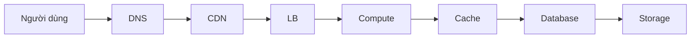
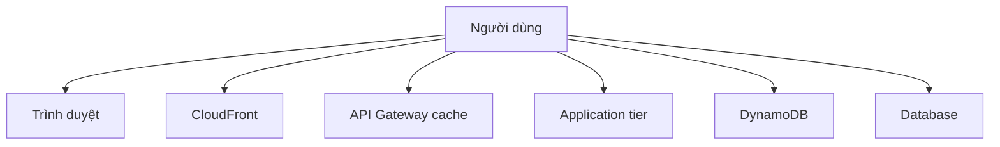
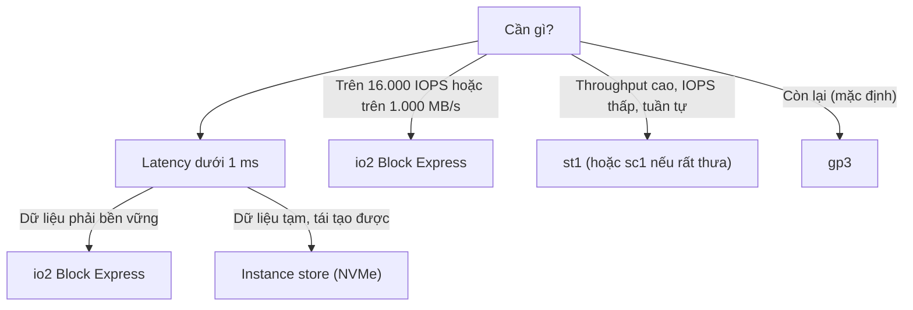
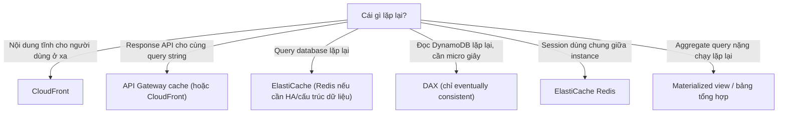

# Hiệu năng — chọn đúng công cụ cho đúng dạng tải

> **Tra nhanh:** bạn đang cầm một câu hỏi có chữ `lowest latency`, `improve
> performance`, `handle increased load` và cần biết nghẽn nằm ở tầng nào trước khi
> chọn dịch vụ.

`Domain 3 · Design High-Performing Architectures (24% đề)`

24% của 65 câu là khoảng **16 câu**. Miền này khác Domain 2 ở chỗ: Domain 2 hỏi
"hệ thống có sống không", Domain 3 hỏi "hệ thống có đủ nhanh không". Cùng một kiến
trúc có thể sẵn sàng cao mà chậm, hoặc nhanh mà mong manh.

---

## Bản đồ

| Mục | Khi nào bạn cần đọc mục này |
|---|---|
| [1. Tìm nghẽn trước khi chọn](#1-tìm-nghẽn-trước-khi-chọn-dịch-vụ) | Luôn luôn. Đọc mục này trước mọi mục khác |
| [2. Chọn compute](#2-chọn-compute-theo-dạng-tải) | Đề mô tả một khối lượng công việc và hỏi chạy nó trên gì |
| [3. Chọn storage](#3-chọn-storage-theo-iops-throughput-latency) | Đề đưa con số IOPS, MB/s, hoặc nói "database needs faster disk" |
| [4. Chọn database](#4-chọn-database-theo-mẫu-truy-vấn) | Đề mô tả cách dữ liệu được truy vấn |
| [5. Caching ở mọi tầng](#5-caching--thêm-cache-ở-tầng-nào) | Đề hỏi "how to reduce latency" hoặc "reduce load on the database" |
| [6. Read replica](#6-read-replica--scale-đọc-và-giới-hạn-của-nó) | Đề nói database quá tải vì đọc |
| [7. Sharding và hot partition](#7-sharding-partitioning-hot-partition) | Đề nhắc DynamoDB throttling, "one shard is much busier" |
| [8. Scale up vs scale out](#8-scale-up-vs-scale-out) | Đề hỏi "how should the application scale" |
| [9. Placement group và mạng](#9-placement-group-và-enhanced-networking--cho-hpc) | Đề nhắc HPC, MPI, "node-to-node communication" |
| [10. Global Accelerator](#10-global-accelerator-vs-cloudfront) | Đề nhắc static IP, non-HTTP, global TCP/UDP |
| [11. Đo bằng gì](#11-đo-bằng-gì--metric-nào-cho-biết-cái-gì-đang-nghẽn) | Đề hỏi "how would you identify the bottleneck" |
| [12. p50 vs p99](#12-p50-vs-p99--vì-sao-trung-bình-nói-dối) | Đề nhắc "some users experience slow response" |

---

## 1. Tìm nghẽn trước khi chọn dịch vụ

Câu hỏi hiệu năng luôn có một tầng đang nghẽn, và đáp án đúng nhắm vào đúng tầng đó.
Chọn nhầm tầng thì giải pháp đúng về mặt kỹ thuật vẫn là đáp án sai.



| Tầng | DNS | CDN | LB | Compute | Cache | Database | Storage |
|---|---|---|---|---|---|---|---|
| nghẽn ở | hiếm | cache miss | ít gặp | CPU/RAM cạn kiệt | cache miss | query chậm, lock | IOPS/throughput cạn |

Bốn dấu hiệu trong đề và tầng tương ứng:

| Đề nói gì | Nghẽn ở đâu | Đáp án nhắm vào |
|---|---|---|
| "Users in Asia experience high latency, users in the US do not" | Khoảng cách vật lý | CloudFront, Global Accelerator, Region gần hơn |
| "Response time increases as the number of users grows" | Compute hoặc database | Scale out, cache, read replica |
| "The database CPU is at 90% during business hours" | Database | Read replica, cache, right-size, đổi engine |
| "Disk queue length is high but CPU is low" | Storage I/O | Đổi volume type, tăng IOPS, đổi sang instance store |

**Nguyên tắc thứ tự:** giải pháp rẻ và nhanh trước, giải pháp cấu trúc sau.

1. **Cache** — thường cho cải thiện lớn nhất trên mỗi đồng bỏ ra
2. **Right-size / đổi thế hệ instance** — đôi khi rẻ hơn *và* nhanh hơn
3. **Scale out** — thêm bản sao
4. **Đổi kiến trúc dữ liệu** — sharding, đổi database engine. Đắt và rủi ro nhất

Đề thi hầu như luôn muốn bạn dừng ở bước 1 hoặc 2. Đáp án "shard the database" chỉ
đúng khi đề nói rõ rằng cache và read replica đã được thử và không đủ.

---

## 2. Chọn compute theo dạng tải

| Dạng tải | Chọn | Vì sao |
|---|---|---|
| Request ngắn, sự kiện rời rạc, dưới 15 phút | **Lambda** | Scale tự động tới hàng nghìn concurrent, không quản máy |
| Container, tải thay đổi, không muốn quản node | **Fargate** | Không có cluster để chăm |
| Container quy mô lớn, tải đều, cần tối ưu giá | **ECS/EKS trên EC2** | Bin-packing tốt hơn, dùng được Spot và RI |
| Cần kiểm soát OS, kernel module, GPU đặc thù | **EC2** | Toàn quyền |
| CPU cao liên tục (mã hóa, transcoding, nén) | **EC2 họ C** (compute optimized) | Tỉ lệ vCPU/RAM cao nhất |
| Dữ liệu lớn nằm trong RAM (cache, in-memory DB, SAP) | **EC2 họ R hoặc X** (memory optimized) | Tỉ lệ RAM/vCPU cao nhất |
| I/O cực cao trên đĩa cục bộ (NoSQL tự quản, data warehouse) | **EC2 họ I hoặc D** (storage optimized) | NVMe instance store, hàng triệu IOPS |
| ML training, rendering, video encoding | **EC2 họ P, G, hoặc Inf/Trn** | GPU / chip chuyên dụng |
| Tải thấp phần lớn thời gian, đôi khi bật lên | **EC2 họ T** (burstable) | Rẻ, nhưng xem cảnh báo bên dưới |
| Batch chia nhỏ được, chịu gián đoạn | **AWS Batch trên Spot** | Xem [10-chi-phi.md](10-chi-phi.md#3-spot--rẻ-nhất-nếu-kiến-trúc-chịu-được-gián-đoạn) |

### Cảnh báo về họ T — CPU credit

Instance họ T (t3, t4g) có **baseline** CPU thấp (t3.micro: 10% của 2 vCPU) và tích
lũy **CPU credit** khi chạy dưới baseline. Chạy trên baseline thì tiêu credit. Hết
credit thì:

- **`unlimited` mode** (mặc định với t3/t4g): vẫn chạy nhanh nhưng **tính thêm tiền**
  cho phần vượt. Hóa đơn tăng âm thầm.
- **`standard` mode**: bị bóp về baseline. Ứng dụng chậm đột ngột và bạn không hiểu vì sao.

Đề mô tả *"the application performs well for a while, then becomes slow"* hoặc
*"CPU utilization is capped at 20%"* → **CPU credit đã cạn**. Metric cần xem:
`CPUCreditBalance`. Đáp án: đổi sang họ M/C, hoặc bật unlimited mode và chấp nhận
chi phí. Họ T **sai** cho mọi workload có tải CPU đều.

### Lambda — ba con số hiệu năng

- **Bộ nhớ quyết định CPU.** 1.769 MB ≈ 1 vCPU đầy đủ; 10.240 MB ≈ 6 vCPU. Tăng bộ
  nhớ cho hàm CPU-bound thường làm nó **rẻ hơn** vì chạy xong nhanh hơn nhiều so với
  mức tăng giá. Đây là điều phản trực giác và đề có ra.
- **Thời gian chạy tối đa 15 phút.** Đề mô tả job dài hơn → không phải Lambda; chọn
  Fargate, Batch, hoặc chia nhỏ bằng Step Functions.
- **Cold start.** Giảm bằng **Provisioned Concurrency** (giữ sẵn môi trường đã khởi
  tạo, trả tiền theo giờ) hoặc **SnapStart** (Java, Python, .NET — chụp ảnh trạng
  thái sau khi init). Đề nói "consistent low latency for a user-facing API" →
  Provisioned Concurrency. Đề nói "reduce cost" → **không** phải Provisioned Concurrency.

---

## 3. Chọn storage theo IOPS, throughput, latency

Ba chỉ số khác nhau, và đề thi phân biệt chúng:

- **IOPS** — số thao tác I/O mỗi giây. Quan trọng với **file nhỏ, truy cập ngẫu
  nhiên**: database transactional, boot volume.
- **Throughput (MB/s)** — lượng byte mỗi giây. Quan trọng với **file lớn, tuần tự**:
  log, big data, video, backup.
- **Latency** — độ trễ một thao tác. Quan trọng khi **mỗi thao tác nằm trong đường
  đi của request người dùng**.

### Bảng số ra quyết định — EBS và instance store

| Loại | IOPS tối đa/volume | Throughput tối đa/volume | Latency | Dung lượng | Dùng khi |
|---|---|---|---|---|---|
| **gp3** (SSD, mặc định) | 16.000 (baseline 3.000) | 1.000 MB/s (baseline 125) | ms một chữ số | 1 GiB – 16 TiB | Mặc định cho gần như mọi thứ. IOPS và throughput **cấu hình độc lập với dung lượng** |
| **gp2** (SSD, thế hệ cũ) | 16.000 (3 IOPS/GiB, burst 3.000) | 250 MB/s | ms một chữ số | 1 GiB – 16 TiB | Không có lý do chọn mới. gp3 rẻ hơn ~20% và tốt hơn |
| **io2 Block Express** (SSD) | **256.000** | **4.000 MB/s** | **dưới 500 µs** | 4 GiB – 64 TiB | Database lớn, mission-critical. Durability 99,999%. Hỗ trợ Multi-Attach tới 16 instance |
| **io1** (SSD, thế hệ cũ) | 64.000 | 1.000 MB/s | ms một chữ số | 4 GiB – 16 TiB | Chỉ khi đề nêu tên nó |
| **st1** (HDD throughput) | 500 | 500 MB/s | cao | 125 GiB – 16 TiB | Log, big data, streaming tuần tự. **Không** dùng làm boot volume |
| **sc1** (HDD lạnh) | 250 | 250 MB/s | cao nhất | 125 GiB – 16 TiB | Dữ liệu truy cập rất thưa, rẻ nhất |
| **Instance store** (NVMe cục bộ) | hàng trăm nghìn đến hàng triệu | hàng GB/s | **thấp nhất có thể** | Theo instance type | **Ephemeral** — mất khi stop/terminate. Dùng cho cache, scratch, buffer |

Bốn quyết định rút ra:

1. **Cần trên 16.000 IOPS hoặc trên 1.000 MB/s trên một volume → io2 Block Express.**
   Đây là ngưỡng chia đôi giữa gp3 và io2 trong mọi câu hỏi.
2. **Cần độ trễ dưới 1 ms → io2 Block Express** (dưới 500 µs) hoặc **instance store**.
   gp3 không đạt.
3. **Throughput cao mà không cần IOPS → st1**, rẻ hơn nhiều so với gp3 cùng MB/s.
4. **"Lowest possible latency" và dữ liệu tái tạo được → instance store.** Đề luôn
   cài chi tiết "data can be regenerated" hoặc "temporary" để cho phép instance store.
   Nếu đề nói "must persist" thì instance store bị loại ngay.

**Bẫy bị bỏ sót: giới hạn của instance, không phải của volume.** Một instance
`m5.large` chỉ có ~4.750 Mbps băng thông EBS. Gắn một io2 với 100.000 IOPS vào nó
thì bạn vẫn bị chặn ở mức instance. Đề mô tả "tăng IOPS của volume mà không nhanh
hơn" → nghẽn ở **EBS bandwidth của instance type**, cần instance lớn hơn hoặc
EBS-optimized.

### File storage

| | EFS | FSx for Windows | FSx for Lustre | S3 |
|---|---|---|---|---|
| Giao thức | NFS (Linux) | **SMB** (Windows, AD) | Lustre (POSIX) | HTTP API |
| Truy cập đồng thời | Hàng nghìn client | Hàng nghìn | Hàng nghìn | Không giới hạn thực tế |
| Throughput | Elastic, tự scale | Theo cấu hình | **hàng trăm GB/s** | Rất cao, scale theo prefix |
| Latency | ms một chữ số | ms một chữ số | **dưới ms** | chục ms |
| Multi-AZ | Có (trừ One Zone) | Có | Không (1 AZ) | Có |
| Dùng khi | File share Linux dùng chung | File share Windows/AD | **HPC, ML training** | Object, dữ liệu lớn, static asset |

Nhận diện nhanh: đề nhắc **Windows/Active Directory/SMB** → FSx for Windows. Đề nhắc
**HPC/machine learning training/hàng trăm GB/s** → FSx for Lustre (và nó tích hợp
trực tiếp với S3). Đề nhắc **shared file system cho nhiều EC2 Linux** → EFS.

**S3 throughput.** S3 cho ít nhất 3.500 PUT/COPY/POST/DELETE và 5.500 GET/HEAD mỗi
giây **trên mỗi prefix**, và số prefix không giới hạn. Nghĩa là muốn throughput cao
hơn thì **trải key qua nhiều prefix**. Tài liệu cũ dạy "thêm hash ngẫu nhiên vào đầu
key" — điều này đã **không còn cần thiết** từ 2018, S3 tự scale theo prefix. Đề vẫn
có thể đưa nó làm đáp án sai.

---

## 4. Chọn database theo mẫu truy vấn

Chọn database theo **cách dữ liệu được truy vấn**, không theo "dữ liệu là gì".

| Mẫu truy vấn trong đề | Chọn |
|---|---|
| Query phức tạp, JOIN nhiều bảng, transaction ACID, schema cố định | **RDS** (hoặc Aurora nếu cần hiệu năng/HA cao hơn) |
| Truy cập theo khóa chính, độ trễ mili giây đơn, quy mô rất lớn, schema linh hoạt | **DynamoDB** |
| Như trên nhưng cần **micro giây** | **DynamoDB + DAX** |
| Truy vấn phân tích trên hàng tỉ dòng, quét cột, báo cáo BI | **Redshift** |
| Phân tích ad-hoc trên dữ liệu đã nằm ở S3, chạy thỉnh thoảng | **Athena** (không có cluster để nuôi) |
| Tìm kiếm toàn văn, log analytics, aggregation phức tạp | **OpenSearch Service** |
| Quan hệ nhiều-nhiều, "bạn của bạn", phát hiện gian lận theo mạng lưới | **Neptune** (graph) |
| Dữ liệu JSON, tương thích MongoDB API | **DocumentDB** |
| Dữ liệu chuỗi thời gian (IoT, metric) | **Timestream** |
| Cache, leaderboard, pub/sub, session store | **ElastiCache** |

Ba nhận diện nhanh nhất trong đề:

- **"millisecond latency at any scale"** + truy cập theo key → DynamoDB.
- **"microsecond"** → **DAX** (nếu nguồn là DynamoDB) hoặc ElastiCache.
- **"complex queries with joins"** hoặc **"existing MySQL application"** → RDS/Aurora.
  DynamoDB không JOIN được — đây là lý do loại nó nhanh nhất.

**Aurora vs RDS.** Aurora là engine tương thích MySQL/PostgreSQL do AWS viết lại tầng
storage. Khác biệt ra thi: throughput cao hơn RDS thường (AWS công bố tới 5 lần MySQL,
3 lần PostgreSQL), storage tự lớn tới 128 TiB, 6 bản trên 3 AZ, tới 15 reader với
độ trễ replica thường dưới 100 ms (so với read replica RDS dùng replication của engine,
độ trễ có thể tính bằng giây), failover dưới 30 giây. Đề nói "cần hiệu năng cao hơn
và độ trễ replica thấp hơn cho MySQL hiện tại" → **Aurora**.

Chi tiết đầy đủ ở [`03-database.md`](03-database.md).

---

## 5. Caching — "thêm cache ở tầng nào"

Đây là dạng câu hỏi ra thi nhiều nhất của Domain 3. Cache có ở mọi tầng, và mỗi tầng
giải một loại vấn đề khác nhau.



- Trình duyệt — Cache-Control header ← rẻ nhất, nhanh nhất, bạn không trả gì
- CloudFront — Cache nội dung tĩnh và cả động (theo TTL, header, cookie). Giải: latency địa lý + tải lên origin + phí egress
- API Gateway cache — Cache response của một stage (0,5 GB – 237 GB). Giải: gọi backend lặp lại cho cùng một query string
- Application tier — ElastiCache (Redis/Memcached). Giải: query database lặp lại, session, kết quả tính toán
- DynamoDB — DAX, cache trong suốt, micro giây. Giải: đọc lặp lại trên DynamoDB
- Database — Materialized view / bảng tổng hợp sẵn. Giải: query aggregate nặng chạy đi chạy lại

### Chọn tầng theo dấu hiệu trong đề

| Đề nói gì | Cache ở tầng nào |
|---|---|
| "Users far from the Region experience high latency for images/video/static files" | **CloudFront** |
| "The same API response is returned to many users; backend load is high" | **API Gateway cache** hoặc CloudFront (nếu là HTTP GET) |
| "The database receives the same query thousands of times per second" | **ElastiCache** |
| "Session data must be shared across instances" | **ElastiCache Redis** (đây là state store, không hẳn cache) |
| "DynamoDB read latency must go from milliseconds to microseconds" | **DAX** |
| "A complex aggregation query takes 30 seconds and runs on every page load" | **Materialized view** hoặc bảng tổng hợp cập nhật định kỳ |
| "Leaderboard / real-time ranking" | **ElastiCache Redis** (sorted set) |

### ElastiCache Redis vs Memcached

| | Redis | Memcached |
|---|---|---|
| Cấu trúc dữ liệu | List, set, sorted set, hash, stream | Chỉ key-value chuỗi |
| Replication và failover | **Có** | Không |
| Persistence (snapshot, AOF) | **Có** | Không |
| Pub/sub, transaction, Lua | Có | Không |
| Đa luồng | Không (Redis cổ điển) | **Có** — tận dụng nhiều core tốt hơn |
| Scale | Cluster mode: sharding tới 500 node | Thêm node, dữ liệu phân bố client-side |

Quy tắc: **cần bất kỳ tính năng nào ngoài key-value đơn thuần → Redis.** Memcached
chỉ thắng khi cần cache đơn giản, đa luồng, và mất dữ liệu không sao. Đề nói cần HA
cho cache → **luôn là Redis**.

### DAX — bốn điều ra thi

1. Cho đọc ở mức **micro giây**, so với mili giây của DynamoDB.
2. **Trong suốt với ứng dụng** — đổi endpoint, không đổi logic. Đây là điểm mạnh
   so với ElastiCache (phải tự viết logic cache-aside).
3. Là **write-through** cache: ghi đi qua DAX xuống DynamoDB rồi mới trả về.
4. **Chỉ tăng tốc eventually consistent read.** Strongly consistent read đi thẳng
   xuống DynamoDB, không được cache. Đề cài chi tiết "strongly consistent" để loại DAX.

### Ba mẫu cache và bẫy của chúng

- **Cache-aside (lazy loading).** Ứng dụng đọc cache; miss thì đọc database rồi ghi
  vào cache. Ưu: chỉ cache thứ thực sự được dùng. Nhược: mỗi lần miss tốn thêm một
  lượt đi-về; dữ liệu có thể cũ.
- **Write-through.** Ghi vào database và cache cùng lúc. Ưu: cache luôn tươi. Nhược:
  ghi chậm hơn, và cache đầy dữ liệu không ai đọc.
- **TTL.** Luôn đặt TTL, kể cả với write-through. Không có TTL thì dữ liệu cũ sống mãi.

**Cache stampede** là bẫy đáng nhớ: khi một key nóng hết hạn, hàng nghìn request cùng
miss và cùng lao xuống database. Đề mô tả "database spikes every few minutes" →
nghi ngờ TTL đồng loạt. Cách xử lý: TTL ngẫu nhiên hóa (jitter), hoặc refresh chủ
động trước khi hết hạn.

---

## 6. Read replica — scale đọc và giới hạn của nó

Read replica là bản sao **chỉ đọc**, cập nhật **bất đồng bộ** từ primary.

Giải quyết được:
- Tải đọc nặng (báo cáo, dashboard, analytics) tách khỏi tải ghi
- Đọc gần người dùng hơn (cross-Region read replica)
- Nguồn để promote thành database độc lập khi migrate

**Không** giải quyết được:
- **Tải ghi.** Mọi ghi vẫn dồn về một primary. Đây là giới hạn cứng của mô hình này.
- **HA.** Replica không tự promote. Xem
  [11-san-sang-cao.md](11-san-sang-cao.md#2-rà-single-point-of-failure).
- **Đọc cần chính xác tuyệt đối.** Có replica lag.

### Replica lag — chi tiết ra thi

| | RDS read replica | Aurora reader |
|---|---|---|
| Cơ chế | Replication của engine (binlog/WAL) | Đọc chung tầng storage |
| Độ trễ điển hình | Mili giây đến **vài giây**, tăng khi ghi nhiều | Thường **dưới 100 ms** |
| Số lượng tối đa | 5 (MySQL/MariaDB/PostgreSQL/Oracle) | **15** |
| Cross-Region | Có | Có (qua Aurora Global Database) |
| Tự động promote khi primary chết | **Không** | **Có** (nếu là thành viên cluster) |

Đề mô tả *"the reporting dashboard sometimes shows data that is a few seconds old"* →
đó là replica lag, và nó là **hành vi đúng**, không phải lỗi. Nếu đề nói không chấp
nhận được → phải đọc từ primary, hoặc chuyển sang Aurora (lag thấp hơn nhiều).

**Ứng dụng phải biết chia traffic.** Read replica có endpoint riêng; ứng dụng phải
gửi query đọc tới đó. Aurora có sẵn **reader endpoint** tự cân bằng qua các reader —
đây là ưu điểm vận hành đáng kể so với RDS, nơi bạn phải tự quản lý danh sách endpoint.

---

## 7. Sharding, partitioning, hot partition

Khi một database không còn scale bằng cách thêm replica (vì nghẽn ở **ghi**), lựa
chọn còn lại là chia dữ liệu ra nhiều nơi.

**Sharding** (partitioning theo chiều ngang) chia các dòng ra nhiều node theo một
**partition key**. Mỗi node giữ một tập con.

Cái giá: mất JOIN xuyên shard, mất transaction xuyên shard, và **chọn sai key thì
hỏng**. Đây là lý do đề thi hiếm khi coi sharding là đáp án đúng cho RDS — nếu đề
mô tả tải ghi vượt một instance, đáp án thường là **DynamoDB** (đã sharding sẵn) hoặc
**Aurora** (writer mạnh hơn nhiều).

### Hot partition — bài toán thật của DynamoDB

DynamoDB tự chia dữ liệu thành partition theo hash của partition key. Mỗi partition
có trần cứng: **3.000 RCU và 1.000 WCU**. Nếu traffic dồn vào một giá trị key duy
nhất, bạn bị throttle **dù capacity tổng của bảng còn dư**.

Ví dụ key sai:

| Partition key | Vấn đề |
|---|---|
| `date` (`2026-08-21`) | Mọi ghi trong ngày dồn vào một partition |
| `country` với 90% traffic từ một nước | Một partition gánh 90% |
| `status` (`pending` / `done`) | Chỉ vài giá trị, cardinality quá thấp |

Cách sửa, theo thứ tự đề thi ưu tiên:

1. **Chọn key có cardinality cao và phân bố đều** — `userId`, `orderId`, `deviceId`.
   Đây luôn là đáp án tốt nhất nếu thiết kế lại được.
2. **Write sharding** — thêm hậu tố ngẫu nhiên hoặc tính toán vào key
   (`2026-08-21#7` với 7 là số 0–9). Ghi trải ra 10 partition; đọc phải query cả 10.
3. **DAX hoặc ElastiCache** cho hot read — nếu nóng là do đọc chứ không phải ghi.
4. **On-demand mode** — hấp thụ đột biến tốt hơn nhưng **không** cứu được hot
   partition; trần mỗi partition vẫn còn.

**Adaptive capacity** của DynamoDB tự động dồn capacity chưa dùng sang partition
nóng, và cũng có thể tách partition nóng ra. Nó giảm nhẹ vấn đề nhưng không xóa nó.
Đề mô tả `ProvisionedThroughputExceededException` trong khi consumed capacity tổng
thấp → **hot partition**, và đáp án là thiết kế lại key.

Khái niệm tương đương ở Kinesis: một **shard** cho 1 MB/s hoặc 1.000 record/s ghi
vào. Partition key dồn vào một giá trị → một shard nóng. Sửa bằng cách chọn partition
key phân tán hơn.

---

## 8. Scale up vs scale out

| | Scale up (vertical) | Scale out (horizontal) |
|---|---|---|
| Làm gì | Đổi sang instance lớn hơn | Thêm instance |
| Downtime | **Có** — phải stop/start | Không |
| Trần | Có — instance lớn nhất | Rất cao |
| Chịu lỗi | Không cải thiện (vẫn một máy) | **Cải thiện** |
| Yêu cầu với ứng dụng | Không cần sửa gì | Phải **stateless** |
| Chi phí ở mức thấp | Rẻ hơn | Có overhead (LB, cross-AZ) |

Mặc định của AWS và của đề thi là **scale out**. Nhưng scale up là đáp án đúng trong
ba trường hợp cụ thể:

1. **Ứng dụng không scale out được** — monolith giữ state cục bộ, license theo máy,
   phần mềm thương mại không hỗ trợ cluster.
2. **Database writer.** RDS/Aurora chỉ có một writer; muốn ghi nhiều hơn thì phải
   máy to hơn (hoặc đổi sang DynamoDB).
3. **Nghẽn là RAM cho một tiến trình duy nhất** — in-memory dataset không chia được.

Đề nói *"the application is a legacy monolith that cannot be modified"* → scale up
là đáp án đúng, dù nghe kém hiện đại.

### Chọn chính sách scaling cho ASG

| Chính sách | Cách hoạt động | Dùng khi |
|---|---|---|
| **Target tracking** | Giữ một metric ở giá trị mục tiêu (CPU 60%, request/target) | **Mặc định nên chọn.** Đơn giản, tự tính toán |
| **Step scaling** | Nhiều bậc theo mức độ vượt ngưỡng của alarm | Cần phản ứng khác nhau theo mức độ |
| **Simple scaling** | Một hành động cho một alarm, có cooldown | Thế hệ cũ, AWS khuyến nghị dùng cái khác |
| **Scheduled scaling** | Theo lịch | Tải có chu kỳ biết trước (9h sáng thứ Hai) |
| **Predictive scaling** | ML dự đoán từ lịch sử, scale **trước** | Tải có chu kỳ nhưng bạn không muốn tự đặt lịch |

Đề mô tả "traffic spikes every weekday at 9 AM and the application is slow for the
first 10 minutes" → **scheduled scaling** hoặc **predictive scaling**. Target
tracking phản ứng *sau khi* metric tăng nên luôn trễ vài phút — đó chính là 10 phút
chậm trong đề. Đây là câu hỏi ra thi thường xuyên.

Với worker tier đọc SQS, metric target tracking đúng là
`ApproximateNumberOfMessagesVisible` (qua custom metric backlog-per-instance), không
phải CPU.

---

## 9. Placement group và enhanced networking — cho HPC

| Loại placement group | Đặt instance thế nào | Dùng khi | Giới hạn |
|---|---|---|---|
| **Cluster** | Sát nhau, **cùng một AZ**, cùng rack nếu được | HPC, MPI, cần độ trễ node-to-node thấp nhất và băng thông cao nhất | Mất AZ là mất tất cả. Nên dùng cùng instance type |
| **Spread** | Mỗi instance một rack riêng (nguồn/mạng riêng) | Số ít instance quan trọng cần cô lập lỗi tối đa | **Tối đa 7 instance mỗi AZ mỗi group** |
| **Partition** | Chia thành các partition, mỗi partition trên rack riêng | HDFS, Cassandra, Kafka — hệ phân tán tự biết topology | Tối đa 7 partition mỗi AZ |

Nhận diện: đề nhắc **HPC, MPI, tightly coupled, node-to-node latency** → **cluster**.
Đề nhắc **"critical instances must not share underlying hardware"** → **spread**. Đề
nhắc tên một hệ phân tán có khái niệm rack awareness → **partition**.

**Enhanced networking** là tên chung cho việc bỏ qua tầng ảo hóa mạng:

- **ENA (Elastic Network Adapter)** — chuẩn trên mọi instance hiện đại, tới 100 Gbps
  và cao hơn tùy type. Không cần làm gì.
- **EFA (Elastic Fabric Adapter)** — ENA cộng thêm đường đi **bỏ qua kernel** cho
  giao tiếp MPI giữa các node. Chỉ có ý nghĩa với HPC và ML training phân tán. Đề
  nhắc **MPI** hoặc **tightly coupled HPC** → EFA + cluster placement group, đi cùng nhau.

**Băng thông một luồng (single-flow) bị giới hạn 5 Gbps** (10 Gbps trong cluster
placement group) bất kể instance có bao nhiêu Gbps tổng. Đề mô tả "một kết nối TCP
duy nhất không đạt được băng thông đã quảng cáo" → đây là lý do, và đáp án là **dùng
nhiều luồng song song**.

---

## 10. Global Accelerator vs CloudFront

Hai dịch vụ đều dùng mạng edge của AWS, đều giảm latency toàn cầu, và đề thi hỏi
phân biệt chúng thường xuyên.

| | CloudFront | Global Accelerator |
|---|---|---|
| Là gì | **CDN** — cache nội dung ở edge | **Anycast + routing** — không cache gì |
| Giao thức | HTTP/HTTPS (và WebSocket) | **TCP và UDP bất kỳ** |
| Địa chỉ IP | Tên miền CloudFront, IP thay đổi | **Hai địa chỉ IPv4 anycast tĩnh** |
| Giải quyết | Latency + tải origin + phí egress cho nội dung cache được | Latency cho traffic **không cache được**, failover nhanh giữa Region |
| Failover | Origin group với failover | **Health check ~30 giây**, chuyển endpoint nhanh |
| Đích | S3, ALB, EC2, HTTP origin bất kỳ | ALB, NLB, EC2, Elastic IP |

Ba từ khóa quyết định:

- **"static IP addresses required"** (firewall của khách hàng cần whitelist IP) →
  **Global Accelerator**. CloudFront không cho IP tĩnh.
- **"non-HTTP protocol"**, "gaming", "VoIP", "IoT over UDP", "MQTT" →
  **Global Accelerator**.
- **"cache static content"**, "reduce load on origin", "images and videos" →
  **CloudFront**.

Nếu đề mô tả một API động toàn cầu không cache được nhưng vẫn dùng HTTP, **cả hai**
đều giúp. Lúc đó nhìn tiếp: có nhắc IP tĩnh hoặc failover đa Region không → Global
Accelerator; có nhắc WAF, chi phí egress, hoặc một phần nội dung cache được →
CloudFront. Dùng cả hai cùng lúc cũng là kiến trúc hợp lệ.

---

## 11. Đo bằng gì — metric nào cho biết cái gì đang nghẽn

Đề hỏi "how would you determine the cause" và câu trả lời là một metric cụ thể.

| Tầng | Metric | Nó nói gì |
|---|---|---|
| EC2 | `CPUUtilization` | CPU nghẽn |
| EC2 (họ T) | `CPUCreditBalance` | Sắp bị bóp về baseline |
| EC2 | `NetworkIn` / `NetworkOut` | Chạm trần băng thông instance |
| EC2 | **RAM và disk used: KHÔNG có mặc định** | Phải cài **CloudWatch agent**. Đây là câu hỏi ra thi |
| EBS | `VolumeQueueLength` | Số I/O đang xếp hàng. Cao liên tục = volume không theo kịp |
| EBS (gp2/st1/sc1) | `BurstBalance` | Sắp hết burst credit, sắp chậm đột ngột |
| EBS | `VolumeReadOps` / `VolumeWriteOps` | IOPS thực tế so với mức cấp phát |
| ALB | `TargetResponseTime` | Backend chậm |
| ALB | `HTTPCode_Target_5XX` vs `HTTPCode_ELB_5XX` | Lỗi ở **ứng dụng** hay ở **load balancer** — phân biệt này ra thi |
| ALB | `RequestCount`, `ActiveConnectionCount` | Tải thực tế |
| ALB | `RejectedConnectionCount` | Chạm trần kết nối |
| ALB | `UnHealthyHostCount` | Bao nhiêu target đang bị loại |
| RDS | `CPUUtilization`, `DatabaseConnections` | Nghẽn CPU hay cạn connection pool |
| RDS | `ReadLatency` / `WriteLatency` | Nghẽn I/O |
| RDS | `FreeableMemory` | Sắp hết RAM, buffer pool sắp bị đẩy ra đĩa |
| RDS | `ReplicaLag` | Replica tụt lại bao xa |
| RDS | `DiskQueueDepth` | I/O xếp hàng |
| DynamoDB | `ThrottledRequests`, `ReadThrottleEvents` | Vượt capacity hoặc **hot partition** |
| DynamoDB | `ConsumedReadCapacityUnits` vs provisioned | Nếu consumed thấp mà vẫn throttle → hot partition |
| Lambda | `Duration`, `Throttles`, `ConcurrentExecutions` | Chạm trần concurrency của account |
| Lambda | `IteratorAge` (stream source) | Consumer tụt lại sau stream |
| SQS | `ApproximateAgeOfOldestMessage` | Consumer không theo kịp |
| CloudFront | `CacheHitRate` | Cache có hiệu quả không |

**Bộ ba công cụ đi kèm:**

- **CloudWatch Logs Insights** — query log bằng ngôn ngữ riêng, tìm pattern lỗi.
- **X-Ray** — trace phân tán. Câu hỏi *"which microservice in the chain is slow"*
  luôn có đáp án X-Ray, vì CloudWatch metric không nói được điều đó.
- **CloudWatch Application Signals / ServiceLens** — gộp metric, log, trace theo dịch vụ.

**Độ phân giải metric.** CloudWatch mặc định lấy mẫu EC2 mỗi **5 phút** (basic
monitoring). Bật **detailed monitoring** để có **1 phút**, tính thêm tiền. Custom
metric hỗ trợ **high-resolution** tới **1 giây**. Đề mô tả "spike lasts 30 seconds
and is not visible in the graphs" → độ phân giải quá thô.

---

## 12. p50 vs p99 — vì sao trung bình nói dối

Trung bình (average) là con số tệ nhất để mô tả độ trễ, và đề thi có ra chỗ này dưới
dạng "một số người dùng bị chậm nhưng dashboard vẫn xanh".

Ví dụ cụ thể: 1.000 request, trong đó 990 request mất 50 ms và 10 request mất 5.000 ms.

```
Trung bình = (990×50 + 10×5000) / 1000 = 99,5 ms      ← trông ổn
p50        = 50 ms                                    ← nửa số người dùng thấy thế này
p99        = 5.000 ms                                 ← 1% người dùng thấy thế này
```

Trung bình 99,5 ms nghe hoàn toàn chấp nhận được, trong khi **10 người dùng đang chờ
5 giây**. Với 1 triệu request mỗi ngày, 1% là 10.000 người dùng bị ảnh hưởng.

Vì sao p99 quan trọng hơn bạn tưởng: một trang web hiện đại gọi hàng chục API để
render. Nếu mỗi API có p99 là 1%, thì xác suất một trang **không** dính request chậm
nào là 0,99^30 ≈ 74% — tức là **hơn một phần tư số lượt tải trang** chạm phải cái
đuôi. Đây là hiệu ứng "tail latency amplification", và nó giải thích vì sao các đội
vận hành nghiêm túc đặt SLO theo p99 chứ không theo trung bình.

Trong AWS:

- CloudWatch hỗ trợ **percentile statistic** (`p50`, `p90`, `p99`, `p99.9`) cho
  metric có đủ dữ liệu mẫu. Alarm đặt được trên percentile.
- ALB `TargetResponseTime` xem ở p99 hữu ích hơn nhiều so với Average.
- Nguyên nhân phổ biến của đuôi dài: **cold start** (Lambda), **GC pause** (JVM),
  **cache miss**, **CPU credit cạn** (họ T), **burst balance cạn** (gp2/st1),
  **hot partition** (DynamoDB), **connection pool cạn**.

Đề mô tả *"most users report good performance but some report timeouts"* → đó là
vấn đề **đuôi phân phối**, và đáp án không bao giờ là "tăng instance size" (thứ chỉ
dịch chuyển cả phân phối). Đáp án là tìm và xóa nguyên nhân gây đuôi.

---

## Bảng số phải nhớ

| Con số | Giá trị | Vì sao ra thi |
|---|---|---|
| gp3 baseline | 3.000 IOPS, 125 MB/s | Mức mặc định, không cần trả thêm |
| gp3 tối đa | 16.000 IOPS, 1.000 MB/s | Ngưỡng chuyển sang io2 |
| io2 Block Express tối đa | **256.000 IOPS, 4.000 MB/s, 64 TiB** | Trần cao nhất của EBS |
| io2 Block Express latency | **dưới 500 µs** | Đáp án cho "sub-millisecond" |
| st1 / sc1 tối đa | 500 / 250 MB/s | Throughput cao, IOPS thấp |
| S3 throughput mỗi prefix | 3.500 ghi, 5.500 đọc mỗi giây | Trải key qua nhiều prefix để tăng |
| Lambda tối đa | 15 phút, 10.240 MB RAM (~6 vCPU) | Loại Lambda khi job dài hơn |
| Lambda 1 vCPU đầy đủ | ~1.769 MB RAM | Tăng RAM cho hàm CPU-bound |
| DynamoDB trần mỗi partition | **3.000 RCU / 1.000 WCU** | Nguồn gốc của hot partition |
| Kinesis trần mỗi shard | 1 MB/s hoặc 1.000 record/s ghi; 2 MB/s đọc | Tính số shard cần |
| RDS read replica | tối đa 5 | So với Aurora |
| Aurora reader | tối đa **15**, lag thường dưới 100 ms | Vì sao Aurora scale đọc tốt hơn |
| Aurora storage | tự lớn tới 128 TiB | Không phải cấp phát trước |
| Spread placement group | **7 instance mỗi AZ mỗi group** | Con số cụ thể ra thi |
| Partition placement group | 7 partition mỗi AZ | |
| Băng thông một luồng TCP | 5 Gbps (10 Gbps trong cluster PG) | Vì sao một kết nối không đạt băng thông quảng cáo |
| CloudWatch basic / detailed | 5 phút / 1 phút; custom tới 1 giây | Bài toán "spike không thấy trên đồ thị" |
| API Gateway cache | 0,5 GB – 237 GB | |
| Global Accelerator | **2 IPv4 anycast tĩnh** | Từ khóa "static IP" |

---

## Bẫy đề thi

**Bẫy 1 — tăng instance size khi vấn đề là số lượng request**

> *Web tier chậm khi số người dùng tăng.* — "Đổi từ m5.large sang m5.4xlarge" tốn
> gấp 8 lần, vẫn là một máy (SPOF), có downtime khi đổi, và vẫn có trần. Đáp án:
> **ASG scale out + ALB**, và kiểm tra cache trước.

**Bẫy 2 — Multi-AZ để scale đọc**

> *Database quá tải vì report.* — "Enable Multi-AZ" là bẫy: standby của RDS Multi-AZ
> instance deployment **hoàn toàn thụ động**. Đáp án: **read replica** hoặc
> ElastiCache. Xem [11-san-sang-cao.md](11-san-sang-cao.md#3-multi-az-nghĩa-là-gì--mỗi-dịch-vụ-một-kiểu).

**Bẫy 3 — DAX cho strongly consistent read**

> *DynamoDB, cần micro giây, cần strongly consistent read.* — "Thêm DAX" là bẫy:
> DAX chỉ cache **eventually consistent read**; strongly consistent read đi thẳng
> xuống DynamoDB, không được cache. Nếu đề thật sự cần cả hai thì phải bỏ một ràng
> buộc — thường là đề đang thử xem bạn có biết giới hạn này không.

**Bẫy 4 — On-demand mode cứu hot partition**

> *DynamoDB throttle dù consumed capacity thấp hơn provisioned nhiều.* — "Đổi sang
> on-demand mode" không cứu: trần **3.000 RCU / 1.000 WCU mỗi partition** vẫn còn.
> Đáp án: **thiết kế lại partition key** cho cardinality cao và phân bố đều, hoặc
> write sharding.

**Bẫy 5 — họ T cho tải CPU đều**

> *Ứng dụng chạy tốt lúc đầu rồi chậm dần, CPU bị chặn ở 20%.* — "Thêm instance vào
> ASG" không giải quyết gốc. Đây là **CPU credit cạn** trên instance họ T. Đáp án:
> chuyển sang **họ M hoặc C**. Metric xác nhận: `CPUCreditBalance` về 0.

**Bẫy 6 — CloudFront khi đề cần IP tĩnh**

> *Ứng dụng game dùng UDP, người dùng toàn cầu, khách hàng doanh nghiệp phải
> whitelist IP.* — "CloudFront" sai hai lần: nó không hỗ trợ UDP và không cho IP
> tĩnh. Đáp án: **Global Accelerator** với hai IPv4 anycast tĩnh.

**Bẫy 7 — target tracking cho tải có chu kỳ biết trước**

> *Traffic tăng vọt lúc 9 giờ sáng mỗi ngày làm việc; 10 phút đầu ứng dụng chậm.* —
> "Giảm ngưỡng target tracking xuống 40%" làm bạn trả tiền cho capacity thừa cả ngày
> mà **vẫn** chậm 10 phút, vì target tracking là phản ứng **sau** khi metric tăng.
> Đáp án: **scheduled scaling** (giờ biết trước) hoặc **predictive scaling**.

---

## Cây quyết định

**Đề hỏi "improve performance" — chạy theo thứ tự:**

1. Nghẽn ở tầng nào? Tìm metric trong [mục 11](#11-đo-bằng-gì--metric-nào-cho-biết-cái-gì-đang-nghẽn).
2. Có cache được không? → Nếu có, cache gần như luôn là đáp án rẻ nhất và hiệu quả nhất.
3. Nếu không cache được: đọc hay ghi nghẽn?
   - Đọc → read replica, hoặc scale out compute
   - Ghi → scale up writer, hoặc đổi sang database sharding sẵn (DynamoDB)
4. Có phải vấn đề khoảng cách địa lý không? → CloudFront (cache được) hoặc Global
   Accelerator (không cache được).
5. Còn hai đáp án? → Chọn cái **ít việc vận hành hơn**.

**Chọn EBS volume:**



**Thêm cache ở đâu:**



---

## Nối với thực hành

| Lab | Chạm vào mục nào | Quan sát gì |
|---|---|---|
| [`labs/w03-ec2-alb-asg/`](../../learn-aws/labs/w03-ec2-alb-asg/) | Mục 8, 11 | Đẩy tải lên và xem target tracking phản ứng — bấm giờ độ trễ từ lúc CPU tăng tới lúc instance mới nhận traffic. Đó chính là "10 phút chậm" trong bẫy 7 |
| [`labs/w04-s3-cloudfront/`](../../learn-aws/labs/w04-s3-cloudfront/) | Mục 5, 10 | So sánh thời gian tải cùng một file qua S3 trực tiếp và qua CloudFront. Xem `CacheHitRate` |
| [`labs/w05-databases/`](../../learn-aws/labs/w05-databases/) | Mục 4, 6, 11 | Tạo read replica, đo `ReplicaLag` khi ghi nhiều. Xem `ReadLatency` và `DiskQueueDepth` khi đổi volume type |
| [`labs/w06-serverless-api/`](../../learn-aws/labs/w06-serverless-api/) | Mục 2, 5, 12 | Đo cold start thật. Tăng bộ nhớ Lambda và xem `Duration` giảm bao nhiêu — kiểm chứng "tăng RAM có thể rẻ hơn" |
| [`labs/w07-decoupling/`](../../learn-aws/labs/w07-decoupling/) | Mục 8 | Scale worker theo `ApproximateNumberOfMessagesVisible` thay vì CPU |
| [`labs/w08-dns-cdn-edge/`](../../learn-aws/labs/w08-dns-cdn-edge/) | Mục 10 | Latency routing của Route 53 và cache behavior của CloudFront |
| [`labs/w10-observability-iac/`](../../learn-aws/labs/w10-observability-iac/) | Mục 11, 12 | Cài CloudWatch agent để có metric RAM. Đặt alarm trên **p99** thay vì Average và so sánh |
| [`labs-self/`](../../learn-aws/labs-self/) — lab `w05` (tự thiết kế tầng dữ liệu) | Mục 3, 4, 6 | Đề bài đưa con số IOPS và latency, bạn tự chọn volume type và tự chứng minh |
| [`labs-self/`](../../learn-aws/labs-self/) — lab `w06` (tự thiết kế API có cache) | Mục 5 | `verify.sh` chấm cache hit rate thật, không chấm code |

Bài tuần tương ứng: [`docs/aws/w03-ec2-alb-asg.md`](../aws/w03-ec2-alb-asg.md),
[`docs/aws/w05-databases.md`](../aws/w05-databases.md),
[`docs/aws/w08-dns-cdn-edge.md`](../aws/w08-dns-cdn-edge.md).

---

## Nguồn nói khác

| Chỗ | Nguồn `aws-saa-c03/` nói | Thực tế (2026-08) |
|---|---|---|
| File `I-*` / `J-*` (hiệu năng, caching) | `README.md` liệt kê nhưng file không tồn tại | File bạn đang đọc thay thế |
| io1/io2 giới hạn | `R-performance-benchmarks.md` đưa bảng benchmark chung, không tách io2 Block Express | **io2 Block Express**: 256.000 IOPS, 4.000 MB/s, 64 TiB, latency dưới 500 µs, durability 99,999%. io1 chỉ 64.000 IOPS / 1.000 MB/s / 16 TiB. Mọi io2 tạo sau 21/11/2023 đều là Block Express. [Provisioned IOPS SSD](https://docs.aws.amazon.com/ebs/latest/userguide/provisioned-iops.html) |
| Instance type trong bảng benchmark | `R-performance-benchmarks.md` dùng m5/c5/r5/t3 | Thế hệ hiện tại là m7i/c7i/r7i và Graviton m7g/c7g/r7g. **Thế hệ mới thường rẻ hơn và nhanh hơn** — đây chính là một đáp án của đề right-sizing. Con số cụ thể trong bảng cũ chỉ nên đọc để hiểu **thứ hạng giữa các họ** |
| Lambda cold start | `R-performance-benchmarks.md` đưa bảng cold start theo bộ nhớ | Con số cold start dao động mạnh theo runtime và kích thước package. Cái ra thi là **cách giảm** (Provisioned Concurrency, SnapStart), không phải con số mili giây |
| S3 prefix | Nhiều tài liệu ôn thi vẫn dạy "thêm hash ngẫu nhiên vào đầu key để tăng hiệu năng" | Từ 07/2018 S3 tự scale theo prefix; **không cần** hash ngẫu nhiên. Cái vẫn đúng: throughput tính **theo prefix**, nên trải key qua nhiều prefix vẫn tăng throughput tổng. [S3 performance](https://docs.aws.amazon.com/AmazonS3/latest/userguide/optimizing-performance.html) |
| EFS performance mode | Tài liệu cũ nhấn mạnh chọn General Purpose vs Max I/O | AWS hiện khuyến nghị **Elastic throughput** và General Purpose cho gần như mọi trường hợp; Max I/O là lựa chọn cũ có latency cao hơn. [EFS performance](https://docs.aws.amazon.com/efs/latest/ug/performance.html) |

---

## Ngoài phạm vi

- **AWS Batch, Parallel Cluster chi tiết** — biết chúng tồn tại cho HPC là đủ. [Batch](https://docs.aws.amazon.com/batch/latest/userguide/what-is-batch.html)
- **Redshift distribution key, sort key, RA3 node** — mức Specialty. [Redshift](https://docs.aws.amazon.com/redshift/latest/dg/c_best-practices-best-dist-key.html)
- **Aurora Serverless v2 ACU tuning chi tiết** — biết nó scale theo ACU là đủ.
- **Nitro System kiến trúc bên trong** — thú vị nhưng không ra thi.
- **CloudFront Functions vs Lambda@Edge chi tiết** — biết CloudFront Functions nhẹ và nhanh hơn cho việc sửa header là đủ.
- **OpenSearch cluster sizing, shard strategy** — mức Specialty.

---

## Tự kiểm tra

**1.** Đề nói: *"An application on t3.medium instances performs well after deployment
but becomes progressively slower over several hours. CloudWatch shows CPU
utilization flat at 20%."* Chẩn đoán, nêu metric xác nhận, và nêu hai cách sửa.

<details><summary>Đáp án</summary>

Chẩn đoán: **CPU credit đã cạn**. t3.medium có baseline 20% — con số 20% trong đề
chính là dấu vân tay. Instance khởi động với credit tích lũy sẵn (launch credit),
chạy nhanh trong vài giờ đầu, rồi khi hết credit thì bị bóp về đúng baseline.

Metric xác nhận: **`CPUCreditBalance`** giảm dần về 0, và `CPUSurplusCreditBalance`
tăng nếu đang ở unlimited mode.

Hai cách sửa:
1. **Đổi sang họ M hoặc C** (m6i.large, c6i.large) — baseline 100%, không có khái
   niệm credit. Đây là đáp án đúng cho tải CPU đều.
2. **Bật `unlimited` mode** — instance vẫn chạy nhanh nhưng bạn trả thêm phí surplus
   credit. Chỉ hợp lý nếu vượt baseline là chuyện thỉnh thoảng; nếu tải đều thì hóa
   đơn unlimited có thể vượt cả giá của một instance M.

Bài học chung: họ T là **sai** cho mọi workload có tải CPU đều. Nó đúng cho dev box,
web server tải rất thấp, và những thứ nhàn rỗi phần lớn thời gian.
</details>

**2.** Vì sao "tăng bộ nhớ cho Lambda" đôi khi làm **giảm** chi phí? Giải thích cơ
chế và nêu loại hàm mà điều này không đúng.

<details><summary>Đáp án</summary>

Lambda phân bổ CPU **tỉ lệ thuận với bộ nhớ**: 1.769 MB ≈ 1 vCPU đầy đủ. Giá tính
theo **GB-giây**, tức là bộ nhớ × thời gian chạy.

Với hàm **CPU-bound**, tăng bộ nhớ gấp đôi có thể làm thời gian chạy giảm gần một
nửa. Giá = 2 × (t/2) = **không đổi**, nhưng độ trễ giảm một nửa. Nếu tăng CPU làm
thời gian giảm **hơn** một nửa (ví dụ hàm dùng được nhiều luồng), tổng chi phí thực
sự **giảm**, và bạn được cả tốc độ lẫn tiền.

Không đúng với:
- **Hàm I/O-bound** — phần lớn thời gian chờ mạng hoặc database. Thêm CPU không làm
  cuộc gọi mạng nhanh hơn; bạn chỉ trả nhiều hơn cho cùng thời gian chờ.
- **Hàm đơn luồng có nút thắt cố định** — vượt một ngưỡng thì thêm vCPU vô ích.

Công cụ: **AWS Lambda Power Tuning** (Step Functions state machine) chạy hàm ở nhiều
mức bộ nhớ và vẽ đường cong chi phí/độ trễ. Compute Optimizer cũng đưa khuyến nghị
bộ nhớ Lambda.
</details>

**3.** DynamoDB báo `ProvisionedThroughputExceededException` trong khi
`ConsumedReadCapacityUnits` chỉ bằng 30% mức provisioned. Giải thích cơ chế và nêu
ba cách sửa theo thứ tự ưu tiên.

<details><summary>Đáp án</summary>

Cơ chế: DynamoDB chia bảng thành các partition theo hash của partition key, và chia
đều capacity cho các partition. Mỗi partition có trần cứng **3.000 RCU / 1.000 WCU**.
Nếu traffic dồn vào một giá trị key duy nhất, partition chứa nó bị quá tải trong khi
các partition khác nhàn rỗi — capacity tổng còn dư nhưng request vẫn bị throttle.
Đây là **hot partition**.

Ba cách sửa theo thứ tự:

1. **Thiết kế lại partition key** cho cardinality cao và phân bố đều. Nếu key đang
   là `date` hay `status`, đổi sang `userId`, `orderId`, hoặc key tổng hợp. Đây luôn
   là đáp án tốt nhất nếu làm được.
2. **Write sharding** — thêm hậu tố vào key (`2026-08-21#0` đến `#9`) để trải ghi ra
   10 partition. Đánh đổi: đọc phải query cả 10 rồi gộp lại. Dùng khi không đổi được
   ngữ nghĩa của key.
3. **DAX hoặc ElastiCache** — chỉ cứu được nếu nóng là do **đọc**. Nếu nóng do ghi
   thì cache vô dụng.

Cái **không** sửa được: đổi sang on-demand mode (trần mỗi partition vẫn còn), tăng
provisioned capacity (capacity chia đều, partition nóng vẫn bị trần), thêm GSI (tạo
thêm vấn đề chứ không giải quyết).

Adaptive capacity của DynamoDB tự dồn capacity chưa dùng sang partition nóng và có
thể tách partition nóng ra, nên vấn đề nhẹ hơn ngày xưa — nhưng nó không xóa được
trần, và đề vẫn ra câu này.
</details>

**4.** Dashboard hiển thị `TargetResponseTime` trung bình là 120 ms và mọi alarm đều
xanh, nhưng bộ phận hỗ trợ nhận báo cáo "trang thỉnh thoảng treo". Giải thích và nêu
cách điều tra.

<details><summary>Đáp án</summary>

Trung bình che giấu đuôi phân phối. Nếu 99% request mất 60 ms và 1% mất 6.000 ms,
trung bình vẫn chỉ là 120 ms — nhưng 1% người dùng đang chờ 6 giây. Với 1 triệu
request/ngày, đó là 10.000 lượt bị ảnh hưởng.

Tệ hơn: một trang gọi hàng chục API. Nếu mỗi API có p99 là 1%, xác suất một lượt tải
trang **không** chạm request chậm nào là 0,99^30 ≈ 74% — hơn một phần tư số lượt tải
trang dính đuôi. Đây là tail latency amplification.

Cách điều tra:
1. Đổi thống kê của metric từ `Average` sang **`p99`** (và `p99.9`) trong CloudWatch.
   Đặt alarm trên p99, không phải Average.
2. Dùng **X-Ray** để trace các request chậm và xem thời gian nằm ở đâu — service nào,
   cuộc gọi nào.
3. Dùng **CloudWatch Logs Insights** lọc các request có thời gian trên ngưỡng và tìm
   pattern chung (cùng một endpoint? cùng một instance? cùng một khung giờ?).
4. Kiểm tra danh sách nguyên nhân gây đuôi điển hình: cold start Lambda, GC pause,
   cache miss, `CPUCreditBalance` cạn, `BurstBalance` cạn, hot partition,
   connection pool cạn, `ReplicaLag` tăng.

Điều **không** nên làm: tăng instance size. Nó dịch chuyển cả phân phối nhưng không
xóa nguyên nhân gây đuôi, và bạn trả tiền cho 99% request vốn đã đủ nhanh.
</details>

**5.** Đề nói: *"A financial services company runs a tightly coupled simulation using
MPI across 40 EC2 instances. Node-to-node latency is the bottleneck."* Thiết kế và
nêu đánh đổi.

<details><summary>Đáp án</summary>

Thiết kế:
- **Cluster placement group** — đặt cả 40 instance sát nhau về mặt vật lý, cùng một
  AZ, băng thông giữa các node cao nhất và latency thấp nhất.
- **EFA (Elastic Fabric Adapter)** trên mỗi instance — đường đi bỏ qua kernel cho
  giao tiếp MPI. Đây là điểm khác biệt lớn nhất so với ENA thường; MPI qua stack TCP
  của kernel chậm hơn nhiều lần.
- **Instance type đồng nhất, thuộc họ compute optimized có băng thông mạng cao**
  (c6in, c7gn hoặc tương đương), hỗ trợ EFA.
- Launch cả 40 instance trong **một lời gọi duy nhất** để tăng khả năng AWS xếp được
  chúng gần nhau.

Đánh đổi phải nói ra:
- **Cluster placement group nằm trong một AZ.** Mất AZ là mất toàn bộ job. Với HPC
  batch điều này thường chấp nhận được — chạy lại job. Với dịch vụ trực tuyến thì không.
- **Rủi ro capacity.** Đặt 40 instance cùng type sát nhau có thể gặp
  `InsufficientInstanceCapacity`. Khắc phục: launch một lần, hoặc dùng Capacity
  Reservation.
- **Không mở rộng dễ.** Thêm instance vào cluster group đang chạy có thể thất bại nếu
  rack đã đầy.

Bẫy cần tránh: **spread placement group** nghe có vẻ "an toàn hơn" nhưng nó làm
đúng điều ngược lại — tách các instance ra xa nhau, tăng latency. Và nó giới hạn 7
instance mỗi AZ, không đủ cho 40 node.
</details>

**6.** Một ứng dụng đọc DynamoDB rất nhiều với cùng vài trăm item. Bạn đang chọn giữa
DAX và ElastiCache. Nêu tiêu chí quyết định và trường hợp mà mỗi cái thắng.

<details><summary>Đáp án</summary>

**DAX thắng khi:**
- Nguồn dữ liệu là DynamoDB và bạn muốn **không sửa code** — DAX dùng cùng API, chỉ
  đổi endpoint. ElastiCache buộc bạn tự viết logic cache-aside (kiểm tra cache, miss
  thì đọc DB, ghi lại cache, xử lý invalidation).
- Cần **write-through** tự động — ghi qua DAX cập nhật cả cache lẫn bảng, không có
  cửa sổ dữ liệu cũ sau khi ghi.
- Muốn ít việc vận hành nhất.

**ElastiCache thắng khi:**
- Cần cache dữ liệu **không phải từ DynamoDB** (kết quả tính toán, dữ liệu từ nhiều
  nguồn, session).
- Cần **cấu trúc dữ liệu** của Redis: sorted set cho leaderboard, list cho hàng đợi
  nhẹ, pub/sub.
- Cần kiểm soát chi tiết chính sách eviction và TTL.
- Cần **strongly consistent read** trên DynamoDB — vì DAX không cache loại này, dùng
  DAX không giúp gì; bạn phải tự cache ở tầng ứng dụng nếu logic cho phép.

Tiêu chí quyết định gọn: **nguồn chỉ là DynamoDB và không muốn sửa code → DAX. Mọi
thứ khác → ElastiCache.**

Chi tiết phải nhớ: DAX **chỉ tăng tốc eventually consistent read**. Đề cài chữ
"strongly consistent" để loại DAX, và đó là bẫy phổ biến.
</details>

**7.** Giải thích vì sao thêm một read replica không giúp gì cho một hệ thống mà
nghẽn nằm ở **ghi**, và nêu ba hướng xử lý theo thứ tự đề thi ưu tiên.

<details><summary>Đáp án</summary>

Read replica là bản sao chỉ đọc, nhận thay đổi từ primary. Mọi lệnh ghi vẫn phải đi
qua **một** primary duy nhất — đó là mô hình single-writer của RDS và Aurora. Thêm
replica còn làm primary bận **hơn** một chút, vì nó phải sinh và gửi luồng
replication cho từng replica.

Ba hướng xử lý:

1. **Scale up writer.** Đổi sang instance lớn hơn, đổi sang io2 nếu nghẽn là I/O,
   đổi từ RDS sang Aurora (writer của Aurora nhanh hơn đáng kể vì tầng storage được
   viết lại và không phải ghi full-page write). Đây là hướng đề thi ưu tiên vì rẻ
   và không phải sửa ứng dụng.
2. **Giảm số lượng ghi.** Gộp batch nhiều ghi nhỏ thành một; đưa ghi không cần ngay
   vào SQS rồi xử lý bất đồng bộ; bỏ ghi không cần thiết (audit log đi CloudWatch
   thay vì bảng database). Thường hiệu quả bất ngờ.
3. **Đổi mô hình dữ liệu.** Chuyển phần tải ghi cao sang **DynamoDB** (đã sharding
   sẵn, không có single writer), hoặc sharding thủ công trên RDS. Sharding thủ công
   là hướng cuối cùng vì mất JOIN và transaction xuyên shard.

Đề thi hầu như luôn muốn hướng 1 hoặc 3. Nếu đề mô tả "write throughput exceeds what
a single database instance can handle" và đưa DynamoDB làm một lựa chọn thì đó
thường là đáp án.
</details>
