# Cây quyết định — gặp bài toán X thì chọn gì

> **Tra nhanh:** bạn đọc xong một câu hỏi tình huống, biết nó thuộc nhóm nào,
> nhưng đang phân vân giữa ba đáp án. File này cho bạn **câu hỏi phân biệt** để
> loại bớt, không cho bạn bảng thuộc tính để đọc lại từ đầu.

`Domain 1 · Secure (30%)` · `Domain 2 · Resilient (26%)` · `Domain 3 · High-Performing (24%)` · `Domain 4 · Cost-Optimized (20%)`

Chưa biết bài toán thuộc nhóm nào thì mở [`21-tu-khoa-de-thi.md`](21-tu-khoa-de-thi.md) trước.
Còn đúng hai đáp án thì chốt bằng [`22-bang-so-sanh.md`](22-bang-so-sanh.md).

---

## Bản đồ

| Cây | Đọc khi đề nói |
|---|---|
| [1. Chọn compute](#1-chon-compute) | "run the application", "migrate the workload", "no server management" |
| [2. Chọn purchasing model EC2](#2-chon-purchasing-model-ec2) | "reduce EC2 cost", "steady state", "interruption", "commitment" |
| [3. Chọn storage](#3-chon-storage) | "store files", "shared across instances", "archive", "IOPS" |
| [4. Chọn database](#4-chon-database) | "store records", "queries", "schema", "scale reads/writes" |
| [5. Chọn cơ chế messaging](#5-chon-co-che-messaging) | "decouple", "fan-out", "stream", "orchestrate", "buffer" |
| [6. Chọn load balancer](#6-chon-load-balancer) | "distribute traffic", "static IP", "path-based", "preserve source IP" |
| [7. Chọn cách cho private subnet ra ngoài](#7-chon-cach-cho-private-subnet-ra-ngoai) | "instances in private subnets need to...", "without traversing the internet" |
| [8. Chọn cách kết nối hybrid](#8-chon-cach-ket-noi-hybrid) | "on-premises data center", "consistent latency", "backup connection" |
| [9. Chọn cách chuyển dữ liệu khối lượng lớn](#9-chon-cach-chuyen-du-lieu-khoi-luong-lon) | "migrate 500 TB", "one-time transfer", "recurring sync", "limited bandwidth" |
| [10. Chọn chiến lược DR](#10-chon-chien-luoc-dr-theo-rtorpo) | "RTO", "RPO", "another Region", "disaster" |
| [11. Chọn nơi đặt cache](#11-chon-noi-dat-cache) | "reduce latency", "reduce load on the database", "repeated reads" |
| [12. Chọn cách xác thực cross-account](#12-chon-cach-xac-thuc-va-uy-quyen-cross-account) | "another AWS account", "third party", "central identity", "restrict permissions" |
| [13. Chọn cơ chế mã hoá](#13-chon-co-che-ma-hoa) | "encrypt at rest", "own keys", "rotate", "compliance" |
| [14. Chọn routing policy Route 53](#14-chon-routing-policy-route-53) | "route users to", "failover", "closest Region", "gradual migration" |

Sau các cây là [Bảng số phải nhớ](#bang-so-phai-nho), [Bẫy đề thi](#bay-de-thi)
và [Tự kiểm tra](#tu-kiem-tra).

---

## Cách dùng một cây

Mỗi cây bắt đầu bằng **câu hỏi loại nửa** — câu mà trả lời xong thì mất đi một
nửa số lựa chọn. Nó không phải câu hỏi sâu nhất, mà là câu **rẻ nhất về thời gian**:
đề luôn nói rõ nó, và nó cắt cây nhanh nhất.

Quy trình 90 giây: đọc **câu cuối** của đề trước (nó chứa động từ quyết định —
"MOST cost-effective", "LEAST operational overhead", "MINIMIZES latency") → chạy
câu hỏi loại nửa → còn hai đáp án thì mở đúng bảng trong `22-bang-so-sanh.md` và
đọc cột "đề thi phân biệt bằng từ nào".

Một cây chỉ có ích khi bạn **không** phải đọc hết nó.

---

## Cây quyết định

### 1. Chọn compute

**Câu hỏi loại nửa: một lần chạy kéo dài bao lâu?**

Vì sao: 15 phút là giới hạn cứng của Lambda. Trả lời xong câu này là Lambda hoặc
biến mất, hoặc trở thành đáp án gần như chắc chắn.

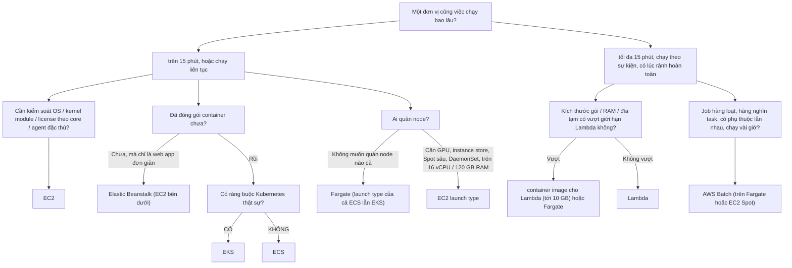

- EC2: lift-and-shift, Oracle/SQL Server BYOL, phần mềm bên thứ ba
- Ràng buộc Kubernetes thật sự: manifest/Helm chart đã có, team đã quen, cần chạy giống trên on-prem, cần CRD/operator
- ECS: ít khái niệm hơn, tích hợp IAM/ALB/CloudWatch sẵn
- Giới hạn Lambda: 250 MB giải nén, 10 GB RAM, 10 GB /tmp, payload 6 MB đồng bộ

**Chốt:** "no infrastructure to manage" + event-driven + ngắn → Lambda. "No servers
to manage" + container đã có → Fargate, vì "no servers" không có nghĩa là "phải là
Lambda". "Lift and shift" / "licensed software" → EC2, vì ứng dụng không được sửa.

Bảng đối chiếu đầy đủ: [`22-bang-so-sanh.md`](22-bang-so-sanh.md#ec2--lambda--fargate).
Cơ chế: [`01-compute.md`](01-compute.md).

---

### 2. Chọn purchasing model EC2

**Câu hỏi loại nửa: workload có chịu được việc bị thu hồi trong 2 phút không?**

Vì sao: đó là ranh giới duy nhất mà Spot đi qua được. Mọi thứ còn lại chỉ là bài
toán cam kết dài hạn.

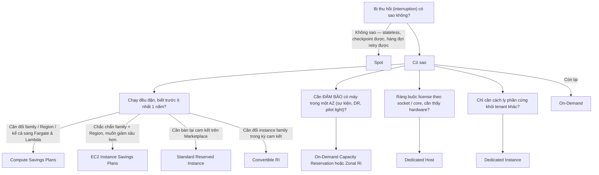

- Spot: giảm tới ~90%; dùng nhiều instance type + nhiều AZ để giảm rủi ro
- On-Demand Capacity Reservation: kết hợp được với Savings Plans
- Dedicated Instance: rẻ hơn Host, không nhìn thấy socket

**Câu hỏi phân biệt hay bị bỏ qua:** *"đề đang hỏi giảm giá hay đảm bảo capacity?"*
Savings Plans và RI vùng (regional RI) **không** giữ chỗ máy. Chỉ Zonal RI và
Capacity Reservation mới giữ chỗ. Đề dùng chữ "guarantee capacity" là đang trỏ
vào nhánh thứ hai, dù cả bốn đáp án đều nói về tiền.

| Đề nói | Chọn |
|---|---|
| "fault-tolerant", "can be interrupted" | Spot |
| "steady state 3 years", "may change instance family" | Convertible RI / Compute SP |
| "guarantee capacity in a specific AZ" | Capacity Reservation / Zonal RI |
| "per-socket licensing", "BYOL Windows Server" | Dedicated Host |

---

### 3. Chọn storage

**Câu hỏi loại nửa: ứng dụng truy cập dữ liệu bằng gì — HTTP API, block device, hay đường dẫn file?**

Vì sao: đây là ràng buộc của **ứng dụng**, không phải của kiến trúc sư. Ứng dụng
legacy ghi vào `/data/report.csv` thì S3 bị loại ngay, dù S3 rẻ hơn mười lần.

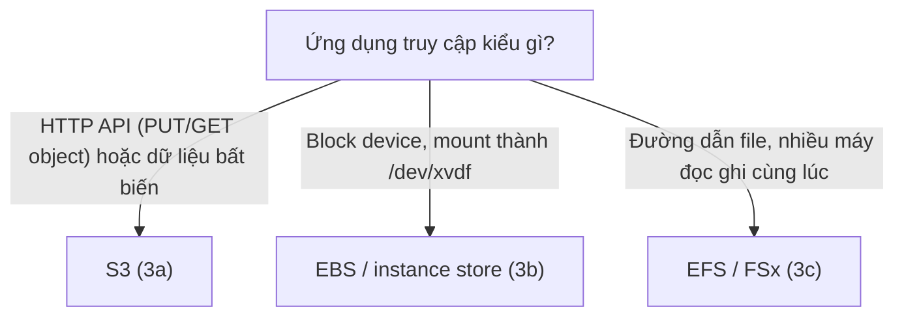

#### 3a. S3 — chọn storage class

**Câu hỏi loại nửa: bạn có biết pattern truy cập không?**

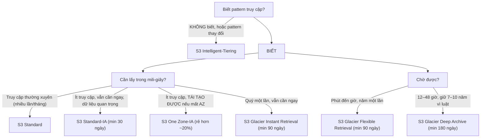

- S3 Intelligent-Tiering: không có phí retrieval; không có min duration; object nhỏ hơn 128 KB không bị tính phí monitoring và cũng không được tự động chuyển tầng

Hai câu hỏi phụ quyết định đáp án. **"Mất dữ liệu có tạo lại được không?"** — chỉ
khi "có" thì One Zone-IA mới đúng, vì nó nằm trên một AZ. **"Object nhỏ hay lớn?"**
— Standard-IA và One Zone-IA tính tiền tối thiểu 128 KB mỗi object, nên một tỉ file
4 KB đẩy sang IA sẽ **đắt hơn** Standard.

#### 3b. EBS và instance store — chọn volume type

**Câu hỏi loại nửa: dữ liệu có cần sống sót qua lệnh stop không?**

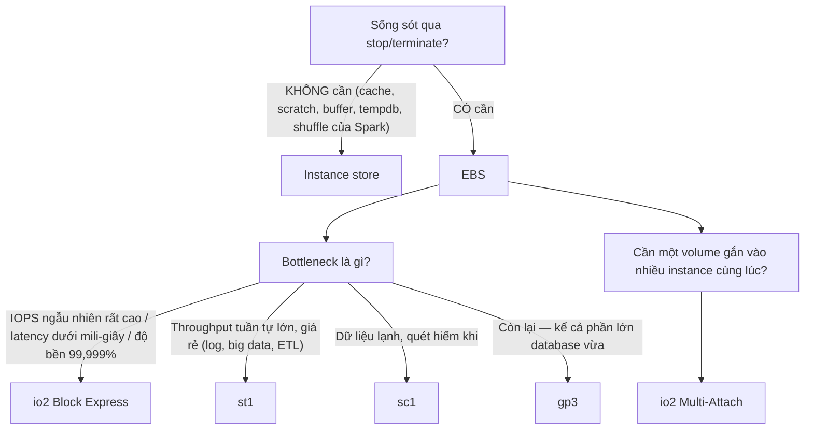

- Instance store: IOPS cao nhất, latency thấp nhất, giá đã nằm trong giá instance
- io2 Block Express: tới 256.000 IOPS, 4.000 MiB/s, 64 TiB
- st1: HDD, tính theo MiB/s, không hợp boot volume
- sc1: rẻ nhất, chậm nhất
- gp3: baseline 3.000 IOPS + 125 MiB/s, mua thêm tới 80.000 IOPS và 2.000 MiB/s, IOPS tách rời khỏi dung lượng
- io2 Multi-Attach: tối đa 16 instance, cùng AZ, cần cluster-aware filesystem — không phải ext4/xfs thường

**gp3 gần như luôn thắng gp2 trong câu hỏi cost:** gp2 buộc mua dung lượng để lấy
IOPS (3 IOPS/GiB), gp3 rẻ hơn ~20% mỗi GiB và bán IOPS riêng.

#### 3c. File share — EFS hay FSx

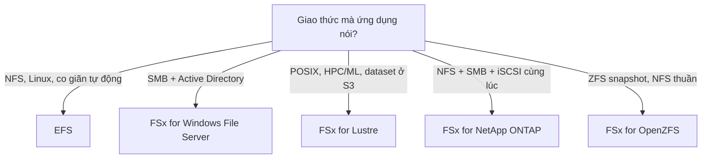

- EFS: Standard nhiều AZ; One Zone rẻ hơn ~47%; lifecycle sang IA/Archive để giảm tiền
- FSx for Lustre: scratch rẻ, persistent có replication

Chi tiết ở [`02-storage.md`](02-storage.md).

---

### 4. Chọn database

**Câu hỏi loại nửa: truy vấn có luôn biết trước khoá không?**

Vì sao: đây là ranh giới thật giữa DynamoDB và mọi thứ còn lại. "NoSQL" không
phải là ranh giới — ranh giới là *access pattern có cố định không*. DynamoDB
scale vô hạn vì nó từ chối cho bạn query tuỳ hứng.

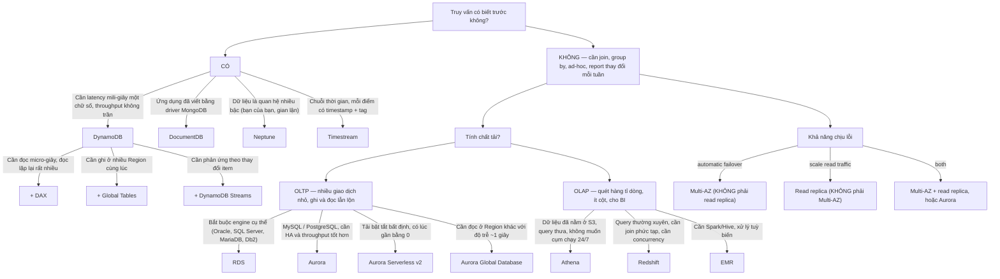

- CÓ — luôn "lấy item theo user_id", "lấy 20 order mới nhất của user_id"
- Sau khi chọn xong engine, hỏi tiếp về khả năng chịu lỗi
- Aurora replica vừa phục vụ đọc vừa làm ứng viên failover

**Ba cặp hay bị đổi chỗ:** "automatic failover" → Multi-AZ, không phải read replica
(replica promote **thủ công** và sao chép bất đồng bộ). "Offload reporting queries"
→ read replica, không phải Multi-AZ (standby loại cũ không phục vụ đọc). "Millions
of writes per second, key lookups" → DynamoDB, không phải Aurora (Aurora vẫn một writer).

Chi tiết ở [`03-database.md`](03-database.md).

---

### 5. Chọn cơ chế messaging

**Câu hỏi loại nửa: message bị xoá sau khi xử lý, hay còn nằm đó cho người khác đọc lại?**

Vì sao: đó là khác biệt bản chất giữa **queue** và **stream**, và nó quyết định
giữa SQS và Kinesis — cặp bị nhầm nhiều nhất ở Domain 3.

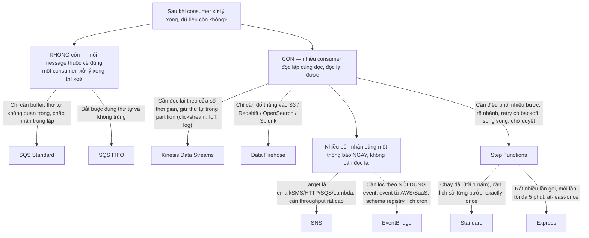

- SQS Standard: throughput không trần, at-least-once, best-effort order
- SQS FIFO: 300 TPS không batch / 3.000 có batch; bật high throughput mode lên tới 70.000 TPS mỗi API action
- Kinesis Data Streams: mỗi shard 1 MB/s hoặc 1.000 record/s ghi vào, 2 MB/s đọc ra; giữ 24 giờ mặc định, tới 365 ngày
- Data Firehose: near-real-time, buffer theo dung lượng hoặc thời gian

**Mẫu phải nhận ra ngay:** `SNS → nhiều SQS queue` (fan-out bền). SNS một mình mất
message nếu subscriber đang chết; thêm SQS để mỗi consumer có vùng đệm và tốc độ
riêng. Đề tả "each downstream service must process at its own pace and must not
lose events" chính là mẫu này.

**Phân biệt SNS với EventBridge:** *"ai quyết định ai nhận?"* SNS — người **gửi**
quyết định qua topic. EventBridge — **rule** quyết định theo nội dung event, người
gửi không cần biết ai nghe. "Route events based on their content, without changing
the producers" → EventBridge.

Chi tiết ở [`06-tich-hop.md`](06-tich-hop.md).

---

### 6. Chọn load balancer

**Câu hỏi loại nửa: bộ cân bằng có cần NHÌN vào nội dung HTTP không?**

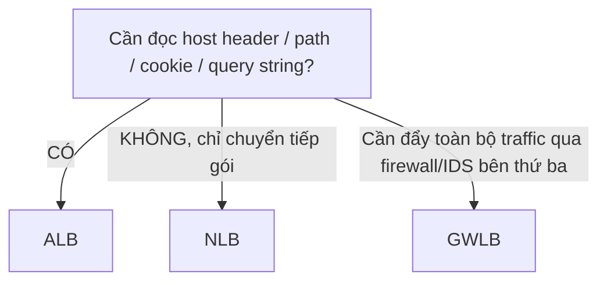

- ALB: định tuyến theo path, host, header, method, source IP; target EC2, IP, Lambda, container (dynamic port mapping); gắn được WAF, Cognito authenticate, sticky session; client IP thật nằm trong header X-Forwarded-For
- NLB: TCP, UDP, TLS; latency thấp nhất; hàng triệu request/giây; có IP tĩnh mỗi AZ (gán được Elastic IP) → hợp firewall on-prem allowlist; GIỮ NGUYÊN source IP khi target theo instance ID; là lớp duy nhất đứng sau VPC Endpoint Service (PrivateLink)
- GWLB: bọc gói bằng GENEVE cổng 6081, appliance ở giữa nhìn thấy gói nguyên bản

**Ba tình huống ép phải kết hợp:** "static IP" + "WAF" + "path-based routing" →
NLB hoặc Global Accelerator đứng trước ALB. "Preserve the original client IP" →
NLB target theo instance ID, hoặc ALB + `X-Forwarded-For`. "Expose a service to
another VPC without peering" → NLB + VPC Endpoint Service.

**CLB chỉ đúng khi đề nói "legacy"** hoặc nhắc EC2-Classic. Chi tiết ở
[`04-networking.md`](04-networking.md).

---

### 7. Chọn cách cho private subnet ra ngoài

**Câu hỏi loại nửa: đích đến là dịch vụ AWS hay internet công cộng?**

Vì sao: nếu đích là AWS thì đáp án gần như luôn là endpoint — rẻ hơn, riêng tư
hơn, và khớp với cụm "without traversing the public internet" mà đề rất hay dùng.

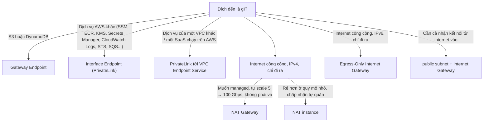

- Gateway Endpoint: MIỄN PHÍ, thêm một prefix list vào route table, không có ENI, không dùng được từ on-prem hay từ VPC khác
- Interface Endpoint: ENI có IP riêng trong subnet, tính tiền theo giờ + theo GB, DÙNG ĐƯỢC từ on-prem qua DX/VPN, bảo vệ bằng Security Group
- PrivateLink: bên cung cấp đặt NLB hoặc GWLB
- NAT instance: phải TẮT source/destination check, tự lo HA, băng thông theo instance
- Egress-Only Internet Gateway: NAT Gateway không phải câu trả lời cho IPv6 egress
- public subnet + Internet Gateway: nghĩa là nó không còn là private subnet nữa — đọc kỹ đề trước khi chọn

**Hai câu hỏi phụ quyết định đáp án.** *"Đề có nói cost không?"* — nếu có và đích
là S3 thì chọn Gateway Endpoint, vì NAT tính cả phí giờ lẫn phí mỗi GB xử lý còn
Gateway Endpoint miễn phí. *"Đề có nói HA không?"* — một NAT Gateway nằm trong **một
AZ**; kiến trúc đúng là mỗi AZ một NAT và route table mỗi AZ trỏ vào NAT của chính
nó. "Instances in AZ-b lost internet access when AZ-a failed" chính là lỗi này.

---

### 8. Chọn cách kết nối hybrid

**Câu hỏi loại nửa: đề có nói "consistent" / "predictable" về băng thông hay độ trễ không?**

Vì sao: chỉ Direct Connect mới hứa được điều đó. VPN đi qua internet công cộng
nên không bao giờ là đáp án cho "consistent latency".

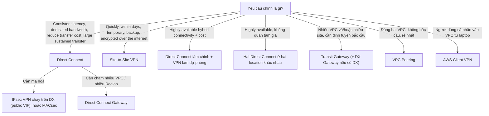

- Direct Connect: Dedicated 1/10/100 Gbps; hosted 50 Mbps – 25 Gbps. Thời gian setup: TUẦN đến THÁNG. KHÔNG mã hoá mặc định
- Site-to-Site VPN: 1,25 Gbps mỗi tunnel, hai tunnel mỗi kết nối, IPsec sẵn. Tính theo giờ, dựng trong vài chục phút
- DX chính + VPN dự phòng: mẫu chuẩn của đề
- Transit Gateway: ~50 Gbps mỗi VPC attachment
- VPC Peering: không transitive, không overlap CIDR, không phí giờ
- AWS Client VPN: là người, không phải site

**Bẫy transitive:** peering không bắc cầu — A↔B và B↔C **không** cho A nói chuyện
với C. Đề tả mạng peering đầy đủ giữa 10 VPC rồi hỏi "reduce operational overhead"
→ Transit Gateway.

---

### 9. Chọn cách chuyển dữ liệu khối lượng lớn

**Câu hỏi loại nửa: tính thử thời gian truyền qua mạng — có kịp deadline không?**

```
Thời gian ước lượng = Dung lượng / (Băng thông thực × 0,125)
   với dung lượng tính bằng GB, băng thông tính bằng Gbps, kết quả ra giây.
   Băng thông thực ≈ 60–80% băng thông danh nghĩa.
```

| Dung lượng | 100 Mbps | 1 Gbps | 10 Gbps |
|---|---|---|---|
| 10 TB | ~10 ngày | ~1 ngày | ~2,5 giờ |
| 100 TB | ~100 ngày | ~10 ngày | ~1 ngày |
| 1 PB | ~3 năm | ~100 ngày | ~10 ngày |

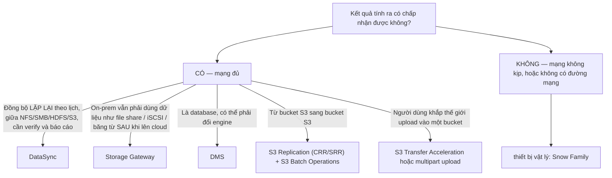

- DataSync: agent trên on-prem; tự retry, tự kiểm tra toàn vẹn
- Storage Gateway — File (NFS/SMB → S3), Volume (iSCSI, cached hoặc stored), Tape (VTL thay thư viện băng từ, đổ vào Glacier)
- DMS: + Schema Conversion Tool nếu đổi engine, ví dụ Oracle → Aurora PostgreSQL. DMS chép được cả lúc nguồn đang chạy (CDC), nên downtime gần bằng 0
- S3 Replication (CRR/SRR) cho dữ liệu MỚI; S3 Batch Operations cho dữ liệu CŨ đã có sẵn
- S3 Transfer Acceleration đi qua edge của CloudFront
- Snow Family: xem [Nguồn nói khác](#nguon-noi-khac) — dòng Snow đã đóng với khách mới, đề thi vẫn hỏi, đời thực thì dùng AWS Data Transfer Terminal hoặc partner

**Chốt DataSync với Storage Gateway:** *"sau khi chuyển xong, on-prem còn đọc dữ
liệu đó không?"* Còn → Storage Gateway. Không → DataSync.

---

### 10. Chọn chiến lược DR theo RTO/RPO

**Hai câu hỏi loại nửa, hỏi theo đúng thứ tự này:**

1. **RPO** — mất bao nhiêu dữ liệu thì chấp nhận được? → quyết định **cơ chế sao chép**.
2. **RTO** — bao lâu phải chạy lại? → quyết định **hạ tầng có được dựng sẵn không**.

Đảo thứ tự là hỏng: RPO 0 mà chỉ có backup hàng đêm thì mọi lựa chọn RTO đều vô nghĩa.

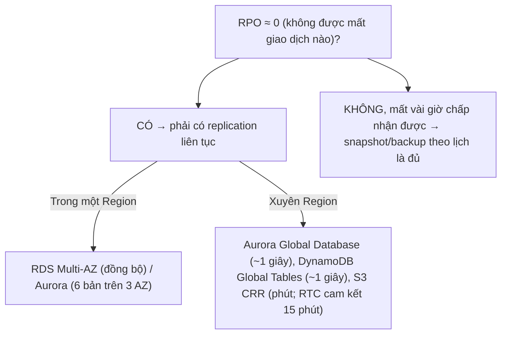

Rồi tới RTO:

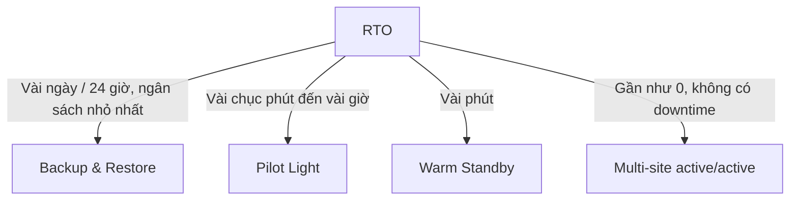

- Backup & Restore: AWS Backup + snapshot copy sang Region khác; dựng lại bằng CloudFormation
- Pilot Light: DB đã replicate và đang chạy; compute đã có AMI + launch template nhưng TẮT
- Warm Standby: bản thu nhỏ đang CHẠY thật ở Region kia; sự cố thì scale lên
- Multi-site active/active: cả hai Region cùng phục vụ; Route 53 latency hoặc Global Accelerator ở trên

| Chiến lược | RPO | RTO | Chi phí thường trực | Dấu hiệu trong đề |
|---|---|---|---|---|
| Backup & Restore | giờ | tới 24 giờ | thấp nhất | "lowest cost", "can tolerate downtime" |
| Pilot Light | phút | chục phút–giờ | thấp | "core data replicated", "minimal running resources" |
| Warm Standby | giây | phút | trung bình | "scaled-down but functional copy" |
| Multi-site active/active | ~0 | ~0 | cao nhất | "no downtime", "zero data loss", "serve from both" |

**Bẫy lớn nhất:** Multi-AZ **không phải** DR — nó chống lỗi một AZ. Chi tiết ở
[`13-khoi-phuc-tham-hoa.md`](13-khoi-phuc-tham-hoa.md).

---

### 11. Chọn nơi đặt cache

**Câu hỏi loại nửa: cái được lặp lại là gì — một HTTP response, một kết quả truy vấn, hay một item DynamoDB?**

Vì sao: mỗi loại có đúng một chỗ hợp lý để cache, và ba đáp án mồi luôn là ba lớp
còn lại.

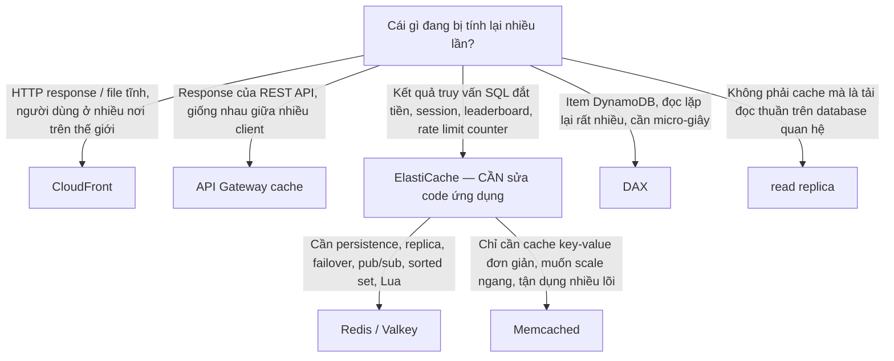

- CloudFront: cache key = phần bạn chọn từ path + header + cookie + query string. TTL điều khiển bằng Cache-Control của origin, hoặc bằng cache policy. KHÔNG cần sửa code ứng dụng
- API Gateway cache: 0,5 – 237 GB, TTL mặc định 300 giây, tối đa 3.600. Cũng KHÔNG cần sửa code
- Memcached: không replication, không persistence, mất node là mất data
- DAX: write-through, API tương thích DynamoDB nên đổi endpoint là chính, chỉ dùng được với DynamoDB, nằm trong VPC
- read replica: giảm tải writer; nhưng có replication lag, không đọc-sau-ghi được

**Chọn chiến lược ghi cache** — đề hỏi ít nhưng hỏi thì rất dễ mất điểm:

| Chiến lược | Cách chạy | Đánh đổi |
|---|---|---|
| Lazy loading (cache-aside) | miss thì đọc DB rồi ghi cache | dữ liệu có thể cũ; lần miss đầu chậm |
| Write-through | ghi DB và ghi cache cùng lúc | cache luôn mới; ghi chậm hơn; cache đầy dữ liệu không ai đọc |
| TTL | mọi key đều có hạn | đơn giản nhất; luôn nên có, kể cả khi đã dùng hai cách trên |

**Câu khoá "không được sửa code ứng dụng"** loại ElastiCache và DAX, đẩy đáp án về
CloudFront hoặc API Gateway cache — xem [`21-tu-khoa-de-thi.md`](21-tu-khoa-de-thi.md#khong-duoc-sua-code-ung-dung).

---

### 12. Chọn cách xác thực và uỷ quyền cross-account

**Câu hỏi loại nửa: chủ thể là con người hay là workload?**

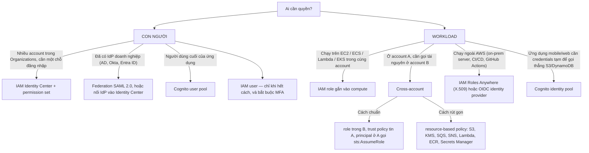

- IAM Identity Center + permission set: thay cho IAM user ở từng account
- IAM role gắn vào compute: instance profile, task role, execution role, IRSA hoặc EKS Pod Identity. KHÔNG bao giờ là access key trong file
- Nếu A là BÊN THỨ BA → bắt buộc thêm sts:ExternalId (chống confused deputy)
- Resource-based policy: cấp quyền thẳng, không cần assume role, không cần đổi identity
- Cognito identity pool: đổi token của user pool hoặc IdP lấy STS credentials

**Quy tắc một dòng:** explicit Deny thắng tất cả; quyền hiệu lực là **phần giao**
của mọi lớp; SCP và permission boundary chỉ **cắt xuống**, không bao giờ cộng thêm.
Bảng bốn lớp ở [`22-bang-so-sanh.md`](22-bang-so-sanh.md#scp--iam-policy--permission-boundary).

**Ngoại lệ phải nhớ:** KMS key policy — key policy không cho phép thì `kms:*` trong
identity policy cũng vô ích. Đây là dịch vụ duy nhất mà resource policy là **bắt
buộc**. Chi tiết ở [`05-security.md`](05-security.md).

---

### 13. Chọn cơ chế mã hoá

**Câu hỏi loại nửa: ai phải giữ và quay vòng key?**

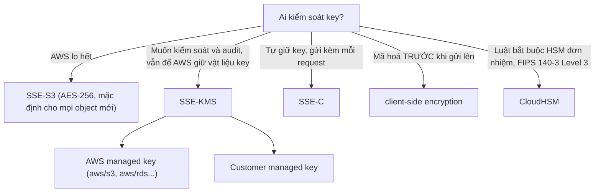

- SSE-S3: không audit được từng lần dùng key, không đặt được policy trên key
- AWS managed key: bật một nút, không có policy riêng
- Customer managed key: tự đặt key policy, rotation hằng năm, thấy từng lệnh gọi trong CloudTrail, xoá được sau 7–30 ngày. Hiệu năng: mỗi object là một lần gọi KMS — bật S3 Bucket Keys để giảm tiền
- SSE-C: mất key là mất dữ liệu, bắt buộc HTTPS
- CloudHSM: AWS không có quyền vào; mất key là mất thật

**Nhận diện nhanh:** "audit every use of the key" hoặc "control who can use the key"
→ SSE-KMS với customer managed key. "Keys must never be stored in AWS" → SSE-C hoặc
client-side. "Single-tenant HSM", "FIPS 140-3 Level 3" → CloudHSM. Bảng đầy đủ ở
[`22-bang-so-sanh.md`](22-bang-so-sanh.md#sse-s3--sse-kms--sse-c).

---

### 14. Chọn routing policy Route 53

**Câu hỏi loại nửa: đề đang phân phối theo TỈ LỆ, theo VỊ TRÍ, hay theo TRẠNG THÁI SỐNG CHẾT?**

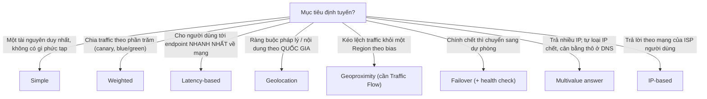

**Cặp bị nhầm nhiều nhất:** Latency-based chọn theo **đo đạc mạng thực tế**;
Geolocation chọn theo **quốc gia của truy vấn**. "Users in Germany must be served
content in German" → Geolocation. "Lowest possible latency" → Latency-based.

**Route 53 không phải load balancer.** Failover ở DNS phụ thuộc TTL và resolver
cache, nên RTO tính bằng phút; cần chuyển hướng trong vài giây thì đó là Global
Accelerator.

---

## Bảng số phải nhớ

Chỉ con số đủ để **loại đáp án** trong một câu hỏi. Mốc: 2026-08.

| Con số | Của cái gì | Loại được đáp án nào |
|---|---|---|
| **15 phút** | Lambda timeout tối đa | mọi việc dài hơn → không phải Lambda |
| **10 GB / 10 GB / 6 MB** | Lambda RAM, `/tmp`, payload đồng bộ | file lớn → S3 presigned URL, không nhét vào payload |
| **256 KB** | message tối đa của SQS, SNS, EventBridge | payload lớn hơn → SQS Extended Client + S3 |
| **14 ngày** | retention tối đa của SQS (mặc định 4 ngày) | "keep for a month" → không phải SQS |
| **300 / 3.000 / 70.000 TPS** | SQS FIFO: không batch / có batch / high throughput mode | "ordered, 50k msg/s" vẫn khả thi với FIFO |
| **1 MB/s hoặc 1.000 record/s vào, 2 MB/s ra** | mỗi shard Kinesis | tính số shard cần |
| **24 giờ → 365 ngày** | retention Kinesis Data Streams | "replay last week" → Kinesis, không phải SQS |
| **1 năm / 5 phút** | Step Functions Standard / Express | workflow chờ người duyệt → Standard |
| **29 giây** | timeout mặc định của API Gateway integration | job dài → trả 202 rồi xử lý bất đồng bộ |
| **5 TB** | object S3 lớn nhất; một lần PUT tối đa 5 GB | file 100 GB → bắt buộc multipart |
| **3.500 PUT / 5.500 GET mỗi giây mỗi prefix** | S3 request rate | nghẽn → tách prefix, không phải đổi storage class |
| **128 KB** | ngưỡng tính tiền tối thiểu của S3 IA; ngưỡng không tự tier của Intelligent-Tiering | nhiều file nhỏ → IA đắt hơn Standard |
| **30 / 90 / 180 ngày** | min duration của IA / Glacier IR và Flexible / Deep Archive | xoá sớm vẫn bị tính đủ |
| **3.000 IOPS + 125 MiB/s** | baseline gp3, mua thêm tới 80.000 IOPS và 2.000 MiB/s | "cần 20.000 IOPS" vẫn là gp3, không cần io2 |
| **256.000 IOPS / 4.000 MiB/s / 64 TiB** | io2 Block Express | trên trần gp3 mới cần io2 |
| **16 instance** | io2 Multi-Attach, cùng AZ | "shared across AZs" → EFS, không phải Multi-Attach |
| **5 Gbps → 100 Gbps** | NAT Gateway tự scale; 55.000 kết nối đồng thời mỗi IP mỗi đích | nghẽn → chia nhiều subnet, nhiều NAT |
| **1,25 Gbps** | mỗi tunnel VPN | "10 Gbps to on-prem" → Direct Connect |
| **400 KB** | item DynamoDB lớn nhất | blob lớn → để S3, DynamoDB giữ con trỏ |
| **1 KB ghi / 4 KB đọc** | một WCU / một RCU (đọc eventually consistent được 2 lần 4 KB) | tính capacity |
| **~1 giây** | replication lag của Aurora Global Database và DynamoDB Global Tables | RPO ≈ 1 giây, không phải 0 |
| **11 số 9** | độ bền S3, EFS; EBS gp3/st1/sc1 là 99,8–99,9%, io2 là 99,999% | "durability" ≠ "availability" |

---

## Bẫy đề thi

**Bẫy 1 — "serverless" bị hiểu thành "phải là Lambda"**
Đề: container chạy liên tục, "the company does not want to manage servers". Mồi: viết lại thành Lambda. Đúng: ECS/EKS trên Fargate.
Vì sao: "không quản server" là yêu cầu vận hành, không phải yêu cầu kiến trúc — và viết lại ứng dụng là thay đổi lớn nhất trong bốn đáp án.

**Bẫy 2 — read replica được chọn cho HA**
Đề: "automatic failover", "minimize downtime". Mồi: thêm read replica. Đúng: Multi-AZ.
Vì sao: replica là công cụ hiệu năng đọc; promote nó là thao tác **thủ công** và sao chép **bất đồng bộ** nên có thể mất dữ liệu.

**Bẫy 3 — Multi-AZ được chọn cho DR**
Đề: "recover from a Region-wide outage". Mồi: bật Multi-AZ. Đúng: replicate hoặc backup sang Region khác theo RTO/RPO.
Vì sao: Multi-AZ nằm trọn trong một Region; Region chết thì cả hai AZ đều chết.

**Bẫy 4 — NAT Gateway được chọn cho traffic tới S3**
Đề: instance private ghi log vào S3, "reduce cost". Mồi: thêm NAT Gateway. Đúng: S3 Gateway Endpoint.
Vì sao: Gateway Endpoint miễn phí; NAT tính cả phí giờ lẫn phí mỗi GB xử lý.

**Bẫy 5 — Kinesis được chọn chỉ vì thấy chữ "real-time"**
Đề: đơn hàng xử lý gần như tức thì, mỗi đơn đúng một lần. Mồi: Kinesis Data Streams. Đúng: SQS.
Vì sao: chỉ một consumer, không replay, không cửa sổ thời gian. Kinesis chỉ thắng khi có **nhiều consumer độc lập** hoặc cần **đọc lại**.

**Bẫy 6 — chọn S3 Standard-IA cho hàng tỉ file nhỏ**
Đề: 2 tỉ thumbnail 5 KB, ít đọc, "most cost-effective". Mồi: chuyển sang Standard-IA. Đúng: giữ Standard hoặc Intelligent-Tiering.
Vì sao: IA tính tiền tối thiểu 128 KB mỗi object, nên file 5 KB bị tính như 128 KB.

**Bẫy 7 — "static IP" bị đọc thành Elastic IP trên EC2**
Đề: khách hàng phải allowlist IP của bạn. Mồi: gán EIP cho từng instance sau ALB. Đúng: NLB, hoặc Global Accelerator.
Vì sao: ALB đổi IP theo thời gian và không cho gán EIP; gán EIP cho instance thì mỗi lần scale lại phải xin allowlist mới.

**Bẫy 8 — Route 53 failover được chọn cho RTO tính bằng giây**
Đề: "traffic must shift to the healthy Region within seconds". Mồi: Route 53 failover routing. Đúng: Global Accelerator.
Vì sao: DNS phụ thuộc TTL và resolver cache; Global Accelerator chuyển hướng ở lớp mạng nên client không cần phân giải lại tên.

---

## Nối với thực hành

Cây quyết định chỉ trở thành phản xạ khi bạn từng chạm tay vào cả hai nhánh.

| Cây | Lab có lời giải | Lab tự viết | Quan sát gì |
|---|---|---|---|
| [Compute](#1-chon-compute) | [`w03-ec2-alb-asg`](../../learn-aws/labs/w03-ec2-alb-asg/) · [`w06-serverless-api`](../../learn-aws/labs/w06-serverless-api/) | [`labs-self`](../../learn-aws/labs-self/) | so cold start của Lambda với thời gian ASG dựng xong một instance |
| [Storage](#3-chon-storage) | [`w04-s3-cloudfront`](../../learn-aws/labs/w04-s3-cloudfront/) | | bật lifecycle, xem object đổi storage class, thử xoá sớm để thấy min duration |
| [Database](#4-chon-database) | [`w05-databases`](../../learn-aws/labs/w05-databases/) | | Query so với Scan trên cùng bảng: đọc `ScannedCount` để thấy tiền đi đâu |
| [Messaging](#5-chon-co-che-messaging) | [`w07-decoupling`](../../learn-aws/labs/w07-decoupling/) | | SNS fan-out ra hai SQS; giết một consumer và xem DLQ nhận message |
| [Private subnet ra ngoài](#7-chon-cach-cho-private-subnet-ra-ngoai) | [`w02-vpc-networking`](../../learn-aws/labs/w02-vpc-networking/) | | vào instance private bằng SSM qua Interface Endpoint, không mở SSH |
| [Cache](#11-chon-noi-dat-cache) | [`w08-dns-cdn-edge`](../../learn-aws/labs/w08-dns-cdn-edge/) | | đổi cache key và xem tỉ lệ hit đảo chiều |
| [Cross-account](#12-chon-cach-xac-thuc-va-uy-quyen-cross-account) | [`w09-security-deep`](../../learn-aws/labs/w09-security-deep/) | | AssumeRole, permission boundary, explicit Deny thắng Allow |
| [DR](#10-chon-chien-luoc-dr-theo-rtorpo) | [`w11-dr-hybrid`](../../learn-aws/labs/w11-dr-hybrid/) | | lab tài liệu: tự ghi RTO/RPO cho từng thành phần |

Quy trình một buổi lab và cảnh báo chi phí: [`learn-aws/labs/README.md`](../../learn-aws/labs/README.md).
Luật của lab tự viết: [`learn-aws/labs-self/CONVENTIONS.md`](../../learn-aws/labs-self/CONVENTIONS.md).

---

## Nguồn nói khác

Chỗ `aws-saa-c03/L-quyet-dinh-nhanh.md` sai hoặc đã cũ, đã sửa trong file này.

| Nguồn nói | Thực tế (2026-08) | Bằng chứng |
|---|---|---|
| Cây storage: gp3 tối đa 16.000 IOPS, 1.000 MB/s, 16 TB | gp3 tới **80.000 IOPS, 2.000 MiB/s, 64 TiB** | [EBS General Purpose SSD](https://docs.aws.amazon.com/ebs/latest/userguide/general-purpose.html) |
| Cây storage: "High IOPS (> 16.000) → io2 Block Express" | ngưỡng thật là **80.000** IOPS, vì gp3 đã lên tới đó | như trên |
| Cây cost: "Scheduled Reserved Instances" | AWS đã **ngừng** loại này; thay bằng Savings Plans hoặc Capacity Reservation | [Savings Plans](https://docs.aws.amazon.com/savingsplans/latest/userguide/what-is-savings-plans.html) |
| Cây performance: "Aurora → Multi-master" | Aurora multi-master đã bị **rút**; SAA không hỏi. Ghi nhiều nơi thì dùng DynamoDB Global Tables | [Aurora User Guide](https://docs.aws.amazon.com/AmazonRDS/latest/AuroraUserGuide/CHAP_AuroraOverview.html) |
| Cây networking: coi Snowball là lựa chọn di trú mặc định | **Snowball Edge không còn nhận khách hàng mới**, và AWS dừng hỗ trợ vào 31-12-2026. Đề SAA-C03 vẫn hỏi, nhưng đời thực dùng DataSync, AWS Data Transfer Terminal hoặc partner | [Snowball Edge availability change](https://docs.aws.amazon.com/snowball/latest/developer-guide/snowball-edge-availability-change.html) |
| Cây database: liệt kê QLDB như một lựa chọn thường trực | QLDB nằm ngoài phạm vi SAA-C03; không dùng nó làm đáp án | [`../CONVENTIONS.md`](../CONVENTIONS.md) mục phạm vi |
| Cây HA: "Storage HA — EBS → Snapshots to S3 (Multi-AZ)" | Snapshot là **backup**, không phải HA. EBS volume vẫn nằm trong một AZ | [EBS snapshots](https://docs.aws.amazon.com/ebs/latest/userguide/ebs-snapshots.html) |
| Toàn bộ file nguồn dùng emoji trong tiêu đề | Bỏ hết — emoji làm hỏng anchor link và Ctrl+F | [`CONVENTIONS.md`](CONVENTIONS.md) |
| `aws-saa-c03/README.md` liệt kê F, G, H, I, J, N, O | Bảy file đó **không tồn tại**. Nội dung của chúng đã được viết mới ở [`10-chi-phi.md`](10-chi-phi.md), [`11-san-sang-cao.md`](11-san-sang-cao.md), [`12-hieu-nang.md`](12-hieu-nang.md), [`13-khoi-phuc-tham-hoa.md`](13-khoi-phuc-tham-hoa.md) | xem [`README.md`](README.md) |

---

## Ngoài phạm vi

Một dòng mỗi thứ. Biết là nó tồn tại, đừng đào sâu cho SAA.

- **AWS Outposts / Local Zones / Wavelength** — có xuất hiện ở đề nhưng chỉ ở mức "cần AWS chạy trong data center của tôi" → [Outposts](https://docs.aws.amazon.com/outposts/).
- **Aurora Global Database write forwarding** — mức Professional → [write forwarding](https://docs.aws.amazon.com/AmazonRDS/latest/AuroraUserGuide/aurora-global-database-write-forwarding.html).
- **Transit Gateway Connect, VPC Lattice** — không ra SAA-C03 → [VPC Lattice](https://docs.aws.amazon.com/vpc-lattice/).
- **QLDB, Timestream chi tiết, Neptune Analytics** — nhận ra tên là đủ → [purpose-built databases](https://aws.amazon.com/products/databases/).
- **Chiến lược Savings Plans nâng cao, Cost Categories, CUR + Athena** — mức FinOps → [Billing docs](https://docs.aws.amazon.com/cost-management/).

---

## Tự kiểm tra

Trả lời ra giấy trước khi mở. Mỗi câu hỏi **vì sao**, không hỏi tên dịch vụ.

**1.** Vì sao câu hỏi "message có bị xoá sau khi xử lý không" phân biệt được SQS
với Kinesis tốt hơn câu hỏi "có cần real-time không"?

<details><summary>Đáp án</summary>

Cả hai đều real-time ở mức mili-giây, nên câu hỏi đó không loại được gì. Mô hình
dữ liệu thì khác hẳn: SQS là hàng đợi — consumer nhận, xử lý, gọi `DeleteMessage`,
message biến mất, không ai đọc lại. Kinesis là log có thứ tự — record nằm trong
shard suốt retention (24 giờ tới 365 ngày) và **mọi consumer đều đọc được từ đầu**.
Nên "nhiều nhóm consumer độc lập cùng đọc một dòng dữ liệu" hoặc "replay 3 ngày
trước" chỉ Kinesis làm được; "mỗi đơn hàng xử lý đúng một lần rồi thôi" là SQS.

</details>

**2.** Đề nói "the application must continue to serve traffic if an entire
Availability Zone fails" và một đáp án là "enable RDS Multi-AZ". Đúng hay sai, và
điều kiện nào làm nó thành sai hẳn?

<details><summary>Đáp án</summary>

Đúng cho tầng database nhưng **chưa đủ** cho câu hỏi. "Continue to serve traffic"
nói về toàn hệ thống: nếu tầng web chỉ có instance trong một AZ, hoặc NAT Gateway
chỉ đặt ở một AZ, thì AZ chết vẫn làm dịch vụ chết dù database đã failover. Đáp án
đủ phải gồm ASG trải nhiều AZ sau một ELB, NAT Gateway mỗi AZ, subnet ở mọi AZ.
Nó thành **sai hẳn** khi đề nói "Region-wide outage" — lúc đó Multi-AZ vô nghĩa.

</details>

**3.** Hai bucket S3 cùng dung lượng, cùng tần suất truy cập, cùng chuyển sang
Standard-IA. Bucket A đắt hơn hẳn sau khi chuyển, bucket B rẻ đi. Khác biệt ở đâu?

<details><summary>Đáp án</summary>

Ở **kích thước object**. Standard-IA tính tiền tối thiểu 128 KB mỗi object và tối
thiểu 30 ngày lưu trữ. Bucket A chứa hàng triệu object nhỏ hơn 128 KB nên mỗi
object bị tính như 128 KB, cộng phí retrieval mỗi lần đọc. Bucket B chứa object
lớn nên hưởng đúng phần giảm giá. Cùng lý do, cụm "millions of small files" trong
đề là dấu hiệu loại IA và nghiêng về Intelligent-Tiering hoặc giữ Standard.

</details>

**4.** Permission boundary của một role cho phép `s3:*`; identity policy của role
cho phép `s3:*` và `dynamodb:*`; SCP của account chỉ cho phép `s3:GetObject`.
Role làm được gì?

<details><summary>Đáp án</summary>

Chỉ `s3:GetObject`. Quyền hiệu lực là **phần giao** của cả ba lớp. SCP cắt xuống
còn `s3:GetObject`; boundary cho `s3:*` nên không cắt thêm; identity policy cho
`s3:*` nên `s3:GetObject` sống sót. `dynamodb:*` chết ở cả SCP lẫn boundary. Điểm
phải nhớ: boundary và SCP **không bao giờ cấp** quyền — bỏ identity policy đi thì
role không làm được gì, dù hai lớp kia đều "cho phép".

</details>

**5.** Đề cho RPO = 15 phút, RTO = 4 giờ, nhấn mạnh "minimize cost". Bạn loại được
chiến lược DR nào ngay, và vì sao?

<details><summary>Đáp án</summary>

Loại **multi-site active/active** và **warm standby** vì cả hai giữ hạ tầng chạy
thật ở Region thứ hai — chi phí thường trực cao hơn mức RTO 4 giờ đòi hỏi. Loại
luôn **backup & restore bằng snapshot hằng đêm** vì RPO 24 giờ vi phạm yêu cầu 15
phút. Còn lại **pilot light**: dữ liệu replicate liên tục (thoả RPO), compute có
sẵn AMI và launch template nhưng đang tắt, dựng lên trong vài chục phút tới vài
giờ (thoả RTO), và chỉ trả tiền cho tầng dữ liệu.

</details>

**6.** Vì sao câu hỏi "sau khi chuyển xong, on-prem còn đọc dữ liệu đó không" phân
biệt được Storage Gateway với DataSync, trong khi "dữ liệu bao nhiêu TB" thì không?

<details><summary>Đáp án</summary>

Dung lượng chỉ chọn giữa "qua mạng" và "qua thiết bị vật lý" — nó không nói gì về
kiến trúc **sau khi** chuyển. DataSync là công cụ **di chuyển**: chạy xong là hết
việc. Storage Gateway là thành phần **hybrid thường trực**: nó để lại một thiết bị
ảo ở on-prem đóng vai NFS/SMB/iSCSI/VTL, cache dữ liệu nóng tại chỗ, và ứng dụng cũ
vẫn đi qua nó vô thời hạn. Nên "the on-premises application must continue to access
the files as a network share" là Storage Gateway, bất kể 5 TB hay 500 TB.

</details>
