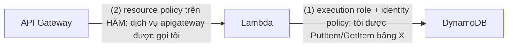

# Đối chiếu — tuần 6

> Đọc file này **sau khi** `./verify.sh` xanh hết. Đọc trước là tự lấy mất bài học.

---

## Bạn vừa làm gì, theo ngôn ngữ đề thi

| Yêu cầu trong lab | Khái niệm SAA | Đọc thêm |
|---|---|---|
| 1–3. API tạo và dùng mã ngắn | mẫu kinh điển **API Gateway → Lambda → DynamoDB** | [`docs/aws/w06-serverless-api.md`](../../../docs/aws/w06-serverless-api.md) §9 |
| 4–6. Input sai ra mã lỗi đúng | **proxy integration**, hình dạng phản hồi do code quyết định | [`w06`](../../../docs/aws/w06-serverless-api.md) §9 |
| 7. Danh tính chỉ làm đúng việc của nó | **least privilege**, execution role, ARN cấp tài nguyên | [`w06`](../../../docs/aws/w06-serverless-api.md) §8 · [sổ tay security](../../../docs/notebook/05-security.md) |
| 8. Trần quyền của bộ lab | **permission boundary** — trần, không phải quyền | [`docs/aws/w09-security-deep.md`](../../../docs/aws/w09-security-deep.md) · [`_boundary/README.md`](../_boundary/README.md) |
| 9. Không thiết bị mạng tính tiền theo giờ | **Lambda ngoài VPC**, endpoint dịch vụ công cộng | [`w06`](../../../docs/aws/w06-serverless-api.md) §7 |
| 10. Log không giữ vĩnh viễn | retention — bẫy chi phí số một của CloudWatch | [sổ tay chi phí](../../../docs/notebook/10-chi-phi.md) |
| 11. Trần tốc độ + kho dữ liệu on-demand | **throttling**, mô hình tính tiền theo lượt dùng | [`w06`](../../../docs/aws/w06-serverless-api.md) §9, §13 |
| Cold start bạn vừa đo | execution model, init phase, memory↔CPU | [`w06`](../../../docs/aws/w06-serverless-api.md) §2, §3 |

### Hai hướng quyền — vẽ được hai mũi tên này là xong nửa Domain 1

| | Hướng (1) — execution role | Hướng (2) — resource policy |
|---|---|---|
| Trả lời câu | "hàm này **được làm gì**?" | "**ai được gọi** hàm này?" |
| Gắn ở đâu | trên IAM role | trên chính tài nguyên (hàm) |
| Thiếu nó thì | API trả **500**, log của hàm **có** dòng `AccessDeniedException` | API trả **500**, log của hàm **trống trơn** |
| Khái niệm liên quan | identity-based policy | resource-based policy, `SourceArn`, confused deputy |

Dòng "thiếu nó thì" là cách chẩn đoán nhanh nhất trong đời thật, và nó cũng là
một dạng câu hỏi thi: *"API trả 500 nhưng CloudWatch Logs của hàm không có dòng
nào — nguyên nhân nào có khả năng nhất?"*

### Vì sao `dynamodb:*` trên đúng một bảng vẫn chưa phải quyền tối thiểu

`verify.sh` chặn `Scan` và `DeleteTable` riêng biệt, có lý do:

| Action | Hàm này cần không | Kẻ tấn công dùng nó để làm gì |
|---|---|---|
| `GetItem`, `PutItem` | **có** | đọc/ghi đúng một bản ghi mỗi lần — thiệt hại có trần |
| `Scan`, `Query` | không | trút **toàn bộ** bảng trong vài lệnh gọi |
| `DeleteTable` | không | xoá sạch dữ liệu, không hoàn tác |
| `UpdateTable` | không | bật chế độ provisioned với capacity khổng lồ — biến lỗ hổng thành hoá đơn |

Quyền tối thiểu là **liệt kê action**, không phải **giới hạn tài nguyên**. Hai
chuyện đó độc lập với nhau, và đề thi hay ghép chúng để bẫy.

---

## Ba cách khác để giải bài này

### Cách A — bỏ hẳn Lambda: API Gateway gọi thẳng DynamoDB

API Gateway (loại REST) tích hợp trực tiếp với dịch vụ AWS: request đi vào,
được ánh xạ thành một lệnh gọi `PutItem`/`GetItem`, phản hồi được ánh xạ ngược
lại — **không có dòng code nào chạy**.

**Tốt hơn khi:** logic đúng là "nhận vào, ghi xuống, đọc lên". Không có cold
start, không có runtime để vá, không có gói triển khai để quản, **rẻ hơn** (mất
hẳn phần tiền Lambda), và ít thứ hỏng hơn. Với các từ khoá "**least operational
overhead**", "**no custom code**", "**cannot maintain code**", đây thường là đáp
án đúng của đề thi — và rất nhiều người bỏ qua vì không biết nó tồn tại.

**Tệ hơn khi:** — và đây là bài này — bạn cần **logic thật**: sinh mã ngắn,
kiểm giao thức của URL, phân loại ba kiểu input sai thành ba thông điệp lỗi
khác nhau. Ánh xạ request/response viết bằng VTL (Velocity Template Language),
một ngôn ngữ mà không ai gỡ lỗi được dễ dàng và cũng không viết unit test được.
Ngoài ra HTTP API **không** có tính năng này, chỉ REST API có — nên chọn cách
này là bị khoá vào loại API đắt gấp ba lần.

**Đề thi hỏi thế nào:** "ghi thẳng vào DynamoDB/SQS/Kinesis, không cần xử lý,
ít vận hành nhất" → tích hợp trực tiếp. "Cần biến đổi/kiểm tra/làm giàu dữ liệu"
→ Lambda.

### Cách B — bỏ API Gateway: Lambda Function URL

Lambda tự có một địa chỉ HTTPS. Không cần API Gateway.

**Tốt hơn khi:** một hàm, một endpoint, không cần định tuyến. **Miễn phí hoàn
toàn** (không có phí $1/triệu request của API Gateway), độ trễ thấp hơn một
chặng, và cấu hình chỉ có vài dòng. Nó hỗ trợ CORS và có kiểu xác thực bằng
IAM (`AWS_IAM`) — đủ cho webhook nội bộ hoặc endpoint máy-với-máy.

**Tệ hơn khi:** — bài này chạm đúng cả bốn giới hạn: **không có throttling
riêng cho endpoint** (yêu cầu 11 chết ngay tại đây — Function URL chỉ chịu trần
concurrency của tài khoản), không có **usage plan / API key**, không có
**authorizer JWT** hay Cognito, và không định tuyến được nhiều đường dẫn về
nhiều hàm. Bạn cũng không đặt được WAF trước nó một cách trực tiếp.

**Đề thi hỏi thế nào:** "single function, simplest, lowest cost, no routing" →
Function URL. Hễ đề nhắc **rate limiting, API key, hạn ngạch theo khách hàng,
authorizer, nhiều route** → API Gateway. Nhớ đúng danh sách bốn thứ Function URL
thiếu là đủ để loại đáp án.

### Cách C — không serverless: container sau một cân bằng tải

Cùng logic đó chạy trong một container trên Fargate hoặc trên EC2, đứng sau ALB.

**Tốt hơn khi:** lưu lượng **cao và đều**. Điểm hoà vốn có thật và đề thi có
hỏi: Lambda tính theo GB-giây, nên nó rẻ khi tải **thấp hoặc gai nhọn**, và đắt
khi tải **cao liên tục**. Container cũng thắng khi request chạy **quá 15 phút**
(giới hạn cứng của Lambda), khi cần giữ kết nối lâu (WebSocket, gRPC streaming),
khi cần **kiểm soát runtime** (thư viện hệ thống, phiên bản ngôn ngữ lạ), hoặc
khi ứng dụng cũ không viết lại được.

**Tệ hơn khi:** — bài này — đội vận hành đã nói thẳng: *không trực một máy chủ
24/7 cho vài chục request/phút*. Và ALB tính **$0,0225/giờ ≈ $16/tháng dù không
ai gọi**, tức là vi phạm luôn yêu cầu của đội tài chính. Ở lab, hàng rào chặn
NAT Gateway và ngân sách $5/tháng làm hướng này bất khả thi — đó là cố ý.

**Đề thi hỏi thế nào:** "spiky/unpredictable traffic", "pay only when used",
"no servers to patch" → serverless. "Steady high throughput", "long-running",
"needs specific runtime/OS", "existing containerized app" → container. Con số
để nhớ: một hàm chạy liên tục 24/7 với 512 MB tốn khoảng **$5–6/tháng** — so nó
với một `t4g.micro` (~$6/tháng) trước khi trả lời câu "cái nào rẻ hơn".

### Ghi chú riêng: chuyển hướng ở tầng biên

Một dịch vụ rút gọn link **đọc nhiều, ghi ít, và không cần logic khi đọc** —
đúng dạng bài mà CloudFront Function hoặc Lambda@Edge làm tốt: trả 301/302 ngay
tại điểm hiện diện gần người dùng nhất, không đi tới region. Kết hợp với
DynamoDB **Global Tables** thì đường đọc gần như không bao giờ vượt biên giới.

Đổi lại: CloudFront Function chạy trong dưới 1 ms, **không gọi được mạng** (nên
không tra được DynamoDB — chỉ hợp khi bảng ánh xạ nhỏ và nhúng thẳng vào code);
Lambda@Edge gọi được nhưng đắt hơn Lambda thường và triển khai chậm hơn nhiều.
Đây là đánh đổi kinh điển của Domain 3, và tuần 8 sẽ đào sâu.

---

## Nếu đề thi hỏi

Câu 1. Một API Gateway HTTP API tích hợp với Lambda trả về 500 Internal Server Error cho mọi request. CloudWatch Logs của hàm KHÔNG có dòng nào cho các request đó. Nguyên nhân nào có khả năng nhất?

**A.** Execution role của hàm thiếu quyền `dynamodb:PutItem`.
**B.** API Gateway chưa được cấp quyền gọi (invoke) hàm — thiếu resource-based policy trên hàm.
**C.** Hàm hết timeout.
**D.** Log group của hàm chưa đặt retention.

**Đáp án: B.** Log trống nghĩa là hàm **chưa bao giờ chạy**. Request chết ở
chặng giữa API Gateway và Lambda, và chặng đó do resource policy trên hàm quyết
định (`aws_lambda_permission` / `lambda:AddPermission`).

- **A sai** — nếu thiếu quyền DynamoDB thì hàm **có chạy**, và log sẽ có dòng
  `AccessDeniedException`. Đó là triệu chứng ngược lại, và đề thi dùng chính sự
  khác nhau này để phân biệt hai loại quyền.
- **C sai** — timeout để lại dòng `Task timed out after ...` trong log, và API
  Gateway trả 504 chứ không phải 500.
- **D sai** — retention không liên quan tới việc log có xuất hiện hay không.

Câu 2. Một hàm Lambda cần ghi và đọc từng bản ghi trong đúng một bảng DynamoDB. Đội bảo mật yêu cầu quyền tối thiểu. Policy nào phù hợp NHẤT?

**A.** `dynamodb:*` trên `*`.
**B.** `dynamodb:*` trên ARN của đúng bảng đó.
**C.** `dynamodb:GetItem` và `dynamodb:PutItem` trên ARN của đúng bảng đó.
**D.** `AmazonDynamoDBFullAccess` gắn vào execution role.

**Đáp án: C.** Quyền tối thiểu cần **cả hai** chiều: giới hạn **action** và giới
hạn **resource**. Chỉ làm một chiều là chưa xong.

- **A sai** — không giới hạn gì cả.
- **B sai** — đây là cái bẫy chính. Giới hạn resource nhưng `dynamodb:*` vẫn
  gồm `Scan` (trút cả bảng), `DeleteTable` (xoá sạch), `UpdateTable` (thổi
  capacity lên thành hoá đơn). Một lỗ hổng injection ở tầng trên biến ngay
  thành sự cố dữ liệu.
- **D sai** — managed policy của AWS được viết cho tiện, không được viết cho
  chặt; nó cấp quyền trên mọi bảng.

Câu 3. Một API serverless bị một client lỗi gọi 8.000 request/giây suốt đêm. Chi phí Lambda và DynamoDB tăng vọt. Cách phòng ngừa nào phù hợp NHẤT cho lần sau, với ít công vận hành nhất?

**A.** Bật provisioned concurrency cho hàm.
**B.** Đặt throttling (rate + burst) ở tầng API Gateway, và cân nhắc usage plan + API key nếu cần hạn ngạch theo từng client.
**C.** Chuyển DynamoDB sang chế độ provisioned với capacity thấp.
**D.** Đặt reserved concurrency cho hàm bằng 0.

**Đáp án: B.** Chặn ở **cửa trước** là rẻ nhất: request bị API Gateway từ chối
trả 429 và **không** sinh ra lệnh gọi Lambda nào, nên không tốn tiền tính toán.

- **A sai** — provisioned concurrency **tăng** chi phí (trả tiền cả khi không có
  request) và không hạn chế gì cả.
- **C sai** — nó biến sự cố chi phí thành sự cố khả dụng: request thật cũng bị
  throttle, và bạn vẫn trả tiền cho capacity đặt trước 24/7.
- **D sai** — bằng 0 nghĩa là **tắt hẳn** hàm. Đó là cầu dao khẩn cấp, không
  phải biện pháp phòng ngừa. (Nhưng nhớ nó: `reserved concurrency = 0` là cách
  dừng một hàm đang chạy loạn mà không xoá nó.)

Nhớ thêm cặp khái niệm hay bị lẫn: **reserved** concurrency = *trần* số phiên
bản chạy song song, **miễn phí**, dùng để bảo vệ phần còn lại của tài khoản.
**Provisioned** concurrency = số phiên bản **giữ ấm sẵn**, **tính tiền**, dùng
để giảm cold start.

Câu 4. Một hàm Lambda được đặt vào private subnet của VPC để tuân thủ chính sách nội bộ. Sau đó nó không gọi được DynamoDB nữa. Giải pháp nào rẻ nhất?

**A.** Thêm NAT Gateway vào VPC.
**B.** Tạo Gateway Endpoint cho DynamoDB trong VPC.
**C.** Gán Elastic IP cho hàm.
**D.** Chuyển hàm ra khỏi VPC.

**Đáp án: B.** Gateway Endpoint (chỉ có cho **S3** và **DynamoDB**) **miễn phí
hoàn toàn**, và nó đưa lưu lượng đi trong mạng AWS thay vì ra internet.

- **A sai về chi phí** — chạy được, nhưng ~$33/tháng cộng phí xử lý dữ liệu, cho
  một thứ Gateway Endpoint làm miễn phí.
- **C sai** — Lambda không gán được Elastic IP; và IP tĩnh không giải quyết việc
  không có đường đi.
- **D "đúng" về kỹ thuật nhưng sai với đề** — đề nói chính sách bắt buộc phải ở
  trong VPC. (Trong đời thật, câu hỏi đầu tiên vẫn nên là *"vì sao hàm này phải
  vào VPC?"* — nếu chỉ để gọi các dịch vụ AWS công cộng thì không cần, và lab
  này là bằng chứng.)

Cặp phải thuộc: **Gateway Endpoint** = S3 + DynamoDB, miễn phí, đi qua route
table. **Interface Endpoint** (PrivateLink) = gần như mọi dịch vụ khác,
$0,01/giờ mỗi AZ + phí dữ liệu, đi qua một ENI trong subnet của bạn.

Câu 5. Người dùng phàn nàn request đầu tiên sau vài phút im lặng mất 2 giây, các request sau chỉ mất 80 ms. Ngân sách không cho phép trả thêm tiền cố định hàng tháng. Cách nào phù hợp NHẤT?

**A.** Bật provisioned concurrency.
**B.** Giảm kích thước gói triển khai, khởi tạo SDK client ở phạm vi module, và tăng bộ nhớ cấp cho hàm.
**C.** Tăng timeout của hàm.
**D.** Chuyển sang REST API thay cho HTTP API.

**Đáp án: B.** Cả ba việc đều tấn công thẳng vào **init phase**, và cả ba đều
không phát sinh chi phí cố định. Tăng bộ nhớ nghe như tốn thêm, nhưng bộ nhớ
quyết định luôn phần **CPU** được chia — hàm khởi tạo và chạy nhanh hơn, nên
GB-giây tiêu thụ có thể **giảm**.

- **A sai với ràng buộc của đề** — nó là câu trả lời đúng cho cold start, nhưng
  nó tính tiền cả khi không có request. Đề đã loại nó bằng một câu.
- **C sai** — timeout không liên quan gì tới thời gian khởi tạo.
- **D sai** — loại API không ảnh hưởng tới cold start của Lambda.

Ba cách giảm cold start, phải phân biệt: **sửa code/gói** (miễn phí), **SnapStart**
(miễn phí, nhưng chỉ có cho một số runtime và có ràng buộc về trạng thái), và
**provisioned concurrency** (tốn tiền, hiệu quả nhất, dùng khi thật sự cần).

Câu 6. Một dịch vụ nhận sự kiện từ S3, xử lý mỗi file mất 40 phút. Kiến trúc nào phù hợp?

**A.** Lambda với timeout đặt lên 40 phút.
**B.** Lambda nhận sự kiện rồi đẩy vào SQS; một tác vụ Fargate đọc hàng đợi và xử lý.
**C.** Lambda gọi đệ quy chính nó mỗi 15 phút để tiếp tục công việc.
**D.** Tăng bộ nhớ Lambda lên 10 GB.

**Đáp án: B.** Lambda có **giới hạn cứng 15 phút**, không cấu hình vượt được.
Mẫu đúng là dùng Lambda làm **cái kích hoạt** rồi giao việc dài cho một compute
không giới hạn thời gian, với hàng đợi ở giữa để chịu tải và để retry.

- **A sai** — 900 giây là trần cứng, `terraform apply` sẽ từ chối.
- **C sai** — đệ quy tự gọi là mẫu chống chỉ định: khó theo dõi, dễ thành vòng
  lặp vô hạn, và AWS còn có cơ chế phát hiện đệ quy để chặn.
- **D sai** — bộ nhớ không mua thêm được thời gian.

Bốn giới hạn cứng của Lambda nên thuộc: **15 phút**, **10 GB bộ nhớ**,
**512 MB–10 GB `/tmp`**, **6 MB payload đồng bộ** (256 KB nếu bất đồng bộ).

---

## Chỗ dễ hiểu sai

**"verify.sh xanh nghĩa là API của tôi dùng được trong production."**
Nó nghĩa là API của bạn **đúng hợp đồng** và **danh tính của nó chặt**. Bốn
khoảng trống, cả bốn đều là chuyện thật:

- **API của bạn ai gọi cũng được.** Không có xác thực nào. Trần 100 req/giây bảo
  vệ *hoá đơn*, không trả lời câu *"ai được phép gọi"*. Ba cơ chế cho ba tình
  huống: **Cognito/JWT authorizer** khi client là người dùng đăng nhập; **IAM
  auth (SigV4)** khi client là một hệ thống khác trong cùng tài khoản/tổ chức;
  **API key + usage plan** (chỉ REST API) khi client là đối tác bên ngoài cần
  hạn ngạch riêng. Lambda authorizer là đường tuỳ biến khi ba cái trên không vừa.

- **Không có gì chống lạm dụng ở tầng nội dung.** Một người có thể rút gọn link
  dẫn tới trang lừa đảo, và tên miền của công ty bạn sẽ đứng ra bảo lãnh cho nó.
  Dịch vụ rút gọn link thật luôn có danh sách chặn và quét URL. Đây không phải
  chuyện hạ tầng, nhưng nó là chuyện **kiến trúc** — và người phỏng vấn hay hỏi.

- **Ghi hai lần cùng một URL ra hai mã khác nhau (nếu bạn dùng mã ngẫu nhiên).**
  Không sai, nhưng nó nghĩa là bảng phình theo số lần bấm nút chứ không theo số
  URL thật. Nếu sinh mã bằng cách băm URL thì cùng URL ra cùng mã — **idempotent**
  — và bạn tiết kiệm cả tiền lưu trữ lẫn tiền ghi. Đổi lại: mất khả năng đếm
  riêng từng chiến dịch, và có nguy cơ đụng băm. Đây là một đánh đổi thật, không
  có đáp án phổ quát.

- **Retry và trùng lặp.** Client gọi POST, mạng đứt trước khi phản hồi về, client
  gọi lại. Với mã ngẫu nhiên bạn vừa tạo hai bản ghi cho cùng một ý định. Cơ chế
  đúng là **idempotency key** do client gửi kèm, và đây là chủ đề tuần 7.

**Một chỗ nữa: 200 kèm `{"loi": "..."}` không phải là xử lý lỗi.**
Nhiều API "chạy được" trả 200 cho mọi thứ rồi để client tự đọc thân xem có lỗi
không. Hậu quả rất cụ thể: mọi công cụ giám sát, mọi retry policy, mọi cân bằng
tải và mọi CDN trên đường đi đều **nhìn vào mã trạng thái**. Trả 200 cho một lỗi
nghĩa là bạn tự làm mình mù ở mọi tầng — và đó chính là bài học tuần 10 nhìn từ
phía ngược lại.
