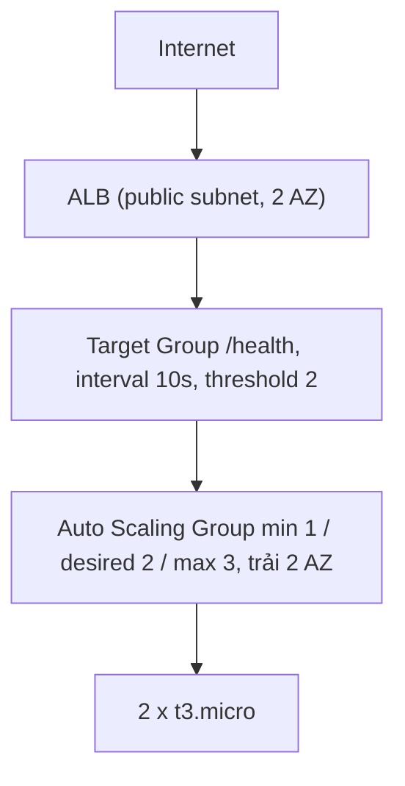

# Tuần 3 — EC2, EBS, Load Balancer, Auto Scaling

`Domain 2 · Resilient` `Domain 3 · Performance`

| | |
|---|---|
| **Chi phí** | **~$0,053/giờ** → lab 3 tiếng ≈ **$0,16** |
| **Để quên 1 tháng** | **~$39** |
| **Thời gian** | 3 giờ, làm gọn trong một buổi |
| **Dọn dẹp** | `cd terraform && terraform destroy` |

> 🔴 **Buổi tốn tiền nhất cả khóa.** ALB tính $0,0225/giờ từ giây đầu tiên và
> **không có bậc miễn phí nào** trong Free Tier mới. Đặt hẹn giờ 3 tiếng ngay khi apply.

Lab này cũng hoàn thành nhiệm vụ credit **"launch và terminate một EC2 instance"** → nhận $20.

---

## Chạy

```bash
source ../../env.sh
cd terraform && terraform init && terraform apply    # ~4 phút (ALB dựng lâu)
cd .. && ./verify.sh                                 # đợi thêm 2 phút nếu chưa thấy máy nào

cd ansible
ansible-playbook site.yml                            # Ansible ghi đè trang nginx
```

Rồi tới phần đáng giá nhất:

```bash
ansible-playbook chaos.yml        # phá health check trên 1 máy
watch -n 5 ../verify.sh           # ngồi xem ASG tự chữa lành, 3-5 phút
```

---

## Kiến trúc



- ALB: $0,0225/giờ · SG: nhận :80 từ 0.0.0.0/0
- Target Group: phát hiện hỏng sau ~20s
- Auto Scaling Group: health_check_type = ELB ← điểm mấu chốt · SG: chỉ nhận :80 TỪ SG CỦA ALB ← không phải từ internet
- 2 x t3.micro: gp3 8GB, IMDSv2 bắt buộc, delete_on_termination = true

---

## Ba quyết định thiết kế đáng chú ý trong code

### 1. Security Group tham chiếu Security Group

```hcl
resource "aws_vpc_security_group_ingress_rule" "app_from_alb" {
  referenced_security_group_id = aws_security_group.alb.id   # ← không phải cidr_ipv4
}
```

Máy **có** public IP (cần internet để `dnf install nginx`), nhưng **không ai gọi thẳng
vào được** — chỉ traffic đến từ SG của ALB mới qua. IP của ALB thay đổi liên tục nên
viết CIDR là bất khả thi.

Đây là mẫu chuẩn và hay ra thi dưới dạng *"cách nào hạn chế truy cập chặt nhất"*.

### 2. `health_check_type = "ELB"` chứ không phải `"EC2"`

| | Kiểm tra gì | Nginx chết thì |
|---|---|---|
| `EC2` (mặc định) | Máy còn sống không | ASG **không làm gì** — người dùng gặp lỗi mãi |
| `ELB` | Ứng dụng còn trả lời không | ASG **thay máy** |

`chaos.yml` được thiết kế riêng để bạn thấy sự khác biệt này: nó làm hỏng `/health`
nhưng để nginx và máy vẫn chạy bình thường. EC2 status check vẫn xanh. Chỉ có ứng dụng
là hỏng — và chỉ `ELB` mới phát hiện được.

### 3. Instance nằm ở public subnet — đánh đổi có chủ đích

Đúng chuẩn production thì instance phải ở private subnet, ra internet qua NAT Gateway.
Nhưng NAT = **$33/tháng**, đắt gấp bốn lần cả hai cái EC2 cộng lại.

Lab chọn public subnet + SG chặt. Muốn làm đúng chuẩn:

```bash
terraform apply -var instances_in_public_subnet=false   # sẽ bật NAT, ~$33/tháng
```

Biết mình đang đánh đổi cái gì, và vì sao — đó chính là tư duy Domain 4.

---

## Ranh giới Terraform / user data / Ansible

Tuần này là chỗ ba công cụ chạm nhau, đáng dừng lại suy nghĩ:

| Công cụ | Làm gì | Chạy khi nào |
|---|---|---|
| **Terraform** | ALB, ASG, launch template, SG, IAM | Khi bạn `apply` |
| **user data** | Cài nginx, dựng trang mặc định | **Đúng một lần**, lúc máy sinh ra |
| **Ansible** | Ghi nội dung trang, tinh chỉnh nginx | **Bất cứ lúc nào**, lặp lại được |

Vì sao cần cả user data lẫn Ansible? Vì máy do ASG sinh ra bất chợt — lúc 3 giờ sáng
khi tải tăng — và lúc đó không ai chạy Ansible cả. user data lo phần bootstrap để máy
mới tự phục vụ được ngay. Ansible lo phần thay đổi sau đó mà không phải thay máy.

Playbook dùng `serial: 1` — sửa từng máy một. Playbook lỗi thì chỉ hỏng một máy,
ALB vẫn còn máy kia. Đó là rolling update thủ công.

---

## Kiến thức thi

### Ba loại scaling policy

| Loại | Cách hoạt động | Khi nào chọn |
|---|---|---|
| **Target tracking** | "Giữ CPU ở 50%", AWS tự tính | **Mặc định nên chọn** — đơn giản nhất |
| **Step scaling** | Thêm N máy theo từng bậc chỉ số | Cần kiểm soát chi tiết |
| **Scheduled** | Co giãn theo giờ | Biết trước tải (giờ hành chính) |

Đề hỏi *"cách đơn giản nhất để tự động co giãn"* → target tracking.

### ALB vs NLB vs GWLB

| | Tầng | Định tuyến theo | Dùng khi |
|---|---|---|---|
| **ALB** | 7 (HTTP) | Path, host, header, query | Web app, microservice, container |
| **NLB** | 4 (TCP/UDP) | IP + port | Cần độ trễ cực thấp, IP tĩnh, giao thức không phải HTTP |
| **GWLB** | 3 (IP) | — | Chèn thiết bị bảo mật của bên thứ ba |

### EBS — bẫy tiền kinh điển

```hcl
delete_on_termination = true   # ← để false là volume sống mãi và tính tiền mãi
```

Volume ở trạng thái `available` (không gắn vào máy nào) vẫn tính **$0,08/GB/tháng**.
Đây là nguyên nhân số một của hoá đơn bí ẩn. `./scripts/find-orphans.sh` quét đúng thứ này.

---

## Bài tập quan sát — làm đủ 5 bước

1. Mở `terraform output alb_url` trong trình duyệt, refresh 10 lần → thấy đổi instance ID.
2. `ansible-playbook site.yml` → refresh lại, trang đổi sang bản của Ansible.
3. `ansible-playbook chaos.yml` → mở `watch -n 5 ../verify.sh`.
4. Ngồi xem **3-5 phút**, ghi lại mốc thời gian:
   - `healthy` → `unhealthy` mất bao lâu? (nên ≈ 20 giây)
   - Từ `unhealthy` tới lúc ASG terminate máy mất bao lâu?
   - Máy mới `InService` mất bao lâu?
5. Tự trả lời: nếu `health_check_type` là `EC2` thì bước 4 có xảy ra không?

---

## Checklist

- [ ] `terraform apply` xong, đã đọc `chi_phi_moi_gio`
- [ ] **Đặt hẹn giờ 3 tiếng**
- [ ] Thấy ALB luân phiên đổi máy giữa 2 AZ
- [ ] `ansible-playbook site.yml` chạy `serial: 1`, trang đổi nội dung
- [ ] Chạy `chaos.yml`, quan sát đủ chu trình self-healing và ghi lại thời gian
- [ ] Giải thích được vì sao SG tham chiếu SG tốt hơn viết CIDR
- [ ] Giải thích được khác biệt `health_check_type` ELB vs EC2
- [ ] Nhận $20 nhiệm vụ credit "launch và terminate EC2"
- [ ] **`terraform destroy`**
- [ ] `../../scripts/find-orphans.sh` — không còn EBS mồ côi, không còn ALB
- [ ] **Sáng hôm sau** chạy `../../scripts/cost-check.sh` xác nhận đúng dự kiến

---

## Dọn dẹp

```bash
cd terraform && terraform destroy      # ~3 phút, ALB xoá chậm
cd ../.. && ./scripts/find-orphans.sh
```

`terraform destroy` xoá đúng thứ tự phụ thuộc — ASG trước, rồi ALB, target group,
instance, volume. Đây chính là "nút dọn dẹp" mà plan gốc nói tới ở tuần 10:
bạn đã có nó từ tuần 1.

Xoá tay theo thứ tự thì rất dễ sót. Thứ tự đúng nếu buộc phải làm tay:
**ASG (desired=0 trước) → ALB → Target Group → Instance → EBS → Snapshot → Elastic IP.**
