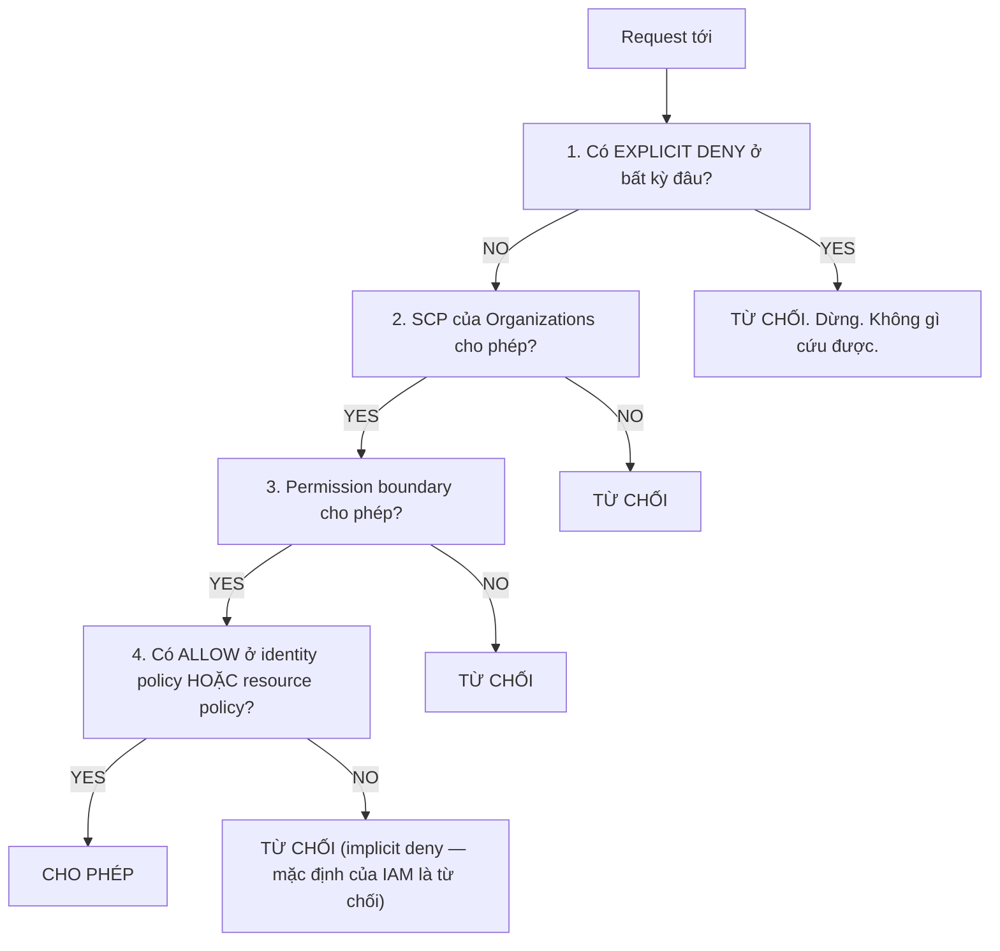

# Tuần 9 — Bảo mật chuyên sâu

`Domain 1 · Security — 30% đề thi, miền nặng nhất`

| | |
|---|---|
| **Chi phí** | **~$0,00** — IAM, SSM Parameter Store Standard, Lambda đều miễn phí |
| **Nếu bật GuardDuty** | Miễn phí 30 ngày đầu, sau đó vài đô/tháng |
| **Dọn dẹp** | `terraform destroy` |

> Nếu chỉ còn thời gian ôn **một** tuần, ôn tuần này.

---

## Chạy

```bash
source ../../env.sh
cd terraform && terraform init && terraform apply
cd ../ansible && ansible-playbook site.yml
cd .. && ./verify.sh
```

---

## Bốn thí nghiệm, mỗi cái trả lời một câu hỏi thi

Điểm khác biệt của lab này: bạn **không đọc mô tả** về các cơ chế bảo mật.
Bạn chạy Policy Simulator và **nhìn thấy** chúng chặn.

### 1. External ID — chống confused deputy

```bash
aws sts assume-role --role-arn <arn>                    # AccessDenied
aws sts assume-role --role-arn <arn> --external-id ...  # thành công
```

**Kịch bản thật:** bạn thuê một công ty giám sát bên ngoài. Họ cần đọc log trong
account của bạn. Cách đúng là cho họ **assume một role**, không phải tạo IAM user
và đưa access key.

**Vấn đề nếu không có external ID:** công ty đó cũng phục vụ khách hàng khác.
Nếu một khách hàng khác đoán được ARN role của bạn, họ có thể **lừa** công ty giám sát
assume vào role của *bạn* thay vì role của *họ*.

**External ID** là một bí mật do **bạn** đặt ra. Không có nó thì assume thất bại,
kể cả khi biết chính xác ARN.

Đề thi mô tả tình huống này gần như nguyên văn khi hỏi về cross-account access.

### 2. Permission boundary — trần quyền

Role `w09-admin-bi-gioi-han` được gắn **`AdministratorAccess`** — quyền cao nhất tồn tại.
Boundary chỉ cho phép `s3:*` và `logs:*`.

| Action | Kết quả |
|---|---|
| `s3:ListAllMyBuckets` | `allowed` |
| `logs:DescribeLogGroups` | `allowed` |
| `iam:CreateUser` | `implicitDeny` |
| `ec2:RunInstances` | `implicitDeny` |

> **Boundary không cấp quyền. Nó đặt TRẦN.**
> Quyền thực tế = **GIAO** của (identity policy) và (boundary).

**Dùng ở đâu trong thực tế:** cho phép developer tự tạo role cho ứng dụng của họ,
mà không sợ họ tự nâng mình lên admin. Đây là câu hỏi thi về *"làm sao uỷ quyền tạo IAM
mà vẫn an toàn"*.

### 3. Explicit Deny thắng tất cả

Role `w09-admin-co-deny` có `AdministratorAccess` **và** một policy Deny hẹp.

| Action | Kết quả |
|---|---|
| `s3:ListAllMyBuckets` | `allowed` |
| `iam:CreateUser` | `allowed` |
| `cloudtrail:StopLogging` | **`explicitDeny`** |
| `guardduty:DeleteDetector` | **`explicitDeny`** |

Role tạo được IAM user, nhưng **không tắt được CloudTrail**.

**Ứng dụng thật:** chặn các hành động xoá dấu vết cho **mọi người kể cả admin**.
Trong Organizations việc này làm bằng **SCP**.

### 4. SecureString thay Secrets Manager

Lambda đọc secret **lúc chạy** từ Parameter Store, thay vì nhúng vào biến môi trường.

Hai điều trong code đáng nhớ:

```python
# KHÔNG in secret ra log — CloudWatch giữ lại, ai đọc log là đọc được secret
return {"do_dai_secret": len(secret), "bon_ky_tu_dau": secret[:4] + "..."}
```

```hcl
environment { variables = { TIEN_TO = var.prefix } }   # chỉ tiền tố, KHÔNG phải secret
```

Biến môi trường của Lambda hiện **nguyên văn** trong console và trong
`GetFunctionConfiguration`. Ai đọc được cấu hình hàm là đọc được secret.

---

## Sơ đồ thứ tự đánh giá quyền — phải vẽ được từ trí nhớ



Ba giá trị Policy Simulator trả về khớp đúng sơ đồ này:

| Giá trị | Nghĩa | Dừng ở bước |
|---|---|---|
| `allowed` | Có Allow, không có Deny | 4 |
| `implicitDeny` | **Không ai cho phép** | rơi xuống đáy |
| `explicitDeny` | **Có người cấm** | 1 |

Phân biệt `implicitDeny` với `explicitDeny` là chi tiết đề thi hay kiểm tra.

---

## Parameter Store vs Secrets Manager

| | SSM Parameter Store (Standard) | Secrets Manager |
|---|---|---|
| Giá | **MIỄN PHÍ** | **$0,40/secret/tháng** + phí API |
| Kích thước | 4 KB | 64 KB |
| **Tự động xoay vòng** | **Không** | **Có** — tích hợp sẵn RDS, Redshift, DocumentDB |
| Cross-account | Không trực tiếp | **Có** |
| Mã hoá | SecureString + KMS | Luôn mã hoá |

**Khác biệt quyết định là tự động xoay vòng.**

- *"Lưu credential database và tự đổi mật khẩu định kỳ mà không sửa code"* → **Secrets Manager**
- *"Lưu cấu hình hoặc secret đơn giản với chi phí thấp nhất"* → **Parameter Store**

Trong 12 tuần này ta luôn dùng Parameter Store để tiết kiệm $0,40/tháng.

### Một lỗi rất mất thời gian

SecureString cần **thêm** quyền `kms:Decrypt`, không chỉ `ssm:GetParameter`.
Thiếu nó thì `GetParameter --with-decryption` báo `AccessDenied`, và thông báo lỗi
**không nói rõ** là do KMS. Code có sẵn statement đó với điều kiện `kms:ViaService`
để giới hạn đúng SSM.

---

## KMS — học lý thuyết, không bật

| | AWS managed key | Customer managed key |
|---|---|---|
| Giá | **Miễn phí** | **$1/tháng** + phí API |
| Xoay vòng | Tự động, mỗi năm | Bật/tắt được, mỗi năm |
| Key policy | AWS quản lý | **Bạn kiểm soát** |
| Xoá được | Không | Có (chờ 7–30 ngày) |
| Cross-account | Không | **Có** |

**Envelope encryption** — cơ chế cốt lõi, hay ra thi:

1. KMS sinh một **data key** (khoá dữ liệu).
2. Dữ liệu được mã hoá bằng data key ở **phía client/dịch vụ**.
3. Data key được mã hoá bằng **CMK** rồi lưu cạnh dữ liệu.
4. Giải mã: gọi KMS giải mã data key trước, rồi dùng nó giải mã dữ liệu.

Lý do tồn tại: KMS giới hạn 4 KB mỗi lần mã hoá trực tiếp. Envelope encryption cho phép
mã hoá dữ liệu bất kỳ kích thước nào mà vẫn chỉ gọi KMS cho một khoá nhỏ.

---

## Nhận diện công cụ bảo mật — đủ để thi

| Dịch vụ | Trả lời câu hỏi | Nhận diện qua từ khoá |
|---|---|---|
| **GuardDuty** | Có ai đang tấn công không? | phát hiện mối đe doạ, hành vi bất thường, IP xấu |
| **Inspector** | Máy/container có lỗ hổng không? | quét CVE, EC2, ECR, Lambda |
| **Macie** | S3 có dữ liệu nhạy cảm không? | PII, dữ liệu cá nhân, phân loại dữ liệu |
| **Security Hub** | Tổng hợp mọi finding | bảng điều khiển chung, CIS/PCI benchmark |
| **Detective** | Điều tra sâu một finding | phân tích nguyên nhân gốc, đồ thị hành vi |
| **Config** | Cấu hình có tuân thủ không? | drift, lịch sử cấu hình, compliance rule |
| **CloudTrail** | Ai đã làm gì, lúc nào? | audit, API call, log truy vết |

Cặp hay nhầm: **GuardDuty** phát hiện *mối đe doạ đang diễn ra*;
**Inspector** tìm *lỗ hổng có sẵn*; **Config** kiểm tra *cấu hình sai lệch*.

### WAF và Shield

| | Chống gì | Giá |
|---|---|---|
| **Shield Standard** | DDoS tầng 3/4 | **Tự động, miễn phí** cho mọi khách hàng |
| **Shield Advanced** | DDoS tầng 7 + hỗ trợ 24/7 + hoàn tiền | **$3000/tháng** |
| **WAF** | SQL injection, XSS, rate limit, bot | Theo rule + request |

---

## Checklist

- [ ] `terraform apply`, `ansible-playbook site.yml` — cả 4 thí nghiệm pass
- [ ] `./verify.sh` — đọc kỹ bảng ba màu allowed/implicitDeny/explicitDeny
- [ ] **Vẽ được sơ đồ 4 bước đánh giá quyền từ trí nhớ**
- [ ] Phân biệt được `implicitDeny` và `explicitDeny`
- [ ] Giải thích được external ID chống lỗ hổng gì
- [ ] Giải thích được permission boundary khác identity policy thế nào
- [ ] Nói được khác biệt quyết định giữa Parameter Store và Secrets Manager
- [ ] Nhận diện đúng GuardDuty / Inspector / Macie / Config qua tình huống
- [ ] Nếu có bật GuardDuty: **đã tắt**
- [ ] `terraform destroy`
